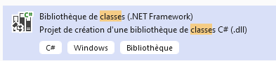
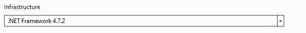
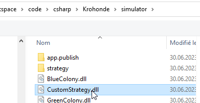
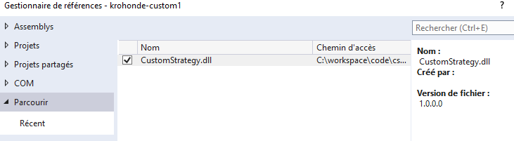
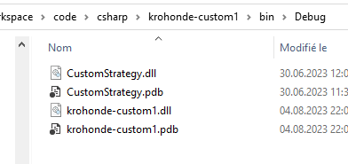
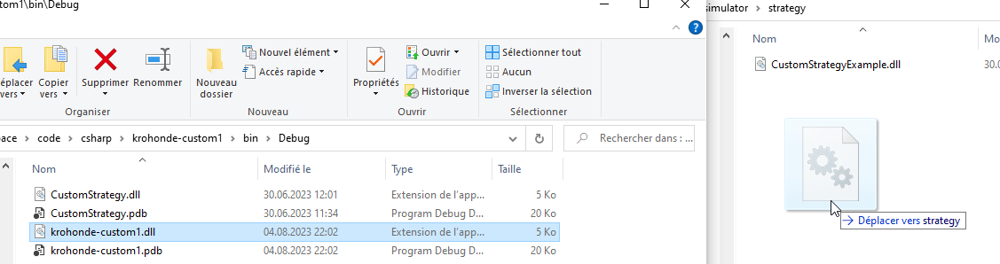

author: Jonathan Melly
summary: ant simulator setup
id: ant-simu-01
categories: dev
tags: ict
environments: Web
status: Published
feedback link: https://git.section-inf.ch/jmy/labs/issues
analytics account: UA-170792591-1

# Mise en place du simulateur de fourmi

## Vue d’ensemble
Duration: 0:01:00


### Environnement fourmilier simplifié
Le simulateur offre un environnement dans lequel 3 fourmilières évoluent dans des conditions naturelles simplifiées elles aussi.

## Mise en place
Duration: 0:03:00

### Télécharger l’archive

Le programme est disponible [à cette adresse](https://github.com/ETML-INF/320-POO_2023/blob/main/assets/simulator.zip)


### Installation

Dézipper l’archive


### Lancer le simulateur

Double-clic sur *krohondesimulator.exe*


Et l’écran suivant devrait apparaître:


## Modifier le comportement des fourmis
Duration: 0:08:00

### Créer un projet CSharp
Créer un projet .NET 4.7 de type *bibliothèque*




### Ajouter une référence vers un DLL


#### Sélectionner le DLL de l’archive *simulator*
```text
CustomStrategy.dll
```




### Ajouter une implémentation automatique (valider l’aide de l’IDE)


### Remplacer le code auto-généré (à adapter selon votre cas)


#### Modifier la méthode *GetMessage*


### Générer le DLL


### Copier le DLL vers le simulateur




### Tester

#### Activer le log


#### Vérifier l’affichage du message


## Améliorations
Duration: 0:03:00

### Automatiser la copie après le build
Pour copier directement une nouvelle version, on peut, par exemple ajouter une option de build dans le fichier *.csproject*

#### Exemple à adapter
```xml
<Target Name="copy strategy" AfterTargets="build">
        <Message Text="Copy example to krohonde" Importance="high" />
        <Copy 
		SourceFiles="$(OutputPath)\CustomStrategyZZZ.dll" 
		DestinationFolder="c:\temp\simulator\strategyZZZ" 
		SkipUnchangedFiles="true" />
    </Target>
```
