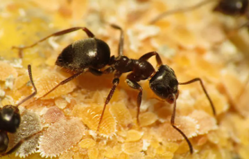
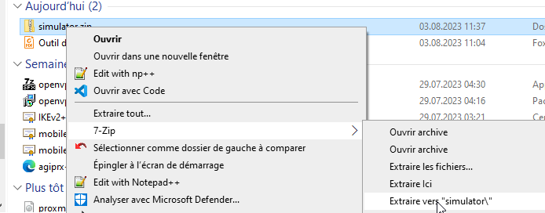
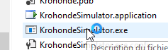
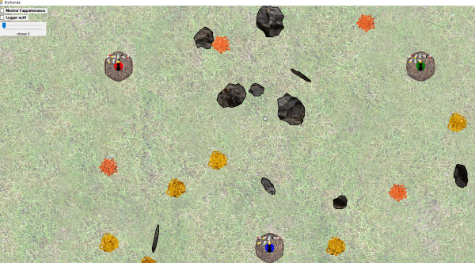

author: Jonathan Melly
summary: ant simulator setup
id: ant-simu-01
categories: dev
tags: 
environments: Web
status: Published
feedback link: https://git.section-inf.ch/jmy/labs/issues
analytics account: UA-170792591-1

# Mise en place du simulateur de fourmi

## Vue d’ensemble
Duration: 0:00:15

### Environnement fourmilier simplifié
Le simulateur offre un environnement dans lequel 3 fourmilières évoluent dans des conditions naturelles simplifiées elles aussi.

## Mise en place
Duration: 0:05:00

### Télécharger l’archive

Le programme est disponible [à cette adresse](https://github.com/ETML-INF/320-POO_2023/blob/main/assets/simulator.zip)

### Installation

Dézipper l’archive

### Lancer le simulateur

Double-clic sur *krohondesimulator.exe*

Et l’écran suivant devrait apparaître:

## Modifier le comportement des fourmis
Duration: 0:05:00

### Créer un projet C#
Créer un projet .NET 4.7 de type *bibliothèque*

### Ajouter une référence vers un DLL

### Ajouter une implémentation

### Générer le DLL

### Copier le DLL vers le simulateur

### Tester

## Améliorations
### Automatiser la copie après le build

