author: Jonathan Melly
summary: ant simulator setup
id: ant-simu-01
categories: dev
tags: ict
environments: Web
status: Published
feedback link: https://git.section-inf.ch/jmy/labs/issues
analytics account: UA-170792591-1

# Mise en place du simulateur de fourmi

## Vue d’ensemble
Duration: 0:01:00

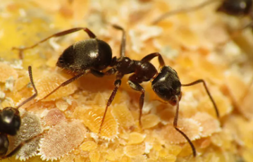

Survey
: Quelle est votre conception de la programmation orientée objet ?
<ul>
<li>C'est un peu comme la lampe d'Aladdin, ça ouvre des portes infinies</li>
<li>C'est un truc pour les autistes qui aiment les mathématiques</li>
<li>J'attends la fin de cet atelier pour me faire une idée d'après une expérience réelle</li>
</ul>

### Environnement fourmilier simplifié
Le simulateur offre un environnement dans lequel 3 fourmilières évoluent dans des conditions naturelles simplifiées elles aussi.

## Mise en place
Duration: 0:03:00

### Télécharger l’archive

Le programme est disponible [à cette adresse](https://github.com/ETML-INF/320-POO_2023/blob/main/assets/04-00-simulator-net6.zip)

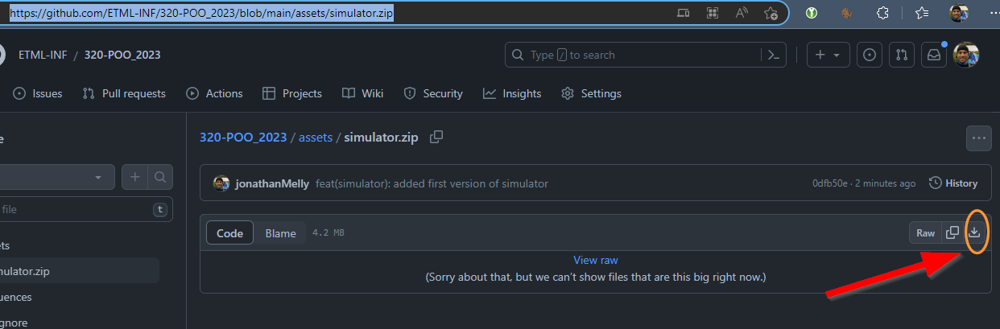


### Installation

Dézipper l’archive

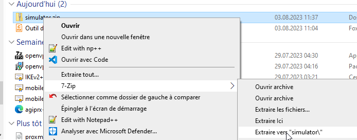

### Lancer le simulateur

Double-clic sur *krohondesimulator.exe*

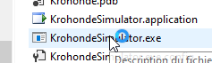

Et l’écran suivant devrait apparaître:

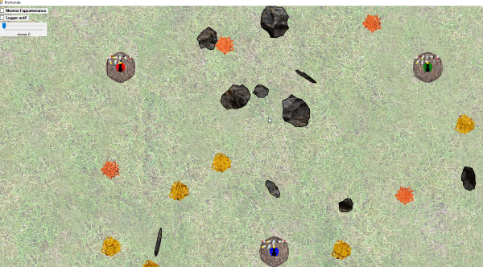


## Modifier le comportement des fourmis
Duration: 0:08:00

### Créer un projet CSharp
Créer un projet **.NET6** de type *bibliothèque*

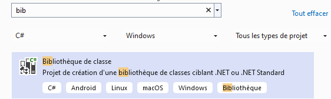
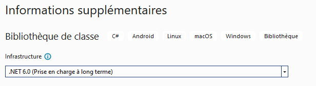

### Ajouter une référence vers un DLL
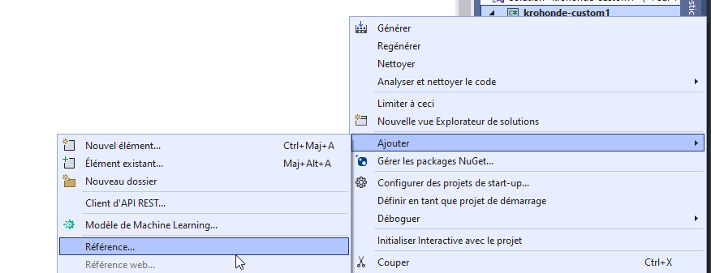

#### Sélectionner le DLL de l’archive *simulator*
```text
Krohonde.dll
```
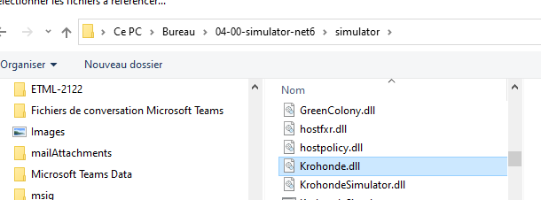

### Ajouter une implémentation
 1. Créer une classe nommée XXXBlueQueen
 1. Ajouter un import : "using Krohonde.CustomStrategy"
 1. Faire hériter la nouvelle classe de QueenStrategy : "... : QueenStrategy" 
 1. Utiliser l’aide de l’IDE pour compléter la classe
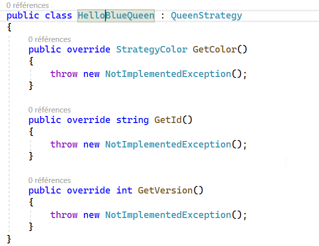

### Remplacer le code auto-généré (à adapter selon votre cas)
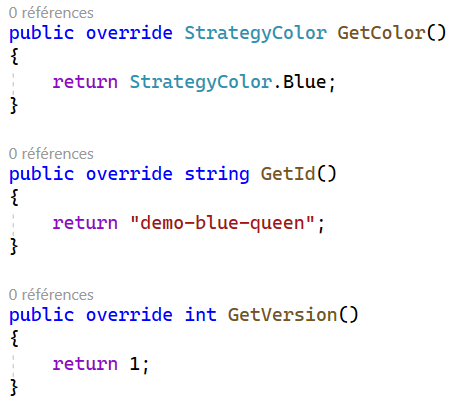

#### Ajouter un override pour la méthode *GetMessage*
Choisir le texte à afficher, par exemple "Hello Demo" :
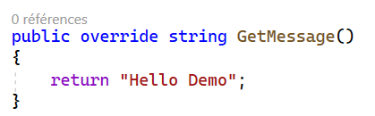

### Générer le DLL
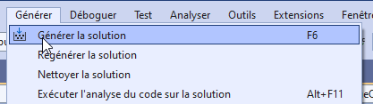

### Copier le DLL vers le simulateur
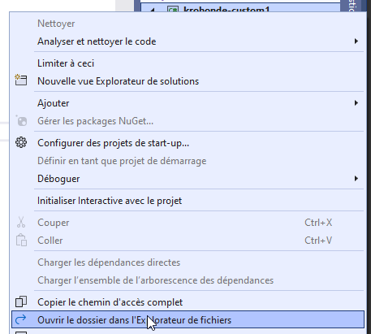

#### Créer le dossier "strategy"
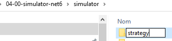


#### Copier/Coller le dll dans le dossier "strategy"
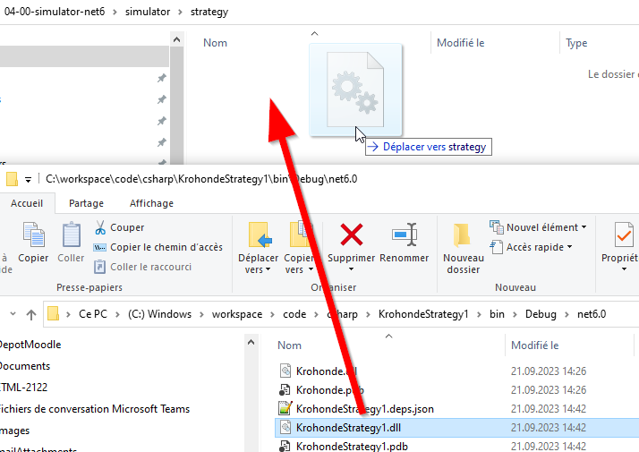

### Tester
Relancer le simulateur

#### Activer le log
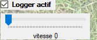

#### Changer la vitesse à min 1

#### Vérifier l’affichage du message
Le log devrait se trouver dans le répertoire *c:\temp*

**Défilement automatique**
Pour voir le log défiler, on peut faire un clic droit dans le répertoire
où est le log (via l’explorateur de fichier) et sélectionner *git bash here*.

Ensuite entrer la commande suivante dans la console qui est apparu:
```shell
tail -100f Krohonde.log
```
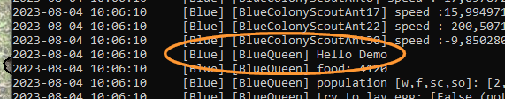

Positive
: les options "-100f" impliquent qu’on affiche les 100 dernières lignes du fichier (100) et qu’on défile automatiquement (f)

## Corriger le mouvement de la reine bleue
La reine bleue a un comportement étrange...

Corriger cela en implémentant une meilleure version de la méthode suivante à disposition:
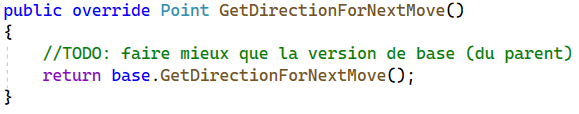

### Tester
Puis tester ce nouveau comportement, et ainsi de suite jusqu’à ce qu’elle reste dans sa zone...

## Améliorations
Duration: 0:03:00

### Automatiser la copie après le build
Pour copier directement une nouvelle version, on peut, par exemple ajouter une option de build dans le fichier *.csproject*

#### Exemple à adapter
```xml
<Target Name="copy strategy" AfterTargets="build">
        <Message Text="Copy example to krohonde" Importance="high" />
        <Copy 
		SourceFiles="$(OutputPath)\CustomStrategyZZZ.dll" 
		DestinationFolder="c:\temp\simulator\strategy\strategyZZZ" 
		SkipUnchangedFiles="true" />
    </Target>
```

## Synthèse
Duration: 0:02:00

Bravo, il est temps de faire le point sur les éléments travaillés


