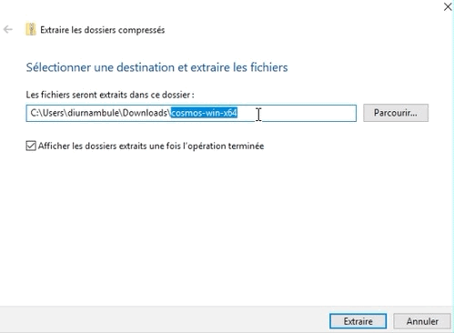
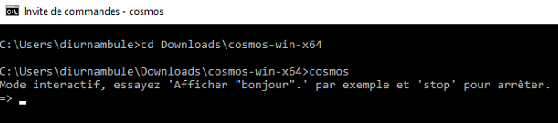
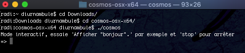
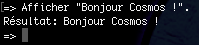
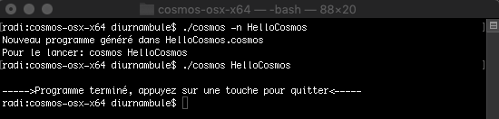
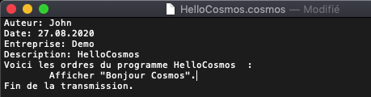
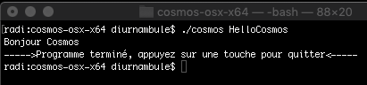

author: Jonathan Melly
summary: Bonjour Cosmos
id: cosmos-base-00-hello
categories: dev
tags: msig
environments: Web
status: Published
feedback link: https://git.section-inf.ch/jmy/labs/issues
analytics account: UA-170792591-1

# Bonjour Cosmos

## Bienvenue
Duration: 0:01:00


Bienvenue dans le premier atelier autour du langage cosmos.

### Objectifs

- Installer Cosmos
- Tester le mode interactif
- Créer un premier programme qui dit 'Bonjour Cosmos'


Survey
: Quelle est votre conception de la programmation ?
<ul>
  <li>C'est un peu comme la lampe d'Aladdin, ça ouvre des portes infinies</li>
  <li>C'est un truc pour les autistes qui aiment les mathématiques</li>
  <li>J'attends la fin de cet atelier pour me faire une idée d'après une expérience réelle</li>
</ul>

## Installation
Duration: 0:03:00


### Téléchargement

Cliquez sur le lien ci-dessous correspondant à votre plateforme pour télécharger cosmos.

#### [Windows](https://github.com/jonathanMelly/cosmos/releases/latest/download/cosmos-win-x64.zip) 

#### [MacOS](https://github.com/jonathanMelly/cosmos/releases/latest/download/cosmos-osx-x64.zip) 

#### [Linux ](https://github.com/jonathanMelly/cosmos/releases/latest/download/cosmos-linux-x64.zip) 

### Décompression

Une fois le fichier téléchargé, double-cliquez dessus.

Pour Windows, après avoir double-cliqué sur le fichier, cliquez sur *Extraire tout* et corrigez le chemin d'extraction en 
retirant la dernière partie après le dernier caractère \\ (antislash):



## Première interaction
Duration: 0:15:00

### Console
Commençons par lancer une console :

- Windows : Clic dans le menu démarrer => Invite de commandes
- MacOS  : Clic sur spotlight => terminal
- Linux   : Si vous utilisez Linux, vous savez comment faire ;-)

### Avancer dans le cosmos
Une fois la console lancée, il faut aller à l'endroit où est le dossier décompressé et lancer le programme:

**Windows**
``` bash
cd Downloads\cosmos-win-x64
cosmos.exe
```


**MacOS / Linux**
``` bash
cd Downloads/cosmos-osx-x64
./cosmos
```


### Mode interactif
Par défaut, cosmos se lance en mode interactif, on peut donc éxécuter des commandes simples :

``` cosmos
Afficher "Bonjour Cosmos !".
```


Positive
: Toute commande se valide avec la touche *ENTER*

Negative
: Pour quitter le mode interactif, écrivez *stop* et validez avec *ENTER*.

### Premier programme
Un programme cosmos complet est divisé en 2 parties:
1. Une entête
1. Le contenu du programme

L'entête est obligatoire. De la même manière qu'un TAG de fichier MP3, elle contient des informations sur le programme (auteur, date, ...) qu'on appelle *méta-données*.

#### Génération d'un squelette
Pour créer un squelette, on peut utiliser la commande suivante:
``` bash
cosmos -n <nomDuProgramme>
```



Positive
: Pour faciliter la mémorisation, il existe un alias (synonyme) plus parlant à cette commande:

``` bash
cosmos --nouveau <nomDuProgramme>
```

#### Ajout d'une instruction
En ouvrant le fichier avec un éditeur de texte (notepad sur windows et textedit sur MacOS par exemple), on peut y ajouter une instruction:


Il ne reste plus qu'à lancer le programme:
``` bash
cosmos HelloCosmos
```



Negative
: Pour arrêter un programme qui est bloqué, on utilise la combinaison des touches *ctrl-c*.

## Cheatsheet
Duration: 0:05:00


Pour parler couramment en langage Cosmos, un dictionnaire est disponible sous forme de *cheatsheet* (traduit littéralement par *feuille de triche*) en cliquant [ICI](https://github.com/jonathanMelly/cosmos/raw/master/doc/cheatsheet.pdf).

## Récapitulatif
Duration: 0:03:00

Pour terminer, un petit quizz facilitera la mémorisation à long terme des éléments pratiqués dans cet atelier.


