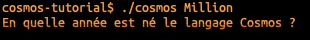

author: Jonathan Melly
summary: Qui veut gagner des millions
id: cosmos-base-01-milion
categories: dev
tags: msig
environments: Web
status: Published
feedback link: https://git.section-inf.ch/jmy/labs/issues
analytics account: UA-170792591-1

# Qui veut gagner les millions ?

## Bienvenue
Duration: 0:01:00

Suite au [précédent épisode](https://labs.section-inf.ch/codelabs/cosmos-base-00-hello/index.html), il est temps d'en découvrir un peu plus sur la programmation en reprenant un jeu de questions / réponses à l'image de *Qui veut gagner des millions*.

### Objectifs

- Interagir avec l'utilisateur
- S'adapter au comportement de l'utilisateur

Survey
: Si tu gagnais un million, que ferais-tu ?
<ul>
  <li>Je les verserai intégralement à Greenpeace</li>
  <li>Je les flamberai en achats divers</li>
  <li>Ça demanderait réflexion...</li>
  <li>Autre</li>
</ul>

## Poser une question
Duration: 0:12:00

Pour commencer, on va poser une question au joueur.

### Créer un nouveau programme

Pour rappel, on créée un nouveau programme avec la commande suivante:

Positive
: Une alternative plus concise est cosmos -n Million

### Afficher la question

Pour afficher une question, il suffit d'éditer le fichier *Million.cosmos* et d'y ajouter:

Pour vérifier si cela fonctionne, on peut lancer le programme:

### Ajouter les propositions

Dans le jeu original, on propose plusieurs possibilités et on pourrait s'inspirer de la question pour ajouter le code suivant:

En testant le programme, on s'aperçoit que le résultat n'est pas satisfaisant:

#### Retour de chariot

En fait, on doit indiquer à l'ordinateur si on veut des retours à la ligne ou pas.
En l'occurrence, on en veut plusieurs !
Pour indiquer un retour à la ligne, on utilise la notation **\n**, ce qui dans notre exemple donnerait:

Negative
: Sur Windows, le caractère de fin de ligne est plutôt **\r\n** mais le seul inconvénient à utiliser **\n** partout est qu'il faut utiliser un éditeur plus évolué que *notepad.exe*, comme par exemple *notepad++* ou *visulstudio code*...

## Récupérer la réponse de l'utilisateur

Maintenant que la question est posée, 

## Récapitulatif
Duration: 0:03:00

Pour terminer, un petit quizz facilitera la mémorisation à long terme des éléments pratiqués dans cet atelier.

lol