author: Jonathan Melly
summary: Animation
id: cosmos-base-02-animation
categories: dev
tags: msig
environments: Web
status: Published
feedback link: https://git.section-inf.ch/jmy/labs/issues
analytics account: UA-170792591-1

# Animation

## Bienvenue
Duration: 0:01:00


Une animation est une suite d'image qui défile à un certain rythme...
Il suffit donc de montrer une information à l'écran, puis de la changer et ainsi de suite pour créer
une animation...

### Objectifs

- Voir la console comme un écran à 2 dimensions (x=colonne, y=ligne)
- Créer une animation
- Créer l'illusion de contrôler un vaisseau avec le clavier

Survey
: Le cerveau humain croit à une animation à une fréquence de
<ul>
  <li>1 image par seconde</li>
  <li>2 images par seconde</li>
  <li>25 images par seconde</li>
  <li>Il sait toujours que ce n'est qu'une illusion</li>
</ul>

## Mouvements basiques
Duration: 0:25:00

### Horizontal

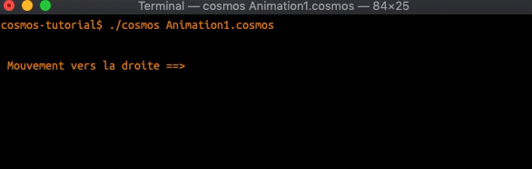

Pour réaliser cette animation, il faut imaginer que la console ressemble à un quadrillage avec des coordonnées:

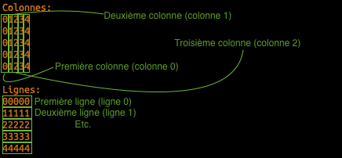

Ainsi, l'animation correspond à faire bouger le texte sur la grille:

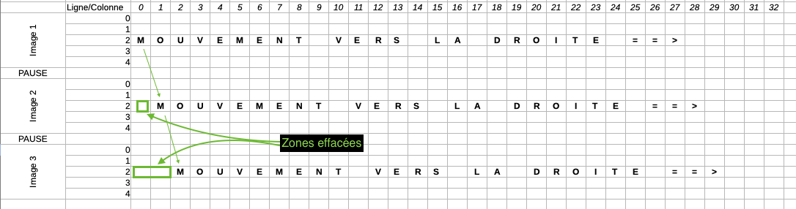

### Placer le curseur sur la grille
Pour placer le curseur à un endroit spécifique (avant d'écrire), on utilise les instructions suivantes:

``` cosmos
Placer le curseur à la colonne 5.
Placer le curseur à la ligne 1.
```

Si le numéro dépend d'une valeur stockée en mémoire, alors ça donne

``` cosmos
//Créer une zone mémoire nommée #colonne avec la valeur 1.
Placer le curseur à la colonne #colonne.
```

### Animation
À présent, nous sommes en mesure d'écrire une première version de l'animation horizontale qui est une répétition de l'élément suivant:

``` cosmos
Placer le curseur à la colonne 1.
Afficher "==>".
Attendre 200ms.
```

Et voici le code:

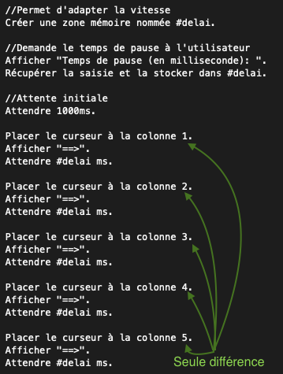

Negative
: Il manque encore un petit détail pour que l'animation ressemble à celle présentée au début... Ne penses-tu pas qu'il faudrait effacer le premier caractère de l'image précédente ?

Une fois la correction faite, voici le résultat:


### Simplification du code
Le code actuel ressemble un peu à du copier/coller et cela est très ennuyeux lorsqu'on doit faire des modifications (d'ailleurs c'est ce qui coûte cher en développement logiciel)...
Pour écrire du code **durable**, on a donc tout intérêt à opérer les modifications suivantes.

#### Stocker le symbole qui avance en mémoire
Comme pour le délai, on va utiliser une zone mémoire pour y enregistrer et référencer le symbole qui avance et on va même en profiter pour proposer à l'utilisateur de le choisir:

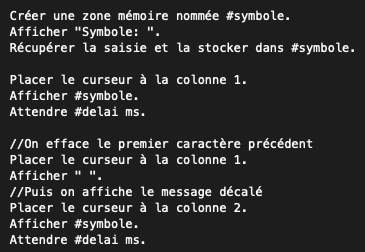

#### Répéter des instructions
Peut-être as-tu remarqué que le code est très similaire et c'est un signe qu'on peut l'optimiser en utiliser une notion de **répétition**. D'ailleurs cette notion est la base de la force de l'informatique qui est capable de répéter des opérations de manière très rapide...

Pour cela on utilise le mot clé *Répéter* qui permet d'éxécuter les opérations à l'intérieur plusieurs fois.
Le programme va donc évoluer selon les 3 étapes suivantes:

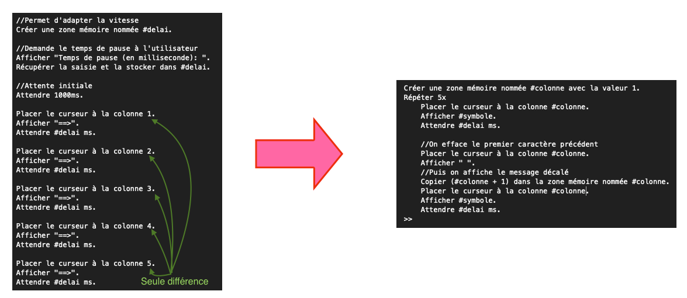

Et voici en grand le résultat, après modification:

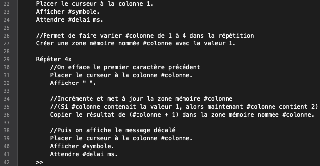

Positive
: Étant donné que le numéro de colonne change à chaque *tour*, on doit le mettre dans une zone mémoire et l'incrémenter sinon l'animation ne fonctionnerait plus.

Negative
: Bonus: Désormais, en changeant juste le nombre de répétitions, on peut choisir la durée de l'animation !

#### Cacher les décors
Sur les vidéos présentées, le curseur (partie clignotante avant le texte à écrire) a été masqué.
Pour faire cela, il suffit d'ajouter la commande suivante:

``` cosmos
Masquer le curseur.
//Pour le réactiver: Afficher le curseur.
```

#### Dans la peau d'un réalisateur
Sauras-tu adapter le programme pour que l'utilisateur se prenne pour un réalisateur et puisse choisir le nombre de répétitions ?

### Défi vertical
En s'inspirant de ce qui a été fait précédemment, il est temps de réaliser le programme suivant:

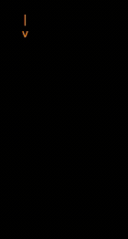

Positive
: Pour réinitialiser la console (repartir du point d'origine 0:0), la commande suivante peut être utile:

Windows
``` bash
cls
```

Linux/Macos
``` bash
clear
```

## Contrôler un mouvement depuis le clavier
Duration: 0:18:00
On va maintenant voir comment faire avancer notre symbole, non plus sur une fréquence fixe mais sur l'appui d'une touche.

### Réagir à une touche
On sait déjà comment récupérer une saisie utilisateur mais il peut être utile d'écouter le clavier et de réagir directement lors de l'appui sur une touche (sans devoir valider avec *Enter*).

Pour cela, on peut utiliser l'instruction suivante:
``` cosmos
Attendre la prochaine touche et la stocker dans #touchePressee.
```

Ce qui dans un programme complet pourrait ressembler à :

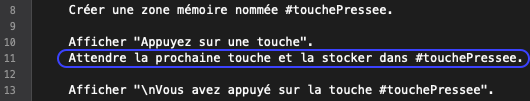

### Flèches directionnelles
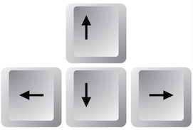
Pour faire avancer un symbole en appuyant sur la touche *Flèche droite*, on peut combiner ce qui a été vu jusque là, soit:

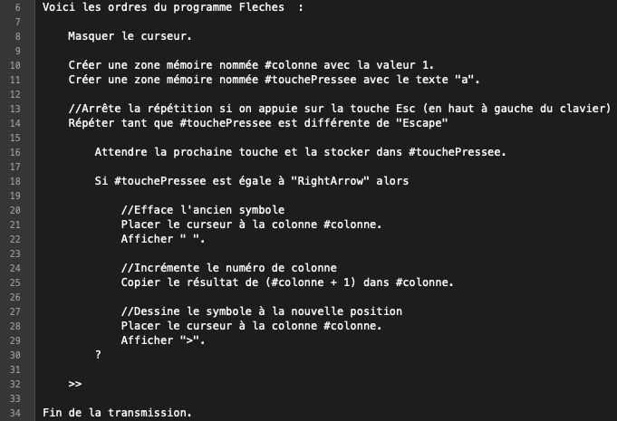

#### Défi à gauche
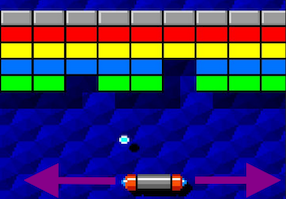
Dans le jeu *arkanoid*, il faut déplacer à gauche ou à droite une capsule qui récupère une bille...

Le défi est donc de s'inspirer du code présenté précédemment et de réagir à la flèche gauche pour arriver au résultat suivant:

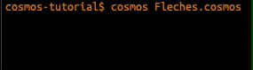

## Bilan des compétences
Duration: 0:05:00

Il est temps de faire le point sur les compétences acquises:


