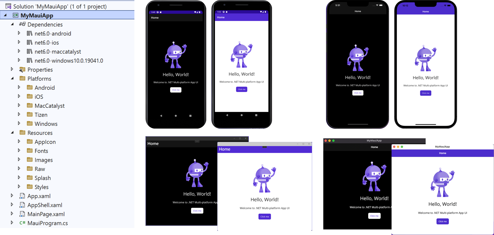
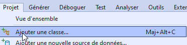
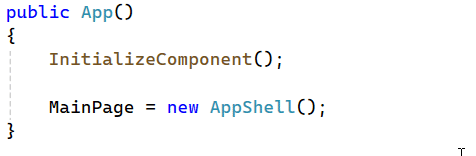

author: Jonathan Melly
summary: mobile app add page
id: mobile-02-addPage
categories: dev
tags: ict
environments: Web
status: Published
feedback link: https://git.section-inf.ch/jmy/labs/issues
analytics account: UA-170792591-1

# Ajouter des pages avec MAUI

## Rappel
Duration: 0:0:30

Ce document se base sur le précédent tutorial qui utilise VisualStudio et un projet MAUI basique.

## Ajouter une page
Duration: 0:01:00

### Ouvrir le menu
Accéder au menu *projet* et choisir l’entrée *ajouter une classe* :

### Types de pages
Sélectionner ensuite *.NET MAUI* dans le filtre à gauche, puis *ContentPage XAML*:

Généralement, on utilise le type *ContentPage XAML* sachant que la différence avec *ContentView* est que cette dernière est utilisée pour définir des composants personnalisés...

Positive
: Concernant le *ResourceDictionary*, celui-ci est utilisé pour regrouper des options de styles, comme par exemple des codes couleurs spécifiques applicables directement à des layouts. Pour en savoir plus [consulter cette ressource](https://learn.microsoft.com/en-us/dotnet/maui/fundamentals/resource-dictionaries?view=net-maui-8.0).

## XAML VS C\#
Duration: 0:1:00

### Fonctionnement général
Le *XAML* est préféré pour tout ce qui peut être décrit au niveau de l’interface, un peu comme le *HTML* permet de décrire les éléments d’une page *WEB*.

De son côté, le C# est utilisé pour gérer ce qui se passe lorsqu’on interagit avec les composants graphiques. Ainsi il est l’équivalent du *PHP* ou *Javascript* (côté backend / NodeJS) ou *ASP.NET* dans une application *WEB*.

Positive
: À noter qu’on pourrait utiliser uniquement le C# pour décrire les composants d’une page et que le XAML est là surtout pour faciliter la lisibilité et la clarté du code...

## Accéder aux pages ajoutées
Duration: 0:1:00

### Navigation
Les pages ajoutées ne sont pas automatiquement ajoutées dans un menu quelconque et il faut donc les intégrer dans une forme de navigation pour pouvoir y accéder.

Une alternative est de manuellement changer la page de démarrage vers une des nouvelles pages:

## Synthèse
Duration: 0:1:00

Revenons un instant sur les éléments clé de ce mini tutorial

