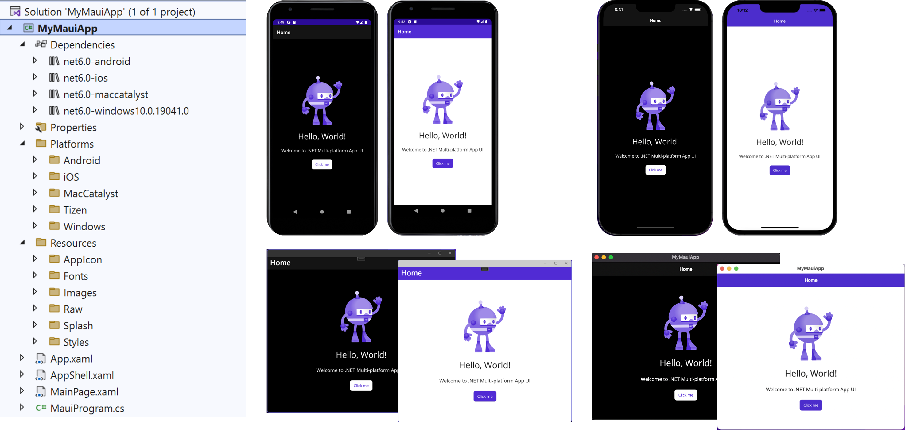
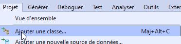
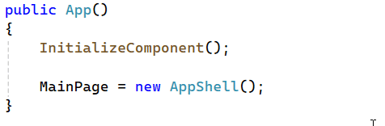

author: Jonathan Melly
summary: mobile app add page
id: mobile-02-addPage
categories: android,dev
tags: ict
environments: Web
status: Published
feedback link: https://git.section-inf.ch/jmy/labs/issues
analytics account: UA-170792591-1

# Ajouter des pages avec MAUI

## Rappel
Duration: 0:0:30



Ce document se base sur le précédent tutorial qui utilise VisualStudio et un projet MAUI basique.

## Ajouter une page
Duration: 0:01:00

### Ouvrir le menu
Accéder au menu *projet* et choisir l’entrée *ajouter une classe* :



### Types de pages
Sélectionner ensuite *.NET MAUI* dans le filtre à gauche, puis *ContentPage XAML*:


Généralement, on utilise le type *ContentPage XAML* sachant que la différence avec *ContentView* est que cette dernière est utilisée pour définir des composants personnalisés...

Positive
: Concernant le *ResourceDictionary*, celui-ci est utilisé pour regrouper des options de styles, comme par exemple des codes couleurs spécifiques applicables directement à des layouts. Pour en savoir plus [consulter cette ressource](https://learn.microsoft.com/en-us/dotnet/maui/fundamentals/resource-dictionaries?view=net-maui-8.0).

## XAML VS C\#
Duration: 0:1:00

### Fonctionnement général
Le *XAML* est préféré pour tout ce qui peut être décrit au niveau de l’interface, un peu comme le *HTML* permet de décrire les éléments d’une page *WEB*.

De son côté, le C# est utilisé pour gérer ce qui se passe lorsqu’on interagit avec les composants graphiques. Ainsi il est l’équivalent du *PHP* ou *Javascript* (côté backend / NodeJS) ou *ASP.NET* dans une application *WEB*.

Positive
: À noter qu’on pourrait utiliser uniquement le C# pour décrire les composants d’une page et que le XAML est là surtout pour faciliter la lisibilité et la clarté du code...


## Accéder aux pages ajoutées
Duration: 0:1:00

### Navigation initiale
Les pages ajoutées ne sont pas automatiquement ajoutées dans un menu quelconque et il faut donc les intégrer dans une forme de navigation pour pouvoir y accéder.

Une alternative est de manuellement changer la page de démarrage vers une des nouvelles pages:



## Navigation générale avec MAUI
Duration: 0:15:00

### Vue d'ensemble
MAUI Shell inclut une expérience de navigation basée sur URI qui utilise des routes pour naviguer vers n'importe quelle page de l'application, mais il existe également d'autres méthodes de navigation. Explorons les différentes approches.

### Navigation Shell (Recommandée)
Duration: 0:5:00

#### Configuration de base
Créons d'abord une structure Shell dans le projet. Dans `AppShell.xaml`, ajouter :

```xml
<?xml version="1.0" encoding="UTF-8" ?>
<Shell
    x:Class="HelloMaui1.AppShell"
    xmlns="http://schemas.microsoft.com/dotnet/2021/maui"
    xmlns:x="http://schemas.microsoft.com/winfx/2009/xaml"
    xmlns:local="clr-namespace:HelloMaui1">

    <ShellContent
        Title="Accueil"
        ContentTemplate="{DataTemplate local:MainPage}"
        Route="MainPage" />

    <ShellContent
        Title="Profil"
        ContentTemplate="{DataTemplate local:ProfilePage}"
        Route="ProfilePage" />

</Shell>
```

#### Navigation par routes
Ajouter une nouvelle page `ProfilePage.xaml` :

```xml
<?xml version="1.0" encoding="utf-8" ?>
<ContentPage x:Class="HelloMaui1.ProfilePage"
             xmlns="http://schemas.microsoft.com/dotnet/2021/maui"
             xmlns:x="http://schemas.microsoft.com/winfx/2009/xaml"
             Title="Profil">
    <StackLayout>
        <Label x:Name="WelcomeLabel"
               Text="Page Profil"
               VerticalOptions="Center" 
               HorizontalOptions="Center" />
        
        <Button Text="Retour à l'accueil"
                Clicked="OnRetourClicked" />
    </StackLayout>
</ContentPage>
```

Dans le code-behind `ProfilePage.xaml.cs` :

```csharp
public partial class ProfilePage : ContentPage
{
    public ProfilePage()
    {
        InitializeComponent();
    }

    private async void OnRetourClicked(object sender, EventArgs e)
    {
        await Shell.Current.GoToAsync("//MainPage");
    }
}
```

#### Navigation depuis MainPage
Modifiez votre `MainPage.xaml` pour ajouter un bouton de navigation :

```xml
<Button Text="Aller au Profil"
        Clicked="OnProfilClicked"
        x:Name="ProfilBtn" />
```

Et dans `MainPage.xaml.cs` :

```csharp
private async void OnProfilClicked(object sender, EventArgs e)
{
    await Shell.Current.GoToAsync("//ProfilePage");
}
```

### Navigation modale
Duration: 0:5:00

#### Qu'est-ce qu'une page modale ?
Une page modale encourage les utilisateurs à compléter une tâche autonome qui ne peut pas être abandonnée avant que la tâche soit terminée ou annulée.

#### Créer une page modale
Ajoutez une nouvelle page `SettingsPage.xaml` :

```xml
<?xml version="1.0" encoding="utf-8" ?>
<ContentPage x:Class="HelloMaui1.SettingsPage"
             xmlns="http://schemas.microsoft.com/dotnet/2021/maui"
             xmlns:x="http://schemas.microsoft.com/winfx/2009/xaml"
             Shell.PresentationMode="Modal"
             Title="Paramètres">
    <StackLayout Padding="20">
        <Label Text="Paramètres de l'application"
               Font="Large"
               HorizontalOptions="Center" />
        
        <Switch x:Name="NotificationSwitch" />
        <Label Text="Notifications activées" />
        
        <Button Text="Sauvegarder et fermer"
                Clicked="OnSauvegarderClicked"
                BackgroundColor="Green"
                TextColor="White" />
                
        <Button Text="Annuler"
                Clicked="OnAnnulerClicked"
                BackgroundColor="Red"
                TextColor="White" />
    </StackLayout>
</ContentPage>
```

Shell.PresentationMode peut être défini sur "Modal" pour indiquer que la page sera affichée comme une page modale.

Dans `SettingsPage.xaml.cs` :

```csharp
public partial class SettingsPage : ContentPage
{
    public SettingsPage()
    {
        InitializeComponent();
    }

    private async void OnSauvegarderClicked(object sender, EventArgs e)
    {
        // Sauvegarder les paramètres
        await Shell.Current.GoToAsync("..");
    }

    private async void OnAnnulerClicked(object sender, EventArgs e)
    {
        await Shell.Current.GoToAsync("..");
    }
}
```

#### Enregistrement de la route modale
Dans `App.xaml.cs`, ajoutez :

```csharp
public partial class App : Application
{
    public App()
    {
        InitializeComponent();
        
        // Enregistrer les routes
        Routing.RegisterRoute("settings", typeof(SettingsPage));
        
        MainPage = new AppShell();
    }
}
```

### Navigation par pile (Stack Navigation)
Duration: 0:5:00

#### Navigation hiérarchique
La navigation hiérarchique fonctionne comme une pile de papiers—dernier entré, premier sorti (LIFO).

Ajoutez une page `DetailPage.xaml` :

```xml
<?xml version="1.0" encoding="utf-8" ?>
<ContentPage x:Class="HelloMaui1.DetailPage"
             xmlns="http://schemas.microsoft.com/dotnet/2021/maui"
             xmlns:x="http://schemas.microsoft.com/winfx/2009/xaml"
             Title="Détails">
    <StackLayout Padding="20">
        <Label x:Name="DetailLabel"
               Text="Page de détails"
               Font="Large"
               HorizontalOptions="Center" />
        
        <Button Text="Aller plus loin"
                Clicked="OnPlusLoinClicked" />
                
        <Button Text="Retour"
                Clicked="OnRetourClicked" />
    </StackLayout>
</ContentPage>
```

Dans `DetailPage.xaml.cs` :

```csharp
public partial class DetailPage : ContentPage
{
    public DetailPage()
    {
        InitializeComponent();
    }

    private async void OnPlusLoinClicked(object sender, EventArgs e)
    {
        // Navigation vers une autre page (empile)
        await Shell.Current.GoToAsync("detail2");
    }

    private async void OnRetourClicked(object sender, EventArgs e)
    {
        // Retour (dépile)
        await Shell.Current.GoToAsync("..");
    }
}
```

## Navigation avec paramètres orientée Flashcard
Duration: 0:10:00

### Introduction
Maintenant que vous maîtrisez les bases, explorons les paramètres de requête avancés dans MAUI. L'objectif est de comprendre comment passer et recevoir des données complexes entre les pages avec des interfaces minimales contextualisées dans une app de type Flashcard...

### Interface IQueryAttributable - La méthode moderne
Duration: 0:8:00

#### Pourquoi IQueryAttributable ?
L'interface IQueryAttributable est la méthode recommandée pour accepter les paramètres de requête plutôt que QueryProperty. Elle permet de gérer plusieurs paramètres de manière plus flexible.
Elle impose d’implémenter une méthode pour traiter les paramètres.

#### Exemple pratique : Page de détail de carte

Créez `CardDetailPage.xaml` :

```xml
<?xml version="1.0" encoding="utf-8" ?>
<ContentPage x:Class="FlashcardApp.CardDetailPage"
             xmlns="http://schemas.microsoft.com/dotnet/2021/maui"
             xmlns:x="http://schemas.microsoft.com/winfx/2009/xaml"
             Title="Détail Carte">

    <StackLayout Padding="20" Spacing="15">
        
        <Label Text="Page Détail de Carte" 
               FontSize="20" 
               HorizontalOptions="Center" />

        <!-- Affichage des paramètres reçus -->
        <Label x:Name="ParamsLabel" 
               Text="Paramètres reçus : aucun"
               BackgroundColor="LightGray"
               Padding="10" />

        <!-- Boutons de navigation -->
        <Button Text="Aller à Édition"
                BackgroundColor="Orange"
                Clicked="OnEditClicked" />

        <Button Text="Aller à Jeu"
                BackgroundColor="Green"
                Clicked="OnPlayClicked" />

        <Button Text="Retour"
                BackgroundColor="Gray"
                Clicked="OnBackClicked" />

    </StackLayout>
</ContentPage>
```

#### Code-behind avec IQueryAttributable

Dans `CardDetailPage.xaml.cs` :

```csharp
namespace FlashcardApp;

public partial class CardDetailPage : ContentPage, IQueryAttributable
{
    // Variables pour stocker les paramètres reçus
    private string _deckId = "";
    private string _cardId = "";
    private string _deckName = "";
    private string _question = "";
    private string _answer = "";

    public CardDetailPage()
    {
        InitializeComponent();
    }

    // Méthode obligatoire de IQueryAttributable
    public void ApplyQueryAttributes(IDictionary<string, object> query)
    {
        var receivedParams = new List<string>();

        // Récupération de chaque paramètre
        if (query.TryGetValue("deckId", out var deckIdObj))
        {
            _deckId = deckIdObj?.ToString() ?? "";
            receivedParams.Add($"deckId: {_deckId}");
        }

        if (query.TryGetValue("cardId", out var cardIdObj))
        {
            _cardId = cardIdObj?.ToString() ?? "";
            receivedParams.Add($"cardId: {_cardId}");
        }

        if (query.TryGetValue("deckName", out var deckNameObj))
        {
            _deckName = System.Web.HttpUtility.UrlDecode(deckNameObj?.ToString() ?? "");
            receivedParams.Add($"deckName: {_deckName}");
        }

        if (query.TryGetValue("question", out var questionObj))
        {
            _question = System.Web.HttpUtility.UrlDecode(questionObj?.ToString() ?? "");
            receivedParams.Add($"question: {_question}");
        }

        if (query.TryGetValue("answer", out var answerObj))
        {
            _answer = System.Web.HttpUtility.UrlDecode(answerObj?.ToString() ?? "");
            receivedParams.Add($"answer: {_answer}");
        }

        // Afficher tous les paramètres reçus
        ParamsLabel.Text = receivedParams.Count > 0 
            ? string.Join("\n", receivedParams) 
            : "Aucun paramètre reçu";
    }

    private async void OnEditClicked(object sender, EventArgs e)
    {
        // Passer les paramètres vers la page d'édition
        await Shell.Current.GoToAsync($"edit-card?cardId={_cardId}&deckId={_deckId}&question={Uri.EscapeDataString(_question)}&answer={Uri.EscapeDataString(_answer)}");
    }

    private async void OnPlayClicked(object sender, EventArgs e)
    {
        // Passer vers le mode jeu
        await Shell.Current.GoToAsync($"play-card?cardId={_cardId}&deckName={Uri.EscapeDataString(_deckName)}");
    }

    private async void OnBackClicked(object sender, EventArgs e)
    {
        await Shell.Current.GoToAsync("..");
    }
}
```


### Page de jeu simple
Duration: 0:2:00

#### Créez `PlayCardPage.xaml` :

```xml
<?xml version="1.0" encoding="utf-8" ?>
<ContentPage x:Class="FlashcardApp.PlayCardPage"
             xmlns="http://schemas.microsoft.com/dotnet/2021/maui"
             xmlns:x="http://schemas.microsoft.com/winfx/2009/xaml"
             Title="Jeu Carte">

    <StackLayout Padding="20" Spacing="15">
        
        <Label Text="Page Jeu de Carte" 
               FontSize="20" 
               HorizontalOptions="Center" />

        <!-- Paramètres reçus -->
        <Label x:Name="PlayParamsLabel" 
               Text="Paramètres reçus : aucun"
               BackgroundColor="LightGreen"
               Padding="10" />

        <!-- Boutons de jeu -->
        <Button Text="Carte suivante"
                BackgroundColor="Blue"
                Clicked="OnNextCardClicked" />

        <Button Text="Terminer session"
                BackgroundColor="Purple"
                Clicked="OnEndSessionClicked" />

    </StackLayout>
</ContentPage>
```

#### Code-behind `PlayCardPage.xaml.cs` :

```csharp
namespace FlashcardApp;

public partial class PlayCardPage : ContentPage, IQueryAttributable
{
    private string _cardId = "";
    private string _deckName = "";

    public PlayCardPage()
    {
        InitializeComponent();
    }

    public void ApplyQueryAttributes(IDictionary<string, object> query)
    {
        var receivedParams = new List<string>();

        foreach (var param in query)
        {
            var decodedValue = System.Web.HttpUtility.UrlDecode(param.Value?.ToString() ?? "");
            receivedParams.Add($"{param.Key}: {decodedValue}");

            if (param.Key == "cardId") _cardId = decodedValue;
            if (param.Key == "deckName") _deckName = decodedValue;
        }

        PlayParamsLabel.Text = receivedParams.Count > 0 
            ? string.Join("\n", receivedParams) 
            : "Aucun paramètre reçu";
    }

    private async void OnNextCardClicked(object sender, EventArgs e)
    {
        // Simuler navigation vers carte suivante
        var nextCardId = "card_" + (int.Parse(_cardId.Split('_')[1]) + 1);
        await Shell.Current.GoToAsync($"..?nextCard={nextCardId}&from=play");
    }

    private async void OnEndSessionClicked(object sender, EventArgs e)
    {
        await DisplayAlert("Session", $"Session terminée pour {_deckName}", "OK");
        await Shell.Current.GoToAsync("../..");
    }
}
```

### Navigation depuis les pages existantes
Duration: 0:1:00

#### Modifier votre `DecksPage` pour tester

Ajoutez ces boutons dans `DecksPage.xaml` :

```xml
<!-- Ajouter ces boutons dans votre DecksPage existante -->
<Button Text="Test Navigation Complète"
        BackgroundColor="Navy"
        TextColor="White"
        Clicked="OnTestNavigationClicked" />
```

Et dans `DecksPage.xaml.cs` :

```csharp
private async void OnTestNavigationClicked(object sender, EventArgs e)
{
    // Test navigation avec Dictionary
    var parameters = new Dictionary<string, object>
    {
        {"deckId", "deck_123"},
        {"cardId", "card_456"},
        {"deckName", "Test Anglais"},
        {"question", "What is your name?"},
        {"answer", "My name is..."}
    };

    await Shell.Current.GoToAsync("card-detail", parameters);
}
```

#### Enregistrement des routes

Dans `App.xaml.cs` :

```csharp
public partial class App : Application
{
    public App()
    {
        InitializeComponent();
        
        // Enregistrer toutes les routes
        Routing.RegisterRoute("card-detail", typeof(CardDetailPage));
        Routing.RegisterRoute("edit-card", typeof(EditCardPage));
        Routing.RegisterRoute("play-card", typeof(PlayCardPage));
        
        MainPage = new AppShell();
    }
}
```

### Points clés :
**IQueryAttributable** : Interface moderne pour recevoir les paramètres
**ApplyQueryAttributes** : Méthode unique pour traiter tous les paramètres
**URL Encoding** : Gestion des caractères spéciaux avec `HttpUtility.UrlDecode`
**Dictionary vs URL** : Deux méthodes de passage de paramètres

Positive
: Ce squelette permet de comprendre parfaitement le mécanisme des paramètres de requête avant d'ajouter la complexité de l'interface utilisateur dans les prochains tutoriels.

---

## Paramètres :  Les deux méthodes de passage de paramètres
Duration: 0:10:00

### Introduction
Passer les paramètres comme sur une page WEB comporte des inconvénients et il existe une manière alternative utilisant un dictionnaire...

### Méthode 1 : Navigation par URL (méthode présentée précédemment)
```csharp
// Construction manuelle de l'URL avec les paramètres
await Shell.Current.GoToAsync($"card-detail?cardId={cardId}&question={Uri.EscapeDataString(question)}");
```

### Méthode 2 : Navigation par Dictionary (version améliorée)
```csharp
// Passage d'un dictionnaire d'objets
var parameters = new Dictionary<string, object>
{
    {"cardId", cardId},
    {"question", question}
};
await Shell.Current.GoToAsync("card-detail", parameters);
```

### La différence importante

Reprenons les exemples pour bien montrer la différence :

#### Exemple avec URL

Dans `DecksPage.xaml.cs` :

```csharp
private async void OnNavigateWithUrlClicked(object sender, EventArgs e)
{
    // MÉTHODE 1 : Construction manuelle de l'URL
    var deckName = "Anglais Niveau 1";
    var question = "What's your name?";
    var answer = "Mon nom est...";
    
    // Il faut encoder manuellement les caractères spéciaux
    var encodedDeckName = Uri.EscapeDataString(deckName);
    var encodedQuestion = Uri.EscapeDataString(question);
    var encodedAnswer = Uri.EscapeDataString(answer);
    
    await Shell.Current.GoToAsync($"card-detail?deckName={encodedDeckName}&cardId=123&question={encodedQuestion}&answer={encodedAnswer}");
}
```

#### Exemple avec Dictionary

Dans `DecksPage.xaml.cs` :

```csharp
private async void OnNavigateWithDictionaryClicked(object sender, EventArgs e)
{
    // MÉTHODE 2 : Utilisation d'un Dictionary
    var parameters = new Dictionary<string, object>
    {
        {"deckName", "Anglais Niveau 1"},           // Pas besoin d'encoder
        {"cardId", 123},                            // Peut être un int
        {"question", "What's your name?"},          // Caractères spéciaux automatiquement gérés
        {"answer", "Mon nom est..."},               // Accents gérés automatiquement
        {"isEditMode", true},                       // Peut être un boolean
        {"difficulty", DifficultyLevel.Easy}        // Peut être un enum
    };
    
    await Shell.Current.GoToAsync("card-detail", parameters);
}
```

### Avantages et inconvénients

#### Méthode URL (String)
**Avantages :**
- Simple pour peu de paramètres
- URL visible et débuggable
- Compatible avec navigation web

**Inconvénients :**
- Encodage manuel requis pour caractères spéciaux
- Tous les paramètres deviennent des strings
- URL peut devenir très longue

#### Méthode Dictionary
**Avantages :**
- Encodage automatique
- Supporte différents types d'objets
- Plus lisible pour beaucoup de paramètres
- Peut passer des objets complexes

**Inconvénients :**
- Moins transparent (paramètres cachés)
- Plus de code pour peu de paramètres

### Exemple pratique complet

Voici un exemple contextualisé qui montre les deux méthodes côte à côte :

#### Page de test - `TestNavigationPage.xaml` :

```xml
<?xml version="1.0" encoding="utf-8" ?>
<ContentPage x:Class="FlashcardApp.TestNavigationPage"
             xmlns="http://schemas.microsoft.com/dotnet/2021/maui"
             xmlns:x="http://schemas.microsoft.com/winfx/2009/xaml"
             Title="Test Navigation">

    <StackLayout Padding="20" Spacing="15">
        
        <Label Text="Test des deux méthodes de navigation" 
               FontSize="18" 
               HorizontalOptions="Center" />

        <Button Text="Navigation par URL"
                BackgroundColor="Blue"
                TextColor="White"
                Clicked="OnNavigateUrlClicked" />

        <Button Text="Navigation par Dictionary"
                BackgroundColor="Green"
                TextColor="White"
                Clicked="OnNavigateDictionaryClicked" />

    </StackLayout>
</ContentPage>
```

#### Code-behind - `TestNavigationPage.xaml.cs` :

```csharp
namespace FlashcardApp;

public partial class TestNavigationPage : ContentPage
{
    public TestNavigationPage()
    {
        InitializeComponent();
    }

    private async void OnNavigateUrlClicked(object sender, EventArgs e)
    {
        // MÉTHODE 1 : URL String (manuel)
        var deckName = "Français - Expressions";
        var question = "Comment dit-on 'Hello' en français ?";
        var answer = "Bonjour / Salut";
        
        // Encodage obligatoire
        var url = $"card-detail?deckName={Uri.EscapeDataString(deckName)}&cardId=url_001&question={Uri.EscapeDataString(question)}&answer={Uri.EscapeDataString(answer)}&method=URL";
        
        await Shell.Current.GoToAsync(url);
    }

    private async void OnNavigateDictionaryClicked(object sender, EventArgs e)
    {
        // MÉTHODE 2 : Dictionary (automatique)
        var parameters = new Dictionary<string, object>
        {
            {"deckName", "Français - Expressions"},
            {"cardId", "dict_001"},
            {"question", "Comment dit-on 'Hello' en français ?"},
            {"answer", "Bonjour / Salut"},
            {"method", "Dictionary"}
        };
        
        await Shell.Current.GoToAsync("card-detail", parameters);
    }
}
```

### Dans quelle situation utiliser quoi ?

#### Utiliser **URL** quand :
- On a 1-3 paramètres simples
- Tous les paramètres sont des strings

#### Utiliser **Dictionary** quand :
- On a beaucoup de paramètres
- Les paramètres contiennent des caractères spéciaux
- On aimerait passer différents types de données
- On veut un code plus facile à lire / modifier

Positive
: La méthode Dictionary est généralement recommandée pour les applications complexes car elle gère automatiquement l'encodage et permet plus de flexibilité dans les types de données.


## Synthèse
Duration: 0:1:00

Revenons un instant sur les éléments clé de ce mini tutorial


