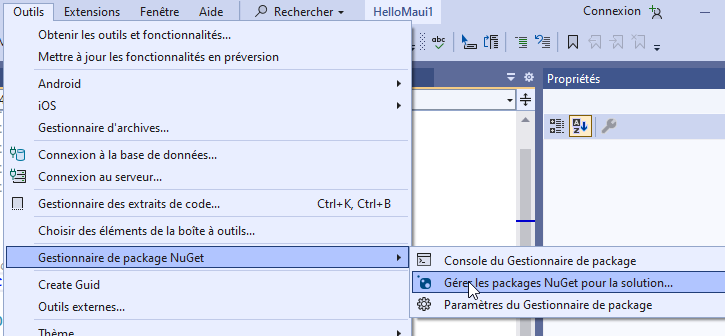
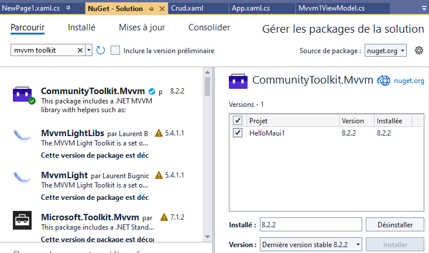
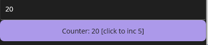
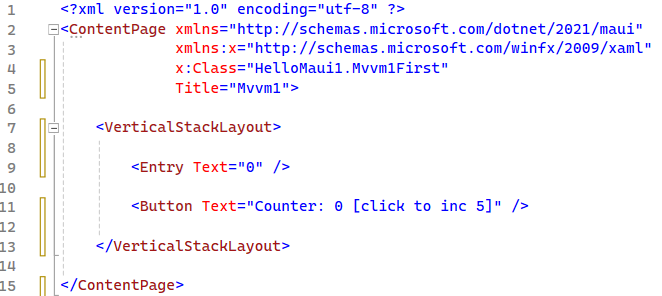
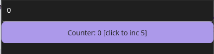
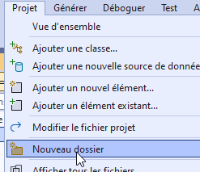
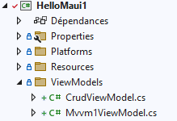
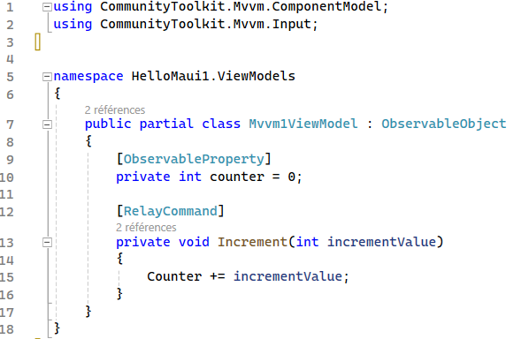
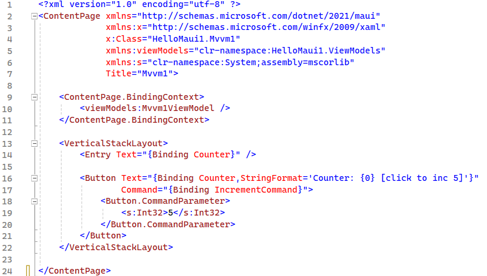
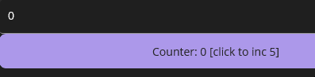

author: Jonathan Melly
summary: mobile app mvvm1
id: mobile-03-mvvm1
categories: android,dev
tags: ict
environments: Web
status: Published
feedback link: https://git.section-inf.ch/jmy/labs/issues
analytics account: UA-170792591-1

# MVVM

## Contexte théorique
Duration: 0:0:30

Le pattern MVVM implique une séparation entre 
 * les éléments graphiques (View)
 * le pilotage des éléments graphiques (ViewModel)
 * les données (Model)

Pour réaliser ce pattern, on utilisera naturellement la POO avec au moins une classe pour chaque élément.
En plus de la partie C#, la vue aura une composante XAML.

## Toolkit
Duration: 0:01:00

### Choix
MVVM peut s’implémenter sans autre dépendance, toutefois il existe un kit de développement (toolkit)
fourni par Microsoft qui facilite la mise en place de MVVM en réduisant le code à écrire.

### Installation
Accéder au gestionnaire nuget :

Ajouter le paquet "mvvm toolkit"

*Lorsque le paquet n’est pas installé, le bouton se nomme "installer"*

## Mise en place d’un compteur
Duration: 0:05:00

Pour illustrer MVVM qui a pour but de modéliser l’interaction entre les éléments graphiques
et des données de manière bidirectionnelle, un simple compteur va être réalisé :

### Ajouter la vue initiale
La vue initiale contient juste un label et un bouton :

En démarrant l’application, on devrait donc avoir une vue qui ressemble à ceci :

Negative
: À ce stade, l’application ne répond pas aux actions de l’utilisateur et c’est normal !

### Définition du modèle
Afin de simplifier les choses, le modèle de cet exemple sera un simple **int**, soit
une valeur stockée temporairement dans la RAM. Ce type étant natif en C#, il n’y à
donc rien à faire.

### ViewModel
Il est temps d’ajouter la logique de présentation avec le premier **ViewModel**.
Afin d’avoir une structure organisée, il est fortement recommandé de créer un dossier
*ViewModels*.

#### Dossier
Créer un dossier

Le renommer en *ViewModels*

Positive
: En cas d’oubli, cette manipulation peut toujours être faite a posteriori, mais attention aux éventuelles références...

#### Fichier
Le composant *ViewModel* est une classe C# qui contient du code et utilise les annotations fournies
par le toolkit :

### Connecter la vue au ViewModel
On peut désormais adapter la vue pour qu’elle soit reliée au ViewModel ce qui la rendra interactive :

## Astuces
Duration: 0:02:00

### Lier le MVVM dans le XAML en 3 clics
On peut utiliser la **fenêtre de propriété** pour ajouter la référence au ViewModel depuis le XAML sans devoir ajouter le namespace à la main:

## Synthèse
Duration: 0:1:00

Que faut-il retenir de cette entrée en matière MVVM ?

