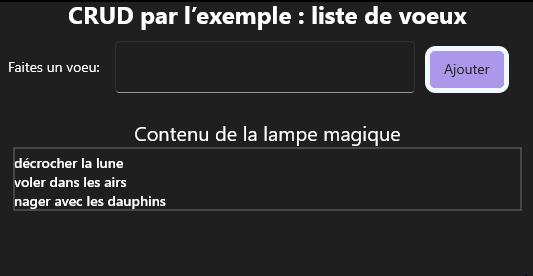
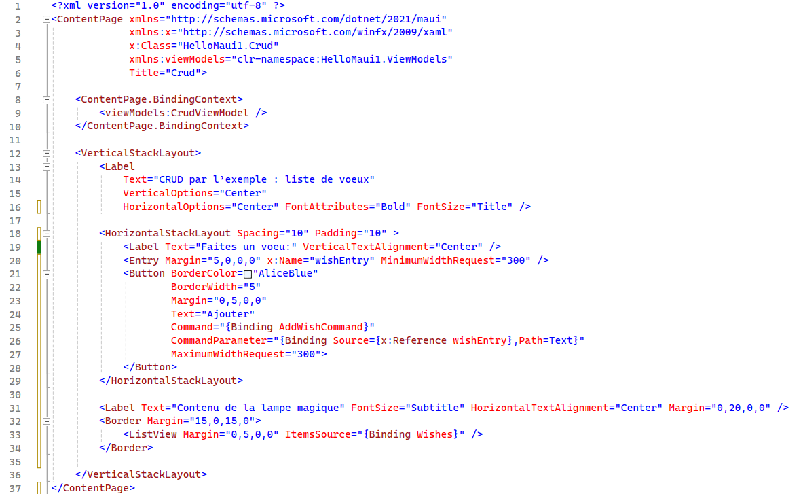
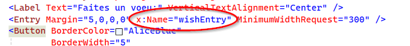
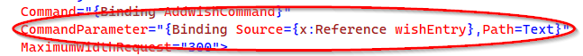
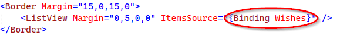
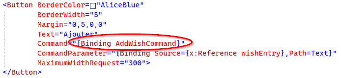
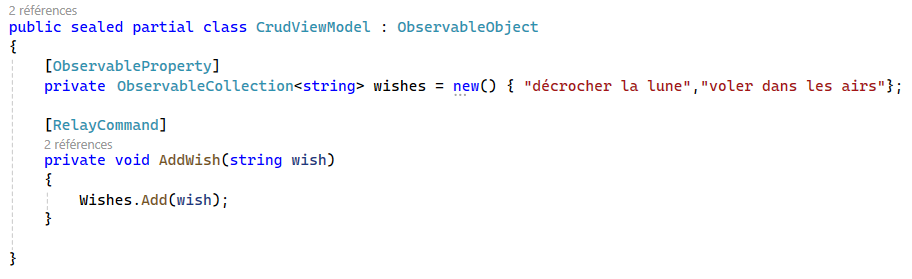
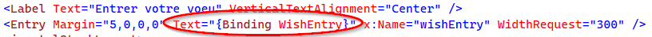

author: Jonathan Melly
summary: mobile app mvvm1
id: mobile-04-mvvm2
categories: android,dev
tags: ict
environments: Web
status: Published
feedback link: https://git.section-inf.ch/jmy/labs/issues
analytics account: UA-170792591-1

# MVVM2 : ListView

## Rappel
Duration: 0:01:00

### Listes
En C#, pour grouper plusieurs éléments dans un même conteneur, on peut utiliser une liste. Par exemple, voici une liste contenant 5 éléments:

|       |       |        |        |         |
| :---: | :---: | :----: | :----: | :-----: |
|   0   |   1   |   2    |   3    |    4    |
| "bob" | "max" | "lisa" | "ania" | "roger" |


Le code correspondant est:
```csharp
List<string> names = new("bob","max","lisa","ania","roger");
```

Positive
: L’avantage d’une liste comparé à un tableau, c’est qu’on peut facilement ajouter/supprimer des éléments car elle est dynamique.

### Prérequis
Ce tutorial part du principe que [celui-ci](https://labs.section-inf.ch/codelabs/mobile-03-mvvm1/index.html?index=..%2F..index) a été réalisé et compris notamment en ce qui concerne l’utilisation du [MVVM toolkit](https://learn.microsoft.com/en-us/dotnet/architecture/maui/mvvm-community-toolkit-features)


## Objectif
Duration: 0:01:00

Le but de ce tutorial est de créer une "wishlist", un peu comme si on avait une lampe d’Aladdin :



## Réalisation
Duration: 0:15:00

### Vue initiale
Créer un projet si nécessaire, puis ajouter un fichier XAML comme suit:



À part le composant *ListView* en fin de fichier, les éléments présentés ne sont pas nouveaux hormis le champ de saisie qui a un attribut *x:Name* 



nécessaire à passer son contenu en paramètre de la commande qui ajoute un voeu:



### ViewModel
Créer ensuite le *ViewModel* associé.

En suivant le XAML précédent, on comprend qu’il faut un attribut pour la liste des voeux :



 ainsi qu’une méthode pour l’ajout:



#### Liste
Selon ce qui a été rappelé, on serait tenté de déclarer l’attribut suivant:
```csharp
List<string> wishes = new(){"marcher sur la lune","..."};
```

Et de lui ajouter l’annotation MVVM:
```csharp
[Observable Property]
List<string> wishes = new(){"marcher sur la lune","..."};
```

Malheureusement ce n’est pas aussi simple, mais presque.
En effet, s’agissant d’une liste, on s’intéresse aux modifications **à l’intérieur** de la liste et non pas forcément de la liste toute entière.
Ainsi il faut utiliser un nouveau type de liste qui déclenche les notifications MVVM et qui se nomme *ObservableCollection*:

```csharp
private  ObservableCollection<string> wishes = new() { "décrocher la lune","voler dans les airs"};
```

#### Commande
Concernant la commande, rien de particulier, on fait comme précédemment en commençant par créer une méthode:

```csharp
private void AddWish(string wish)
{
    Wishes.Add(wish);
}
```

puis en ajoutant l’annotation MVVM correspondante:

```csharp
[RelayCommand]
private void AddWish(string wish)
{
    Wishes.Add(wish);
}
```

#### Tout ensemble


## Améliorations (fine tuning)
Duration: 0:10:00

### État des lieux
À ce stade l’application devrait être fonctionnelle et mérite quelques ajustements que l’on retrouve régulièrement dans les applications.

### Activation conditionnelle du bouton
Tant que rien n’est écrit dans le champ texte, le bouton *Ajouter* devrait être désactivé. Avec le MVVM toolkit et un peu de XAML, on peut réaliser ceci de manière élégante.

#### ViewModel

```csharp
[ObservableProperty]
[NotifyCanExecuteChangedFor(nameof(AddWishCommand))]
private string wishEntry = "";

[RelayCommand(CanExecute = nameof(AddWishCanExecute))]
private void AddWish(string wish)
{
    Wishes.Add(wish);
}

private bool AddWishCanExecute()
{
    return !string.IsNullOrEmpty(WishEntry);
}
```

#### XAML
La seule modification à effectuer est de rajouter le binding entre le champ texte et la propriété qui permet de savoir si du texte est rempli:



À partir de là, tant que le champ texte n’est pas rempli, le bouton devrait être désactivé !

### Vider le champ texte
Il serait agréable que le champ texte se réinitialise après avoir ajouté une entrée.
Maintenant que le champ texte est lié (binding) au ViewModel, il suffit de changer sa valeur:

```csharp
[RelayCommand(CanExecute = nameof(AddWishCanExecute))]
private void AddWish(string wish)
{
    Wishes.Add(wish);

    //Vidange du champ texte automatique
    wishEntry="";
}
```

Negative
: Pourtant cela ne fonctionne pas, n’est-ce pas ? Mais pourquoi alors ?

#### Attribut VS Propriété
Le Toolkit MVVM transforme automatiquement un attribut *private string attr* en une propriété (ajout de getter/setter) parce qu’il ajoute les mécanismes de notification MVVM... De ce fait, pour profiter des *ajouts*, on doit obligatoirement passer par les accesseurs. Ainsi un *w* minuscule aura une grande différence de fonctionnement d’un **W** majuscule:

```csharp
/*MAJUSCULE->Propriété->MVVM*/W/*/!\*/ishEntry="";
```

## Conclusion
Duration: 0:1:00

### Lier simplicité et efficacité
MVVM avec le toolkit permet de faire beaucoup avec peu, pour autant qu’on soit concentré et qu’on comprenne comment ça fonctionne.

Les deux tutoriaux réalisés décrivent la base du fonctionnement avec MVVM et le toolkit à partir de laquelle on peut développer de plus vastes applications. Il s’agit alors de reproduire les bons réflexes acquis...

Enfin, en cas de difficulté, revenir à ces 2 exercices devraient aider à identifier / résoudre le problème.