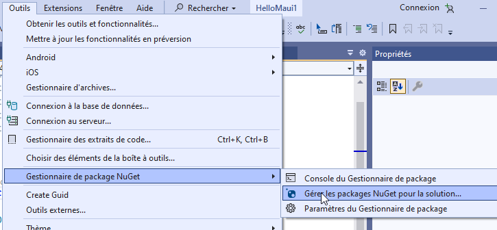

author: Jonathan Melly
summary: mobile app crud
id: mobile-05-crud1
categories: android,dev
tags: ict
environments: Web
status: Published
feedback link: https://git.section-inf.ch/jmy/labs/issues
analytics account: UA-170792591-1

# CRUD

## Introduction
Duration: 0:0:30

Ce tutorial fait suite au tutorial [MVVM-ListView](https://labs.section-inf.ch/codelabs/mobile-04-mvvm2/index.html?index=..%2F..index) et reprend l’application des voeux en ajoutant la persistance et les actions (CR)**UD** manquantes...

## Contexte théorique
Duration: 0:0:30


CRUD correspond à
 * **C**reate
 * **R**ead
 * **U**pdate
 * **D**elete

Autrement dit, cela correspond aux fonctions de bases pour manipuler les données.

## Librairies additionnelles
Duration: 0:06:00

### Interaction avec la base de données


**CRUD** implique le stockage des données. Dans l’environnement .NET, le réflexe est d’utiliser *EntityFramework* qui est un *ORM* (Object Relational Mapping) qui permet, pour les cas généraux, d’utiliser une simple API plutôt que d’écrire des requêtes SQL à la main...

### SGBD


*EntityFramework* fonctionne avec les backends standards et pour des raisons de simplification, **SQLite** sera utilisé dans ce tutorial.

Positive
: Il est très facile de passer de SQLite à MariaDB avec EntityFramework, il suffit d’ajouter le driver et changer le chaîne de connexion...


### Installation

Accéder au gestionnaire nuget :



Installer le paquet 
```nuget
Microsoft.EntityFrameworkCore.Sqlite
```


*Ce paquet installera aussi EntityFramework grâce au système de dépendances...*

## Adaptation du **modèle**
Duration: 0:10:00

### Situation initiale
Jusque là, le modèle s’était borné à un simple "String", certes pratique dans le cadre d’un exercice mais pas tout à fait réaliste.

### Modèle basique
Une manière de *convertir* un voeu représenté par du texte en une classe pourrait être quelque-chose comme ça:

```csharp
public class Wish
{
    /* Définition du voeu, par exemple 
    "marcher sur la lune" */
    public string? Definition {get;set;} 

    /* Date à laquelle le voeu a été exaucé */
    public DateTime AccomplishedDate{get;set;}
}
```

Pour garder un projet en ordre, ce modèle trouvera sa place dans un dossier **Models** :


### Adaptation pour la base de données

Pour que le modèle puisse être stocké en base de données avec EF (EntityFramework), il faut ajouter une propriété pour la clé primaire (Id) et déclarer le *DbContext*

#### Id pour Wish


Positive
: En plus de l’Id, une méthode *ToString* particulière a été ajoutée afin de faciliter le debug...

#### DbContext

Créer le fichier dans un nouveau dossier nommé *services*


Dont voici le contenu:


## Adaptation du **ViewModel**
Duration: 0:15:00

### **C**REATE
À la création d’un voeu, on va l’insérer en base de données en plus de mettre à jour la liste locale:


Positive
: Grâce à EF, les modifications sont minimes pour interagir avec la base de données

### **R**EAD
Étant donné qu’on insère des données en base, il faut désormais charger ces données depuis la DB au lancement de la page:


### **U**PDATE
Comment faire pour mettre à jour un voeu ?

On charge la version en base de données correspondante (utilisation implicite des Id[clé primaire]) et on la met à jour en demandant une synchronisation.

Negative
: Pour des raisons de simplification, le ViewModel fait directement appel à une fonction pour faire apparaître un *prompt*...


Negative
: En ajoutant un appel direct à la vue (DisplayPrompt) dans le ViewModel, on risque de compliquer les tests automatiques mais pour l’instant on tolère ce raccourci...

#### Vue
Voici ce qu’on verra en cliquant sur le crayon:


### **D**ELETE
Il reste encore à gérer la suppression. À nouveau, grâce à EF qui reconnaît les Ids, cette étape est vraiment très simple:


## Adaptation de la **vue**
Duration: 0:15:00

L’édition et la suppression n’ont pas encore de bouton associés dans la vue et il faut donc les ajouter.

### **U**PDATE et **D**ELETE

On va avoir besoin d’une référence sur le ViewModel pour lier les actions, il faut donc être certain d’avoir un *x:Name* ici:


Il subsiste actuellement un bogue avec les ListView lorsqu’on ajoute des boutons à l’intérieur, on va donc convertir la ListView en CollectionView qui a le mérite d’être beaucoup plus flexible au niveau du design.
À part ça, on ajoute 2 boutons, 1 sous forme d’icône et l’autre sous forme textuelle ce qui donne le rendu suivant:


Et voici le XAML correspondant:


#### Image MAUI
Pour intégrer des images dans MAUI, le plus simple est d’utiliser un **SVG** à partir duquel le compilateur générera automatiquement les png de la bonne taille selon les devices cibles.

Le plus simple est donc de glisser-déposer un SVG


ici:


Et ensuite le référencer en tant que *image.png* (changer l’extension).


## Vue un peu plus "smartphone"
Duration: 0:15:00

Une version plus orientée smartphone pourrait ressembler à ça:


Pour cette partie c’est à vous de jouer sachant qu’un mot clé intéressant est **SWIPE** ;-)

## Synthèse
Duration: 0:1:00

Suite à cet exercice, les compétences suivantes ont été travaillées:

- Installer EF pour SQLite
- Définir une entité de persistance (aka table de base de données)
- Charger des données avec EF
- Ajouter / Modifier / Éditer des données avec EF
- Utiliser une CollectionView avec des boutons d’action