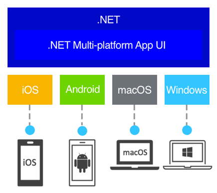
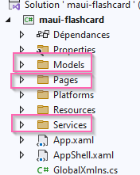

author: Jonathan Melly
summary: mobile app crud with json
id: mobile-05a-crud
categories: android,dev
tags: ict
environments: Web
status: Published
feedback link: https://git.section-inf.ch/jmy/labs/issues
analytics account: UA-170792591-1

# CRUD

## Introduction
Duration: 0:02:00



Ce tutorial présente une approche de base pour gérer des données dans une application MAUI en utilisant uniquement du code-behind (sans MVVM) et de la sérialisation JSON pour la persistance.

### Objectifs

Apprendre à créer une application de gestion de paquets de cartes (decks) avec les opérations CRUD :
- **C**reate : Créer de nouveaux decks
- **R**ead : Lister les decks existants avec CollectionView
- **U**pdate : Renommer un deck
- **D**elete : Supprimer un deck

### Approche technique

Cette application utilise :
- **Code-behind simple** : Pas de ViewModel, logique directement dans les fichiers .xaml.cs
- **JSON** : Stockage des données dans un fichier JSON
- **XAML** : Interface utilisateur déclarative
- **CollectionView** : Affichage moderne de la liste

Positive
: Cette approche est idéale pour débuter car elle évite la complexité du pattern MVVM tout en restant fonctionnelle.

## Mise en place du projet
Duration: 0:05:00

### Créer le projet

Créer un nouveau projet MAUI nommé **DeckManager** en suivant les étapes du tutorial [hello world](https://labs.section-inf.ch/codelabs/mobile-hello/index.html) ou reprendre un projet existant (par exemple, le projet Flashcard...).

### Structure du projet

Nous allons organiser le projet avec les dossiers suivants :
- **Models** : Pour la classe Deck
- **Services** : Pour la gestion du JSON
- **Pages** : Pour les pages XAML

Créer ces dossiers dans l'explorateur de solution :




Positive
: Un projet bien organisé et plus facile à maintenir et faire évoluer

## Modèle de données
Duration: 0:05:00

### Classe Deck

Dans le dossier **Models**, créer une nouvelle classe `Deck.cs` :

```csharp
namespace DeckManager.Models
{
    public class Deck
    {
        public int Id { get; set; }
        public string Name { get; set; } = string.Empty;
        public DateTime CreatedDate { get; set; }
        public int CardCount { get; set; }

        public Deck()
        {
            CreatedDate = DateTime.Now;
        }

        public override string ToString()
        {
            return $"{Name} ({CardCount} cards)";
        }
    }
}
```

### Propriétés

- **Id** : Identifiant unique du deck
- **Name** : Nom du deck (ex: "Anglais niveau 1")
- **CreatedDate** : Date de création
- **CardCount** : Nombre de cartes dans le deck

Positive
: La méthode `ToString()` redéfinie est utile pour le débogage et l'affichage rapide (la version par défaut écrivant simplement le nom de la classe).

## Service de persistance JSON
Duration: 0:10:00

### Pourquoi JSON ?

Le format JSON est simple, lisible et parfait pour stocker des données structurées sans avoir besoin d'une base de données complexe.

### Classe JsonDataService

Dans le dossier **Services**, créer la classe `JsonDataService.cs` :

```csharp
using System.Text.Json;
using DeckManager.Models;

namespace DeckManager.Services
{
    public class JsonDataService
    {
        private readonly string _filePath;

        public JsonDataService()
        {
            // Path to store the JSON file in app data
            _filePath = Path.Combine(
                FileSystem.AppDataDirectory,
                "decks.json"
            );
        }

        public async Task<List<Deck>> LoadDecksAsync()
        {
            try
            {
                if (!File.Exists(_filePath))
                {
                    return new List<Deck>();
                }

                var json = await File.ReadAllTextAsync(_filePath);
                var decks = JsonSerializer.Deserialize<List<Deck>>(json);
                return decks ?? new List<Deck>();
            }
            catch (Exception ex)
            {
                System.Diagnostics.Debug.WriteLine($"Error loading: {ex.Message}");
                return new List<Deck>();
            }
        }

        public async Task SaveDecksAsync(List<Deck> decks)
        {
            try
            {
                var options = new JsonSerializerOptions
                {
                    WriteIndented = true
                };
                var json = JsonSerializer.Serialize(decks, options);
                await File.WriteAllTextAsync(_filePath, json);
            }
            catch (Exception ex)
            {
                System.Diagnostics.Debug.WriteLine($"Error saving: {ex.Message}");
            }
        }

        public string GetFilePath()
        {
            return _filePath;
        }
    }
}
```

### Points clés

- **FileSystem.AppDataDirectory** : Dossier de données de l'application (%APPDATA%\...)
- **LoadDecksAsync** : Charge les decks depuis le fichier JSON
- **SaveDecksAsync** : Sauvegarde les decks dans le fichier JSON
- **WriteIndented** : Rend le JSON lisible (formaté)
- **Async** : Les méthodes qui ont des dépendances vers des entrées/sorties qui peuvent être lentes (accès au système de fichier) supportent
le mode asynchrone qui évite de bloquer l’appelant le temps que l’opération soit réalisée... Ceci permet notamment d’éviter de bloquer
la partie graphique et donner une impression d’application lente...

Positive
: Le service gère automatiquement les erreurs et retourne une liste vide en cas de problème.

## Page de gestion des decks - XAML
Duration: 0:10:00

### Créer la page

Ajoutez une nouvelle page XAML dans le dossier racine : **DecksPage.xaml**


### Interface utilisateur

Remplacez le contenu de `DecksPage.xaml` :

```xml
<?xml version="1.0" encoding="utf-8" ?>
<ContentPage xmlns="http://schemas.microsoft.com/dotnet/2021/maui"
             xmlns:x="http://schemas.microsoft.com/winfx/2009/xaml"
             x:Class="DeckManager.DecksPage"
             Title="Mes Decks">

    <Grid RowDefinitions="Auto,*,Auto" Padding="10">

        <!-- Header with add button -->
        <HorizontalStackLayout Grid.Row="0"
                              Spacing="10"
                              Margin="0,0,0,10">
            <Entry x:Name="NewDeckEntry"
                   Placeholder="Nom du nouveau deck"
                   HorizontalOptions="FillAndExpand" />
            <Button Text="Ajouter"
                    Clicked="OnAddDeckClicked"
                    BackgroundColor="#2196F3"
                    TextColor="White" />
        </HorizontalStackLayout>

        <!-- Decks list -->
        <CollectionView Grid.Row="1"
                       x:Name="DecksCollectionView"
                       SelectionMode="None">
            <CollectionView.ItemTemplate>
                <DataTemplate>
                    <Frame Margin="0,5"
                           Padding="10"
                           BorderColor="LightGray"
                           CornerRadius="8"
                           HasShadow="True">
                        <Grid ColumnDefinitions="*,Auto,Auto">

                            <!-- Deck info -->
                            <StackLayout Grid.Column="0"
                                        VerticalOptions="Center">
                                <Label Text="{Binding Name}"
                                       FontSize="18"
                                       FontAttributes="Bold" />
                                <Label Text="{Binding CardCount, StringFormat='{0} cartes'}"
                                       FontSize="14"
                                       TextColor="Gray" />
                                <Label Text="{Binding CreatedDate, StringFormat='Créé le {0:dd/MM/yyyy}'}"
                                       FontSize="12"
                                       TextColor="LightGray" />
                            </StackLayout>

                            <!-- Edit button -->
                            <Button Grid.Column="1"
                                   Text="✏️"
                                   FontSize="20"
                                   BackgroundColor="Transparent"
                                   Clicked="OnEditDeckClicked"
                                   CommandParameter="{Binding .}" />

                            <!-- Delete button -->
                            <Button Grid.Column="2"
                                   Text="🗑️"
                                   FontSize="20"
                                   BackgroundColor="Transparent"
                                   Clicked="OnDeleteDeckClicked"
                                   CommandParameter="{Binding .}" />
                        </Grid>
                    </Frame>
                </DataTemplate>
            </CollectionView.ItemTemplate>

            <!-- Empty view -->
            <CollectionView.EmptyView>
                <StackLayout HorizontalOptions="Center"
                            VerticalOptions="Center">
                    <Label Text="📚"
                           FontSize="60"
                           HorizontalOptions="Center" />
                    <Label Text="Aucun deck"
                           FontSize="18"
                           TextColor="Gray"
                           HorizontalOptions="Center" />
                    <Label Text="Créez votre premier deck ci-dessus"
                           FontSize="14"
                           TextColor="LightGray"
                           HorizontalOptions="Center" />
                </StackLayout>
            </CollectionView.EmptyView>
        </CollectionView>

        <!-- Info bar -->
        <Label Grid.Row="2"
               x:Name="InfoLabel"
               Text="Prêt"
               FontSize="12"
               TextColor="Gray"
               HorizontalOptions="Center"
               Margin="0,10,0,0" />
    </Grid>

</ContentPage>
```

### Points XAML importants

- **CollectionView** : Affichage moderne et performant de la liste
- **DataTemplate** : Définit l'apparence de chaque élément
- **Binding** : Lie les propriétés du Deck à l'interface
- **CommandParameter** : Passe l'objet Deck aux boutons
- **EmptyView** : Affichage quand la liste est vide

Positive
: Le CollectionView est plus moderne et flexible que la ListView désormais dépréciée.

## Code-behind - Chargement et CREATE
Duration: 0:10:00

### Initialisation

Ouvrir `DecksPage.xaml.cs` et remplacer/adapter son contenu comme suit :

```csharp
using DeckManager.Models;
using DeckManager.Services;

namespace DeckManager
{
    public partial class DecksPage : ContentPage
    {
        private JsonDataService _dataService;
        private List<Deck> _decks;
        private int _nextId = 1;

        public DecksPage()
        {
            InitializeComponent();
            _dataService = new JsonDataService();
            _decks = new List<Deck>();
            LoadDecks();
        }

        private async void LoadDecks()
        {
            _decks = await _dataService.LoadDecksAsync();

            // Calculate next ID
            if (_decks.Any())
            {
                _nextId = _decks.Max(d => d.Id) + 1;
            }

            RefreshView();
            UpdateInfo($"Chargé: {_decks.Count} deck(s)");
        }

        private void RefreshView()
        {
            DecksCollectionView.ItemsSource = null;
            DecksCollectionView.ItemsSource = _decks;
        }

        private void UpdateInfo(string message)
        {
            InfoLabel.Text = $"{DateTime.Now:HH:mm:ss} - {message}";
        }
    }
}
```

### CREATE - Ajouter un deck

Ajouter la méthode pour créer un nouveau deck :

```csharp
private async void OnAddDeckClicked(object sender, EventArgs e)
{
    var name = NewDeckEntry.Text?.Trim();

    if (string.IsNullOrEmpty(name))
    {
        await DisplayAlert("Erreur", "Veuillez entrer un nom", "OK");
        return;
    }

    // Create new deck
    var newDeck = new Deck
    {
        Id = _nextId++,
        Name = name,
        CardCount = 0
    };

    _decks.Add(newDeck);
    await _dataService.SaveDecksAsync(_decks);

    RefreshView();
    NewDeckEntry.Text = string.Empty;
    UpdateInfo($"Ajouté: {name}");
}
```

### Points clés

- **Validation** : Vérifie que le nom n'est pas vide
- **ID automatique** : Incrémente `_nextId` pour chaque nouveau deck
- **Sauvegarde** : Persiste immédiatement dans le JSON
- **Rafraîchissement** : Met à jour l'affichage
- **Reset** : Vide le champ de saisie

Positive
: La sauvegarde automatique garantit qu'aucune donnée n'est perdue.

## UPDATE - Renommer un deck (version DisplayPrompt)
Duration: 0:08:00

### Méthode d'édition avec popup

Ajoutez la méthode dans `DecksPage.xaml.cs` :

```csharp
private async void OnEditDeckClicked(object sender, EventArgs e)
{
    var button = sender as Button;
    var deck = button?.CommandParameter as Deck;

    if (deck == null) return;

    // Prompt for new name
    var newName = await DisplayPromptAsync(
        "Renommer",
        "Nouveau nom du deck:",
        initialValue: deck.Name,
        placeholder: "Nom du deck"
    );

    if (string.IsNullOrWhiteSpace(newName))
    {
        return; // User cancelled or entered empty
    }

    // Update deck name
    deck.Name = newName.Trim();
    await _dataService.SaveDecksAsync(_decks);

    RefreshView();
    UpdateInfo($"Renommé: {newName}");
}
```

### Fonctionnement

1. **CommandParameter** : Récupère le deck depuis le bouton
2. **DisplayPromptAsync** : Affiche un popup de saisie
3. **initialValue** : Pré-remplit avec le nom actuel
4. **Validation** : Vérifie que le nouveau nom n'est pas vide
5. **Mise à jour** : Modifie le nom et sauvegarde

Positive
: `DisplayPromptAsync` est une méthode native MAUI très pratique pour les saisies rapides.

## UPDATE - Alternative avec Entry inline
Duration: 0:12:00

### Approche différente

Au lieu d'utiliser un popup, on peut permettre l'édition directement dans la liste avec un Entry qui apparaît au clic.

### Première idée : Modifier le XAML du DataTemplate

Une option serait d’avoir un emplacement qu’on affiche/masque pour la partie saisie d’information.
Ceci correspondrait à remplacer le `DataTemplate` dans `DecksPage.xaml` comme suit :

```xml
<CollectionView.ItemTemplate>
    <DataTemplate>
        <Frame Margin="0,5"
               Padding="10"
               BorderColor="LightGray"
               CornerRadius="8"
               HasShadow="True">
            <Grid ColumnDefinitions="*,Auto,Auto,Auto">

                <!-- Deck info (normal mode) -->
                <StackLayout Grid.Column="0"
                            VerticalOptions="Center"
                            x:Name="DisplayStack">
                    <Label Text="{Binding Name}"
                           FontSize="18"
                           FontAttributes="Bold" />
                    <Label Text="{Binding CardCount, StringFormat='{0} cartes'}"
                           FontSize="14"
                           TextColor="Gray" />
                    <Label Text="{Binding CreatedDate, StringFormat='Créé le {0:dd/MM/yyyy}'}"
                           FontSize="12"
                           TextColor="LightGray" />
                </StackLayout>

                <!-- Edit mode (hidden by default) -->
                <HorizontalStackLayout Grid.Column="0"
                                      VerticalOptions="Center"
                                      IsVisible="False"
                                      x:Name="EditStack">
                    <Entry Text="{Binding Name}"
                           x:Name="EditEntry"
                           HorizontalOptions="FillAndExpand"
                           WidthRequest="200" />
                    <Button Text="✓"
                           FontSize="18"
                           BackgroundColor="Green"
                           TextColor="White"
                           Clicked="OnSaveEditClicked"
                           CommandParameter="{Binding .}" />
                    <Button Text="✗"
                           FontSize="18"
                           BackgroundColor="Red"
                           TextColor="White"
                           Clicked="OnCancelEditClicked"
                           CommandParameter="{Binding .}" />
                </HorizontalStackLayout>

                <!-- Edit button -->
                <Button Grid.Column="1"
                       Text="✏️"
                       FontSize="20"
                       BackgroundColor="Transparent"
                       Clicked="OnEditDeckInlineClicked"
                       CommandParameter="{Binding .}"
                       x:Name="EditButton" />

                <!-- Delete button -->
                <Button Grid.Column="2"
                       Text="🗑️"
                       FontSize="20"
                       BackgroundColor="Transparent"
                       Clicked="OnDeleteDeckClicked"
                       CommandParameter="{Binding .}" />
            </Grid>
        </Frame>
    </DataTemplate>
</CollectionView.ItemTemplate>
```

### Code-behind pour l'édition inline

Negative
: Malheureusement, dans un DataTemplate, on ne peut pas facilement accéder aux éléments par leur x:Name depuis le code-behind.

### Deuxième idée : Créer une page d'édition - EditDeckPage.xaml

Voici donc une nouvelle page dédiée à la création :

```xml
<?xml version="1.0" encoding="utf-8" ?>
<ContentPage xmlns="http://schemas.microsoft.com/dotnet/2021/maui"
             xmlns:x="http://schemas.microsoft.com/winfx/2009/xaml"
             x:Class="DeckManager.EditDeckPage"
             Title="Modifier le deck">

    <StackLayout Padding="20" Spacing="15">

        <Label Text="Nom du deck"
               FontSize="16"
               FontAttributes="Bold" />

        <Entry x:Name="NameEntry"
               Placeholder="Nom du deck"
               FontSize="18" />

        <Label Text="Nombre de cartes"
               FontSize="16"
               FontAttributes="Bold"
               Margin="0,20,0,0" />

        <HorizontalStackLayout Spacing="10">
            <Button Text="-"
                   Clicked="OnDecrementClicked"
                   WidthRequest="50"
                   BackgroundColor="LightGray" />

            <Label x:Name="CardCountLabel"
                   Text="0"
                   FontSize="24"
                   VerticalOptions="Center"
                   HorizontalOptions="Center"
                   WidthRequest="60"
                   HorizontalTextAlignment="Center" />

            <Button Text="+"
                   Clicked="OnIncrementClicked"
                   WidthRequest="50"
                   BackgroundColor="LightGray" />
        </HorizontalStackLayout>

        <Button Text="Sauvegarder"
               Clicked="OnSaveClicked"
               BackgroundColor="#4CAF50"
               TextColor="White"
               Margin="0,30,0,0" />

        <Button Text="Annuler"
               Clicked="OnCancelClicked"
               BackgroundColor="Gray"
               TextColor="White" />

    </StackLayout>

</ContentPage>
```

### Code-behind EditDeckPage.xaml.cs

Et voici la partie de traitement :

```csharp
using DeckManager.Models;
using DeckManager.Services;

namespace DeckManager
{
    public partial class EditDeckPage : ContentPage, IQueryAttributable
    {
        private Deck _deck;
        private int _cardCount;
        private JsonDataService _dataService;
        private List<Deck> _decks;

        public EditDeckPage()
        {
            InitializeComponent();
        }

        // Receive navigation parameters
        public void ApplyQueryAttributes(IDictionary<string, object> query)
        {
            if (query.TryGetValue("deck", out var deckObj) && deckObj is Deck deck)
            {
                _deck = deck;
                _cardCount = deck.CardCount;

                // Initialize fields
                NameEntry.Text = deck.Name;
                CardCountLabel.Text = _cardCount.ToString();
            }

            if (query.TryGetValue("dataService", out var serviceObj) && serviceObj is JsonDataService service)
            {
                _dataService = service;
            }

            if (query.TryGetValue("decks", out var decksObj) && decksObj is List<Deck> decks)
            {
                _decks = decks;
            }
        }

        private void OnIncrementClicked(object sender, EventArgs e)
        {
            _cardCount++;
            CardCountLabel.Text = _cardCount.ToString();
        }

        private void OnDecrementClicked(object sender, EventArgs e)
        {
            if (_cardCount > 0)
            {
                _cardCount--;
                CardCountLabel.Text = _cardCount.ToString();
            }
        }

        private async void OnSaveClicked(object sender, EventArgs e)
        {
            var newName = NameEntry.Text?.Trim();

            if (string.IsNullOrWhiteSpace(newName))
            {
                await DisplayAlert("Erreur", "Le nom ne peut pas être vide", "OK");
                return;
            }

            // Update deck
            _deck.Name = newName;
            _deck.CardCount = _cardCount;

            // Save immediately to JSON
            await _dataService.SaveDecksAsync(_decks);

            await Shell.Current.GoToAsync("..");
        }

        private async void OnCancelClicked(object sender, EventArgs e)
        {
            await Shell.Current.GoToAsync("..");
        }
    }
}
```

#### Explication de la syntaxe pour la récupération des paramètres

La ligne suivante peut sembler complexe :
```csharp
if (query.TryGetValue("deck", out var deckObj) && deckObj is Deck deck)
```

Décomposons-la étape par étape pour comprendre ce qui se passe :

##### Version décomposée (équivalente mais plus longue)

```csharp
// Étape 1 : Essayer de récupérer la valeur avec la clé "deck"
bool found = query.TryGetValue("deck", out var deckObj);

// Étape 2 : Vérifier que la valeur a été trouvée
if (found)
{
    // Étape 3 : Vérifier que l'objet est bien de type Deck
    if (deckObj is Deck)
    {
        // Étape 4 : Convertir (cast) vers le type Deck
        Deck deck = (Deck)deckObj;

        // Étape 5 : Utiliser la variable deck
        _deck = deck;
        // ...
    }
}
```

##### Version condensée (celle utilisée)

La syntaxe condensée combine toutes ces étapes :

```csharp
if (query.TryGetValue("deck", out var deckObj) && deckObj is Deck deck)
{
    _deck = deck;
    // ...
}
```

##### Explication partie par partie

1. **`query.TryGetValue("deck", out var deckObj)`**
   - Cherche la clé `"deck"` dans le dictionnaire
   - Si trouvée : retourne `true` ET stocke la valeur dans `deckObj`
   - Si non trouvée : retourne `false`

2. **`&&`** (ET logique)
   - N'évalue la partie droite QUE si la partie gauche est `true`
   - Court-circuite si `TryGetValue` retourne `false`

3. **`deckObj is Deck deck`**
   - Vérifie que `deckObj` est de type `Deck`
   - Si oui : retourne `true` ET crée une variable `deck` typée
   - Si non : retourne `false`

4. **Résultat final**
   - Le bloc `if` s'exécute SEULEMENT si :
     - La clé existe dans le dictionnaire
     - ET la valeur est du bon type
   - La variable `deck` est directement utilisable (typée)

Positive
: Cette syntaxe condensée est très courante en C# moderne car elle évite les conversions (cast) dangereuses et rend le code plus sûr.

### Modifier DecksPage pour utiliser EditDeckPage

Il faut maintenant adapter la page initiale en remplaçant la méthode `OnEditDeckClicked` dans `DecksPage.xaml.cs`.

Pour rappel, il existe plusieurs manières de passer des paramètres entre les pages avec le 'shell' et nous suggérons d'utiliser
la version la plus polyvalente, même si elle demande un peu plus de code :

```csharp
private async void OnEditDeckClicked(object sender, EventArgs e)
{
    var button = sender as Button;
    var deck = button?.CommandParameter as Deck;

    if (deck == null) return;

    // Navigate to edit page using Shell
    // Pass deck, dataService and decks list so EditDeckPage can save
    var navigationParameter = new Dictionary<string, object>
    {
        { "deck", deck },
        { "dataService", _dataService },
        { "decks", _decks }
    };
    await Shell.Current.GoToAsync("EditDeck", navigationParameter);
}

// Refresh view when returning from edit page
protected override void OnAppearing()
{
    base.OnAppearing();

    // Just refresh the display (save is done in EditDeckPage)
    RefreshView();
}
```

#### Pourquoi passer le service et la liste ?

En passant `_dataService` et `_decks` à la page d'édition, celle-ci peut sauvegarder immédiatement lorsque l'utilisateur clique sur "Sauvegarder". C'est plus clair et intuitif :
- **Clic sur Sauvegarder** → Modifications enregistrées
- **Clic sur Annuler** → Rien n'est sauvegardé

> Une alternative consiste à utiliser un registre de services via une classe statique, par exemple, ou en utilisant [le système .NET](https://learn.microsoft.com/en-us/dotnet/maui/fundamentals/dependency-injection?view=net-maui-10.0) un peu plus complexe 

### Avantages de l'approche avec page dédiée

- **Interface complète** : Plus d'espace pour les contrôles
- **Édition de plusieurs propriétés** : Nom ET nombre de cartes
- **Meilleure UX** : Focus clair sur la tâche d'édition
- **Code plus simple** : Pas de gestion de visibilité complexe

Positive
: L'utilisation d'une page dédiée pour l'édition est une pratique courante dans les applications mobiles.

## DELETE - Supprimer un deck
Duration: 0:08:00

### Méthode de suppression

Ajoutez la méthode dans `DecksPage.xaml.cs` :

```csharp
private async void OnDeleteDeckClicked(object sender, EventArgs e)
{
    var button = sender as Button;
    var deck = button?.CommandParameter as Deck;

    if (deck == null) return;

    // Confirm deletion
    var confirm = await DisplayAlert(
        "Confirmation",
        $"Voulez-vous vraiment supprimer '{deck.Name}' ?",
        "Supprimer",
        "Annuler"
    );

    if (!confirm) return;

    // Remove deck
    _decks.Remove(deck);
    await _dataService.SaveDecksAsync(_decks);

    RefreshView();
    UpdateInfo($"Supprimé: {deck.Name}");
}
```

### Sécurité de suppression

- **DisplayAlert** : Demande confirmation avant suppression
- **Bouton destructif** : "Supprimer" en premier (rouge sur iOS)
- **Bouton d'annulation** : "Annuler" pour revenir en arrière
- **Retour booléen** : `confirm` indique le choix de l'utilisateur

Negative
: Toujours demander confirmation avant une suppression pour éviter les erreurs.

## Amélioration : ObservableCollection au lieu de RefreshView
Duration: 0:08:00

### Pourquoi RefreshView() ?

Dans ce tutorial, nous utilisons une méthode `RefreshView()` qui réassigne la liste :

```csharp
private void RefreshView()
{
    DecksCollectionView.ItemsSource = null;
    DecksCollectionView.ItemsSource = _decks;
}
```

Cette approche simple force le `CollectionView` à se rafraîchir complètement. Mais pourquoi est-ce nécessaire ?

**Le problème** : Lorsqu'on utilise une `List<Deck>`, le CollectionView ne détecte PAS automatiquement :
- L'ajout d'éléments (`_decks.Add(...)`)
- La suppression d'éléments (`_decks.Remove(...)`)
- Les modifications de propriétés d'un élément (ex: `deck.Name = "nouveau nom"`)

### Qu'est-ce que ObservableCollection ?

`ObservableCollection<T>` est une collection intelligente qui **notifie automatiquement** les changements :
- Détecte les ajouts
- Détecte les suppressions
- Détecte les remplacements d'éléments
- Ne détecte PAS les modifications de propriétés (il faudrait `INotifyPropertyChanged` sur la classe Deck)

### Modifications nécessaires

Voici les changements à apporter pour utiliser `ObservableCollection` :

#### 1. Modifier la déclaration dans DecksPage.xaml.cs

```csharp
using System.Collections.ObjectModel;  // Ajouter ce using
using DeckManager.Models;
using DeckManager.Services;

namespace DeckManager
{
    public partial class DecksPage : ContentPage
    {
        private JsonDataService _dataService;
        private ObservableCollection<Deck> _decks;  // List devient ObservableCollection
        private int _nextId = 1;

        public DecksPage()
        {
            InitializeComponent();
            _dataService = new JsonDataService();
            _decks = new ObservableCollection<Deck>();  // new ObservableCollection
            LoadDecks();
        }
```

#### 2. Modifier LoadDecks pour charger dans ObservableCollection

```csharp
private async void LoadDecks()
{
    var loadedDecks = await _dataService.LoadDecksAsync();

    // Clear and repopulate ObservableCollection
    _decks.Clear();
    foreach (var deck in loadedDecks)
    {
        _decks.Add(deck);
    }

    if (_decks.Any())
    {
        _nextId = _decks.Max(d => d.Id) + 1;
    }

    // Assign ItemsSource ONCE (no need to reassign every time)
    if (DecksCollectionView.ItemsSource == null)
    {
        DecksCollectionView.ItemsSource = _decks;
    }

    UpdateInfo($"Chargé: {_decks.Count} deck(s)");
}
```

#### 3. Supprimer RefreshView() partout où cela apparaît

Avec `ObservableCollection`, plus besoin de rafraîchir manuellement :

**Méthode OnAddDeckClicked :**
```csharp
private async void OnAddDeckClicked(object sender, EventArgs e)
{
    var name = NewDeckEntry.Text?.Trim();

    if (string.IsNullOrEmpty(name))
    {
        await DisplayAlert("Erreur", "Veuillez entrer un nom", "OK");
        return;
    }

    var newDeck = new Deck
    {
        Id = _nextId++,
        Name = name,
        CardCount = 0
    };

    _decks.Add(newDeck);  // ← La vue se met à jour automatiquement !
    await _dataService.SaveDecksAsync(_decks.ToList());

    // RefreshView();  ← SUPPRIMÉ !
    NewDeckEntry.Text = string.Empty;
    UpdateInfo($"Ajouté: {name}");
}
```

**Méthode OnDeleteDeckClicked :**
```csharp
private async void OnDeleteDeckClicked(object sender, EventArgs e)
{
    var button = sender as Button;
    var deck = button?.CommandParameter as Deck;

    if (deck == null) return;

    var confirm = await DisplayAlert(
        "Confirmation",
        $"Voulez-vous vraiment supprimer '{deck.Name}' ?",
        "Supprimer",
        "Annuler"
    );

    if (!confirm) return;

    _decks.Remove(deck);  // ← La vue se met à jour automatiquement !
    await _dataService.SaveDecksAsync(_decks.ToList());

    // RefreshView();  ← SUPPRIMÉ !
    UpdateInfo($"Supprimé: {deck.Name}");
}
```

**Méthode OnAppearing :**
```csharp
protected override void OnAppearing()
{
    base.OnAppearing();

    // RefreshView();  ← SUPPRIMÉ !
    // L'ObservableCollection met déjà à jour la vue automatiquement
}
```

#### 4. Adapter JsonDataService ou les appels

La méthode `SaveDecksAsync` attend une `List<Deck>`, donc convertir :

```csharp
await _dataService.SaveDecksAsync(_decks.ToList());
```

Ou modifier `JsonDataService` pour accepter `IEnumerable<Deck>` :

```csharp
public async Task SaveDecksAsync(IEnumerable<Deck> decks)
{
    try
    {
        var options = new JsonSerializerOptions
        {
            WriteIndented = true
        };
        var json = JsonSerializer.Serialize(decks, options);
        await File.WriteAllTextAsync(_filePath, json);
    }
    catch (Exception ex)
    {
        System.Diagnostics.Debug.WriteLine($"Error saving: {ex.Message}");
    }
}
```

#### 5. Adapter EditDeckPage pour recevoir ObservableCollection

```csharp
private ObservableCollection<Deck> _decks;  // ← Change type

public void ApplyQueryAttributes(IDictionary<string, object> query)
{
    // ...

    if (query.TryGetValue("decks", out var decksObj) && decksObj is ObservableCollection<Deck> decks)
    {
        _decks = decks;
    }
}
```

Et dans OnSaveClicked :
```csharp
// Update deck (ObservableCollection détecte le changement si on remplace l'objet)
_deck.Name = newName;
_deck.CardCount = _cardCount;

// Save to JSON
await _dataService.SaveDecksAsync(_decks.ToList());
```

### Comparaison des approches

|                           |                        |                                                |
|---------------------------|------------------------|------------------------------------------------|
| *Aspect*                  | *List + RefreshView*   | *ObservableCollection*                         |
|                           |                        |                                                |
| **Simplicité**            | Très simple            | Un peu plus de code                            |
| **Performance**           | Rafraîchit TOUT        | Met à jour uniquement l'élément modifié        |
| **Détection automatique** | Non                    | Oui (ajout/suppression)                        |
| **Code explicite**        | Clair où ça rafraîchit | "Magique"                                      |
| **Propriétés modifiées**  | Non détecté            | Non détecté (besoin de INotifyPropertyChanged) |

### Quand utiliser chaque approche ?

**List + RefreshView** :
- Applications simples avec peu d'éléments
- Quand la clarté du code est prioritaire
- Pour apprendre les bases sans "magie"

**ObservableCollection** :
- Listes avec beaucoup d'éléments (meilleures performances)
- Mises à jour fréquentes
- Applications professionnelles

Positive
: Dans un contexte d’apprentissage, `List + RefreshView` est pertinent car il montre explicitement QUAND et POURQUOI on rafraîchit la vue. L'ObservableCollection doit cependant être connue car elle a justement été créee pour gérer les problématiques de mises à jour.

## Navigation et intégration
Duration: 0:05:00

### Configurer la navigation Shell

Si besoin, voici comment configurer `AppShell.xaml` pour le tutoriel :

```xml
<?xml version="1.0" encoding="UTF-8" ?>
<Shell
    x:Class="DeckManager.AppShell"
    xmlns="http://schemas.microsoft.com/dotnet/2021/maui"
    xmlns:x="http://schemas.microsoft.com/winfx/2009/xaml"
    xmlns:local="clr-namespace:DeckManager">

    <ShellContent
        Title="Decks"
        ContentTemplate="{DataTemplate local:DecksPage}"
        Route="DecksPage" />

</Shell>
```

### Enregistrer les routes

Dans `App.xaml.cs`, enregistrez la route pour EditDeckPage :

```csharp
namespace DeckManager
{
    public partial class App : Application
    {
        public App()
        {
            InitializeComponent();

            // Register navigation routes
            Routing.RegisterRoute("EditDeck", typeof(EditDeckPage));

            MainPage = new AppShell();
        }
    }
}
```

### Points clés de la navigation Shell

- **Route registration** : Les pages non déclarées dans AppShell doivent être enregistrées !
- **GoToAsync** : Navigation avec `Shell.Current.GoToAsync("RouteName")`
- **Parameters** : Passage de paramètres via Dictionary
- **IQueryAttributable** : Interface pour recevoir les paramètres
- **".."** : Navigation arrière (comme "retour")

Negative
: Ne pas utiliser `Navigation.PushAsync()` avec Shell ! Cela utilise une pile de navigation différente et causera des conflits. Utiliser toujours `Shell.Current.GoToAsync()`.

Positive
: Shell gère automatiquement la barre de navigation et le bouton retour.

## Validation de l'application
Duration: 0:05:00

### Lancer l'application

Il est temps de faire un tour des fonctionnalités pour vérifier que tout est en ordre.

### Tester les opérations CRUD

1. **CREATE** : Ajouter plusieurs decks avec des noms différents
2. **READ**   : Vérifier que la liste s'affiche correctement
3. **UPDATE** : Cliquez sur ✏️ et renommez un deck (essayez les 2 méthodes)
4. **DELETE** : Cliquez sur 🗑️ et supprimez un deck

### Vérifier la persistance

1. Ajoutez quelques decks
2. Fermez l'application complètement
3. Relancez l'application
4. Vérifiez que les decks sont toujours là

Positive
: Si les données persistent après redémarrage, votre sérialisation JSON fonctionne parfaitement !

### Cas limite
- Qu’est-ce qui se passe si on créee 2 decks avec le même nom ?
- Que faudrait-il faire ?

## Améliorations possibles
Duration: 0:05:00

### Tri et recherche

Ajouter / Adapter ces fonctionnalités pour améliorer l'expérience utilisateur :

```csharp
// Sort decks by name
private void SortDecks()
{
    _decks = _decks.OrderBy(d => d.Name).ToList();
    RefreshView();
}

// Search filter
private void OnSearchTextChanged(object sender, TextChangedEventArgs e)
{
    var searchText = e.NewTextValue?.ToLower() ?? "";

    if (string.IsNullOrWhiteSpace(searchText))
    {
        DecksCollectionView.ItemsSource = _decks;
    }
    else
    {
        var filtered = _decks.Where(d =>
            d.Name.ToLower().Contains(searchText)
        ).ToList();
        DecksCollectionView.ItemsSource = filtered;
    }
}
```

#### Tri par nom ou par date
- L’exemple propose un tri par nom, mais peut-être que par date de création serait plus judicieux ?

### Ajout d'un SearchBar dans le XAML

```xml
<SearchBar Placeholder="Rechercher un deck..."
           TextChanged="OnSearchTextChanged"
           Margin="0,0,0,10" />
```

### Thème coloré par deck

Ajouter une propriété Color au modèle Deck et assigner des couleurs :

```csharp
public class Deck
{
    public int Id { get; set; }
    public string Name { get; set; } = string.Empty;
    public DateTime CreatedDate { get; set; }
    public int CardCount { get; set; }
    public string Color { get; set; } = "#2196F3";

    // ...
}
```

Positive
: Ces améliorations peuvent être implémentées progressivement sans changer l'architecture.

## Déboguer le fichier JSON
Duration: 0:03:00

### Localiser le fichier

Ajouter un bouton de debug dans une nouvelle page "debug" :

```csharp
private async void OnShowPathClicked(object sender, EventArgs e)
{
    var path = _dataService.GetFilePath();
    await DisplayAlert("Fichier JSON", path, "OK");
}
```

### Exemple de contenu JSON

Voici à quoi ressemble le fichier `decks.json` :

```json
[
  {
    "Id": 1,
    "Name": "Anglais - Vocabulaire",
    "CreatedDate": "2024-01-15T10:30:00",
    "CardCount": 25
  },
  {
    "Id": 2,
    "Name": "Mathématiques",
    "CreatedDate": "2024-01-15T11:00:00",
    "CardCount": 15
  },
  {
    "Id": 3,
    "Name": "Histoire - Dates importantes",
    "CreatedDate": "2024-01-15T14:20:00",
    "CardCount": 40
  }
]
```

Positive
: Le format JSON est lisible et peut même être édité manuellement si nécessaire pour le débogage.

## Code complet - DecksPage.xaml.cs
Duration: 0:02:00

### Fichier complet pour référence

```csharp
using DeckManager.Models;
using DeckManager.Services;

namespace DeckManager
{
    public partial class DecksPage : ContentPage
    {
        private JsonDataService _dataService;
        private List<Deck> _decks;
        private int _nextId = 1;

        public DecksPage()
        {
            InitializeComponent();
            _dataService = new JsonDataService();
            _decks = new List<Deck>();
            LoadDecks();
        }

        private async void LoadDecks()
        {
            _decks = await _dataService.LoadDecksAsync();

            if (_decks.Any())
            {
                _nextId = _decks.Max(d => d.Id) + 1;
            }

            RefreshView();
            UpdateInfo($"Chargé: {_decks.Count} deck(s)");
        }

        private void RefreshView()
        {
            DecksCollectionView.ItemsSource = null;
            DecksCollectionView.ItemsSource = _decks;
        }

        private void UpdateInfo(string message)
        {
            InfoLabel.Text = $"{DateTime.Now:HH:mm:ss} - {message}";
        }

        private async void OnAddDeckClicked(object sender, EventArgs e)
        {
            var name = NewDeckEntry.Text?.Trim();

            if (string.IsNullOrEmpty(name))
            {
                await DisplayAlert("Erreur", "Veuillez entrer un nom", "OK");
                return;
            }

            var newDeck = new Deck
            {
                Id = _nextId++,
                Name = name,
                CardCount = 0
            };

            _decks.Add(newDeck);
            await _dataService.SaveDecksAsync(_decks);

            RefreshView();
            NewDeckEntry.Text = string.Empty;
            UpdateInfo($"Ajouté: {name}");
        }

        private async void OnEditDeckClicked(object sender, EventArgs e)
        {
            var button = sender as Button;
            var deck = button?.CommandParameter as Deck;

            if (deck == null) return;

            // Navigate to edit page using Shell
            // Pass deck, dataService and decks list so EditDeckPage can save
            var navigationParameter = new Dictionary<string, object>
            {
                { "deck", deck },
                { "dataService", _dataService },
                { "decks", _decks }
            };
            await Shell.Current.GoToAsync("EditDeck", navigationParameter);
        }

        protected override void OnAppearing()
        {
            base.OnAppearing();

            // Just refresh the display (save is done in EditDeckPage)
            RefreshView();
        }

        private async void OnDeleteDeckClicked(object sender, EventArgs e)
        {
            var button = sender as Button;
            var deck = button?.CommandParameter as Deck;

            if (deck == null) return;

            var confirm = await DisplayAlert(
                "Confirmation",
                $"Voulez-vous vraiment supprimer '{deck.Name}' ?",
                "Supprimer",
                "Annuler"
            );

            if (!confirm) return;

            _decks.Remove(deck);
            await _dataService.SaveDecksAsync(_decks);

            RefreshView();
            UpdateInfo($"Supprimé: {deck.Name}");
        }
    }
}
```

## Synthèse
Duration: 0:02:00

### Compétences acquises

Suite à ce tutorial, les éléments suivants ont été pratiqué :

- Créer un modèle de données simple (classe Deck)
- Implémenter un service de persistance JSON
- Utiliser CollectionView pour afficher une liste
- Réaliser les 4 opérations CRUD :
  - **Create** : Ajouter des decks
  - **Read** : Charger et afficher les decks
  - **Update** : Renommer un deck (2 approches : DisplayPrompt et page dédiée)
  - **Delete** : Supprimer avec confirmation

- Gérer les événements en code-behind
- Utiliser le binding XAML avec DataTemplate
- Sérialiser/désérialiser du JSON avec System.Text.Json
- Stocker des fichiers dans FileSystem.AppDataDirectory
- Naviguer entre pages avec Shell (GoToAsync, routes, IQueryAttributable)

### Comparaison des approches UPDATE

|  |  |  |
|---|---|---|
| *Approche* | *Avantages* | *Inconvénients* |
|  |  |  |
| **DisplayPrompt** | Simple, rapide à implémenter | Limité à une seule propriété |
| **Page dédiée** | Interface complète, plusieurs propriétés | Un peu plus de code |

### Prochaines étapes

Cette base est parfaite pour la suite du projet Flashcard, soit:

- **Ajouter la gestion des cartes (flashcards) dans chaque deck**
- **Ajouter des animations**
- **Implémenter un mode de révision**

Positive
: Ce tutorial est une base solide pour créer des applications MAUI avec persistance de données !


### Quiz
Voici un quizz pour vérifier les aspects clé des éléments présentés


