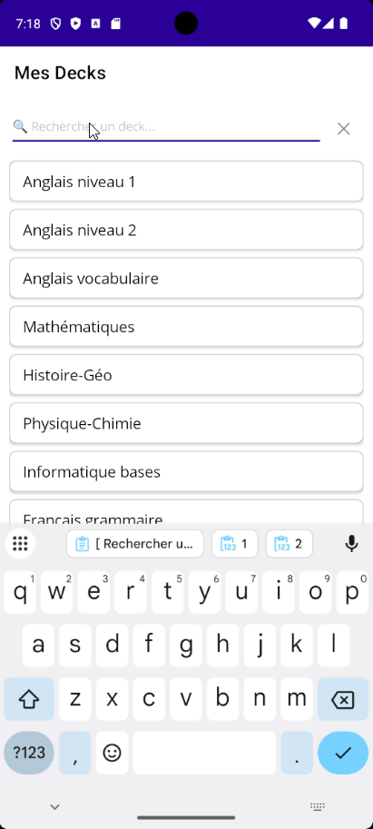

author: Jonathan Melly
summary: Recherche et filtrage dans une app MAUI (code-behind)
id: mobile-05b-filter
categories: android,dev
tags: ict
environments: Web
status: Published
feedback link: https://git.section-inf.ch/jmy/labs/issues
analytics account: UA-170792591-1

# Recherche et filtrage en code-behind

## Vue d'ensemble
Duration: 0:03:00

Ce tutorial fait suite à **mobile-05a-crud** et ajoute une fonctionnalité de recherche progressive à l'application **DeckManager**.

### Contexte

À la fin du codelab CRUD, l'application affiche la liste complète des decks sans aucun filtre. Dès que la liste grandit, retrouver un deck devient fastidieux. Ce tutorial introduit la recherche par étapes successives.

### Démonstration


### Objectifs

À travers 4 étapes progressives, apprendre à :
1. Filtrer la liste avec une recherche **simple** (début du mot)
2. Étendre à une recherche par **contenu** (wildcard/contains)
3. Combiner plusieurs termes avec les opérateurs **ET / OU**
4. Ajouter une **autocomplétion** qui propose des suggestions en cours de frappe

### Approche technique

- **Données en mémoire** : pas de requête JSON supplémentaire, on filtre `_decks` déjà chargé
- **Code-behind uniquement** : pas de ViewModel, logique dans `.xaml.cs`
- **LINQ** : filtrage déclaratif et concis de la liste

Positive
: Toutes les étapes s'enchaînent. Chaque étape améliore le résultat de la précédente — il n'y a jamais besoin de repartir de zéro.

Survey
: Quelle approche de recherche utilisez-vous le plus souvent dans une appli ?
<ul>
<li>Je tape le début du mot</li>
<li>Je tape un morceau du mot (n'importe où)</li>
<li>Je combine plusieurs mots-clés</li>
<li>J'attends les suggestions de l'autocomplétion</li>
</ul>

## Étape 1 : Barre de recherche et filtre simple
Duration: 0:10:00

### Objectif

Ajouter un champ de recherche qui filtre les decks dont le **nom commence** par le texte saisi.

### Modifier DecksPage.xaml

Ajouter une `Entry` de recherche entre le header (ajout de deck) et le `CollectionView`. Le `Grid` existant passe de 3 lignes à 4 :

```xml
<Grid RowDefinitions="Auto,Auto,*,Auto" Padding="10">

    <!-- Header with add button (row 0 - unchanged) -->
    <HorizontalStackLayout Grid.Row="0"
                          Spacing="10"
                          Margin="0,0,0,10">
        <Entry x:Name="NewDeckEntry"
               Placeholder="Nom du nouveau deck"
               HorizontalOptions="FillAndExpand" />
        <Button Text="Ajouter"
                Clicked="OnAddDeckClicked"
                BackgroundColor="#2196F3"
                TextColor="White" />
    </HorizontalStackLayout>

    <!-- Search bar (row 1 - new) -->
    <Entry Grid.Row="1"
           x:Name="SearchEntry"
           Placeholder="🔍 Rechercher un deck..."
           TextChanged="OnSearchTextChanged"
           Margin="0,0,0,10" />

    <!-- Decks list (row 2 - was row 1) -->
    <CollectionView Grid.Row="2"
                   x:Name="DecksCollectionView"
                   SelectionMode="None">
        <!-- ... DataTemplate inchangé ... -->
    </CollectionView>

    <!-- Info bar (row 3 - was row 2) -->
    <Label Grid.Row="3"
           x:Name="InfoLabel"
           Text="Prêt"
           FontSize="12"
           TextColor="Gray"
           HorizontalOptions="Center"
           Margin="0,10,0,0" />
</Grid>
```

### Modifier DecksPage.xaml.cs

Ajouter une liste filtrée et le gestionnaire d'événement `TextChanged` :

```csharp
public partial class DecksPage : ContentPage
{
    private JsonDataService _dataService;
    private List<Deck> _decks;
    private List<Deck> _filteredDecks;  // new: displayed subset
    private int _nextId = 1;

    public DecksPage()
    {
        InitializeComponent();
        _dataService = new JsonDataService();
        _decks = new List<Deck>();
        _filteredDecks = new List<Deck>();
        LoadDecks();
    }

    private async void LoadDecks()
    {
        _decks = await _dataService.LoadDecksAsync();

        if (_decks.Any())
        {
            _nextId = _decks.Max(d => d.Id) + 1;
        }

        ApplyFilter();
        UpdateInfo($"Chargé: {_decks.Count} deck(s)");
    }

    // Replace RefreshView() with ApplyFilter()
    private void ApplyFilter()
    {
        string search = SearchEntry?.Text?.Trim() ?? string.Empty;

        if (string.IsNullOrEmpty(search))
        {
            _filteredDecks = _decks;
        }
        else
        {
            _filteredDecks = _decks
                .Where(d => d.Name.StartsWith(search, StringComparison.OrdinalIgnoreCase))
                .ToList();
        }

        DecksCollectionView.ItemsSource = null;
        DecksCollectionView.ItemsSource = _filteredDecks;
    }

    private void OnSearchTextChanged(object sender, TextChangedEventArgs e)
    {
        ApplyFilter();
        UpdateInfo($"Filtre: '{e.NewTextValue}' → {_filteredDecks.Count} résultat(s)");
    }
}
```

Mettre à jour les appels existants à `RefreshView()` pour qu'ils appellent `ApplyFilter()` à la place :

```csharp
private async void OnAddDeckClicked(object sender, EventArgs e)
{
    // ... code inchangé ...
    _decks.Add(newDeck);
    await _dataService.SaveDecksAsync(_decks);

    ApplyFilter();  // was RefreshView()
    NewDeckEntry.Text = string.Empty;
    UpdateInfo($"Ajouté: {name}");
}
```

### Observer

Lancer l'application et taper `"ang"` dans le champ de recherche. Seuls les decks dont le nom **commence par** "ang" (ex: "Anglais niveau 1") apparaissent. Vider le champ affiche tous les decks.

Negative
: `StartsWith` est sensible à la casse par défaut. Sans `StringComparison.OrdinalIgnoreCase`, "anglais" ne correspond pas à "Anglais". Toujours préciser la comparaison.

## Étape 2 : Recherche par contenu (wildcard)
Duration: 0:10:00

### Objectif

Permettre de trouver un deck en tapant **n'importe quel fragment** du nom, pas seulement le début.

### Comprendre la différence

| Saisie   | StartsWith   | Contains              |
|:---------|:-------------|:----------------------|
| `"ang"`  | ✅ "Anglais" | ✅ "Anglais"          |
| `"glai"` | ❌           | ✅ "Anglais"          |
| `"1"`    | ❌           | ✅ "Anglais niveau 1" |

### Modifier ApplyFilter()

Remplacer `StartsWith` par `Contains` :

```csharp
private void ApplyFilter()
{
    string search = SearchEntry?.Text?.Trim() ?? string.Empty;

    if (string.IsNullOrEmpty(search))
    {
        _filteredDecks = _decks;
    }
    else
    {
        _filteredDecks = _decks
            .Where(d => d.Name.Contains(search, StringComparison.OrdinalIgnoreCase))
            .ToList();
    }

    DecksCollectionView.ItemsSource = null;
    DecksCollectionView.ItemsSource = _filteredDecks;
}
```

### Aller plus loin : supporter le joker `*`

En SQL, `LIKE '%texte%'` est la recherche par contenu. On peut aussi imiter la syntaxe du joker `*` pour donner plus de contrôle :

```csharp
private bool MatchesWildcard(string name, string pattern)
{
    // Without wildcard, behaves like Contains
    if (!pattern.Contains('*'))
    {
        return name.Contains(pattern, StringComparison.OrdinalIgnoreCase);
    }

    // Split on * and check each part in order
    string[] parts = pattern.Split('*', StringSplitOptions.RemoveEmptyEntries);
    int index = 0;

    foreach (string part in parts)
    {
        int found = name.IndexOf(part, index, StringComparison.OrdinalIgnoreCase);
        if (found < 0) return false;
        index = found + part.Length;
    }

    return true;
}

private void ApplyFilter()
{
    string search = SearchEntry?.Text?.Trim() ?? string.Empty;

    if (string.IsNullOrEmpty(search))
    {
        _filteredDecks = _decks;
    }
    else
    {
        _filteredDecks = _decks
            .Where(d => MatchesWildcard(d.Name, search))
            .ToList();
    }

    DecksCollectionView.ItemsSource = null;
    DecksCollectionView.ItemsSource = _filteredDecks;
}
```

### Observer

| Saisie     | Résultats attendus                                    |
|:-----------|:------------------------------------------------------|
| `"niveau"` | Tous les decks contenant "niveau"                     |
| `"ang*1"`  | "Anglais niveau 1" (commence par "ang", contient "1") |
| `"*math*"` | Tous les decks contenant "math"                       |

Positive
: Le joker `*` est une extension simple et intuitive pour les utilisateurs habitués à la recherche de fichiers (`*.txt`).

## Étape 3 : Recherche multi-termes (ET / OU)
Duration: 0:12:00

### Objectif

Permettre de chercher avec **plusieurs mots** séparés par des espaces (mode ET) ou par un `|` (mode OU).

### Règles à implémenter

- `"anglais math"` → deck contenant **"anglais" ET "math"** dans le nom
- `"anglais|math"` → deck contenant **"anglais" OU "math"** dans le nom
- `"anglais"` → comportement inchangé (un seul terme)

### Modifier ApplyFilter()

```csharp
private void ApplyFilter()
{
    string search = SearchEntry?.Text?.Trim() ?? string.Empty;

    if (string.IsNullOrEmpty(search))
    {
        _filteredDecks = _decks;
    }
    else if (search.Contains('|'))
    {
        // OR mode: split on | and keep decks matching at least one term
        string[] orTerms = search.Split('|', StringSplitOptions.RemoveEmptyEntries);

        _filteredDecks = _decks
            .Where(d => orTerms.Any(term =>
                d.Name.Contains(term.Trim(), StringComparison.OrdinalIgnoreCase)))
            .ToList();
    }
    else
    {
        // AND mode: split on spaces and keep decks matching all terms
        string[] andTerms = search.Split(' ', StringSplitOptions.RemoveEmptyEntries);

        _filteredDecks = _decks
            .Where(d => andTerms.All(term =>
                d.Name.Contains(term, StringComparison.OrdinalIgnoreCase)))
            .ToList();
    }

    DecksCollectionView.ItemsSource = null;
    DecksCollectionView.ItemsSource = _filteredDecks;
}
```

### Mettre à jour l'info-bar

Indiquer le mode de recherche actif :

```csharp
private void OnSearchTextChanged(object sender, TextChangedEventArgs e)
{
    ApplyFilter();

    string mode = string.Empty;
    string text = e.NewTextValue ?? string.Empty;

    if (text.Contains('|'))
        mode = " [OU]";
    else if (text.Contains(' '))
        mode = " [ET]";

    UpdateInfo($"Filtre{mode}: '{text}' → {_filteredDecks.Count} résultat(s)");
}
```

### Tester les trois modes

Préparer au moins 4 decks de test en mémoire :

```csharp
// Test data to add temporarily in LoadDecks() for quick testing
private void LoadTestData()
{
    _decks = new List<Deck>
    {
        new Deck { Id = 1, Name = "Anglais niveau 1", CardCount = 20 },
        new Deck { Id = 2, Name = "Anglais niveau 2", CardCount = 15 },
        new Deck { Id = 3, Name = "Mathématiques", CardCount = 30 },
        new Deck { Id = 4, Name = "Anglais vocabulaire", CardCount = 25 },
        new Deck { Id = 5, Name = "Histoire-Géo", CardCount = 40 },
    };
    _nextId = 6;
    ApplyFilter();
}
```

| Saisie                 | Mode | Résultats attendus                             |
|:-----------------------|:-----|:-----------------------------------------------|
| `"anglais"`            | —    | decks 1, 2, 4                                  |
| `"anglais niveau"`     | ET   | decks 1, 2 (contiennent "anglais" ET "niveau") |
| `"anglais niveau 2"`   | ET   | deck 2 uniquement                              |
| `"math` \| `histoire"` | OU   | decks 3, 5 (contiennent "math" OU "histoire")  |

Negative
: Attention à l'ordre des conditions dans `ApplyFilter()`. Le test sur `|` doit être vérifié **avant** le split sur les espaces, sinon `"math|histoire"` serait traité comme un seul terme contenant un pipe.

## Étape 4 : Autocomplétion
Duration: 0:15:00

### Objectif

Afficher une liste déroulante de suggestions sous le champ de recherche au fur et à mesure de la saisie, et remplir automatiquement le champ au clic.

### Principe

L'interface se compose de deux couches superposées :

- **Champ de recherche** (`SearchEntry`) — toujours visible en haut
- **Panneau de suggestions** (`SuggestionsFrame`) — apparaît juste en dessous du champ pendant la saisie, par-dessus la liste principale
- **Liste principale** (`DecksCollectionView`) — filtrée en temps réel, partiellement couverte quand les suggestions sont visibles

### Modifier DecksPage.xaml

Encapsuler la barre de recherche et les suggestions dans un `Grid` superposé. Le panel de suggestions doit **flotter au-dessus** de la liste principale grâce à `ZIndex` :

```xml
<Grid RowDefinitions="Auto,Auto,*,Auto" Padding="10">

    <!-- Header (row 0 - unchanged) -->
    <HorizontalStackLayout Grid.Row="0" Spacing="10" Margin="0,0,0,10">
        <Entry x:Name="NewDeckEntry"
               Placeholder="Nom du nouveau deck"
               HorizontalOptions="FillAndExpand" />
        <Button Text="Ajouter"
                Clicked="OnAddDeckClicked"
                BackgroundColor="#2196F3"
                TextColor="White" />
    </HorizontalStackLayout>

    <!-- Search + suggestions overlay (row 1) -->
    <Grid Grid.Row="1" RowDefinitions="Auto,Auto" Margin="0,0,0,10">

        <!-- Search Entry -->
        <Entry Grid.Row="0"
               x:Name="SearchEntry"
               Placeholder="🔍 Rechercher un deck..."
               TextChanged="OnSearchTextChanged"
               Focused="OnSearchFocused"
               Unfocused="OnSearchUnfocused" />

        <!-- Autocomplete suggestions (hidden by default) -->
        <Frame Grid.Row="1"
               x:Name="SuggestionsFrame"
               IsVisible="False"
               Padding="0"
               BorderColor="LightGray"
               CornerRadius="4"
               HasShadow="True"
               ZIndex="10">
            <CollectionView x:Name="SuggestionsView"
                           MaximumHeightRequest="200"
                           SelectionMode="Single"
                           SelectionChanged="OnSuggestionSelected">
                <CollectionView.ItemTemplate>
                    <DataTemplate>
                        <Grid Padding="12,8" BackgroundColor="White">
                            <Label Text="{Binding Name}"
                                   FontSize="16" />
                        </Grid>
                    </DataTemplate>
                </CollectionView.ItemTemplate>
            </CollectionView>
        </Frame>
    </Grid>

    <!-- Decks list (row 2) -->
    <CollectionView Grid.Row="2"
                   x:Name="DecksCollectionView"
                   SelectionMode="None">
        <!-- DataTemplate inchangé -->
    </CollectionView>

    <!-- Info bar (row 3) -->
    <Label Grid.Row="3"
           x:Name="InfoLabel"
           Text="Prêt"
           FontSize="12"
           TextColor="Gray"
           HorizontalOptions="Center"
           Margin="0,10,0,0" />
</Grid>
```

### Modifier DecksPage.xaml.cs

Ajouter la logique des suggestions :

```csharp
// --- Autocomplete logic ---

private void OnSearchFocused(object sender, FocusEventArgs e)
{
    UpdateSuggestions(SearchEntry.Text);
}

private void OnSearchUnfocused(object sender, FocusEventArgs e)
{
    // Small delay so tap on suggestion registers before hiding
    Task.Delay(200).ContinueWith(_ =>
        MainThread.BeginInvokeOnMainThread(() =>
            SuggestionsFrame.IsVisible = false));
}

private void UpdateSuggestions(string? input)
{
    string search = input?.Trim() ?? string.Empty;

    if (string.IsNullOrEmpty(search) || search.Length < 2)
    {
        SuggestionsFrame.IsVisible = false;
        return;
    }

    // Suggest deck names that contain the search text
    List<Deck> suggestions = _decks
        .Where(d => d.Name.Contains(search, StringComparison.OrdinalIgnoreCase))
        .Take(5)
        .ToList();

    if (suggestions.Count == 0)
    {
        SuggestionsFrame.IsVisible = false;
        return;
    }

    SuggestionsView.ItemsSource = suggestions;
    SuggestionsFrame.IsVisible = true;
}

private void OnSuggestionSelected(object sender, SelectionChangedEventArgs e)
{
    if (e.CurrentSelection.FirstOrDefault() is Deck selected)
    {
        // Fill the search box with the selected deck name
        SearchEntry.Text = selected.Name;
        SuggestionsFrame.IsVisible = false;
        SuggestionsView.SelectedItem = null;
        ApplyFilter();
    }
}
```

Mettre à jour `OnSearchTextChanged` pour appeler aussi `UpdateSuggestions` :

```csharp
private void OnSearchTextChanged(object sender, TextChangedEventArgs e)
{
    ApplyFilter();
    UpdateSuggestions(e.NewTextValue);

    string mode = string.Empty;
    string text = e.NewTextValue ?? string.Empty;

    if (text.Contains('|'))
        mode = " [OU]";
    else if (text.Contains(' '))
        mode = " [ET]";

    UpdateInfo($"Filtre{mode}: '{text}' → {_filteredDecks.Count} résultat(s)");
}
```

### Observer

1. Taper `"ang"` → les suggestions "Anglais niveau 1", "Anglais niveau 2", "Anglais vocabulaire" apparaissent
2. Appuyer sur "Anglais vocabulaire" → le champ se remplit et la liste se filtre
3. Vider le champ → les suggestions disparaissent, la liste complète revient

Positive
: `Task.Delay(200)` dans `OnSearchUnfocused` est une astuce courante : si on cache immédiatement les suggestions à la perte du focus, le clic sur une suggestion n'a pas le temps de se déclencher. Le délai laisse MAUI traiter le tap avant de masquer.

Negative
: `MaximumHeightRequest="200"` limite la hauteur du panneau de suggestions pour qu'il ne recouvre pas toute la liste. Sans cette limite, avec de nombreux decks, le panneau prendrait tout l'écran.

## Étape 5 : Découvrir et corriger un bug d'autocomplétion
Duration: 0:15:00

### Objectif

Identifier un comportement inattendu de l'autocomplétion en situation réelle, comprendre pourquoi il se produit, puis le corriger.

### Observer le problème

Reproduire exactement ces étapes dans l'application :

1. Taper `anglais` dans le champ de recherche → la liste se filtre sur les decks "Anglais"
2. Ajouter `|` puis commencer à taper `esp` → le champ contient `anglais|esp`, mode OU actif
3. Choisir la suggestion **"Espagnol débutant"** dans le panneau

**Que se passe-t-il ?** Observer attentivement le contenu du champ de recherche et la liste affichée après la sélection.

Negative
: Le résultat n'est probablement pas celui attendu. Prendre le temps de noter exactement ce qui a changé avant de continuer.

### Analyser la cause

Ouvrir `MainPage.xaml.cs` et retrouver la méthode `OnSuggestionSelected`. Répondre aux questions suivantes en lisant le code :

1. Que contient `SearchEntry.Text` juste avant la ligne `SearchEntry.Text = selected` ?
2. Que contient `selected` à ce moment-là ?
3. Après l'assignation, qu'est-il arrivé aux termes tapés avant `|` ?

> **Piste** : La méthode reçoit le nom complet du deck sélectionné et l'assigne directement au champ. Elle ne tient aucun compte de ce qui était déjà écrit.

Comparer maintenant avec `UpdateSuggestions` : cette méthode cherche des suggestions sur `lastTerm` (le dernier terme saisi), mais `OnSuggestionSelected` ignore complètement cette distinction.

### Améliorer

L'objectif est qu'après la sélection d'une suggestion, le champ de recherche conserve les termes déjà saisis avant le dernier séparateur (`|` ou espace), et remplace **uniquement** le dernier terme par le nom sélectionné.

Quelques questions pour guider la réflexion :

- Comment récupérer la partie du texte **avant** le dernier séparateur ?
- Quelles méthodes de `string` permettent de trouver la position du dernier caractère `|` ou ` ` ?
- Comment reconstruire la nouvelle valeur du champ à partir de ce préfixe et du nom sélectionné ?

Positive
: Tester la correction avec le scénario initial : taper `anglais|esp`, sélectionner "Espagnol débutant". Le champ devrait contenir `anglais|Espagnol débutant` et la liste afficher les decks Anglais ET Espagnol débutant.

Survey
: Avant de lire la piste, avez-vous trouvé la cause du bug ?
<ul>
<li>Oui, j'ai trouvé immédiatement en lisant OnSuggestionSelected</li>
<li>Oui, mais j'ai dû comparer avec UpdateSuggestions pour comprendre</li>
<li>Non, j'ai eu besoin de la piste</li>
<li>Je n'avais pas remarqué qu'il y avait un bug</li>
</ul>

## Bonus : Améliorations
Duration: 0:10:00

### 1. Icône pour effacer la recherche

Ajouter un bouton pour réinitialiser le filtre en un clic :

```xml
<!-- In the search Grid, replace the Entry with a HorizontalStackLayout -->
<HorizontalStackLayout Grid.Row="0" Spacing="5">
    <Entry x:Name="SearchEntry"
           Placeholder="🔍 Rechercher..."
           TextChanged="OnSearchTextChanged"
           Focused="OnSearchFocused"
           Unfocused="OnSearchUnfocused"
           HorizontalOptions="FillAndExpand" />
    <Button Text="✕"
            Clicked="OnClearSearchClicked"
            BackgroundColor="Transparent"
            TextColor="Gray"
            FontSize="18"
            WidthRequest="40" />
</HorizontalStackLayout>
```

```csharp
private void OnClearSearchClicked(object sender, EventArgs e)
{
    SearchEntry.Text = string.Empty;
    SuggestionsFrame.IsVisible = false;
    ApplyFilter();
    UpdateInfo("Filtre effacé");
}
```

### 2. Compteur de résultats dans l'interface

Afficher le nombre de résultats directement sous la barre de recherche :

```xml
<Label x:Name="ResultCountLabel"
       Grid.Row="1"
       Text=""
       FontSize="12"
       TextColor="Gray"
       Margin="2,0,0,4" />
```

```csharp
private void ApplyFilter()
{
    // ... filtering logic ...

    ResultCountLabel.Text = _filteredDecks.Count == _decks.Count
        ? string.Empty
        : $"{_filteredDecks.Count} résultat(s) sur {_decks.Count}";
}
```

### 3. Recherche sur plusieurs champs

Étendre la recherche pour inclure le nombre de cartes (pour retrouver les gros decks) :

```csharp
_filteredDecks = _decks
    .Where(d =>
        d.Name.Contains(search, StringComparison.OrdinalIgnoreCase) ||
        d.CardCount.ToString().Contains(search))
    .ToList();
```

### 4. Tri des résultats

Offrir un tri alphabétique ou par nombre de cartes :

```csharp
// After filtering, sort results
_filteredDecks = _filteredDecks
    .OrderBy(d => d.Name)
    .ToList();
```

## Synthèse
Duration: 0:03:00

### Récapitulatif des techniques de filtrage

| Étape | Technique       | Méthode LINQ          | Exemple           |
| :---- | :-------------- | :-------------------- | :---------------- |
| 1     | Début du mot    | `StartsWith`          | `"ang"` → "Anglais..." |
| 2     | N'importe où    | `Contains`            | `"glai"` → "Anglais..." |
| 2+    | Joker `*`       | `IndexOf` en boucle   | `"ang*1"` → "Anglais niveau 1" |
| 3 ET  | Tous les mots   | `.All(term => ...)`   | `"anglais 1"` → exact |
| 3 OU  | Au moins un mot | `.Any(term => ...)`   | `"math\|histoire"` |
| 4     | Autocomplétion  | `Take(5)` + sélection | suggestions en live |

### Concepts MAUI utilisés

- **`TextChanged`** : réagir à chaque frappe dans un `Entry`
- **`Focused` / `Unfocused`** : détecter l'activation/désactivation d'un champ
- **`ZIndex`** : superposer un contrôle par-dessus un autre
- **`MaximumHeightRequest`** : limiter la hauteur d'un contrôle dynamique
- **`Task.Delay` + `MainThread`** : différer une action sur le thread UI
- **LINQ** : `Where`, `Any`, `All`, `Take`, `OrderBy`

### Le flux complet

```
Utilisateur tape
    ↓
OnSearchTextChanged
    ├── ApplyFilter()     → met à jour DecksCollectionView
    └── UpdateSuggestions() → affiche/masque SuggestionsFrame

Utilisateur choisit une suggestion
    ↓
OnSuggestionSelected
    ├── SearchEntry.Text = selected.Name
    └── ApplyFilter()     → filtre sur le nom choisi
```

Positive
: L'approche en mémoire est idéale pour des listes de taille raisonnable (quelques centaines d'éléments). Pour des milliers d'éléments, il faudrait envisager une base de données locale (SQLite) avec des requêtes filtrées côté base de données.

Survey
: Laquelle de ces fonctionnalités avez-vous trouvée la plus utile à implémenter ?
<ul>
<li>Étape 1 : Recherche simple (StartsWith)</li>
<li>Étape 2 : Recherche par contenu (Contains / wildcard)</li>
<li>Étape 3 : Opérateurs ET / OU</li>
<li>Étape 4 : Autocomplétion</li>
</ul>
