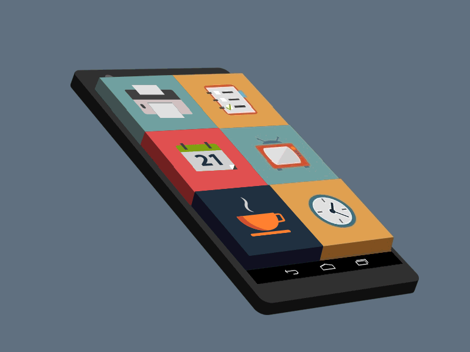

author: Jonathan Melly
summary: mobile app crud
id: mobile-06-animation
categories: android,dev
tags: ict
environments: Web
status: Published
feedback link: https://git.section-inf.ch/jmy/labs/issues
analytics account: UA-170792591-1

# Animation

## Introduction
Duration: 0:0:30

Pour rendre une application vivante, rien de tel qu’un peu d’animation...

### Contexte technique

Ce tutorial part du principe que la notion MVVM avec MAUI est maîtrisée.

## Animations de base avec MAUI
Duration: 0:01:00

### Voici ce qu’on peut faire

- Rotation
- Translation
- Changement de taille
- Fondu

### Voici ce qu’on va faire

## Code : Vue
Duration: 0:5:00

Exceptionnellement, il y aura un peu de code dans la partie XAML.CS car l’animation se passe uniquement au niveau de l’UI.

Positive
: Par contre, pour respecter MVVM, ce code sera appelé par le ViewModel du moment que la vue y a enregistré son action...

### XAML
Hormis le lien avec le ViewModel, voici la partie XAML de la vue:

### XAML.CS

Pour la partie XAML.CS, on procède ainsi

1. Récupérer une référence vers le ViewModel
2. Enregistrer l’animation à faire pour la rotation (via une méthode standard)
3. Enregistrer l’animation à faire pour le déplacement (via un lambda)

## Code : ViewModel
Duration: 0:10:00

En lien avec les bindings de la vue, il faut définir:

### Les propriétés

### La méthode pour réagir au switch

### L’action et la méthode pour la rotation

### L’action et la méthode pour le déplacement

## Synthèse
Duration: 0:1:00

Suite à cet exercice, les compétences suivantes ont été travaillées:

- Animer un élément graphique avec une rotation / translation
- Respecter MVVM avec une vue animée
- Utiliser le type "Action" pour stocker un pointeur vers une fonction
- Enregistrer et invoquer une Action