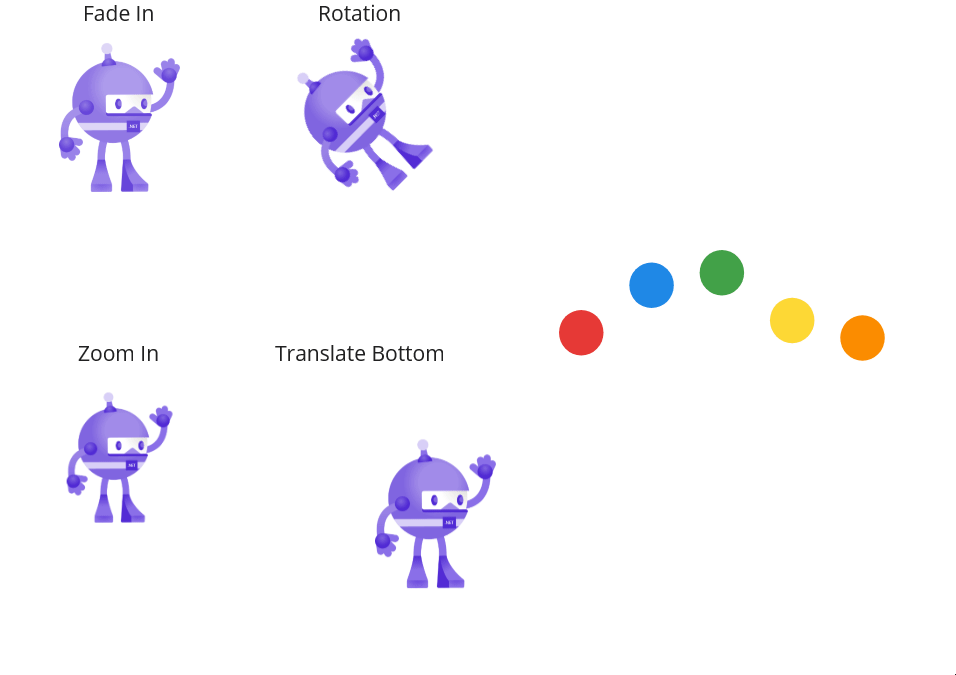
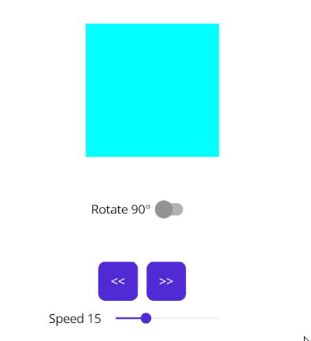
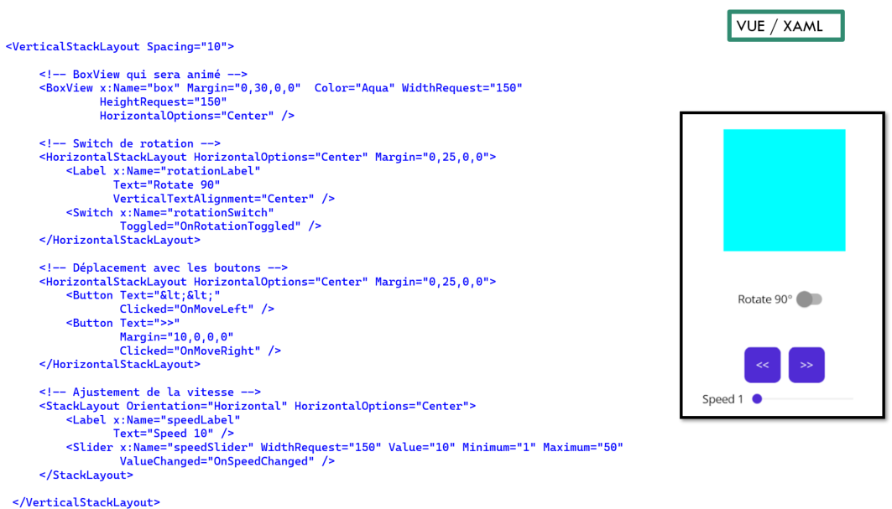

author: Jonathan Melly
summary: mobile app crud
id: mobile-06a-animation
categories: android,dev
tags: ict
environments: Web
status: Published
feedback link: https://git.section-inf.ch/jmy/labs/issues
analytics account: UA-170792591-1

# Animation avec code behind

## Introduction
Duration: 0:0:30


Pour rendre une application vivante, rien de tel qu’un peu d’animation...

### Contexte technique

Ce tutorial utilise une approche **code-behind** où toute la logique est directement dans le fichier XAML.CS.

## Animations de base avec MAUI
Duration: 0:01:00

### Voici ce qu’on peut faire



- Rotation
- Translation
- Changement de taille
- Fondu

### Voici ce qu’on va faire



## Vue
Duration: 0:5:00

### XAML



**Éléments clés:**
- `BoxView` nommé "box" qui sera l'élément animé
- `Switch` pour activer/désactiver la rotation avec le gestionnaire `OnRotationToggled`
- Deux `Button` pour déplacer à gauche/droite avec `OnMoveLeft`/`OnMoveRight`
- `Slider` pour ajuster la vitesse avec `OnSpeedChanged`

### XAML.CS

Pour la partie XAML.CS, on procède ainsi:

1. Définir les propriétés pour l'état de l'animation (rotation active, position, vitesse)
2. Créer les gestionnaires d'événements pour les boutons de déplacement
3. Créer la méthode pour gérer le switch de rotation
4. Créer la méthode pour ajuster la vitesse via le slider
5. Implémenter les méthodes d'animation directement avec les APIs MAUI

Exemple de structure:
```csharp
public partial class AnimationPage : ContentPage
{
    private bool rotationActive = false;
    private double currentX = 0;
    private uint animationSpeed = 500; // Vitesse en millisecondes

    public AnimationPage()
    {
        InitializeComponent();
        // Démarrer la rotation continue si activée
        RotateContinuously();
    }

    // Gestionnaire pour le switch de rotation
    private void OnRotationToggled(object sender, ToggledEventArgs e)
    {
        rotationActive = e.Value;
    }

    // Rotation continue en arrière-plan
    private async void RotateContinuously()
    {
        while (true)
        {
            if (rotationActive)
            {
                await box.RotateTo(box.Rotation + 90, animationSpeed);
            }
            await Task.Delay(100);
        }
    }

    // Déplacement vers la gauche
    private async void OnMoveLeft(object sender, EventArgs e)
    {
        currentX -= 50;
        await box.TranslateTo(currentX, 0, animationSpeed);
    }

    // Déplacement vers la droite
    private async void OnMoveRight(object sender, EventArgs e)
    {
        currentX += 50;
        await box.TranslateTo(currentX, 0, animationSpeed);
    }

    // Ajustement de la vitesse
    private void OnSpeedChanged(object sender, ValueChangedEventArgs e)
    {
        animationSpeed = (uint)(51 - e.NewValue) * 10; // Inversion pour que plus = plus rapide
        speedLabel.Text = $"Speed {(int)e.NewValue}";
    }
}
```

## Implémentation détaillée
Duration: 0:10:00

Voici l'implémentation complète des différentes parties du code-behind:

### Les propriétés et variables

```csharp
public partial class AnimationPage : ContentPage
{
    private bool rotationActive = false;
    private double currentX = 0;
    private uint animationSpeed = 500;
}
```

Ces variables permettent de:
- `rotationActive`: Suivre si la rotation est activée ou non
- `currentX`: Mémoriser la position horizontale actuelle de la BoxView
- `animationSpeed`: Contrôler la vitesse des animations (en millisecondes)

### Le constructeur et la rotation continue

```csharp
public AnimationPage()
{
    InitializeComponent();
    // Démarrer la boucle de rotation en arrière-plan
    RotateContinuously();
}

private async void RotateContinuously()
{
    while (true)
    {
        if (rotationActive)
        {
            // Rotation de 90 degrés à chaque itération
            await box.RotateTo(box.Rotation + 90, animationSpeed);
        }
        // Petite pause pour éviter de surcharger le CPU
        await Task.Delay(100);
    }
}
```

**Points importants:**
- La méthode `RotateContinuously()` tourne en boucle infinie (`while(true)`)
- Elle vérifie si `rotationActive` est vrai pour animer ou pas
- La rotation est cumulative: `box.Rotation + 90` pour tourner de 90° supplémentaires
- `Task.Delay(100)` évite de surcharger le thread UI

### La méthode pour réagir au switch

```csharp
private void OnRotationToggled(object sender, ToggledEventArgs e)
{
    rotationActive = e.Value;
}
```

Cette méthode est appelée quand l'utilisateur change l'état du switch. Elle met simplement à jour la variable `rotationActive`, et la boucle `RotateContinuously()` réagira automatiquement.

### Les méthodes pour le déplacement

```csharp
private async void OnMoveLeft(object sender, EventArgs e)
{
    currentX -= 50;
    await box.TranslateTo(currentX, 0, animationSpeed);
}

private async void OnMoveRight(object sender, EventArgs e)
{
    currentX += 50;
    await box.TranslateTo(currentX, 0, animationSpeed);
}
```

**Fonctionnement:**
- `OnMoveLeft`: Décrémente la position X de 50 pixels puis anime le déplacement
- `OnMoveRight`: Incrémente la position X de 50 pixels puis anime le déplacement
- `TranslateTo(x, y, duration)`: API MAUI pour animer une translation
- Les animations utilisent `animationSpeed` pour respecter la vitesse choisie

### La méthode pour ajuster la vitesse

```csharp
private void OnSpeedChanged(object sender, ValueChangedEventArgs e)
{
    // Inversion: slider à 50 = vitesse max (100ms), slider à 1 = vitesse min (500ms)
    animationSpeed = (uint)(51 - e.NewValue) * 10;

    // Mise à jour du label pour afficher la valeur du slider
    speedLabel.Text = $"Speed {(int)e.NewValue}";
}
```

**Explication du calcul:**
- Le slider va de 1 à 50
- `(51 - e.NewValue)` inverse la valeur: slider=50 → 1, slider=1 → 50
- Multiplier par 10 donne: slider=50 → 10ms (rapide), slider=1 → 500ms (lent)
- Plus le slider est élevé, plus l'animation est rapide

## Synthèse
Duration: 0:1:00

Suite à cet exercice, les compétences suivantes ont été travaillées:

- Animer un élément graphique avec une **rotation continue** et une **translation**
- Utiliser l'approche **code-behind** pour gérer les animations
- Implémenter des gestionnaires d'événements (Clicked, Toggled, ValueChanged)
- Utiliser les APIs d'animation MAUI (`RotateTo`, `TranslateTo`)
- Gérer l'asynchronisme avec async/await pour les animations
- Créer une boucle d'animation continue avec `while(true)` et `Task.Delay()`
- Contrôler la vitesse des animations dynamiquement avec un Slider
- Manipuler les contrôles XAML depuis le code-behind (Label, Switch, Slider)
