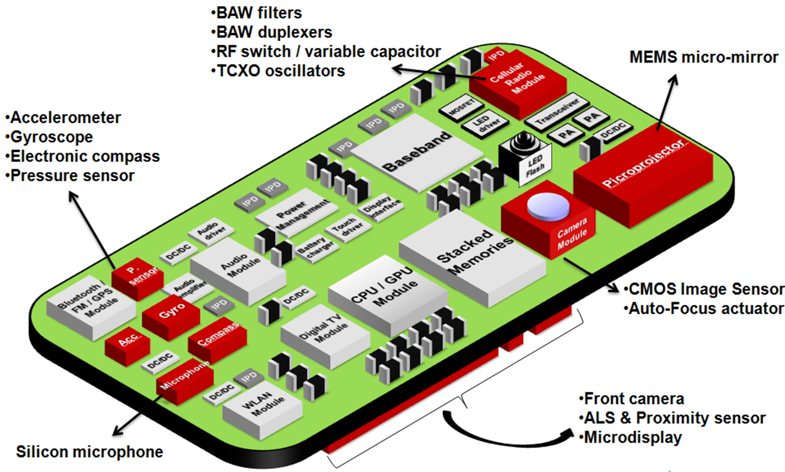
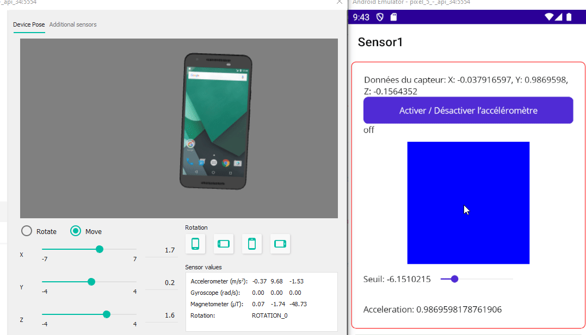
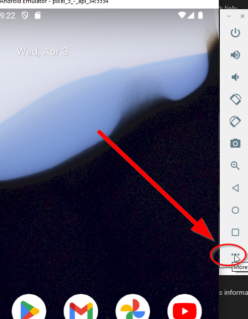
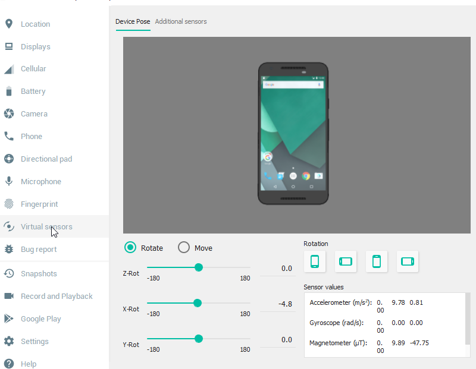

author: Jonathan Melly
summary: mobile app sensors
id: mobile-07a-sensor
categories: android,dev
tags: ict
environments: Web
status: Published
feedback link: https://git.section-inf.ch/jmy/labs/issues
analytics account: UA-170792591-1

# Capteurs avec code behind

## Introduction
Duration: 0:0:30



Comme nos 5 sens, les capteurs de téléphones peuvent donner des informations bien utiles pour certaines applications...

### Contexte technique
Ce tutorial utilise une approche **code-behind** où toute la logique de gestion des capteurs est directement dans le fichier XAML.CS.

## Accéléromètre
Duration: 0:15:00

Pour utiliser l'accéléromètre, il faut l'activer et assigner une fonction qui sera appelée en cas de changement des données du capteur (la fréquence d'actualisation est adaptable...)

### Aperçu


### XAML
Voici la structure XAML pour afficher les données de l'accéléromètre :

```xml
<?xml version="1.0" encoding="utf-8" ?>
<ContentPage xmlns="http://schemas.microsoft.com/dotnet/2021/maui"
             xmlns:x="http://schemas.microsoft.com/winfx/2009/xaml"
             x:Class="HelloMaui1.SensorPage"
             Title="Sensors">

    <VerticalStackLayout>
        <Frame BorderColor="Red" Margin="5,5,5,0">
            <StackLayout>
                <Label x:Name="sensorValueLabel"
                       Text="Données du capteur: N/A"
                       VerticalOptions="Center"
                       HorizontalOptions="Center" />

                <Button x:Name="enableButton"
                        Text="Activer / Désactiver l'accéléromètre"
                        Clicked="OnEnableClicked" />

                <HorizontalStackLayout Margin="0,0,10,0">
                    <Label x:Name="enabledLabel" Text="on" IsVisible="False" />
                    <Label x:Name="disabledLabel" Text="off" IsVisible="True" />
                </HorizontalStackLayout>

                <BoxView x:Name="cancelIndicator"
                         Margin="0,10,0,0"
                         Color="Red"
                         HeightRequest="200"
                         WidthRequest="200" />

                <HorizontalStackLayout Margin="0,15,0,0">
                    <Label x:Name="thresholdLabel" Text="Seuil: 0" />
                    <Slider x:Name="thresholdSlider"
                            Minimum="-10"
                            Maximum="10"
                            WidthRequest="150"
                            ValueChanged="OnThresholdChanged" />
                </HorizontalStackLayout>

                <Label x:Name="accelerationLabel"
                       Margin="0,30,0,0"
                       Text="Acceleration: 0" />
            </StackLayout>
        </Frame>

        <Frame BorderColor="Green" Margin="5,10,5,0">
            <StackLayout>
                <Switch x:Name="shakeSwitch"
                        Toggled="OnShakeToggled" />
                <BoxView x:Name="shakeIndicator"
                         Color="Black"
                         WidthRequest="150"
                         HeightRequest="150" />
            </StackLayout>
        </Frame>
    </VerticalStackLayout>
</ContentPage>
```

**Structure:**
- **Frame rouge**: Contient l'accéléromètre et la détection de seuil avancée
- **Frame vert**: Contient la détection de secousses

Positive
: Le seuil et l'accélération présents dans l'aperçu **sont également traités** dans ce tutorial avec une fonctionnalité avancée...

### Code-behind
Voici l'implémentation complète dans le fichier XAML.CS:

#### Propriétés et champs

```csharp
using System.Diagnostics;

public partial class SensorPage : ContentPage
{
    private string sensorValue;
    private bool enabled = false;
    private bool disabled = true;

    // Variables pour la détection de seuil avancée
    private bool cancel = false;
    private string cancelColor = "Red";
    private double threshold = 0;
    private double acceleration = 0;
    private Stopwatch stopwatch = new();

    // Variables pour la détection de secousses
    private string shakeColor = "Black";

    public SensorPage()
    {
        InitializeComponent();
    }
}
```

Ces variables permettent de:
- `sensorValue`: Stocker les valeurs du capteur
- `enabled/disabled`: Suivre l'état du capteur
- `threshold`: Valeur de seuil pour détecter une inclinaison maintenue
- `acceleration`: Valeur calculée de l'accélération
- `cancel/cancelColor`: Gérer la détection d'une inclinaison prolongée
- `stopwatch`: Mesurer la durée d'une inclinaison au-delà du seuil

#### Activation du capteur

```csharp
private void OnEnableClicked(object sender, EventArgs e)
{
    if (Accelerometer.Default.IsSupported)
    {
        if (!Accelerometer.Default.IsMonitoring)
        {
            // Activer l'accéléromètre
            Accelerometer.Default.ReadingChanged += Accelerometer_ReadingChanged;
            Accelerometer.Default.Start(SensorSpeed.Default);

            enabled = true;
            disabled = false;

            // Mettre à jour l'UI
            MainThread.BeginInvokeOnMainThread(() =>
            {
                enabledLabel.IsVisible = true;
                disabledLabel.IsVisible = false;
            });
        }
        else
        {
            // Désactiver l'accéléromètre
            Accelerometer.Default.Stop();
            Accelerometer.Default.ReadingChanged -= Accelerometer_ReadingChanged;

            enabled = false;
            disabled = true;

            // Mettre à jour l'UI
            MainThread.BeginInvokeOnMainThread(() =>
            {
                enabledLabel.IsVisible = false;
                disabledLabel.IsVisible = true;
            });
        }
    }
}
```

**Points importants:**
- `Accelerometer.Default.IsSupported`: Vérifier si l'appareil a un accéléromètre
- `IsMonitoring`: Vérifier si le capteur est déjà actif
- `ReadingChanged += ...`: S'abonner aux changements de valeurs
- `Start(SensorSpeed.Default)`: Démarrer la lecture du capteur
- Mettre à jour la visibilité des labels "on"/"off" selon l'état

#### Gestion du slider de seuil

```csharp
private void OnThresholdChanged(object sender, ValueChangedEventArgs e)
{
    threshold = e.NewValue;
    MainThread.BeginInvokeOnMainThread(() =>
    {
        thresholdLabel.Text = $"Seuil: {threshold:F1}";
    });
}
```

Ce slider permet de définir un seuil d'accélération. Si l'accélération dépasse ce seuil pendant 3 secondes, le BoxView rouge deviendra bleu.

#### Fonction observateur (avec détection de seuil avancée)

```csharp
private void Accelerometer_ReadingChanged(object sender, AccelerometerChangedEventArgs e)
{
    // Récupérer les valeurs X, Y, Z
    sensorValue = e.Reading.ToString();

    // Calcul avancé: détecter une inclinaison maintenue sur l'axe Y
    var data = e.Reading.Acceleration.Y;
    acceleration = Math.Sqrt(data * data); // Valeur absolue via racine carrée
    var thresholdPassed = acceleration >= threshold;

    if (thresholdPassed)
    {
        if (!cancel)
        {
            // Premier dépassement du seuil: démarrer le chronomètre
            stopwatch.Reset();
            stopwatch.Start();
            cancel = true;
        }
        else
        {
            // Seuil maintenu: vérifier si ça fait plus de 3 secondes
            if (stopwatch.ElapsedMilliseconds > 3000)
            {
                cancelColor = "Blue"; // Seuil maintenu pendant 3 secondes!
                stopwatch.Stop();
            }
        }
    }
    else
    {
        // Retour sous le seuil: réinitialiser
        cancel = false;
        cancelColor = "Red";
        stopwatch.Stop();
    }

    // Mettre à jour l'UI (nécessaire sur le thread principal)
    MainThread.BeginInvokeOnMainThread(() =>
    {
        sensorValueLabel.Text = $"Données du capteur: {sensorValue}";
        accelerationLabel.Text = $"Acceleration: {acceleration:F2}";
        cancelIndicator.Color = cancelColor == "Blue" ? Colors.Blue : Colors.Red;
    });
}
```

**Explication:**
- Cette méthode est appelée automatiquement quand le capteur détecte un changement
- `e.Reading` contient les valeurs X, Y, Z de l'accélération
- **Logique avancée**: Si l'accélération sur Y dépasse le seuil pendant 3 secondes, le BoxView devient bleu
- `Stopwatch`: Permet de mesurer précisément le temps pendant lequel le seuil est dépassé
- `MainThread.BeginInvokeOnMainThread()`: **Crucial** car les événements du capteur arrivent sur un thread secondaire

**Cas d'usage:**
Cette logique pourrait servir à détecter une inclinaison prolongée du téléphone, par exemple pour annuler une action en maintenant le téléphone incliné pendant 3 secondes.

### Simulateur
On peut stimuler l’accéléromètre en utilisant les outils avancés du simulateur:



#### Virtual sensors


## Gestion des secousses
Duration: 0:15:00

Pour réagir à des secousses, il est nécessaire de faire un peu de calcul et définir un seuil de tolérance...
Tout cela est possible, néanmoins, MAUI intègre cela nativement et on peut donc réutiliser ce qui a déjà été implémenté...

### XAML
La partie shake est déjà incluse dans le XAML complet ci-dessus (Frame vert):
- `Switch` avec le gestionnaire `OnShakeToggled` pour activer/désactiver la détection
- `BoxView` nommé "shakeIndicator" qui changera de couleur lors d'une secousse

### Code-behind
Voici l'implémentation complète de la détection de secousses (la variable `shakeColor` est déjà déclarée en haut):

#### Méthode pour réagir au switch

```csharp
private void OnShakeToggled(object sender, ToggledEventArgs e)
{
    ToggleShake(e.Value);
}
```

Cette méthode est appelée quand l'utilisateur change l'état du switch. Avec l'approche **code-behind**, on utilise simplement l'événement `Toggled` standard du Switch.

#### Méthode d'activation

```csharp
private void ToggleShake(bool enable)
{
    if (Accelerometer.Default.IsSupported)
    {
        if (enable)
        {
            // Activer la détection de secousses
            Accelerometer.Default.ShakeDetected += Accelerometer_ShakeDetected;
            Accelerometer.Default.Start(SensorSpeed.Default);
        }
        else
        {
            // Désactiver la détection
            Accelerometer.Default.Stop();
            Accelerometer.Default.ShakeDetected -= Accelerometer_ShakeDetected;

            // Réinitialiser la couleur
            shakeColor = "Black";
            shakeIndicator.Color = Colors.Black;
        }
    }
}
```

**Points importants:**
- `ShakeDetected`: Événement spécifique MAUI pour les secousses
- Plus besoin de calculer manuellement les seuils, MAUI le fait automatiquement
- On s'abonne/désabonne selon l'état du switch

#### Méthode observateur

```csharp
private void Accelerometer_ShakeDetected(object sender, EventArgs e)
{
    // Changer la couleur en rouge lors d'une secousse
    shakeColor = "Red";

    // Mettre à jour l'UI sur le thread principal
    MainThread.BeginInvokeOnMainThread(() =>
    {
        shakeIndicator.Color = Colors.Red;
    });
}
```

**Explication:**
- Cette méthode est appelée automatiquement quand une secousse est détectée
- On change simplement la couleur du BoxView pour donner un feedback visuel
- `MainThread.BeginInvokeOnMainThread()` est nécessaire pour modifier l'UI

Le carré va donc changer de couleur lorsqu'une secousse est détectée.

### Simulateur
Pour simuler une secousse avec l’émulateur, le plus simple est d’envoyer une commande:
```shell
adb emu sensor set acceleration 100:100:100 && timeout 1 > NUL && adb emu sensor set acceleration 0:0:0
```

Negative
: Avec l’émulateur maison, ADB.EXE est dans le dossier sdk\\platform-tools...

## Synthèse
Duration: 0:1:00

Suite à cet exercice, les compétences suivantes ont été travaillées:

- Activation d'un capteur (accéléromètre) avec l'approche **code-behind**
- Définition d'une méthode de traitement des données transmises par le capteur
- Utilisation de `MainThread.BeginInvokeOnMainThread()` pour mettre à jour l'UI depuis un thread secondaire
- S'abonner et se désabonner aux événements `ReadingChanged` et `ShakeDetected`
- Utilisation d'un composant `Switch` et `Slider` avec gestionnaires d'événements
- Détection des secousses d'un téléphone avec l'API intégrée MAUI
- Implémentation d'une logique avancée de détection de seuil avec `Stopwatch`
- Manipulation directe des contrôles XAML depuis le code-behind (Label, Button, BoxView, Switch, Slider)
- Calcul de valeurs à partir des données brutes du capteur (accélération sur un axe)
