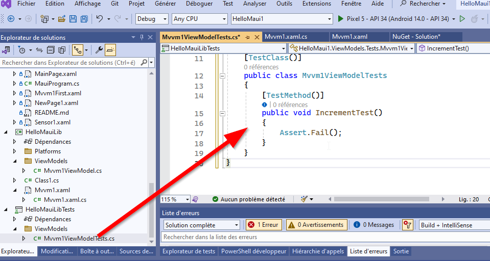

author: Jonathan Melly
summary: mobile test
id: mobile-08-test
categories: android,dev
tags: ict
environments: Web
status: Published
feedback link: https://git.section-inf.ch/jmy/labs/issues
analytics account: UA-170792591-1

# Qualité

## Introduction
Duration: 0:1:0


La qualité d’un logiciel passe par les tests et idéalement ceux-ci sont automatisés car réaliser les tests à la main est fastidieux et **coûteux**.

Negative
: Il ne faut toutefois pas négliger les tests manuels dans un environnement mobile où même les émulateurs (que l’ont peut piloter par le code) pourraient montrer des disparités avec les vrais appareils.

La portée de ce tutorial se concentre sur la mise en place de *tests unitaires* et les tests d’intégration ne seront donc pas abordé ici.

## Structure du projet MAUI
Duration: 0:15:00

Pour pouvoir facilement tester un projet MAUI, il faut commencer par le *découper* en 2 parties sinon lorsqu’on veut tester du code, il y aura des problèmes d’initialisation... 

On aura donc les 2 projets suivants:

1. L’application en tant que telle (MauiAPP)
2. Le reste

Positive
: À ceux deux projets sera ajouté un 3ème, le projet de test !

### Ajout d’un projet de type "librairie"

**Ajouter un projet**


**Choisir le bon type**


**À la fin, un nouveau projet fait partie de la solution:**


### Ajout de la référence à partir du projet principal

Maintenant que la solution comporte 2 projets, il faut référencer la librairie à partir du projet principal:

**Attention: modifier le PROJET PRINCIPAL (pas la lib)**


**Ajouter la lib comme référence**


**Optionnellement, optimiser la compilation de la lib**


### Déplacement des classes

À partir de là, les éléments peuvent être migrés:


**Ajouter le dossier ViewModels**


**Déplacer une classe VM**


Negative
: Attention, VisualStudio fait une copie du fichier

**OOps, petit problème**


**Ajout du toolkit pour le projet lib**


**Suppression de l’original**


**Déplacement d’un XAML**


**Suppresion du XAML original**

À toi de jouer ;-)

### Mise à jour du XMLNS
Il reste une petite adaptation à faire car actuellement le **shell** est défini dans le projet principal alors que la page *MVVM1* a été déplacée dans le projet de librairie.

Il faut donc ajuster cela:

**Ajouter un namespace pour la lib**


**L’utiliser**


Positive
: Idéalement, on changera aussi les namespaces du projet librairie, par exemple *HelloMauiLib* au lieu de celui récupéré du projet initial, soit *HelloMaui1*...

## Mise en place du projet de test
Duration: 0:5:00

Tout est désormais prêt pour tester le ViewModel déplacé dans le projet de librairie.

### Génération automatique
VisualStudio propose un assistant pour créer un test unitaire, voici donc comment l’utiliser:

**Identifier la méthode à tester**

Faire un clic droit sur la méthode


**Oops**


**Correction et deuxième essai**


**Paramètres**

Les paramètres proposés peuvent être laissés tels quels


**Vérification du projet généré**



### Correction du projet auto-généré
Une erreur s’est glissée lors de la création automatique du projet, en effet, le premier build de l’application est pour Android et cela ne fonctionne pas pour tester le code C# pur.

Il faut donc corriger le *TargetFramework* du fichier *.csproject* du projet de test, par exemple en faisant un double-clic sur le projet :


**Et en corrigeant ainsi**


Negative
: Attention, l’important est que la version corresponde avec celle du projet *librairie* pour la partie windows...


## Mon premier test unitaire
Duration: 0:5:00

On peut maintenant enfin coder la validation de la méthode

### **A**rrange **A**ct **A**ssert
Pour rappel, un test suit une structure AAA, voici donc comment cela se reflète dans le code:


### Lancer le test

Il y a plusieurs manières:

**Clic droit sur la méthode de test**


**Menu Test**


**Ligne de commande**

```shell
dotnet test
```


### Résultat


## Synthèse
Duration: 0:1:00

Suite à cet exercice, les compétences suivantes ont été travaillées:

- Split d’un projet MAUI en un projet principal et une librairie
- Déplacer des éléments d’un projet à l’autre
- Créer un test pour une méthode d’un ViewModel