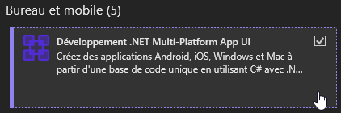
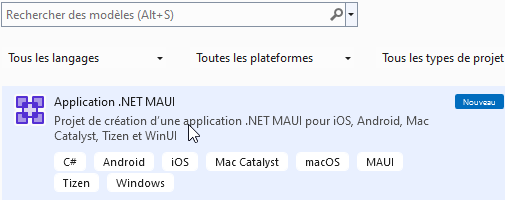
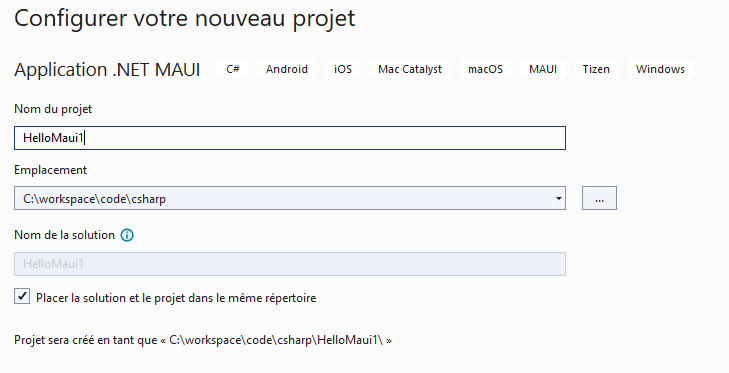
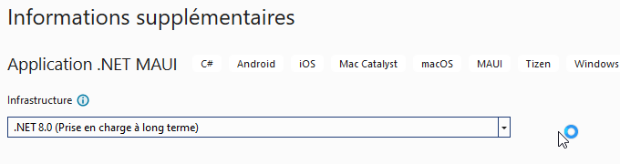
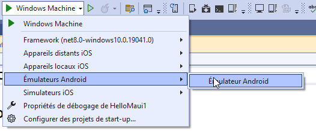
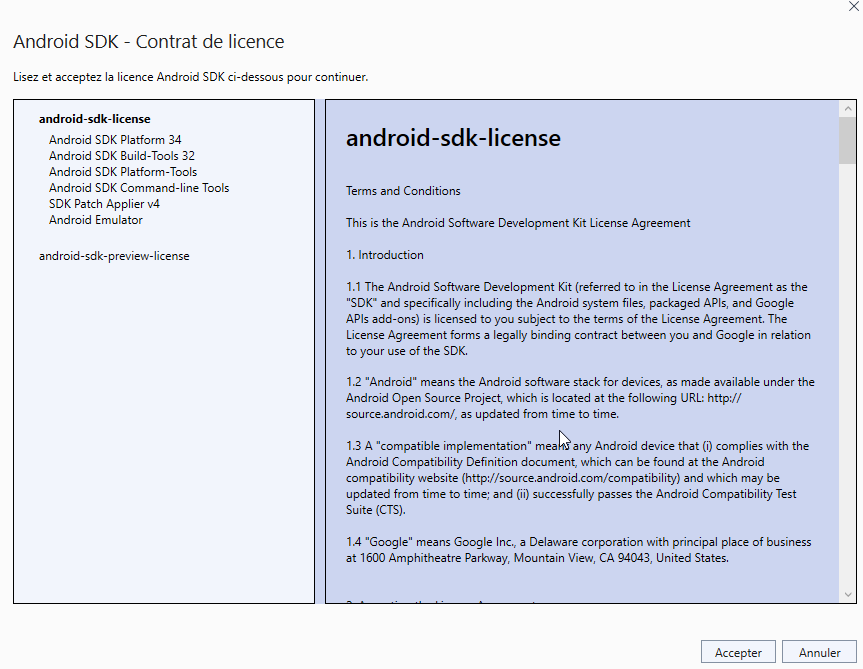
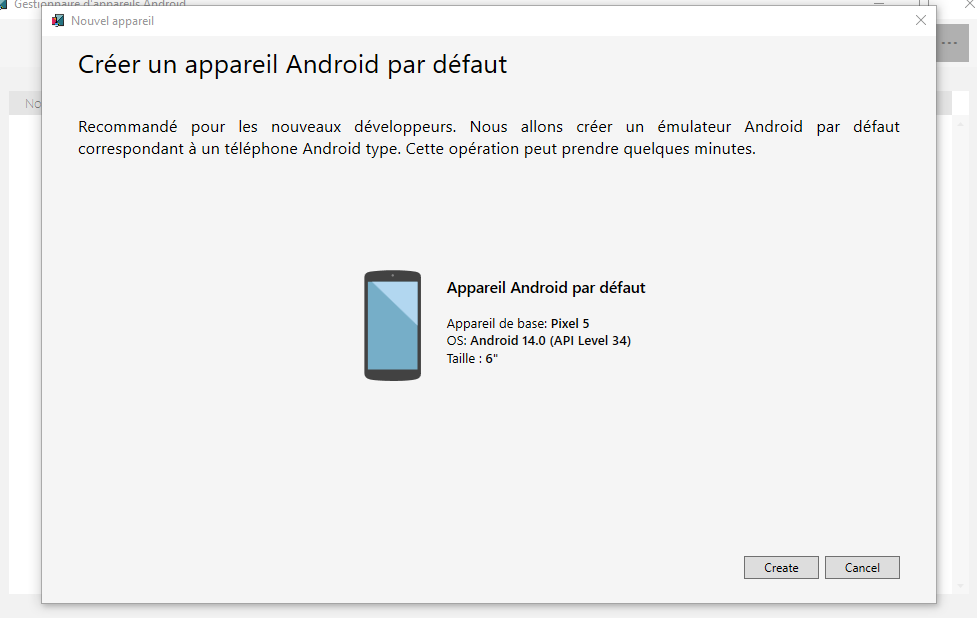
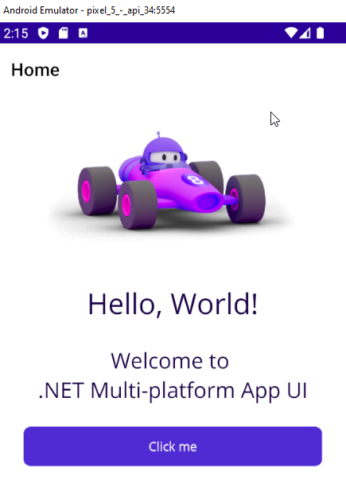

author: Jonathan Melly
summary: mobile app hello world
id: mobile-hello
categories: android,dev
tags: ict
environments: Web
status: Published
feedback link: https://git.section-inf.ch/jmy/labs/issues
analytics account: UA-170792591-1

# Première appli mobile MAUI

## Vue d’ensemble
Duration: 0:02:00

Survey
: À votre avis, quel est l'avenir des applications mobile ?
<ul>
<li>C'est un peu comme la lampe d'Aladdin, ça ouvre des portes infinies</li>
<li>Il est très incertain</li>
<li>J'attends la fin de ce tuto pour me faire une meilleure idée</li>
</ul>

### MAUI, une baguette magique ?
Microsoft a développé une technologie de pointe avec MAUI (et Xamarin Forms) qui permet de développer
une application mobile en C#, avec visualstudio qui pourra ensuite être déployée sur toutes les plateformes
mobiles principales :

## Mise en place
Duration: 0:05:00

### Ajouter les composants dans VisualStudio
Lancer l'installateur visualstudio (visualstudio installer) et ajouter si
nécessaire le composant MAUI :

Negative
: Si l'option n'est pas disponible, il faut peut-être commencer par mettre à jour visualstudio...

## Créer un projet
Duration: 0:10:00

### Type de projet
Lancer visualstudio et créer un projet MAUI

### Configuration du projet

### Créer un émulateur Android
Pour tester l'application, il faut un smartphone ou un émulateur. 
Dans tous les cas, un émulateur est bien pratique, voici comment le créer :

Negative
: Pour tester sur IOS, il faut impérativement avoir un device apple, même pour l'émulateur...

Accepter la licence

Choisir l'appareil par défaut

## Lancer l'application
Duration: 0:01:00

Une fois l'émulateur créé, l'application example devrait se lancer :

## Synthèse
Bravo, il est temps de faire le point sur les éléments travaillés

