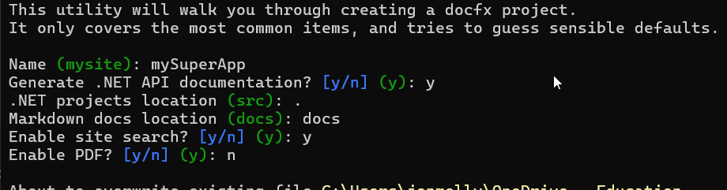
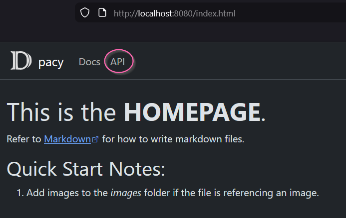

author: Jonathan Melly
summary: Générer la documentation d'un projet C# avec DocFX
id: oo-05-docfx
categories: csharp,dev
tags: ict
environments: Web
status: Published
feedback link: https://git.section-inf.ch/jmy/labs/issues
analytics account: UA-170792591-1

# Documentation C# : générer un site avec DocFX

## Vue d'ensemble
Duration: 0:03:00

À ce stade du cours, nos classes `Snail`, `FastSnail`, `SlowSnail` et `BonusSnail` ont des propriétés, des méthodes, de l'héritage et du polymorphisme. Le code devient conséquent — il est temps de le **documenter** proprement.

**DocFX** est l'outil officiel de Microsoft pour générer automatiquement un **site de documentation** à partir du code source C#. Il lit les commentaires XML (`///`) dans le code et produit un site HTML navigable, comme la documentation officielle de .NET elle-même.

### Objectifs

Apprendre à :
1. Installer DocFX en tant qu'outil .NET global
2. Initialiser un projet de documentation
3. Ajouter des commentaires XML au code C#

### Prérequis

- .NET SDK 8.0 ou supérieur installé (`dotnet --version` pour vérifier)
- Un projet C# existant (par exemple le projet de course d'escargots)

Positive
: Documenter son code est une compétence professionnelle essentielle. DocFX est utilisé par Microsoft pour la documentation officielle de .NET — vous utilisez le même outil que les pros.

Survey
: Comment documentez-vous votre code aujourd'hui ?
<ul>
<li>Je ne documente pas (le code parle de lui-même)</li>
<li>J'ajoute quelques commentaires // dans le code</li>
<li>J'utilise des commentaires XML (///)</li>
<li>J'utilise déjà un outil de génération de doc</li>
</ul>

## Installer DocFX
Duration: 0:05:00

### Objectif

Installer DocFX en tant qu'outil global .NET, disponible depuis n'importe quel terminal.

### Commande d'installation

Ouvrez un terminal (PowerShell, cmd, ou le terminal intégré de votre IDE) et exécutez :

```bash
dotnet tool update -g docfx
```

Cette commande installe DocFX globalement (ou le met à jour si déjà installé). Le flag `-g` signifie **global** : l'outil sera accessible depuis n'importe quel répertoire.

### Vérifier l'installation

```bash
docfx --version
```

Vous devriez voir un numéro de version (par exemple `2.78.2`).

Negative
: Si la commande `docfx` n'est pas reconnue après l'installation, fermez et rouvrez votre terminal. Sur certains systèmes, il faut relancer le terminal pour que le PATH soit mis à jour.

### En cas de problème

| Problème                          | Solution                                                                                        |
|:----------------------------------|:------------------------------------------------------------------------------------------------|
| `dotnet` non reconnu              | Installer le .NET SDK 8.0+ depuis [dotnet.microsoft.com](https://dotnet.microsoft.com/download) |
| `docfx` non reconnu après install | Fermer et rouvrir le terminal                                                                   |
| Erreur de permissions             | Exécuter le terminal en tant qu'administrateur                                                  |

Positive
: DocFX est installé une seule fois. Il sera disponible pour tous vos projets C#.

## Initialiser le projet de documentation
Duration: 0:05:00

### Objectif

Créer la structure de base du projet DocFX dans votre solution.

### Se placer dans le répertoire du projet

- Naviguer dans le répertoire de votre solution C# (là où se trouve le fichier `.sln` ou le dossier du projet)
- Créer un nouveau dossier à partir duquel la documentation sera créée
- Naviguer dans le nouveau dossier

```shell
cd chemin/vers/votre/projet
mkdir doc
cd doc
```

### Initialiser DocFX

```bash
docfx init
```



### Points importants

- Par défaut, les sources sont cherchées dans le dossier src, la plupart du temps, c'est le dossier courant directement...
- Les éléments suivants ont été générés:

| Fichier/Dossier | Rôle                                                    |
|:----------------|:--------------------------------------------------------|
| `docfx.json`    | Configuration principale (on va le modifier)            |
| `api/`          | Documentation générée automatiquement depuis le code C# |
| `articles/`     | Articles écrits manuellement (tutoriels, guides)        |
| `index.md`      | Page d'accueil du site de documentation                 |
| `toc.yml`       | Table des matières (navigation du site)                 |

Positive
: Ne modifiez pas la structure des dossiers. DocFX s'attend à trouver `api/` et `articles/` à ces emplacements.

## Générer la documentation ##

À partir de là, pour générer la documentation, on peut:

### Lancer la génération ###

``` shell
docfx docfx.json
```

### Démarrer un serveur pour consulter la documentation (fait la génération avant) ###

``` shell
docfx docfx.json --serve
```



#### API
Dans cet onglet, on retrouve la documentation technique du code...

## Àméliorer la documentation

Ajouter des commentaires de documentation XML (`///`) au code C# pour que DocFX génère une documentation riche.

### Les commentaires XML en C#

En C#, les commentaires de documentation commencent par `///` (triple slash). L'IDE complète automatiquement le squelette quand vous tapez `///` au-dessus d'une classe ou d'une méthode.

### Documenter la classe Snail

```csharp
/// <summary>
/// Représente un escargot dans la course.
/// Classe de base pour tous les types d'escargots.
/// </summary>
class Snail
{
    /// <summary>
    /// Nom de l'escargot (immutable).
    /// </summary>
    public string Name { get; }

    /// <summary>
    /// Position horizontale de l'escargot sur la piste.
    /// </summary>
    public int X { get; protected set; }

    /// <summary>
    /// Énergie de l'escargot, toujours entre 10 et 100.
    /// </summary>
    public int Energy
    {
        get { return _energy; }
        protected set { /* validation */ }
    }

    /// <summary>
    /// Crée un nouvel escargot avec un nom, une couleur et une position.
    /// </summary>
    /// <param name="name">Le nom de l'escargot.</param>
    /// <param name="color">La couleur d'affichage.</param>
    /// <param name="x">La position horizontale initiale.</param>
    /// <param name="y">La position verticale initiale.</param>
    public Snail(string name, ConsoleColor color, int x, int y)
    {
        // ...
    }

    /// <summary>
    /// Déplace l'escargot. Les classes dérivées peuvent redéfinir ce comportement.
    /// </summary>
    /// <param name="dx">Déplacement horizontal.</param>
    /// <param name="dy">Déplacement vertical.</param>
    public virtual void Move(int dx, int dy)
    {
        X = X + dx;
        Y = Y + dy;
    }

    /// <summary>
    /// Réduit l'énergie de l'escargot.
    /// L'énergie ne descend jamais en dessous de 10.
    /// </summary>
    /// <param name="amount">La quantité d'énergie à retirer.</param>
    public void ReduceEnergy(int amount)
    {
        Energy = Energy - amount;
    }
}
```

### Documenter les classes dérivées

```csharp
/// <summary>
/// Escargot rapide : avance deux fois plus vite que la normale.
/// </summary>
class FastSnail : Snail
{
    /// <summary>
    /// Crée un escargot rapide.
    /// </summary>
    public FastSnail(string name, ConsoleColor color, int x, int y)
        : base(name, color, x, y)
    {
    }

    /// <summary>
    /// Avance en doublant la distance horizontale.
    /// </summary>
    public override void Move(int dx, int dy)
    {
        base.Move(dx * 2, dy);
    }
}
```

### Les balises XML principales

| Balise              | Rôle                            | Exemple                                                    |
| :------------------ | :------------------------------ | :--------------------------------------------------------- |
| `<summary>`         | Description courte de l'élément | `/// <summary>Représente un escargot.</summary>`           |
| `<param name="x">`  | Décrit un paramètre             | `/// <param name="dx">Déplacement horizontal.</param>`     |
| `<returns>`         | Décrit la valeur de retour      | `/// <returns>True si l'escargot est épuisé.</returns>`    |
| `<remarks>`         | Remarques supplémentaires       | `/// <remarks>L'énergie ne descend pas sous 10.</remarks>` |
| `<example>`         | Exemple d'utilisation           | `/// <example>snail.Move(3, 0);</example>`                 |
| `<see cref="..."/>` | Lien vers un autre élément      | `/// Voir <see cref="FastSnail"/>`                         |

### Astuce IDE

Dans Visual Studio ou Rider, tapez `///` au-dessus d'une méthode et appuyez sur Entrée. L'IDE génère automatiquement le squelette avec les balises `<summary>` et `<param>` déjà remplies.

Positive
: Vous n'êtes pas obligé de tout documenter d'un coup. Commencez par les classes et les méthodes publiques — ce sont les éléments que DocFX affichera dans la documentation API.

## Bonus : Personnaliser la documentation
Duration: 0:10:00

### 1. Modifier la page d'accueil

Éditer `index.md` pour personnaliser la page d'accueil de votre documentation :

```markdown
# Course d'Escargots — Documentation

Bienvenue dans la documentation du projet **Course d'Escargots**.

## Classes principales

- **Snail** : Classe de base pour tous les escargots
- **FastSnail** : Escargot rapide (avance 2x)
- **SlowSnail** : Escargot lent (s'arrête si fatigué)
- **BonusSnail** : Escargot à bonus aléatoires


## Pour commencer
Consultez la section [API Documentation](api/index.md)
pour voir le détail de chaque classe.
```

### 2. Ajouter un article

Créez un fichier dans `docs/`, par exemple `architecture.md` :

```markdown
# Architecture du projet

Le projet utilise l'**héritage** pour spécialiser les escargots.

## Hiérarchie de classes

- `Snail` (classe de base)
  - `FastSnail` — avance 2x plus vite
  - `SlowSnail` — s'arrête si énergie ≤ 30
  - `BonusSnail` — bonus aléatoire + CollectBonus()
```

Ajoutez-le à la table des matières dans `toc.yml` :

```yaml
- name: Introduction
  href: intro.md
- name: Architecture
  href: architecture.md
```

### 3. Générer un PDF

DocFX peut aussi générer un PDF. Cette fonctionnalité nécessite **Node.js v20+** installé.

Ajoutez la section `pdf` dans `docfx.json` :

```json
{
  "build": {
    ...
  },
  "pdf": {
    "content": [
      {
        "files": ["api/**.yml", "api/index.md"]
      },
      {
        "files": ["articles/**.md", "articles/**/toc.yml", "toc.yml", "*.md"]
      }
    ],
    "dest": "_pdf"
  }
}
```

Puis générez :

```bash
docfx pdf docfx.json
```

Le PDF sera créé dans `_pdf/`.

Negative
: La génération PDF nécessite Node.js v20 ou supérieur. Vérifiez avec `node --version`. Si Node.js n'est pas installé, la génération HTML fonctionne sans problème — le PDF est optionnel.

## Synthèse
Duration: 0:02:00

### Récapitulatif des commandes

| Étape           | Commande                                       | Résultat                     |
|:----------------|:-----------------------------------------------|:-----------------------------|
| Installer DocFX | `dotnet tool update -g docfx`                  | Outil disponible globalement |
| Initialiser     | `docfx init`                                   | Crée les fichiers de base    |
| Configurer      | Adapter si besoin `docfx.json` (section `src`) | Pointe vers les `.csproj`    |
| Documenter      | Ajouter `///` dans le code C#                  | Commentaires XML             |
| Générer + voir  | `docfx docfx_project/docfx.json --serve`       | Site sur `localhost:8080`    |
| PDF (optionnel) | `docfx pdf docfx_project/docfx.json`           | PDF dans `_pdf/`             |

### Concepts clés

1. **DocFX** est l'outil officiel de Microsoft pour la documentation .NET
2. Les commentaires **`///`** (triple slash) avec des balises XML alimentent la doc
3. La configuration dans **`docfx.json`** indique où trouver les `.csproj`
4. Le site généré dans **`_site`** est du HTML statique prêt à déployer
5. Documenter les classes et méthodes **publiques** en priorité

Positive
: Votre projet est maintenant documenté professionnellement. Chaque fois que vous ajoutez ou modifiez une classe, relancez `docfx` pour mettre à jour la documentation. Les commentaires `///` sont aussi lus par l'IntelliSense de votre IDE — double bénéfice !

Survey
: Quelle fonctionnalité de DocFX vous semble la plus utile ?
<ul>
<li>La génération automatique de doc API depuis le code</li>
<li>Les commentaires XML visibles dans l'IDE (IntelliSense)</li>
<li>Le site HTML navigable</li>
<li>La possibilité de générer un PDF</li>
</ul>
