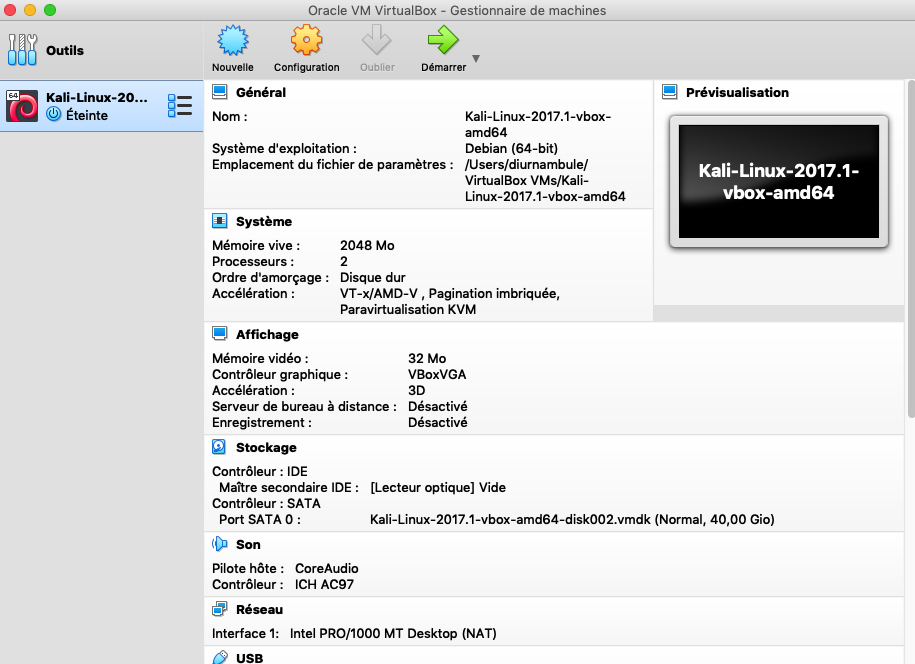
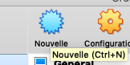
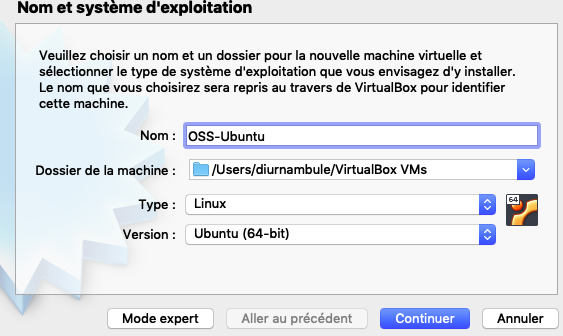
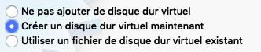
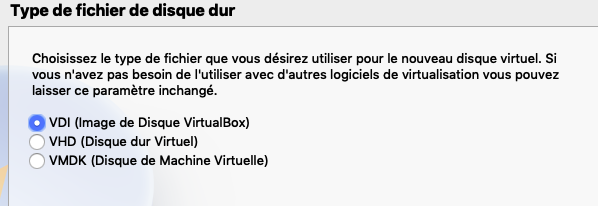
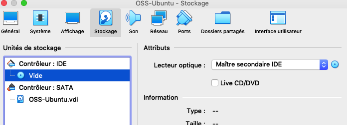
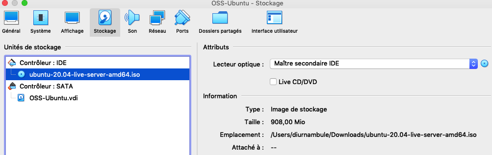
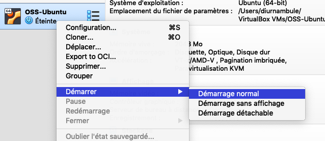
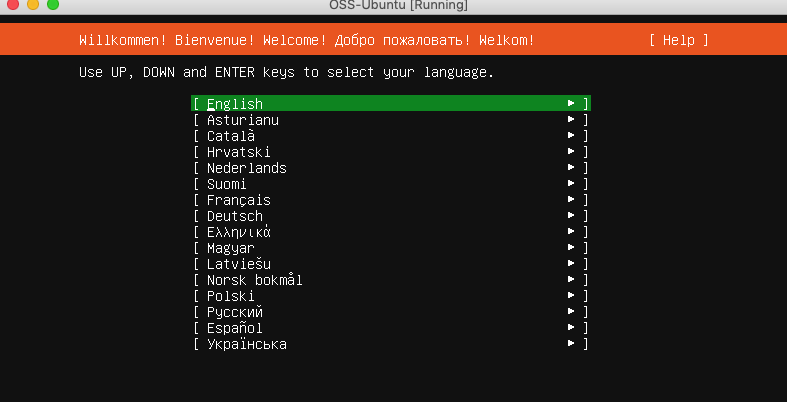

author: Jonathan Melly
summary: Installer un OS opensource
id: oss-os-install
categories: system
tags: mem
environments: Web
status: Draft
feedback link: https://git.section-inf.ch/jmy/labs/issues
analytics account: UA-170792591-1

# Installation d'un système d'exploitation open source

## Aperçu 
Duration: 2

### Compétences qui vont être acquises

- Créer une machine virtuelle
- Télécharger et installer un système d'exploitation
- Configurer le système en ligne de commande
- Installer une couche graphique et l'utiliser
- Obtenir des métriques système
- Installer les logiciels additionnels

Survey
: Sais-tu qui est tux ?
<ul>
  <li>Oui</li>
  <li>Non</li>
  <li>Peut-être</li>
</ul>

## Machine virtuelle
Duration: 0:05:00

### Installation
Au lieu de configurer un multiboot ou acheter un nouvel ordinateur, une **machine virtuelle** sera créee avec le logiciel VirtualBox disponible pour Windows, MacOS et Linux à l'adresse suivante : [Virtualbox](https://www.virtualbox.org/wiki/Downloads).

Positive
: Si ce logiciel est déjà installé sur l'ordinateur, on peut directement passer au point suivant.

#### Écran d'accueil de virtualbox
Voici à quoi devrait ressembler l'application une fois lancée :

### Démarrage et création
Pour commencer, une nouvelle machine virtuelle doit être créee:

Ensuite, suivez les screenshots suivants pour la configuration:

1. Nom et système d'exploitation

2. RAM (mémoire vive)

3. Disque dur

4. Vérification

## Distribution
Duration: 0:02:00

Il existe plusieurs systèmes d'exploitation opensource qu'on appelle communément *distribution*.
Ubuntu sera utilisé et il faut donc télécharger une image du système de base.

Negative
: Les systèmes open source sont des dérivés du système UNIX. Il y a deux branches principales que sont **BSD** et **Linux**.
Ce dernier est un noyau autour duquel gravite diverses distributions comme Ubuntu qui est lui-même dérivé de Debian...Vous trouverez plus d'informations [ici](https://fr.wikipedia.org/wiki/Liste_des_distributions_GNU/Linux).

### Téléchargement de l'image
L'adresse pour le téléchargement est la suivante : [https://ubuntu.com/download/server](https://ubuntu.com/download/server)

Positive
: Pour accélerer le téléchargement, une image a été placée sur le réseau à l'endroit habituel.

### Association du fichier image avec la machine virtuelle
Pour démarrer sur l'image récupérée, il faut configurer la machine virtuelle dans Virtualbox:

### Démarrage
Ensuite la machine peut être démarrée :

### Écran d'accueil
Si tout va bien, voici l'écran présenté:

## Installation
Duration: 0:15:00

## Ajout du mode graphique
Duration: 0:05:00

## Outils
Duration: 0:5:00

