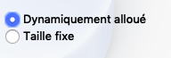
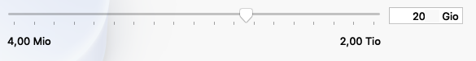
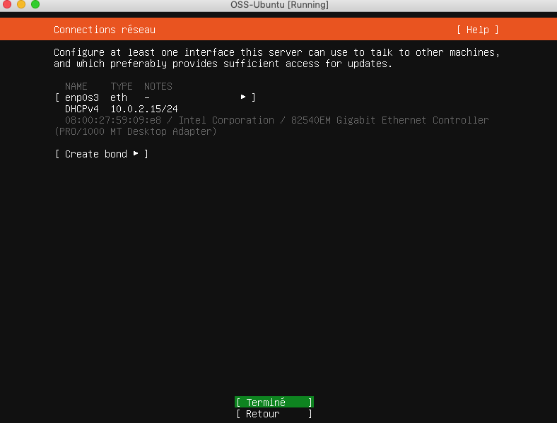
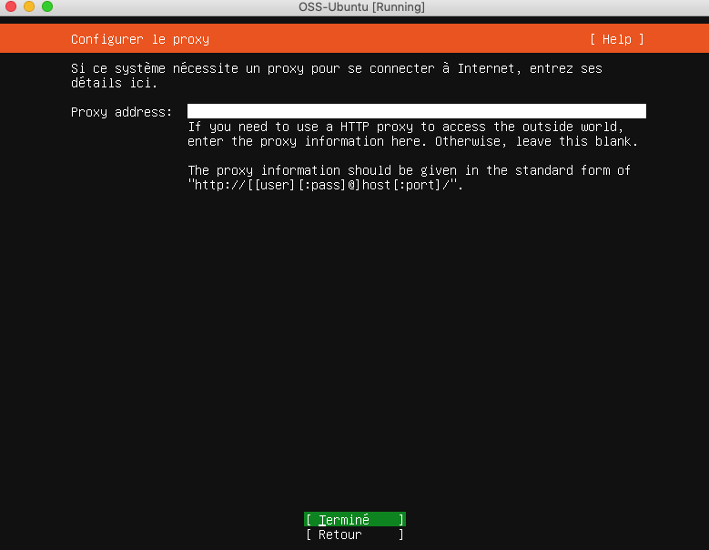
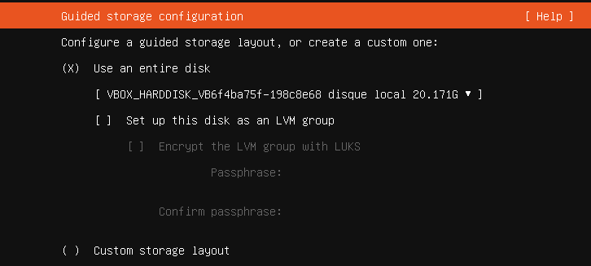
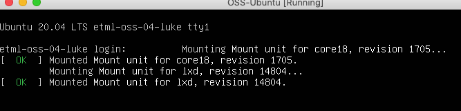

author: Jonathan Melly
summary: Installer un OS opensource
id: oss-os-install
categories: system
tags: mem
environments: Web
status: Draft
feedback link: https://git.section-inf.ch/jmy/labs/issues
analytics account: UA-170792591-1

# Installation d'un système d'exploitation open source

## Aperçu 
Duration: 2

### Compétences qui vont être acquises

- Créer une machine virtuelle
- Télécharger et installer un système d'exploitation
- Configurer le système en ligne de commande
- Installer une couche graphique et l'utiliser
- Obtenir des métriques système
- Installer les logiciels additionnels

Survey
: Sais-tu qui est tux ?
<ul>
  <li>Oui</li>
  <li>Non</li>
  <li>Peut-être</li>
</ul>

## Machine virtuelle
Duration: 0:05:00

### Installation
Au lieu de configurer un multiboot ou acheter un nouvel ordinateur, une **machine virtuelle** sera créee avec le logiciel VirtualBox disponible pour Windows, MacOS et Linux à l'adresse suivante : [Virtualbox](https://www.virtualbox.org/wiki/Downloads).

Positive
: Si ce logiciel est déjà installé sur l'ordinateur, on peut directement passer au point suivant.

#### Écran d'accueil de virtualbox
Voici à quoi devrait ressembler l'application une fois lancée :

### Démarrage et création
Pour commencer, une nouvelle machine virtuelle doit être créee:

Ensuite, suivez les screenshots suivants pour la configuration:

1. Nom et système d'exploitation

2. RAM (mémoire vive)

3. Disque dur

4. Vérification

## Distribution
Duration: 0:02:00

Il existe plusieurs systèmes d'exploitation opensource qu'on appelle communément *distribution*.
Ubuntu sera utilisé et il faut donc télécharger une image du système de base.

Negative
: Les systèmes open source sont des dérivés du système UNIX. Il y a deux branches principales que sont **BSD** et **Linux**.
Ce dernier est un noyau autour duquel gravite diverses distributions comme Ubuntu qui est lui-même dérivé de Debian...Vous trouverez plus d'informations [ici](https://fr.wikipedia.org/wiki/Liste_des_distributions_GNU/Linux).

### Téléchargement de l'image
L'adresse pour le téléchargement est la suivante : [https://ubuntu.com/download/server](https://ubuntu.com/download/server)

Positive
: Pour accélerer le téléchargement, une image a été placée sur le réseau à l'endroit habituel.

### Association du fichier image avec la machine virtuelle
Pour démarrer sur l'image récupérée, il faut configurer la machine virtuelle dans Virtualbox:

### Démarrage
Ensuite la machine peut être démarrée :

### Écran d'accueil
Si tout va bien, voici l'écran présenté:

## Installation
Duration: 0:20:00

### Saisies en mode texte
L'installation se fait en mode *texte*, ainsi, les touches fléchées, ENTER, TAB et ESCAPE (retour en arrière) sont particulièrement utiles:

### Langue
Pour faciliter la compréhension du système, celui-ci une fois installé, sélectionner la langue française:

### Mises à jour
Le programme d'installation peut inclure des mises à jour mais ceci sera fait après l'installation.
L'option par défaut est donc conservée:

### Clavier
Le clavier doit être configuré ainsi:

### Réseau
Sans entrer dans les détails, le choix par défaut est conservé :

#### Proxy
Il n'y a pas de proxy à configurer (utilisation de l'interfacée NAT de Virtualbox)

#### Miroir
Pour accélerer l'installation, un miroir proche doit être sélectionné.
Ce travail étant réalisé par le programme d'installation, l'option proposée est conservée:

### Disque
Lors de la création de la machine virtuelle, un seul disque virtuel avait été créé et c'est celui-ci qu'il faut choisir:

#### Partitions
Lors d'une installation professionnelle, un disque est compartimenté pour des raisons de **sécurité** et de **performance**.
Pour une utilisation amateur, l'option par défaut est adaptée:

#### Récapitulatif
Confirmer après la présentation du récapitulatif:

### Compte utilisateur
Un système d'exploitation est la plupart du temps *multi-utilisateur*, ce qui veut dire qu'on peut configurer plusieurs comptes.
Il s'agit maintenant de configurer le compte principal ainsi que le nom de la machine.
Voici l'exemple à suivre et adapter:

### Logiciels additionnels
L'installateur propose d'ajouter automatiquement des élément additionnels communs.

#### SSH
Laisser l'option par défaut (NON installé) :

#### Autres
Aucun logiciel additionnel ajouté:

### Mises à jour
Le programme d'installation installe les mises à jour de sécurité critiques, il faut donc patienter.

Negative
: Si Internet ne fonctionne pas, on peut forcer la fin de l'installation en appuyant sur ENTER

### Redémarrage
L'installation est terminée, il est temps de redémarrer:

### Éjection du cdrom virtuel
Il se peut qu'une erreur se produise, dans ce cas, il faut juste appuyer sur ENTER:

### Premier login
À la fin du démarrage, on devrait voir apparaître une invite de login:

Il se peut toutefois que celle-ci soit masquée au premier démarrage :

Indépendemment de ce qui est affiché, on peut entrer dans le système en introduisant le nom d'utilisateur suivi de ENTER suivi du mot de passe et à nouveau ENTER:

Negative
: Il est tout à fait normal que les caractères du mot de passe ne soient pas affichés, c'est une manière d'augmenter la sécurité des mot de passe (au cas où quelqu'un serait en train d'espionner...)

## Récapitulatif
Duration: 0:05:00

Félicitations, l'installation d'Ubuntu est terminée est réussie.
Voici un questionnaire pour faciliter la mémorisation des éléments importants:

