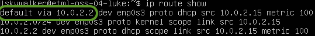
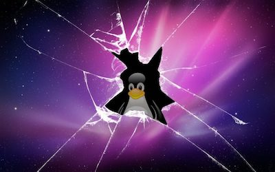
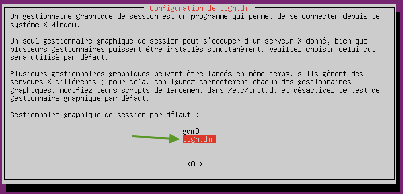
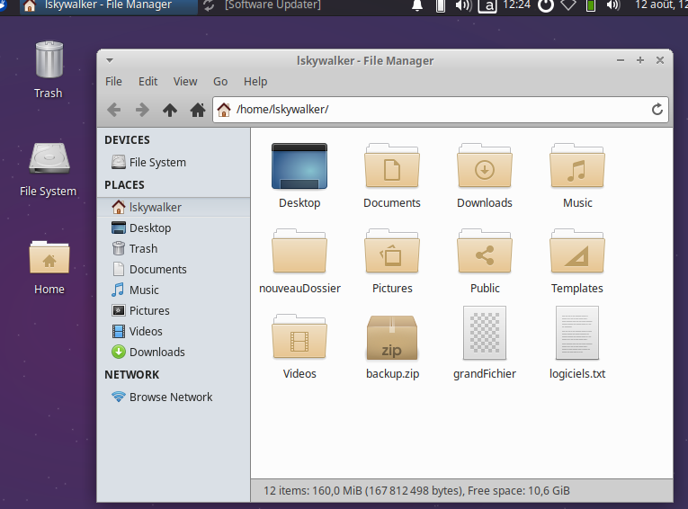
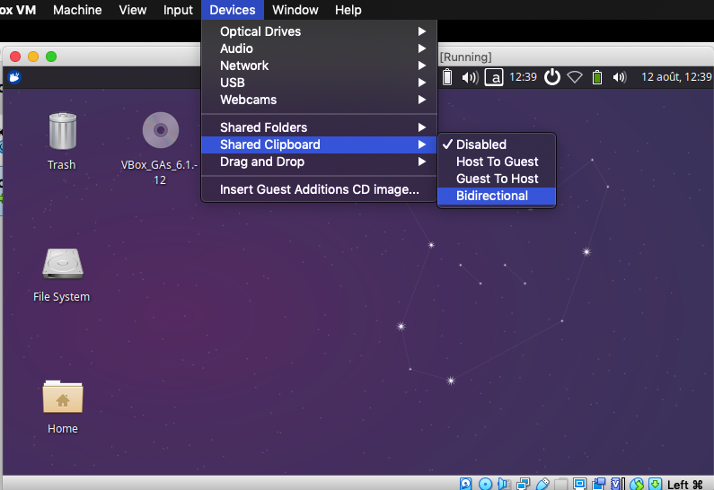

author: Jonathan Melly
summary: Tuner un OS opensource - Partie 2
id: oss-os-manage-2
categories: system
tags: mem
environments: Web
status: Published
feedback link: https://git.section-inf.ch/jmy/labs/issues
analytics account: UA-170792591-1


# Tuning d'un système d'exploitation open source #2

## Aperçu 
Duration: 1


### Compétences qui vont être acquises

- Afficher les informations du réseau
- Gérer les logiciels
- Installer une interface graphique

Survey
: À ton avis, que signifie ipv6 ?
<ul>
  <li>Que l'ordinateur en question est hyper puissant</li>
  <li>Internet Protocol Viper Six</li>
  <li>Que beaucoup de périphériques souhaitent être atteignables sur Internet</li>
</ul>

## Prérequis
Duration: 0:01:00

### Partie 1
Ces activités suivent la [partie 1](https://labs.section-inf.ch/codelabs/oss-os-manage-1/index.html).

## Internet
Duration: 00:15:00


La connexion au réseau Internet est un must et pour vérifier que tout est en ordre, certaines commandes sont très utiles.

### Adresse IP
Pour se connecter au réseau Internet, il faut une carte réseau (lan ou wifi) avec une adresse IP. Pour voir ces informations, la commande est la suivante:

``` bash
ip addr show
```


On voit que l'adresse IP attribuée à la carte réseau est 10.0.2.15 (le /24 indique que le masque est 255.255.255.0).

### Voisins
Une commande intéressante est de regarder s'il y a d'autres cartes connectées sur ce réseau :

``` bash
ip neigh show
```


On constate qu'un voisin (**neigh**bour) est là avec l'adresse 10.0.2.2 et le point suivant nous indiquera de qui il s'agit.

### Routeur
Pour aller sur le réseau Internet, on passe par un routeur (souvent integré à une box internet) qui possède une adresse locale et une adresse sur le réseau Internet.
Pour voir comment sont routées les informations sur le réseau, la commande est 

``` bash
ip route show
```



On voit que la route par défaut passe par l'adresse relevée précédemment. On peut donc en déduire que le routeur a l'adresse 10.0.2.2.

Negative
: Pour rappel, la carte réseau et le routeur n'existent pas physiquement, ils sont simulés par le logiciel 'virtualbox' qui lui utilise la carte réseau physique de votre ordinateur connectée sur le réseau de l'école.
Néanmoins, le fait qu'ils soient virtuels n'a pas d'impact ici et vous pouvez faire comme si c'était réel.

### Serveur WEB de l'ETML
Puisque tous les feux sont au vert (adresse locale et routeur), il est temps de faire un test en envoyant un *message de bonjour* au serveur de l'ETML:

``` bash
ping etml.ch -c 1
```


Plusieurs informations sont disponibles avec le retour de cette commande:

1. Adresse IP du serveur WEB ETML: 94.103.96.239
1. Serveur accessible : 1 paquet transmis et 1 reçu
1. Temps moyen de la transmission/réception du message: 11.5 millisecondes

## Logiciels
Duration: 00:15:00


Ubuntu fournit un grand nombres le logiciels qui sont en fait des produits issus de projets Open Source.

### Installés
Pour lister les logiciels installés, la commande est:

``` bash
apt list --installed
```

Cette commande retourne plus de résultats qu'il n'y a de place dans la fenêtre. Dans ce cas, une astuce est d'écrire le résultat de la commande dans un fichier, puis de l'ouvrir avec l'éditeur *nano* :

``` bash
apt list --installed > logiciels.txt
nano logiciels.txt
```

### Installer un logiciel
Si on veut installer un nouveau logiciel, il suffit de rechercher dans la base de données. Par exemple, si on voulait installer tetris, on pourrait faire la recherche suivante:

``` bash
apt-cache search tetris
```


On voit qu'il y a plusieurs versions Open Source de Tetris. Pour que cela fonctionne en ligne de commande, nous allons installer *bastet* (basic tetris):

``` bash
sudo apt-get install bastet
```

Positive
: Il faut répondre *O* suivi de *Enter* à la question pour 'libboost'.

On peut maintenant lancer le programme sachant que pour l'arrêter il faudra appuyer sur les touches *ctrl* et *c* simultanément:

``` bash
bastet
```

### Enlever un logiciel
Sauf erreur, tu as signé une charte concernant le jeu à l'ETML et il faut donc retirer ce programme de l'ordinateur:

``` bash
sudo apt-get remove bastet
```

Positive
: À nouveau, il faut valider la demande de désinstallation.

### Mise à jour des logiciels
Avec tous les logiciels installés, il est utile d'avoir un programme qui gère les mises à jour.
D'ailleurs, lorsqu'on se logue, on nous dit si des mises à jour sont en attente:


Une mise à jour se fait en plusieurs étapes:

1. Mettre à jour la base de données des logiciels disponibles et leur version
1. Lister les programmes nécessitant une mise à jour
1. Lancer la mise à jour

``` bash
sudo apt-get update
apt list --upgradable
sudo apt-get upgrade
```

Positive
: À nouveau, il faut valider la demande de mise à jour.

Negative
: Pour faire une mise à jour de l'OS (système de base), la commande est *sudo apt-get dist-upgrade*


## Mode graphique
Duration: 00:20:00



Après une introduction à la ligne de commande, il est temps d'ajouter un bureau (une interface graphique).

### Installation
L'installation se déroule de la même manière qu'avec tetris sauf qu'on installe un autre programme (comme d'habitude, on valide la demande)

``` bash
sudo apt-get install xubuntu-desktop
```

À la question sur le gestionnaire graphique, l'option *lightdm* est à préférer:



Negative
: Il est tout à fait normal que cela prenne du temps car il y a beaucoup de librairies et programmes nécessaires à un bureau interactif.

Une fois la commande terminée, un redémarrage est recommandé:

``` bash
sudo reboot
```


### Découverte
À toi de découvrir cet environnement graphique de base en te balladant dans les menus et les options avec les objectifs suivants:

1. Voir les logiciels installés (graphique et console)
1. Créer un document Calc (installer si besoin) contenant un graphique avec l'utilisation de la mémoire pendant 5 minutes (une valeur par minute)
1. Exporter un PDF du document Calc et l'envoyer au professeur par email



## Avancé
Duration: 00:10:00

Maintenant qu'on a un mode graphique, il serait intéressant qu'on puisse redimensionner la fenêtre et échanger avec l'ordinateur hôte...
Pour cela, il faut installer un programme et redémarrer:

``` bash
sudo apt-get install virtualbox-guest-dkms
```

Pour le redémarrage, il y a un bouton en haut à droite.

Désormais, la fenêtre devrait être redimensionnable et pour partager le presse-papier, voici ce qu'il faut activer:



## Synthèse récapitulative
Duration: 0:02:00

Il est de voir ce que tu as retenu:


