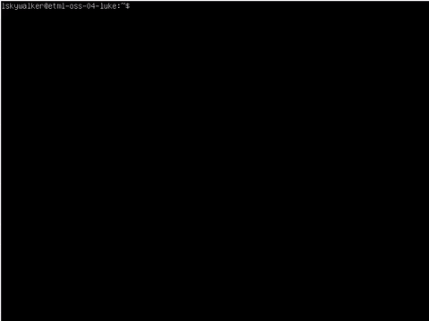
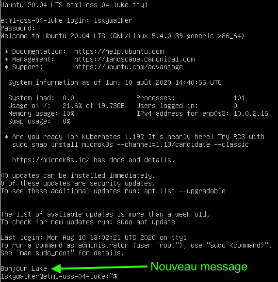
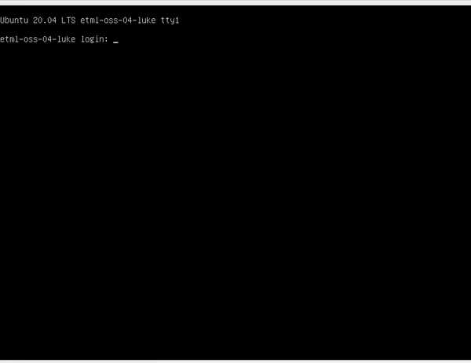

author: Jonathan Melly
summary: Tuner un OS opensource
id: oss-os-manage
categories: system
tags: mem
environments: Web
status: Published
feedback link: https://git.section-inf.ch/jmy/labs/issues
analytics account: UA-170792591-1


# Tuning d'un système d'exploitation open source

## Aperçu 
Duration: 1


### Compétences qui vont être acquises

- Visualiser la charge système
- Modifier la configuration du système
- Gérer les logiciels (Installation / Désinstallation)
- Afficher les informations du réseau
- Travailler avec des archives (création/compression/décompression)
- Écrire et éxécuter un mini programme très simple

Survey
: À ton avis, la commande 'TOP' sert à quoi ?
<ul>
  <li>Lister le top model du moment</li>
  <li>Trier Ou Partager (le noyau)</li>
  <li>Identifier les processus les plus gourmands</li>
</ul>

## Prérequis
Duration: 0:01:00

### Système d'exploitation
Toutes les activités sont basées sur les opérations décrites [ici](https://labs.section-inf.ch/codelabs/oss-os-install/index.html?index=..%2F..index#0).


## Utilisation des ressources système
Duration: 0:08:00

Un système d'exploitation est un peu comme un chef d'orchestre ayant pour musiciens des composants électroniques.


On peut observer son travail d'orchestration avec la commande *top* (écrire *top* puis valider avec la touche *enter*)
``` bash
top
```


Negative
: Pour quitter la commande, il suffit d'appuyer sur la touche *q*

### Décryptage du résultat


#### Partie 1 : Résumé
Cette partie comporte 3 points:

1. Le nombre de processus : 98 programmes chargés dont 1 en cours d'éxécution et 97 qui dorment.
1. L'utilisation du processeur: 0.3% utilisé et 99.7% en attente de travail.
1. L'utilisation de la RAM : 1987.8Mo disponible dont 148.3Mo utilisés et 1208.3Mo de libres.
1. L'utilisation du SWAP : 2Go au total dont 0 utilisé.

#### Partie 2 : Détail des processus
Le processus en haut de la liste est justement celui qui permet d'afficher les informations sur le processus.
Voici la traduction des colonnes:

1. PID: process id => Numéro d'identification du programme (géré par l'OS et permet de l'arrêter par exemple)
1. USER: utilisateur qui a lancé le processus
1. PR: priorité (-20 = priorité la plus importante)
1. NI: priorité demandée par le programme
1. VIRT: mémoire virtuelle utilisée par le programme
1. RES: mémoire RAM utilisée par le programme
1. SHR: partie de mémoire partagée dans RES
1. S: statut (R=running, s=sleeping, i=idle, etc...)
1. %CPU: pourcentage d'utilisation du processeur
1. %MEM: pourcentage d'utilisation de la mémoire
1. COMMAND: nom du programme

## Aide sur une commande
Duration: 0:10:00

Voulez-vous en savoir plus sur le résultat de la commande *top* ou vous demandez-vous où peut-on trouver les informations décrites précédemment sans l'utilisation d'Internet ?

Pour cela, il existe la commande *man* (manuel d'utilisation) :
``` bash
man top
```

Une fois la commande lancée, on peut:

1. Quitter en appuyant sur *q*
1. Tourner les pages (avancer la lecture) en appuyant sur *enter*
1. Chercher un terme en appuyant sur */* puis en saisissant un mot puis en appuyant sur *enter*. Ensuite, on appuie sur *n* (next=suivant) pour chercher le prochain terme

**En utilisant ce qui a été expliqué, que représentent les lettres *us* et *sy* à la deuxième ligne du résultat de la commande *top* ?**

Survey
: US et SY
<ul>
  <li>Pourcentage de métal provenant des US et de Syrie</li>
  <li>US=unité scientifique et SY=science yamakusa</li>
  <li>US=temps utilisateur et SY=temps noyau</li>
  <li>US=espace unique et SY=espace système</li>
</ul>

## Configuration système
Duration: 0:10:00

Un système Linux est basé sur des **fichiers de configuration**. Ces fichiers contiennent des indications que le système d'exploitation (au travers de ses programmes) interprète. C'est un peu  comme un automobiliste qui regarde les panneaux de signalisation pour savoir à quelle vitesse rouler à l'exception près qu'un programme, lui, ne fait jamais d'excès de vitesse ;-)

### Ajouter un message de bienvenue
Pour commencer, nous allons ajouter un message au login. Pour cela, nous avons donc besoin de 2 éléments:

1. Quel fichier de configuration ?
1. Comment éditer un fichier en ligne de commande ?

#### Bash
Pour la première question, un indice utile est que le programme lancé au login (interpréteur de commande) se nomme *bash*. Comme tout programme, on peut donc lire son manuel:
``` bash
man bash
```

Negative
: En cas de difficulté, un(e) camarade, votre professeur(e) ou Internet sauront vous aiguiller.

#### Nano
Il existe plusieurs éditeurs de fichier en ligne de commande et même si *vi* (visual editor) est le plus connu, *nano* a le mérite d'être plus facile à prendre en main et c'est donc celui qui va être utilisé.

En lien avec la partie précédente, pour éditer un fichier la commande est la suivante:
``` bash
nano unFichierAEditer
```

En remplaçant *unFichierAEditer* par le fichier de configuration de login, on peut alors ajouter une ligne tout en bas du fichier (descendre avec la flèche en bas) pour saluer l'utilisateur:



Résumé des commandes à effectuer:

1. Lancer l'éditeur (nano ...)
1. Se déplacer à la fin du fichier (flèche en bas)
1. Écrire la commande (echo "Bonjour Luke")
1. Sauvegarder (ctrl-o)
1. Quitter (ctrl-x)

Pour vérifier si cela fonctionne, il suffit de se déloguer :
``` bash
exit
```

Puis de se reloguer:




#### Défi
En s'inspirant de ce qui a été fait précédemment, votre mission est d'ajouter la date au moment du login:



