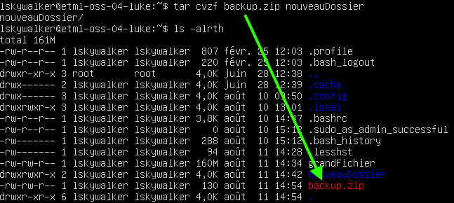
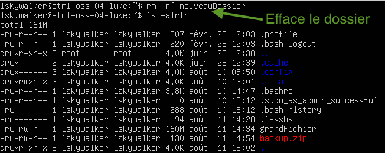
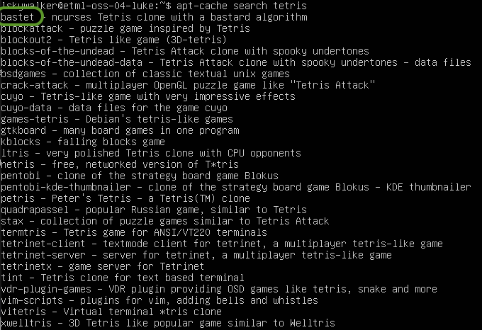

author: Jonathan Melly
summary: Tuner un OS opensource
id: oss-os-manage
categories: system
tags: mem
environments: Web
status: Published
feedback link: https://git.section-inf.ch/jmy/labs/issues
analytics account: UA-170792591-1


# Tuning d'un système d'exploitation open source

## Aperçu 
Duration: 1


### Compétences qui vont être acquises

- Visualiser la charge système
- Modifier la configuration du système
- Gérer les logiciels (Installation / Désinstallation)
- Afficher les informations du réseau
- Faire un backup
- Installer une interface graphique

Survey
: À ton avis, la commande 'TOP' sert à quoi ?
<ul>
  <li>Lister le top model du moment</li>
  <li>Trier Ou Partager (le noyau)</li>
  <li>Identifier les processus les plus gourmands</li>
</ul>

## Prérequis
Duration: 0:01:00

### Système d'exploitation
Toutes les activités sont basées sur les opérations décrites [ici](https://labs.section-inf.ch/codelabs/oss-os-install/index.html?index=..%2F..index#0).


## Utilisation des ressources système
Duration: 0:08:00

Un système d'exploitation est un peu comme un chef d'orchestre ayant pour musiciens des composants électroniques.


### CPU et RAM
On peut observer le travail d'orchestration avec la commande *top* (écrire *top* puis valider avec la touche *enter*)
``` bash
top
```


Negative
: Pour quitter la commande, il suffit d'appuyer sur la touche *q*

#### Décryptage du résultat


##### Partie 1 : Résumé
Cette partie comporte 3 points:

1. Le nombre de processus : 98 programmes chargés dont 1 en cours d'éxécution et 97 qui dorment.
1. L'utilisation du processeur: 0.3% utilisé et 99.7% en attente de travail.
1. L'utilisation de la RAM : 1987.8Mo disponible dont 148.3Mo utilisés et 1208.3Mo de libres.
1. L'utilisation du SWAP : 2Go au total dont 0 utilisé.

##### Partie 2 : Détail des processus
Le processus en haut de la liste est justement celui qui permet d'afficher les informations sur le processus.
Voici la traduction des colonnes:

1. PID: process id => Numéro d'identification du programme (géré par l'OS et permet de l'arrêter par exemple)
1. USER: utilisateur qui a lancé le processus
1. PR: priorité (-20 = priorité la plus importante)
1. NI: priorité demandée par le programme
1. VIRT: mémoire virtuelle utilisée par le programme
1. RES: mémoire RAM utilisée par le programme
1. SHR: partie de mémoire partagée dans RES
1. S: statut (R=running, s=sleeping, i=idle, etc...)
1. %CPU: pourcentage d'utilisation du processeur
1. %MEM: pourcentage d'utilisation de la mémoire
1. COMMAND: nom du programme

### Espace disque
Quand il n'y a plus d'espace pour stocker des nouvelles données, un ordinateur peut se bloquer. Il est donc utile de pouvoir contrôler l'espace sur les disques (SSD ou HDD) et aussi observer combien d'espace est pris par un dossier.

#### Lister les disques et leur partition
Une commande pratique est la suivante:

``` bash
sudo df -h
```


On voit que le disque de 20Go est rempli à 24%.

#### Calculer la taille d'un dossier
Pour savoir combien d'espace est utilisé par un utilisateur, il suffit de se loguer puis d'éxécuter la commande suivante:

``` bash
du -sh .
```


Ici, seulement 48Ko sont utilisés. Pour vérifier que c'est correct, on peut ajouter un fichier d'environ 150Mo et vérifier:


## Aide sur une commande
Duration: 0:05:00


Voulez-vous en savoir plus sur le résultat de la commande *top*, *du*, *df*, *dd* ou vous aimeriez savoir où on peut trouver les informations décrites précédemment sans l'utilisation d'Internet ?

Pour cela, il existe la commande *man* (manuel d'utilisation). Par exemple, pour *top*, on peut écrire:

``` bash
man top
```

Une fois la commande lancée, on peut:

1. Quitter en appuyant sur *q*
1. Tourner les pages (avancer la lecture) en appuyant sur *enter*
1. Chercher un terme en appuyant sur */* puis en saisissant un mot puis en appuyant sur *enter*. Ensuite, on appuie sur *n* (next=suivant) pour chercher le prochain terme

**En utilisant ce qui a été expliqué, que représentent les lettres *us* et *sy* à la deuxième ligne du résultat de la commande *top* ?**

Survey
: US et SY
<ul>
  <li>Pourcentage de métal provenant des US et de Syrie</li>
  <li>US=unité scientifique et SY=science yamakusa</li>
  <li>US=temps utilisateur et SY=temps noyau</li>
  <li>US=espace unique et SY=espace système</li>
</ul>

## Pimpage du login
Duration: 0:09:00


Un système Linux est basé sur des **fichiers de configuration**. Ces fichiers contiennent des indications que le système d'exploitation (au travers de ses programmes) interprète. C'est un peu  comme un automobiliste qui regarde les panneaux de signalisation pour savoir à quelle vitesse rouler à l'exception près qu'un programme, lui, ne fait jamais d'excès de vitesse ;-)

### Ajouter un message de bienvenue
Pour commencer, nous allons ajouter un message au login. Pour cela, nous avons donc besoin de 2 éléments:

1. Quel fichier de configuration ?
1. Comment éditer un fichier en ligne de commande ?

#### Bash
Pour la première question, un indice utile est que le programme lancé au login (interpréteur de commande) se nomme *bash*. Comme tout programme, on peut donc lire son manuel:
``` bash
man bash
```

Negative
: En cas de difficulté, un(e) camarade, votre professeur(e) ou Internet sauront vous aiguiller.

#### Nano
Il existe plusieurs éditeurs de fichier en ligne de commande et même si *vi* (visual editor) est le plus connu, *nano* a le mérite d'être plus facile à prendre en main et c'est donc celui qui va être utilisé.

En lien avec la partie précédente, pour éditer un fichier la commande est la suivante:
``` bash
nano unFichierAEditer
```

En remplaçant *unFichierAEditer* par le fichier de configuration de login, on peut alors ajouter une ligne tout en bas du fichier (descendre avec la flèche en bas) pour saluer l'utilisateur:


Résumé des commandes à effectuer:

1. Lancer l'éditeur (nano ...)
1. Se déplacer à la fin du fichier (flèche en bas)
1. Écrire la commande (echo "Bonjour Luke")
1. Sauvegarder (ctrl-o)
1. Quitter (ctrl-x)

Pour vérifier si cela fonctionne, il suffit de se déloguer :
``` bash
exit
```

Puis de se reloguer:


#### Défi
En s'inspirant de ce qui a été fait précédemment, votre mission est d'ajouter la date au moment du login:


## Backup
Duration: 00:10:00

Il est souvent utile de sauvegarder certains fichiers ou dossiers pour les mettre en lieu sûr (clé USB ou cloud).
Avant de pouvoir faire un backup, il faut pouvoir se ballader dans le système de fichier sans l'aide d'un explorateur traditionnel qu'on contrôle avec une souris.

### Navigation dans le système de fichier

Quand on se logue, on arrive dans le répertoire de l'utilisateur qui est habituellement */home/nomUtilisateur*.
Pour savoir où on est dans la ligne de commande, on peut toujours utiliser *pwd* :

``` bash
pwd
```


À partir de là, on peut, par exemple, lister les éléments présents dans ce répertoire:

``` bash
ls -arth
```


#### Créer un répertoire
Pour ajouter un dossier (ou répertoire) la commande est *mkdir*:

``` bash
mkdir nouveauDossier
```


Pour 'ouvrir' le dossier, on utilise la commande *cd* et ensuite on peut vérifier que le dossier est bien vide avec la commande précédente de listing et aussi voir qu'on est dans un sous-dossier depuis la racine (/):

``` bash
cd nouveauDossier
```


Pour retourner dans le dossier parent, on utilise la même commande avec le paramètre '..':
``` bash
cd ..
```

### Zipper un répertoire
Un format traditionnel pour faire des backups de répertoires entiers est le *zip*.

Pour sauvegarder le répertoire qui a été créé précédemment, la commande est la suivante:

``` bash
tar czvf backup.zip nouveauDossier
```



Positive
: Il suffirait ensuite d'uploader ce fichier sur le cloud [exemple](https://stackoverflow.com/questions/27873017/example-of-dropbox-api-put-using-curl-and-oauth-2-to-upload-a-file-to-dropbox) ou le copier vers une clé USB.

Pour vérifier que cela fonctionne, supprimons le dossier et rechargeons-le depuis la sauvegarde:

``` bash
rm -rf nouveauDossier
```



``` bash
tar -xzvf backup.zip
```


## Internet
Duration: 00:10:00

La connexion au réseau Internet est un must et pour vérifier que tout est en ordre, certaines commandes sont très utiles.

### Adresse IP
Pour se connecter au réseau Internet, il faut une carte réseau (lan ou wifi) avec une adresse IP. Pour voir ces informations, la commande est la suivante:

``` bash
ip addr show
```


On voit que l'adresse IP attribuée à la carte réseau est 10.0.2.15 (le /24 indique que le masque est 255.255.255.0).

### Voisins
Une commande intéressante est de regarder s'il y a d'autres cartes connectées sur ce réseau :

``` bash
ip neigh show
```


On constate qu'un voisin (**neigh**bour) est là avec l'adresse 10.0.2.2 et le point suivant nous indiquera de qui il s'agit.

### Routeur
Pour aller sur le réseau Internet, on passe par un routeur (souvent integré à une box internet) qui possède une adresse locale et une adresse sur le réseau Internet.
Pour voir comment sont routées les informations sur le réseau, la commande est 

``` bash
ip route show
```


On voit que la route par défaut passe par l'adresse relevée précédemment. On peut donc en déduire que le routeur a l'adresse 10.0.2.2.

Negative
: Pour rappel, la carte réseau et le routeur n'existent pas physiquement, ils sont simulés par le logiciel 'virtualbox' qui lui utilise la carte réseau physique de votre ordinateur connectée sur le réseau de l'école.
Néanmoins, le fait qu'ils soient virtuels n'a pas d'impact ici et vous pouvez faire comme si c'était réel.

### Serveur WEB de l'ETML
Puisque tous les feux sont au vert (adresse locale et routeur), il est temps de faire un test en envoyant un *message de bonjour* au serveur de l'ETML:

``` bash
ping etml.ch -c 1
```


Plusieurs informations sont disponibles avec le retour de cette commande:

1. Adresse IP du serveur WEB ETML: 94.103.96.239
1. Serveur accessible : 1 paquet transmis et 1 reçu
1. Temps moyen de la transmission/réception du message: 11.5 millisecondes

## Logiciels
Duration: 00:08:00

Ubuntu fournit un grand nombres le logiciels qui sont en fait des produits issus de projets Open Source.

### Installés
Pour lister les logiciels installés, la commande est:

``` bash
apt list --installed
```

Cette commande retourne plus de résultats qu'il n'y a de place dans la fenêtre. Dans ce cas, une astuce est d'écrire le résultat de la commande dans un fichier, puis de l'ouvrir avec l'éditeur *nano* :

``` bash
apt list --installed > logiciels.txt
nano logiciels.txt
```

### Installer un logiciel
Si on veut installer un nouveau logiciel, il suffit de rechercher dans la base de données. Par exemple, si on voulait installer tetris, on pourrait faire la recherche suivante:

``` bash
apt-cache search tetris
```



On voit qu'il y a plusieurs versions Open Source de Tetris. Pour que cela fonctionne en ligne de commande, nous allons installer *bastet* (basic tetris):

``` bash
sudo apt-get install bastet
```

Positive
: Il faut répondre *O* suivi de *Enter* à la question pour 'libboost'.

On peut maintenant lancer le programme sachant que pour l'arrêter il faudra appuyer sur les touches *ctrl* et *c* simultanément:

``` bash
bastet
```

### Enlever un logiciel
Sauf erreur, tu as signé une charte concernant le jeu à l'ETML et il faut donc retirer ce programme de l'ordinateur:

``` bash
sudo apt-get remove bastet
```

Positive
: À nouveau, il faut valider la demande de désinstallation.

### Mise à jour des logiciels
Avec tous les logiciels installés, il est utile d'avoir un programme qui gère les mises à jour.
D'ailleurs, lorsqu'on se logue, on nous dit si des mises à jour sont en attente:


Une mise à jour se fait en plusieurs étapes:

1. Mettre à jour la base de données des logiciels disponibles et leur version
1. Lister les programmes nécessitant une mise à jour
1. Lancer la mise à jour

``` bash
sudo apt-get update
apt list --upgradable
sudo apt-get upgrade
```

Positive
: À nouveau, il faut valider la demande de mise à jour.

Negative
: Pour faire une mise à jour de l'OS (système de base), la commande est *sudo apt-get dist-upgrade*


## Mode graphique
Duration: 00:10:00

Après une introduction à la ligne de commande, il est temps d'ajouter un bureau (une interface graphique).

### Installation
L'installation se déroule de la même manière qu'avec tetris sauf qu'on installe un autre programme (comme d'habitude, on valide la demande)

``` bash
sudo apt-get install xubuntu-desktop
```

À la question sur le gestionnaire graphique, l'option *lightdm* est à préférer:


Negative
: Il est tout à fait normal que cela prenne du temps car il y a beaucoup de librairies et programmes nécessaires à un bureau interactif.

Une fois la commande terminée, un redémarrage est recommandé:

``` bash
sudo reboot
```


### Découverte
À toi de découvrir cet environnement graphique de base en te balladant dans les menus et les options avec les objectifs suivants:

1. Voir les logiciels installés (graphique et console)
1. Créer un document Calc (installer si besoin) contenant un graphique avec l'utilisation de la mémoire pendant 5 minutes (une valeur par minute)
1. Exporter un PDF du document Calc et l'envoyer au professeur par email


## Avancé
Duration: 00:01:00

Maintenant qu'on a un mode graphique, il serait intéressant qu'on puisse redimensionner la fenêtre et échanger avec l'ordinateur hôte...
Pour cela, il faut installer un programme et redémarrer:

``` bash
sudo apt-get install virtualbox-guest-dkms
```

Pour le redémarrage, il y a un bouton en haut à droite.

Désormais, la fenêtre devrait être redimensionnable et pour partager le presse-papier, voici ce qu'il faut activer:


## Synthèse récapitulative
Duration: 0:05:00

Sans être encore un hacker/une hackeuse chevronné(e), les activités réalisées t'ont montré quelques éléments des coulisses d'un système d'exploitation et il est temps de réviser ce que tu as découvert pour mieux t'en souvenir:


