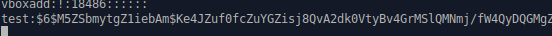

author: Jonathan Melly
summary: Sécurité d'un OS
id: oss-os-security
categories: system
tags: mem
environments: Web
status: Published
feedback link: https://git.section-inf.ch/jmy/labs/issues
analytics account: UA-170792591-1


# Comment hacker son propre mot de passe ?

## Aperçu 
Duration: 1


As-tu déjà entendu qu'un mot de passe devait avoir une certaine complexité pour des raisons de sécurité ? 
Et as-tu cru cette explication ?

Aujourd'hui, plutôt que de croire, tu vas voir de tes propres yeux si c'est vrai ou pas en tentant de **hacker** ton propre mot de passe !

### Compétence visée

- Mesurer la force d'un mot de passe

Survey
: Fondamentalement, un(e) hacker(euse) est ?
<ul>
  <li>un(e) expert(e) en informatique</li>
  <li>similaire à darth vador</li>
  <li>une personne qui a été lobotomisée</li>
</ul>

## Prérequis
Duration: 0:01:00


### Linux fonctionnel
Il faut avoir suivi l'atelier [Installer Linux](https://labs.section-inf.ch/codelabs/oss-os-manage-1/index.html) pour participer à ce laboratoire.

## Explications
Duration: 00:05:00


Comme la clé d'une porte de maison, un système d'exploitation requiert un login associé à un mot de passe pour que l'utilisateur puisse l'utiliser.
Ces informations doivent donc être stockées dans le système. De la même manière qu'on pourrait imaginer une sorte de pâte à modeler qu'on placerait dans la serrure d'une porte pour capter l'empreinte de la clé (comme le vol d'une empreinte digitale), on peut obtenir des informations sur les comptes utilisateurs d'un système qui sont stockés dans des fichiers de configuration.


Toutefois, les mot de passe ne sont pas stockés en clair dans les fichiers de configuration car cela serait trop facile à dérober. Ce qui est stocké, c'est une empreinte générée à partir du mot de passe. C'est un peu comme un code QR avec lequel on ne peut rien faire, par contre un smartphone peut le décoder.

Ce laboratoire se déroulera donc en **2 étapes**:

1. Récupérer l'empreinte du mot de passe
1. Essayer différentes combinaisons

## Prépration de l'environnement
Duration: 00:05:00

### Terminal
Pour commencer, il faut démarrer un terminal:


### Ajouter un compte de test
Pour simuler un mot de passe faible, ajoutons un compte avec le mot de passe *12345*:

``` bash
sudo adduser test
```


## Récupération du mot de passe
Duration: 00:10:00


### Copie des fichiers de configuration
Les informations de compte sont stockés dans */etc/passwd* et les empreintes de mot de passe dans */etc/shadow* et on va donc commencer par copier ces informations dans des fichiers:


``` bash
cat /etc/passwd > comptes.txt
sudo cat /etc/shadow > motDePasses.txt
```


#### Tentative de hacking à la main
Puisque le fichier */etc/shadow* contient les mot de passe, on peut simplement l'ouvrir avec *nano* et y trouver le mot de passe non ?:

``` bash
nano motDePasse.txt
```



Negative
: Pour rappel, c'est la combinaison *ctrl+x* pour quitter *nano*.

Comme décrit précédemment, ce n'est pas le mot de passe *12345* qui est inscrit dans le fichier mais une empreinte illisible... On ne peut donc rien faire avec ça et il nous faut alors un programme qui va, à partir de mot de passe aléatoires, générer des empreintes et les comparer.

Positive
: Cette manière de procéder (générer des empreintes et les comparer) est similaire pour le WiFi ou n'importe quel compte sur Internet...

### Installation du programme de hacking
Vu que tu sais comment installer un programme avec *apt*, la seule indication est que ce dernier s'apelle *john*.
Pour vérifier qu'il a bien été installé, la commande *john* devrait retourner ceci:


### Conversion des fichiers pour john
Dans le paquet *john* se trouve un programme additionnel appelé *unshadow*. Celui-ci permet d'adapter le format des empreintes de mot de passe à l'utilitaire:

``` bash
unshadow comptes.txt motDePasses.txt > convertis.txt
```

En regardant le fichier *convertis.txt* tu verras qu'il ressemble beaucoup aux originaux et c'est surtout une question de formattage...

## Hacking du mot de passe
Duration: 00:10:00


### Lancement de john
Maintenant qu'on a le fichier compatible avec le programme de hacking, on va pouvoir commencer **l'audit de sécurité** sur le compte de test :

``` bash
john -user:test convertis.txt
```

Positive
: Pour afficher le mot de passe en cours de tentative, tu peux appuyer sur n'importe quelle touche et sur *q* ou *ctrl-c* pour quitter prématurément.

Si tout va bien, le résultat devrait ressembler à cela:


### Changement de mot de passe
Maintenant que la procédure est connue, il suffit de changer le mot de passe du compte de test (par exemple 11111) pour vérifier si john le trouve rapidement:

``` bash
sudo passwd test
```

Negative
: Attention, la commande *sudo* demande d'abord ton mot de passe et ensuite le nouveau pour le compte de test

Ensuite il faut refaire l'export, la conversion et l'audit:

``` bash
sudo cat /etc/shadow > motDePasses.txt
unshadow comptes.txt motDePasses.txt > convertis.txt
john -user:test convertis.txt
```


Et ainsi de suite avec n'importe quel mot de passe que tu voudrais tester (celui que tu as utilisé pour tes comptes personnels par exemple)...

## Alternative
Duration: 00:03:00


Comme alternative, si tu as confiance, tu peux utiliser un site comme par exemple [https://www.uic.edu/apps/strong-password/](https://www.uic.edu/apps/strong-password/).

## Conclusion
Duration: 00:03:00


Connaître les **forces** et les **faiblesses** d'un système informatique est un élément essentiel pour pouvoir évaluer et protéger ce dernier. Ainsi les outils de hacking sont utilisés à des fins d'audit et de manière officielle lorsque cela est nécessaire.

Sans être encore spécialiste, tu es désormais sensibilisé(e) aux dangers d'utiliser des mot de passe *faibles* et autonome pour **mesurer** la force d'un mot de passe.

Bien sûr, le programme *john* comporte plusieurs modes et options et s'il n'a pas trouvé ton mot de passe en quelques minutes, cela ne garantit pas qu'il n'est pas facilement crackable (sensible à une attaque par dictionnaire peut-être).

### Sources
[Crack shadow hashes](https://null-byte.wonderhowto.com/how-to/crack-shadow-hashes-after-getting-root-linux-system-0186386/)

[Ubuntu short password](https://askubuntu.com/questions/180402/how-to-set-a-short-password-on-ubuntu)


