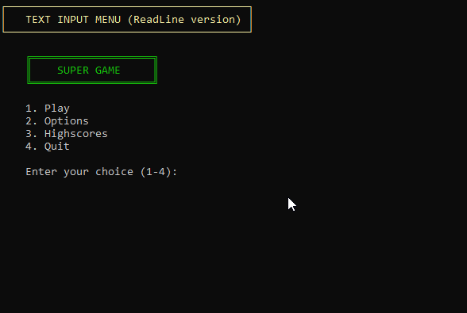
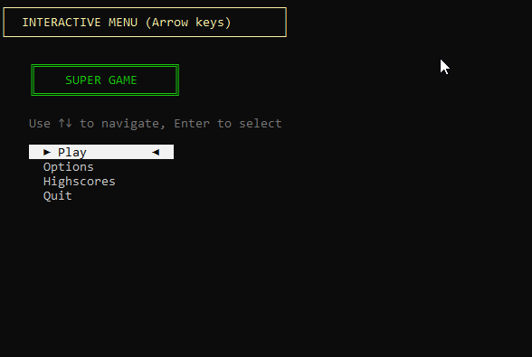

author: Jonathan Melly
summary: menu console pré-orienté objet
id: preoo-01-menu
categories: csharp,dev
tags: ict
environments: Web
status: Published
feedback link: https://git.section-inf.ch/jmy/labs/issues
analytics account: UA-170792591-1

# Menu Console Pré-OO

## Vue d'ensemble
Duration: 0:02:00

Ce tutorial présente une approche progressive pour créer un menu console en C#, en partant d'une version très simple jusqu'à une version interactive avec navigation au clavier.

### Contexte

Nous allons créer le menu principal d'un jeu vidéo fictif avec les options suivantes :
- **Play** : Lancer une partie
- **Options** : Configurer le jeu
- **Highscores** : Voir les meilleurs scores
- **Quit** : Quitter le jeu

### Objectifs

À travers 4 étapes progressives, vous apprendrez à :
1. Afficher un menu basique avec `Console.Write` et `Console.ReadLine`
2. Utiliser un tableau pour stocker et afficher les options
3. Structurer le code avec des fonctions préfixées `Menu_`
4. Créer une navigation interactive avec les touches fléchées

Positive
: Cette approche "pré-orientée objet" prépare le terrain pour comprendre les classes et objets plus tard.

Survey
: Avez-vous déjà créé un menu console ?
<ul>
<li>Oui, plusieurs fois</li>
<li>Une fois ou deux</li>
<li>Jamais, c'est ma première fois</li>
</ul>

## Étape 1 : Menu basique
Duration: 0:10:00

### Objectif

Créer un menu simple en utilisant uniquement `Console.WriteLine` et `Console.ReadLine`.



### Créer le projet

Créez un nouveau projet **Console App** dans Visual Studio nommé **GameMenu**.

### Code initial

Adapter le contenu de `Program.cs` avec la proposition suivante :

```csharp
Console.WriteLine("=== SUPER GAME ===");
Console.WriteLine("");
Console.WriteLine("1. Play");
Console.WriteLine("2. Options");
Console.WriteLine("3. Highscores");
Console.WriteLine("4. Quit");
Console.WriteLine("");
Console.Write("Enter your choice (1-4): ");

string? input = Console.ReadLine();

if (input == "1")
{
    Console.WriteLine("Starting game...");
}
else if (input == "2")
{
    Console.WriteLine("Opening options...");
}
else if (input == "3")
{
    Console.WriteLine("Showing highscores...");
}
else if (input == "4")
{
    Console.WriteLine("Goodbye!");
}
else
{
    Console.WriteLine("Invalid choice!");
}

Console.ReadKey();
```

### Test

Lancer l'application et tester les différentes options.

### Analyse

Cette version fonctionne mais présente plusieurs problèmes :
- Le code est répétitif (chaque `WriteLine` pour afficher une option)
- Ajouter une option nécessite de modifier plusieurs lignes
- Le code n'est pas réutilisable

Negative
: Cette approche ne passe pas très bien à l'échelle : imaginez un menu avec 20 options !

### Switch
Adapter le code en utilisant l'instruction [switch](https://learn.microsoft.com/en-us/dotnet/csharp/language-reference/statements/selection-statements#the-switch-statement)

## Étape 2 : Utiliser un tableau
Duration: 0:10:00

### Objectif

Stocker les options dans un tableau pour centraliser les données et simplifier l'affichage.

### Code amélioré

Adapter le contenu de `Program.cs` selon la version suivante :

```csharp
// Menu options stored in an array
string[] menuOptions = new string []{ "Play", "Options", "Highscores", "Quit" };

// Display title
Console.WriteLine("=== SUPER GAME ===");
Console.WriteLine("");

// Display menu options using a loop
for (int i = 0; i < menuOptions.Length; i++)
{
    Console.WriteLine($"{i + 1}. {menuOptions[i]}");
}

Console.WriteLine("");
Console.Write($"Enter your choice (1-{menuOptions.Length}): ");

// Get user input
string? input = Console.ReadLine();

// Validate and process choice
if (int.TryParse(input, out int choice) && choice >= 1 && choice <= menuOptions.Length)
{
    string selectedOption = menuOptions[choice - 1];
    Console.WriteLine($"You selected: {selectedOption}");

    // Handle the selection
    switch (choice)
    {
        case 1:
            Console.WriteLine("Starting game...");
            break;
        case 2:
            Console.WriteLine("Opening options...");
            break;
        case 3:
            Console.WriteLine("Showing highscores...");
            break;
        case 4:
            Console.WriteLine("Goodbye!");
            break;
    }
}
else
{
    Console.WriteLine("Invalid choice!");
}

Console.ReadKey();
```

### Améliorations

| Avant | Après |
| :--- | :--- |
| Options écrites en dur | Options dans un tableau |
| Boucle manuelle implicite | Boucle `for` explicite |
| Validation manuelle | `int.TryParse` pour valider |

### Ajouter une option

Pour ajouter une nouvelle option, il suffit maintenant de modifier le tableau :

```csharp
string[] menuOptions = { "Play", "Options", "Highscores", "Credits", "Quit" };
```

Positive
: Le tableau centralise les données : une seule modification pour ajouter une option à l'affichage !

## Étape 3 : Structurer avec des fonctions
Duration: 0:15:00

### Objectif

Organiser le code en fonctions préfixées par `Menu_` pour une meilleure lisibilité et réutilisabilité.

### Pourquoi des fonctions ?

Les fonctions permettent de :
- **Séparer les responsabilités** : chaque fonction fait une seule chose
- **Réutiliser le code** : appeler une fonction plusieurs fois
- **Faciliter les tests** : tester chaque fonction indépendamment
- **Préparer l'OO** : les fonctions deviendront des méthodes de classe

### Code structuré

Adapter le contenu de `Program.cs` selon la proposition suivante :

```csharp
// Global array to store menu options
string[] options = Array.Empty<string>();

// Main program
Menu_Init();
Menu_Show();
int choice = Menu_GetUserChoice();
Menu_HandleChoice(choice);

Console.ReadKey();

// ============ MENU FUNCTIONS ============

void Menu_Init()
{
    options = new string[] { "Play", "Options", "Highscores", "Quit" };
}

void Menu_AddOption(string option)
{
    // Create a new array with one more slot
    string[] newOptions = new string[options.Length + 1];

    // Copy existing options
    for (int i = 0; i < options.Length; i++)
    {
        newOptions[i] = options[i];
    }

    // Add new option at the end
    newOptions[options.Length] = option;

    // Replace old array
    options = newOptions;
}

void Menu_Show()
{
    Console.Clear();
    Console.WriteLine("=== SUPER GAME ===");
    Console.WriteLine("");

    for (int i = 0; i < options.Length; i++)
    {
        Console.WriteLine($"  {i + 1}. {options[i]}");
    }

    Console.WriteLine("");
}

int Menu_GetUserChoice()
{
    Console.Write($"Enter your choice (1-{options.Length}): ");
    string? input = Console.ReadLine();

    if (int.TryParse(input, out int choice) && choice >= 1 && choice <= options.Length)
    {
        return choice;
    }

    return -1; // Invalid choice
}

void Menu_HandleChoice(int choice)
{
    if (choice == -1)
    {
        Console.WriteLine("Invalid choice!");
        return;
    }

    string selectedOption = options[choice - 1];
    Console.WriteLine($"You selected: {selectedOption}");

    switch (selectedOption)
    {
        case "Play":
            Console.WriteLine("Starting game...");
            break;
        case "Options":
            Console.WriteLine("Opening options...");
            break;
        case "Highscores":
            Console.WriteLine("Showing highscores...");
            break;
        case "Quit":
            Console.WriteLine("Goodbye!");
            break;
        default:
            Console.WriteLine($"Action for '{selectedOption}' not implemented.");
            break;
    }
}
```

### Les fonctions expliquées

| Fonction | Rôle |
| :--- | :--- |
| `Menu_Init()` | Initialise le tableau avec les options par défaut |
| `Menu_AddOption(string)` | Ajoute une option au menu |
| `Menu_Show()` | Affiche le menu à l'écran |
| `Menu_GetUserChoice()` | Lit et valide le choix de l'utilisateur |
| `Menu_HandleChoice(int)` | Exécute l'action correspondant au choix |

### Amélioration du redimensionnement
En se basant sur la théorie du cours, simplifier le code lorsq'on ajoute une option au tableau... (Array.Resize et/ou Array.Copy)

### Test avec ajout dynamique

Modifier le programme principal pour tester l'ajout d'options :

```csharp
Menu_Init();
Menu_AddOption("Credits");  // Add a new option
Menu_AddOption("Tutorial"); // Add another option
Menu_Show();
int choice = Menu_GetUserChoice();
Menu_HandleChoice(choice);

Console.ReadKey();
```

Positive
: Le préfixe `Menu_` permet de regrouper visuellement les fonctions liées au menu. En POO, elles deviendront les méthodes d'une classe `Menu`.

## Étape 4 : Navigation au clavier
Duration: 0:20:00

### Objectif

Remplacer la saisie de numéro par une navigation avec les touches fléchées et une mise en surbrillance de l'option sélectionnée.



### Concept

- L'utilisateur utilise **↑** et **↓** pour naviguer
- L'option sélectionnée est **mise en surbrillance** (couleur inversée)
- La touche **Enter** valide le choix
- Le menu se rafraîchit à chaque déplacement

### Code final

Adapter `Program.cs` comme suit :

```csharp
// Global variables
string[] options = Array.Empty<string>();
int selectedIndex = 0;

// Main program
Menu_Init();
int choice = Menu_RunInteractive();
Menu_HandleChoice(choice);

Console.ReadKey();

// ============ MENU FUNCTIONS ============

void Menu_Init()
{
    options = new string[] { "Play", "Options", "Highscores", "Quit" };
    selectedIndex = 0;
}

void Menu_AddOption(string option)
{
    string[] newOptions = new string[options.Length + 1];

    for (int i = 0; i < options.Length; i++)
    {
        newOptions[i] = options[i];
    }

    newOptions[options.Length] = option;
    options = newOptions;
}

void Menu_ShowInteractive()
{
    Console.Clear();
    Console.WriteLine("=== SUPER GAME ===");
    Console.WriteLine("");
    Console.WriteLine("Use ↑↓ arrows to navigate, Enter to select");
    Console.WriteLine("");

    for (int i = 0; i < options.Length; i++)
    {
        if (i == selectedIndex)
        {
            // Highlight selected option
            Console.BackgroundColor = ConsoleColor.White;
            Console.ForegroundColor = ConsoleColor.Black;
            Console.WriteLine($"  > {options[i]} <  ");
            Console.ResetColor();
        }
        else
        {
            Console.WriteLine($"    {options[i]}    ");
        }
    }

    Console.WriteLine("");
}

int Menu_RunInteractive()
{
    ConsoleKey key;

    do
    {
        Menu_ShowInteractive();

        // Read key without displaying it
        ConsoleKeyInfo keyInfo = Console.ReadKey(true);
        key = keyInfo.Key;

        // Handle navigation
        if (key == ConsoleKey.UpArrow)
        {
            selectedIndex--;
            if (selectedIndex < 0)
            {
                selectedIndex = options.Length - 1; // Wrap to bottom
            }
        }
        else if (key == ConsoleKey.DownArrow)
        {
            selectedIndex++;
            if (selectedIndex >= options.Length)
            {
                selectedIndex = 0; // Wrap to top
            }
        }

    } while (key != ConsoleKey.Enter);

    return selectedIndex + 1; // Return 1-based choice
}

int Menu_GetUserChoice()
{
    Console.Write($"Enter your choice (1-{options.Length}): ");
    string? input = Console.ReadLine();

    if (int.TryParse(input, out int choice) && choice >= 1 && choice <= options.Length)
    {
        return choice;
    }

    return -1;
}

void Menu_HandleChoice(int choice)
{
    if (choice == -1 || choice < 1 || choice > options.Length)
    {
        Console.WriteLine("Invalid choice!");
        return;
    }

    string selectedOption = options[choice - 1];

    Console.Clear();
    Console.WriteLine($">>> {selectedOption.ToUpper()} <<<");
    Console.WriteLine("");

    switch (selectedOption)
    {
        case "Play":
            Console.WriteLine("Starting game...");
            Console.WriteLine("Loading level 1...");
            break;
        case "Options":
            Console.WriteLine("=== OPTIONS ===");
            Console.WriteLine("Sound: ON");
            Console.WriteLine("Music: ON");
            Console.WriteLine("Difficulty: Normal");
            break;
        case "Highscores":
            Console.WriteLine("=== HIGHSCORES ===");
            Console.WriteLine("1. AAA - 10000");
            Console.WriteLine("2. BBB - 8500");
            Console.WriteLine("3. CCC - 7200");
            break;
        case "Quit":
            Console.WriteLine("Thanks for playing!");
            Console.WriteLine("Goodbye!");
            break;
        default:
            Console.WriteLine($"Action for '{selectedOption}' not implemented.");
            break;
    }
}
```

### Éléments clés

#### Console.ReadKey(true)

Le paramètre `true` empêche l'affichage du caractère saisi :

```csharp
ConsoleKeyInfo keyInfo = Console.ReadKey(true);
```

#### Changement de couleurs

```csharp
Console.BackgroundColor = ConsoleColor.White;
Console.ForegroundColor = ConsoleColor.Black;
Console.WriteLine("Texte en surbrillance");
Console.ResetColor(); // Important : remettre les couleurs par défaut
```

#### Navigation circulaire

```csharp
// En haut de la liste, aller en bas
if (selectedIndex < 0)
{
    selectedIndex = options.Length - 1;
}

// En bas de la liste, aller en haut
if (selectedIndex >= options.Length)
{
    selectedIndex = 0;
}
```

Positive
: Cette version offre une expérience utilisateur bien meilleure !

## Bonus : Améliorations possibles
Duration: 0:05:00

### Idées pour aller plus loin

Voici quelques améliorations à implémenter :

#### 1. Ajouter des sons

```csharp
// Play a beep when navigating
Console.Beep(800, 50); // frequency, duration in ms
```

#### 2. Personnaliser les couleurs

```csharp
void Menu_SetColors(ConsoleColor background, ConsoleColor foreground)
{
    Console.BackgroundColor = background;
    Console.ForegroundColor = foreground;
}
```

#### 3. Ajouter un titre ASCII art

```csharp
void Menu_ShowTitle()
{
    Console.WriteLine(@"
   _____ _    _ _____  ______ _____
  / ____| |  | |  __ \|  ____|  __ \
 | (___ | |  | | |__) | |__  | |__) |
  \___ \| |  | |  ___/|  __| |  _  /
  ____) | |__| | |    | |____| | \ \
 |_____/ \____/|_|    |______|_|  \_\

   _____          __  __ ______
  / ____|   /\   |  \/  |  ____|
 | |  __   /  \  | \  / | |__
 | | |_ | / /\ \ | |\/| |  __|
 | |__| |/ ____ \| |  | | |____
  \_____/_/    \_\_|  |_|______|
    ");
}
```

#### 4. Boucle de menu complète

```csharp
bool running = true;

while (running)
{
    Menu_Init();
    int choice = Menu_RunInteractive();

    if (options[choice - 1] == "Quit")
    {
        running = false;
    }
    else
    {
        Menu_HandleChoice(choice);
        Console.WriteLine("\nPress any key to return to menu...");
        Console.ReadKey(true);
    }
}
```

## Synthèse
Duration: 0:02:00

### Récapitulatif des étapes

| Étape | Concept | Avantage |
| :---: | :--- | :--- |
| 1 | Console.Write/Read | Simple, direct |
| 2 | Tableau | Centralisation des données |
| 3 | Fonctions Menu_ | Organisation, réutilisabilité |
| 4 | Navigation clavier | Expérience utilisateur |

### Spoiler alert: vers la POO

Ce code est prêt pour être transformé en classe...

```csharp
// Les fonctions Menu_* deviendront des méthodes
// Les variables globales deviendront des attributs
public class Menu
{
    private string[] options;
    private int selectedIndex;

    public void Init() { ... }
    public void AddOption(string option) { ... }
    public void Show() { ... }
    public int GetUserChoice() { ... }
    // etc.
}
```

Positive
: Félicitations ! Vous avez créé un menu console professionnel en partant de zéro. Ces concepts vous serviront pour n'importe quelle application console.

Survey
: Quelle étape avez-vous trouvée la plus intéressante ?
<ul>
<li>Étape 1 : La base avec Console.Write</li>
<li>Étape 2 : L'utilisation du tableau</li>
<li>Étape 3 : La structuration en fonctions</li>
<li>Étape 4 : La navigation interactive</li>
</ul>

