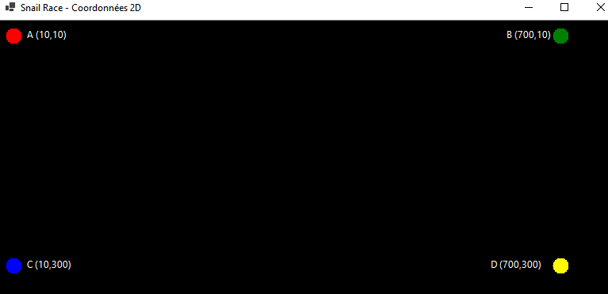

author: Jonathan Melly
summary: système de coordonnées 2D en Windows Forms C#
id: preoo-02-coordinates-winforms
categories: csharp,dev,winforms
tags: ict
environments: Web
status: Published
feedback link: https://git.section-inf.ch/jmy/labs/issues
analytics account: UA-170792591-1

# Coordonnées 2D Windows Forms - Course d'Escargots

## Vue d'ensemble
Duration: 0:02:00

Ce tutorial présente le système de coordonnées 2D en C# Windows Forms (.NET 8+) à travers la création d'une course d'escargots animée.

### Contexte

Nous allons créer un jeu graphique où :
- Plusieurs escargots font la course automatiquement
- Le joueur peut encourager son escargot avec la barre d'espace
- L'affichage utilise le double-buffering pour une animation fluide

### Objectifs

À travers 4 étapes progressives, vous apprendrez à :
1. Comprendre le système de coordonnées en Windows Forms
2. Dessiner des formes avec `Graphics` (Rectangle, String, Point)
3. Utiliser `BufferedGraphics` pour une animation fluide
4. Créer une course animée avec interaction clavier

### Prérequis

- Visual Studio 2022 avec support .NET 8
- Connaissances de base en C#

Negative
: **Rappel important !** Comme en console, le système de coordonnées a son origine en **haut à gauche** et l'axe Y est **inversé** (Y augmente vers le bas).

## Étape 1 : Projet et coordonnées
Duration: 0:15:00

### Créer le projet

1. Ouvrir Visual Studio
2. **Create a new project**
3. Chercher **Windows Forms App** (pas "Windows Forms App (.NET Framework)" !)
4. Sélectionner **Windows Forms App** avec l'icône C#
5. Nommer le projet **SnailRace**
6. Choisir **.NET 8.0+** comme framework

### Le système de coordonnées

En Windows Forms, comme en console :

```
(0,0)─────────────────→ X
  │
  │    ┌─────────┐
  │    │  Form   │
  │    │         │
  │    └─────────┘
  ↓
  Y
```

| Propriété | Description |
|:----------|:------------|
| **X** | Distance depuis le bord **gauche** |
| **Y** | Distance depuis le bord **haut** |
| **(0,0)** | Coin **supérieur gauche** |

### Premier dessin

Ouvrir `Form1.cs` et remplacer tout le contenu par :

```csharp
namespace SnailRace;

public partial class Form1 : Form
{
    public Form1()
    {
        InitializeComponent();

        // Configuration de la fenêtre
        this.Text = "Snail Race - Coordonnées 2D";
        this.Size = new Size(800, 400);
        this.BackColor = Color.Black;

        // Événement pour dessiner
        this.Paint += Form1_Paint;
    }

    private void Form1_Paint(object? sender, PaintEventArgs e)
    {
        Graphics g = e.Graphics;

        // Point A en haut à gauche (près de l'origine)
        g.FillEllipse(Brushes.Red, 10, 10, 20, 20);
        g.DrawString("A (10,10)", this.Font, Brushes.White, 35, 10);

        // Point B en haut à droite
        g.FillEllipse(Brushes.Green, 700, 10, 20, 20);
        g.DrawString("B (700,10)", this.Font, Brushes.White, 640, 10);

        // Point C en bas à gauche
        g.FillEllipse(Brushes.Blue, 10, 300, 20, 20);
        g.DrawString("C (10,300)", this.Font, Brushes.White, 35, 300);

        // Point D en bas à droite
        g.FillEllipse(Brushes.Yellow, 700, 300, 20, 20);
        g.DrawString("D (700,300)", this.Font, Brushes.White, 620, 300);

        // Lignes pour montrer les axes
        g.DrawLine(Pens.Gray, 0, 0, 780, 0);    // Axe X (haut)
        g.DrawLine(Pens.Gray, 0, 0, 0, 380);    // Axe Y (gauche)
    }
}
```

### Résultat attendu



### Comprendre les paramètres

```csharp
g.FillEllipse(Brushes.Red, 10, 10, 20, 20);
//                         X   Y   W   H
//                         │   │   │   └── Hauteur
//                         │   │   └────── Largeur
//                         │   └────────── Y (depuis le haut)
//                         └────────────── X (depuis la gauche)
```

Positive
: En Windows Forms, les méthodes de dessin utilisent toujours l'ordre **(X, Y, Width, Height)** pour les rectangles et ellipses.

### Exercice

Modifier le code pour dessiner un rectangle au centre de la fenêtre (environ 400, 180).

## Étape 2 : Dessiner l'escargot
Duration: 0:15:00

### Objectif

Créer une fonction pour dessiner un escargot à une position donnée.

### Structure de l'escargot

Notre escargot sera composé de :
- Un **rectangle** pour le corps
- Un **cercle** pour la coquille
- Du **texte** pour le numéro

```
    ┌───┐
    │ 1 ├──●
    └───┘
    Corps  Coquille
```

### Code avec fonction de dessin

```csharp
namespace SnailRace;

public partial class Form1 : Form
{
    // Taille de l'escargot
    const int SNAIL_WIDTH = 40;
    const int SNAIL_HEIGHT = 25;

    public Form1()
    {
        InitializeComponent();

        this.Text = "Snail Race";
        this.Size = new Size(800, 400);
        this.BackColor = Color.FromArgb(30, 30, 30);

        this.Paint += Form1_Paint;
    }

    private void Form1_Paint(object? sender, PaintEventArgs e)
    {
        Graphics g = e.Graphics;

        // Dessiner plusieurs escargots à différentes positions
        DrawSnail(g, 50, 50, 1, Color.Yellow);
        DrawSnail(g, 50, 100, 2, Color.Cyan);
        DrawSnail(g, 50, 150, 3, Color.Magenta);
        DrawSnail(g, 50, 200, 4, Color.Lime);
    }

    private void DrawSnail(Graphics g, int x, int y, int number, Color color)
    {
        // Corps (rectangle)
        using (Brush bodyBrush = new SolidBrush(color))
        {
            g.FillRectangle(bodyBrush, x, y, SNAIL_WIDTH, SNAIL_HEIGHT);
        }

        // Contour du corps
        using (Pen outlinePen = new Pen(Color.White, 1))
        {
            g.DrawRectangle(outlinePen, x, y, SNAIL_WIDTH, SNAIL_HEIGHT);
        }

        // Coquille (cercle à droite du corps)
        int shellX = x + SNAIL_WIDTH - 5;
        int shellY = y + 2;
        int shellSize = SNAIL_HEIGHT - 4;

        using (Brush shellBrush = new SolidBrush(Color.FromArgb(150, color)))
        {
            g.FillEllipse(shellBrush, shellX, shellY, shellSize, shellSize);
        }
        g.DrawEllipse(Pens.White, shellX, shellY, shellSize, shellSize);

        // Numéro de l'escargot
        using (Font font = new Font("Arial", 10, FontStyle.Bold))
        {
            string text = number.ToString();
            SizeF textSize = g.MeasureString(text, font);
            float textX = x + (SNAIL_WIDTH - textSize.Width) / 2;
            float textY = y + (SNAIL_HEIGHT - textSize.Height) / 2;
            g.DrawString(text, font, Brushes.Black, textX, textY);
        }
    }
}
```

### Points importants

#### 1. Le mot-clé `using`

```csharp
using (Brush bodyBrush = new SolidBrush(color))
{
    g.FillRectangle(bodyBrush, x, y, SNAIL_WIDTH, SNAIL_HEIGHT);
}
```

Les objets graphiques (Brush, Pen, Font) consomment des ressources. Le `using` garantit leur libération automatique.

#### 2. Centrer du texte

```csharp
SizeF textSize = g.MeasureString(text, font);
float textX = x + (SNAIL_WIDTH - textSize.Width) / 2;
float textY = y + (SNAIL_HEIGHT - textSize.Height) / 2;
```

`MeasureString` permet de connaître la taille du texte avant de le dessiner.

### Exercice

Ajouter deux "antennes" à l'escargot avec `g.DrawLine()`.

## Étape 3 : Animation avec BufferedGraphics
Duration: 0:20:00

### Objectif

Animer les escargots avec un affichage fluide grâce au double-buffering.

### Problème du scintillement

Sans double-buffering, l'animation scintille car :
1. L'écran est effacé (devient noir brièvement)
2. Les éléments sont redessinés un par un
3. L'œil perçoit ces changements rapides

### Solution : BufferedGraphics

Le double-buffering dessine d'abord dans une **image en mémoire**, puis affiche l'image complète d'un coup.

```
┌──────────┐     ┌────────────┐
│  Buffer  │ ──► │  Écran     │
│ (dessin) │     │(affichage) │
└──────────┘     └────────────┘
```

### Code avec animation

```csharp
namespace SnailRace;

public partial class Form1 : Form
{
    // Configuration
    const int SNAIL_WIDTH = 40;
    const int SNAIL_HEIGHT = 25;
    const int NUM_SNAILS = 4;
    const int TRACK_START = 60;
    const int TRACK_END = 700;

    // Données des escargots (tableaux parallèles)
    int[] snailX = new int[NUM_SNAILS];
    int[] snailY = new int[NUM_SNAILS];
    int[] snailEnergy = new int[NUM_SNAILS];
    Color[] snailColors = { Color.Yellow, Color.Cyan, Color.Magenta, Color.Lime };

    // Double buffering
    BufferedGraphicsContext context;
    BufferedGraphics buffer;

    // Animation
    System.Windows.Forms.Timer gameTimer;
    Random random = new Random();
    bool raceStarted = false;

    public Form1()
    {
        InitializeComponent();

        this.Text = "Snail Race - Press SPACE to start";
        this.Size = new Size(800, 300);
        this.BackColor = Color.FromArgb(30, 30, 30);
        this.DoubleBuffered = true;  // Active aussi le double-buffering du Form

        // Initialiser les escargots
        for (int i = 0; i < NUM_SNAILS; i++)
        {
            snailX[i] = TRACK_START;
            snailY[i] = 50 + i * 50;  // Espacement vertical
            snailEnergy[i] = 100;
        }

        // Configurer le double-buffering manuel
        context = BufferedGraphicsManager.Current;
        context.MaximumBuffer = new Size(this.Width + 1, this.Height + 1);

        // Timer pour l'animation (60 FPS environ)
        gameTimer = new System.Windows.Forms.Timer();
        gameTimer.Interval = 16;  // ~60 FPS
        gameTimer.Tick += GameTimer_Tick;

        // Événements
        this.Paint += Form1_Paint;
        this.KeyDown += Form1_KeyDown;
        this.Resize += Form1_Resize;
    }

    private void Form1_Resize(object? sender, EventArgs e)
    {
        // Recréer le buffer si la fenêtre change de taille
        context.MaximumBuffer = new Size(this.Width + 1, this.Height + 1);
    }

    private void Form1_KeyDown(object? sender, KeyEventArgs e)
    {
        if (e.KeyCode == Keys.Space)
        {
            if (!raceStarted)
            {
                raceStarted = true;
                gameTimer.Start();
                this.Text = "Snail Race - GO!";
            }
        }

        if (e.KeyCode == Keys.R)
        {
            // Reset
            ResetRace();
        }
    }

    private void ResetRace()
    {
        gameTimer.Stop();
        raceStarted = false;

        for (int i = 0; i < NUM_SNAILS; i++)
        {
            snailX[i] = TRACK_START;
            snailEnergy[i] = 100;
        }

        this.Text = "Snail Race - Press SPACE to start";
        this.Invalidate();
    }

    private void GameTimer_Tick(object? sender, EventArgs e)
    {
        bool raceFinished = false;
        int winner = -1;

        // Déplacer chaque escargot
        for (int i = 0; i < NUM_SNAILS; i++)
        {
            // Probabilité d'avancer basée sur l'énergie
            if (random.Next(100) < snailEnergy[i])
            {
                snailX[i] += random.Next(1, 4);  // Avance de 1-3 pixels

                // Fatigue
                snailEnergy[i] -= random.Next(1, 3);
                if (snailEnergy[i] < 10) snailEnergy[i] = 10;
            }

            // Vérifier victoire
            if (snailX[i] >= TRACK_END)
            {
                raceFinished = true;
                winner = i;
                break;
            }
        }

        // Redessiner
        this.Invalidate();

        if (raceFinished)
        {
            gameTimer.Stop();
            this.Text = $"Snail {winner + 1} WINS! Press R to restart";
        }
    }

    private void Form1_Paint(object? sender, PaintEventArgs e)
    {
        // Créer le buffer
        buffer = context.Allocate(e.Graphics, this.ClientRectangle);
        Graphics g = buffer.Graphics;

        // Effacer avec la couleur de fond
        g.Clear(this.BackColor);

        // Activer l'anti-aliasing pour un rendu plus lisse
        g.SmoothingMode = System.Drawing.Drawing2D.SmoothingMode.AntiAlias;

        // Dessiner les pistes
        DrawTracks(g);

        // Dessiner les escargots
        for (int i = 0; i < NUM_SNAILS; i++)
        {
            DrawSnail(g, snailX[i], snailY[i], i + 1, snailColors[i]);
            DrawEnergyBar(g, i);
        }

        // Dessiner la ligne d'arrivée
        DrawFinishLine(g);

        // Afficher le buffer sur l'écran
        buffer.Render(e.Graphics);
        buffer.Dispose();
    }

    private void DrawTracks(Graphics g)
    {
        using (Pen trackPen = new Pen(Color.FromArgb(60, 60, 60), 30))
        {
            for (int i = 0; i < NUM_SNAILS; i++)
            {
                int y = snailY[i] + SNAIL_HEIGHT / 2;
                g.DrawLine(trackPen, TRACK_START, y, TRACK_END, y);
            }
        }

        // Ligne de départ
        using (Pen startPen = new Pen(Color.White, 3))
        {
            g.DrawLine(startPen, TRACK_START, 40, TRACK_START, 40 + NUM_SNAILS * 50);
        }
    }

    private void DrawFinishLine(Graphics g)
    {
        // Damier d'arrivée
        int squareSize = 10;
        for (int row = 0; row < (NUM_SNAILS * 50) / squareSize; row++)
        {
            for (int col = 0; col < 2; col++)
            {
                bool isWhite = (row + col) % 2 == 0;
                Brush brush = isWhite ? Brushes.White : Brushes.Black;
                g.FillRectangle(brush,
                    TRACK_END + col * squareSize,
                    40 + row * squareSize,
                    squareSize, squareSize);
            }
        }
    }

    private void DrawEnergyBar(Graphics g, int snailIndex)
    {
        int barX = 10;
        int barY = snailY[snailIndex] + 5;
        int barWidth = 40;
        int barHeight = 15;

        // Fond de la barre
        g.FillRectangle(Brushes.DarkGray, barX, barY, barWidth, barHeight);

        // Niveau d'énergie
        int energyWidth = (int)(barWidth * snailEnergy[snailIndex] / 100.0);
        Color energyColor = snailEnergy[snailIndex] > 50 ? Color.LimeGreen :
                           snailEnergy[snailIndex] > 25 ? Color.Orange : Color.Red;

        using (Brush energyBrush = new SolidBrush(energyColor))
        {
            g.FillRectangle(energyBrush, barX, barY, energyWidth, barHeight);
        }

        // Contour
        g.DrawRectangle(Pens.White, barX, barY, barWidth, barHeight);
    }

    private void DrawSnail(Graphics g, int x, int y, int number, Color color)
    {
        // Corps
        using (Brush bodyBrush = new SolidBrush(color))
        {
            g.FillRectangle(bodyBrush, x, y, SNAIL_WIDTH, SNAIL_HEIGHT);
        }
        g.DrawRectangle(Pens.White, x, y, SNAIL_WIDTH, SNAIL_HEIGHT);

        // Coquille
        int shellX = x + SNAIL_WIDTH - 5;
        int shellY = y + 2;
        int shellSize = SNAIL_HEIGHT - 4;

        using (Brush shellBrush = new SolidBrush(Color.FromArgb(180, color)))
        {
            g.FillEllipse(shellBrush, shellX, shellY, shellSize, shellSize);
        }
        g.DrawEllipse(Pens.White, shellX, shellY, shellSize, shellSize);

        // Numéro
        using (Font font = new Font("Arial", 9, FontStyle.Bold))
        {
            string text = number.ToString();
            SizeF textSize = g.MeasureString(text, font);
            float textX = x + (SNAIL_WIDTH - textSize.Width) / 2;
            float textY = y + (SNAIL_HEIGHT - textSize.Height) / 2;
            g.DrawString(text, font, Brushes.Black, textX, textY);
        }
    }
}
```

### Points clés du BufferedGraphics

```csharp
// 1. Créer le contexte (une fois)
context = BufferedGraphicsManager.Current;

// 2. Dans Paint, allouer un buffer
buffer = context.Allocate(e.Graphics, this.ClientRectangle);
Graphics g = buffer.Graphics;

// 3. Dessiner dans le buffer
g.Clear(this.BackColor);
// ... tous les dessins ...

// 4. Afficher le buffer d'un coup
buffer.Render(e.Graphics);
buffer.Dispose();
```

### Le Timer pour l'animation

```csharp
gameTimer = new System.Windows.Forms.Timer();
gameTimer.Interval = 16;  // Millisecondes entre chaque tick
gameTimer.Tick += GameTimer_Tick;  // Fonction appelée à chaque tick
gameTimer.Start();  // Démarre l'animation
```

| Interval | FPS approximatif |
|:--------:|:----------------:|
| 16 ms    | ~60 FPS          |
| 33 ms    | ~30 FPS          |
| 100 ms   | 10 FPS           |

Positive
: `this.Invalidate()` demande au système de redessiner le formulaire, ce qui déclenche l'événement `Paint`.

## Étape 4 : Interaction joueur
Duration: 0:15:00

### Objectif

Permettre au joueur d'encourager son escargot pendant la course.

### Mécaniques ajoutées

|         Touche         | Action                       |
| :--------------------: | :--------------------------- |
|  SPACE (avant course)  | Démarrer la course           |
| SPACE (pendant course) | Booster l'escargot du joueur |
|           R            | Recommencer                  |

### Code final avec interaction

Modifier les parties suivantes du code :

```csharp
// Ajouter cette variable en haut de la classe
int playerSnailIndex = 0;  // Le joueur contrôle l'escargot 0
int boostCooldown = 0;     // Temps avant de pouvoir rebooster

// Modifier Form1_KeyDown
private void Form1_KeyDown(object? sender, KeyEventArgs e)
{
    if (e.KeyCode == Keys.Space)
    {
        if (!raceStarted)
        {
            // Démarrer la course
            raceStarted = true;
            gameTimer.Start();
            this.Text = "Snail Race - SPACE to boost!";
        }
        else if (boostCooldown <= 0)
        {
            // Booster l'escargot du joueur
            snailEnergy[playerSnailIndex] += 15;
            if (snailEnergy[playerSnailIndex] > 100)
                snailEnergy[playerSnailIndex] = 100;

            boostCooldown = 10;  // Cooldown de 10 frames
        }
    }

    if (e.KeyCode == Keys.R)
    {
        ResetRace();
    }
}

// Modifier GameTimer_Tick pour gérer le cooldown
private void GameTimer_Tick(object? sender, EventArgs e)
{
    // Réduire le cooldown
    if (boostCooldown > 0) boostCooldown--;

    bool raceFinished = false;
    int winner = -1;

    for (int i = 0; i < NUM_SNAILS; i++)
    {
        if (random.Next(100) < snailEnergy[i])
        {
            snailX[i] += random.Next(1, 4);
            snailEnergy[i] -= random.Next(1, 3);
            if (snailEnergy[i] < 10) snailEnergy[i] = 10;
        }

        if (snailX[i] >= TRACK_END)
        {
            raceFinished = true;
            winner = i;
            break;
        }
    }

    this.Invalidate();

    if (raceFinished)
    {
        gameTimer.Stop();
        string result = (winner == playerSnailIndex) ? "YOU WIN!" : $"Snail {winner + 1} wins...";
        this.Text = $"{result} Press R to restart";
    }
}

// Modifier ResetRace
private void ResetRace()
{
    gameTimer.Stop();
    raceStarted = false;
    boostCooldown = 0;

    for (int i = 0; i < NUM_SNAILS; i++)
    {
        snailX[i] = TRACK_START;
        snailEnergy[i] = 100;
    }

    this.Text = "Snail Race - Press SPACE to start";
    this.Invalidate();
}
```

### Mettre en évidence l'escargot du joueur

Modifier `DrawSnail` pour marquer l'escargot du joueur :

```csharp
private void DrawSnail(Graphics g, int x, int y, int number, Color color, bool isPlayer = false)
{
    // Indicateur "YOU" pour le joueur
    if (isPlayer)
    {
        using (Font smallFont = new Font("Arial", 7))
        {
            g.DrawString("YOU", smallFont, Brushes.White, x, y - 12);
        }

        // Contour plus épais pour le joueur
        using (Pen playerPen = new Pen(Color.Gold, 3))
        {
            g.DrawRectangle(playerPen, x - 2, y - 2, SNAIL_WIDTH + 4, SNAIL_HEIGHT + 4);
        }
    }

    // Corps
    using (Brush bodyBrush = new SolidBrush(color))
    {
        g.FillRectangle(bodyBrush, x, y, SNAIL_WIDTH, SNAIL_HEIGHT);
    }
    g.DrawRectangle(Pens.White, x, y, SNAIL_WIDTH, SNAIL_HEIGHT);

    // ... reste du code identique ...
}
```

Et modifier l'appel dans `Form1_Paint` :

```csharp
for (int i = 0; i < NUM_SNAILS; i++)
{
    bool isPlayer = (i == playerSnailIndex);
    DrawSnail(g, snailX[i], snailY[i], i + 1, snailColors[i], isPlayer);
    DrawEnergyBar(g, i);
}
```

### Afficher l'indicateur de boost

Ajouter dans `Form1_Paint` après les escargots :

```csharp
// Indicateur de boost disponible
if (raceStarted)
{
    string boostText = boostCooldown > 0 ? $"Boost: {boostCooldown}" : "BOOST READY!";
    Color boostColor = boostCooldown > 0 ? Color.Gray : Color.LimeGreen;

    using (Font boostFont = new Font("Arial", 12, FontStyle.Bold))
    using (Brush boostBrush = new SolidBrush(boostColor))
    {
        g.DrawString(boostText, boostFont, boostBrush, 10, this.ClientSize.Height - 30);
    }
}
```

## Bonus : Améliorations possibles
Duration: 0:05:00

### 1. Ajouter des points avec DrawPoint

Windows Forms n'a pas de `DrawPoint` direct, mais on peut utiliser `FillRectangle` avec 1x1 pixel ou `FillEllipse` :

```csharp
// Point simple (1 pixel)
g.FillRectangle(Brushes.White, x, y, 1, 1);

// Point visible (petit cercle)
void DrawPoint(Graphics g, int x, int y, Color color, int size = 4)
{
    using (Brush brush = new SolidBrush(color))
    {
        g.FillEllipse(brush, x - size/2, y - size/2, size, size);
    }
}
```

### 2. Trail derrière l'escargot

```csharp
// Ajouter un tableau pour stocker les positions précédentes
Queue<Point>[] snailTrails = new Queue<Point>[NUM_SNAILS];

// Dans l'initialisation
for (int i = 0; i < NUM_SNAILS; i++)
{
    snailTrails[i] = new Queue<Point>();
}

// Dans GameTimer_Tick, avant de déplacer
snailTrails[i].Enqueue(new Point(snailX[i], snailY[i]));
if (snailTrails[i].Count > 10) snailTrails[i].Dequeue();

// Dans le dessin
void DrawTrail(Graphics g, int snailIndex, Color color)
{
    int alpha = 50;
    foreach (Point p in snailTrails[snailIndex])
    {
        using (Brush trailBrush = new SolidBrush(Color.FromArgb(alpha, color)))
        {
            g.FillEllipse(trailBrush, p.X + 20, p.Y + 10, 8, 8);
        }
        alpha += 15;
    }
}
```

### 3. Confettis de victoire

```csharp
void DrawConfetti(Graphics g, int winnerIndex)
{
    for (int i = 0; i < 50; i++)
    {
        int x = random.Next(this.ClientSize.Width);
        int y = random.Next(this.ClientSize.Height);
        Color c = Color.FromArgb(random.Next(256), random.Next(256), random.Next(256));

        using (Brush brush = new SolidBrush(c))
        {
            g.FillRectangle(brush, x, y, 5, 5);
        }
    }
}
```

## Synthèse
Duration: 0:03:00

### Coordonnées : Console vs Windows Forms

| Aspect         | Console                  | Windows Forms     |
| :------------- | :----------------------- | :---------------- |
| Origine        | (0,0) haut-gauche        | (0,0) haut-gauche |
| Unité          | Caractères               | Pixels            |
| Y augmente     | Vers le bas              | Vers le bas       |
| Positionnement | `SetCursorPosition(x,y)` | Paramètres (x, y) |
| Dessin         | Caractères ASCII         | `Graphics.Draw*`  |

### Méthodes Graphics principales

| Méthode                               | Utilisation          |
| :------------------------------------ | :------------------- |
| `FillRectangle(brush, x, y, w, h)`    | Rectangle plein      |
| `DrawRectangle(pen, x, y, w, h)`      | Contour rectangle    |
| `FillEllipse(brush, x, y, w, h)`      | Ellipse/cercle plein |
| `DrawEllipse(pen, x, y, w, h)`        | Contour ellipse      |
| `DrawString(text, font, brush, x, y)` | Texte                |
| `DrawLine(pen, x1, y1, x2, y2)`       | Ligne                |

### Points clés

1. **Coordonnées** : Toujours (X, Y) avec Y inversé par rapport aux maths
2. **BufferedGraphics** : Essentiel pour une animation fluide
3. **Timer** : Utiliser `System.Windows.Forms.Timer` pour les jeux simples
4. **Invalidate()** : Déclenche le redessin du formulaire
5. **using** : Libérer les ressources graphiques (Brush, Pen, Font)

Positive
: Ces concepts sont la base de tout développement de jeux 2D, que ce soit en Windows Forms, WPF, Unity, ou d'autres frameworks !

### Vers la POO

```csharp
public class Snail
{
    public int X { get; set; }
    public int Y { get; set; }
    public int Energy { get; set; }
    public Color Color { get; set; }

    public void Draw(Graphics g) { ... }
    public void Move(Random random) { ... }
    public void Boost() { ... }
}

public class Race
{
    private List<Snail> snails;
    private BufferedGraphics buffer;

    public void Update() { ... }
    public void Draw(Graphics g) { ... }
}
```

Survey
: Quelle partie avez-vous trouvée la plus intéressante ?
<ul>
<li>Les méthodes de dessin (DrawRectangle, FillEllipse...)</li>
<li>Le double-buffering pour l'animation</li>
<li>Le Timer et la boucle de jeu</li>
<li>L'interaction clavier pendant le jeu</li>
</ul>
