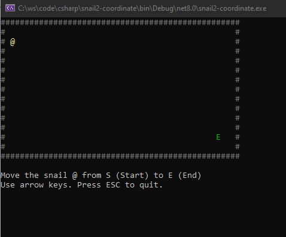
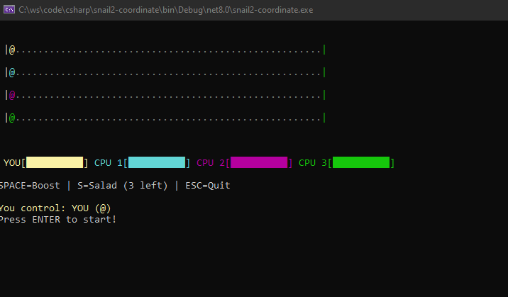

author: Jonathan Melly
summary: système de coordonnées 2D en console C#
id: preoo-02-coordinates
categories: csharp,dev
tags: ict
environments: Web
status: Published
feedback link: https://git.section-inf.ch/jmy/labs/issues
analytics account: UA-170792591-1

# Coordonnées 2D Console - Le Jeu de l'Escargot

## Vue d'ensemble
Duration: 0:02:00

Ce tutorial présente le système de coordonnées 2D en C# à travers la création d'un mini-jeu où un escargot doit parcourir un chemin du départ à l'arrivée.

### Contexte

Nous allons créer un jeu simple où :
- Un escargot `@` se déplace sur une grille
- Il doit aller du point de départ `S` jusqu'à l'arrivée `E`
- Le joueur contrôle l'escargot avec les touches fléchées

### Objectifs

À travers 6 étapes progressives, vous apprendrez à :
1. Comprendre le système de coordonnées de la console (différent des maths !)
2. Positionner des éléments à l'écran avec `Console.SetCursorPosition`
3. Déplacer un personnage sur la grille
4. Créer un jeu complet avec départ et arrivée
5. Simuler une course automatique avec plusieurs escargots et un système de fatigue
6. Interagir avec la course pour encourager son escargot

Negative
: **Attention !** Le système de coordonnées de la console est **inversé** par rapport aux mathématiques. C'est le piège classique des débutants en programmation graphique.

Survey
: Connaissez-vous déjà le système de coordonnées en programmation ?
<ul>
<li>Oui, je connais bien</li>
<li>J'en ai entendu parler</li>
<li>Non, c'est nouveau pour moi</li>
</ul>

## Étape 1 : Comprendre les coordonnées
Duration: 0:15:00

### Le piège des coordonnées

En **mathématiques**, on apprend que :
- L'axe **X** va de gauche à droite ✓
- L'axe **Y** va de **bas en haut** ↑
- L'origine (0,0) est en **bas à gauche**

```
    Y
    ↑
    |
    |  • (3,2)
    |
    +------→ X
   (0,0)
```

En **programmation console** (et dans la plupart des systèmes graphiques) :
- L'axe **X** va de gauche à droite ✓ (pareil)
- L'axe **Y** va de **haut en bas** ↓ (inversé !)
- L'origine (0,0) est en **haut à gauche**

```
   (0,0)----→ X
    |
    |  • (3,2)
    |
    ↓
    Y
```

Negative
: **C'est contre-intuitif !** En console, augmenter Y fait descendre, pas monter. C'est parce que l'écran s'affiche ligne par ligne, de haut en bas, comme quand on lit un texte.

### Premier test : afficher aux coordonnées

Reprendre le projet précédent avec le mune ou créer un nouveau projet **Console App** nommé **SnailGame**.

Adapter le contenu de `Program.cs` avec les éléments suivants :

```csharp
// Clear the console
Console.Clear();

// Position (0,0) = top-left corner
Console.SetCursorPosition(0, 0);
Console.Write("A");

// Position (10,0) = 10 characters to the right, still at top
Console.SetCursorPosition(10, 0);
Console.Write("B");

// Position (0,5) = left side, 5 lines DOWN (not up!)
Console.SetCursorPosition(0, 5);
Console.Write("C");

// Position (10,5) = 10 right, 5 down
Console.SetCursorPosition(10, 5);
Console.Write("D");

// Wait for key press
Console.SetCursorPosition(0, 10);
Console.WriteLine("Press any key to exit...");
Console.ReadKey();
```

### Résultat attendu

```
A         B


C         D


Press any key to exit...
```

### Exercice : dessiner un carré

Modifiez le code pour dessiner un carré avec des `*` aux positions :
- (5, 2), (15, 2), (5, 7), (15, 7)

### Comprendre SetCursorPosition

```csharp
Console.SetCursorPosition(x, y);
//                        ↑  ↑
//                        |  |
//            colonne (gauche/droite)
//                           |
//               ligne (haut/bas, inversé !)
```

| Paramètre    | Direction   | Sens                      |
|:-------------|:------------|:--------------------------|
| **x** (1er)  | Horizontale | 0 = gauche, + = droite    |
| **y** (2ème) | Verticale   | 0 = **haut**, + = **bas** |

Positive
: Retenez : **X = colonne (Left)**, **Y = ligne (Top)**. Certains appellent aussi cela Left/Top au lieu de X/Y.

## Étape 2 : Afficher l'escargot
Duration: 0:10:00

### Objectif

Créer une fonction pour afficher l’escargot à une position donnée.

### Code avec l'escargot

```csharp
// Snail position
int snailX = 5;
int snailY = 3;

// Main program
Console.Clear();
Console.CursorVisible = false; // Hide the blinking cursor

Snail_Draw(snailX, snailY);

Console.SetCursorPosition(0, 10);
Console.WriteLine("Press any key to exit...");
Console.ReadKey();

// ============ SNAIL FUNCTIONS ============

void Snail_Draw(int x, int y)
{
    Console.SetCursorPosition(x, y);
    Console.ForegroundColor = ConsoleColor.Yellow;
    Console.Write("@");  // Our snail character
    Console.ResetColor();
}
```

### Amélioration : effacer l'escargot

Pour pouvoir déplacer l'escargot, il faut aussi effacer sa position précédente :

```csharp
void Snail_Clear(int x, int y)
{
    Console.SetCursorPosition(x, y);
    Console.Write(" ");  // Replace with empty space
}
```

### Test de déplacement simple

Ajoutez ce code pour voir l'escargot "se déplacer" :

```csharp
// Snail position
int snailX = 5;
int snailY = 3;

Console.Clear();
Console.CursorVisible = false;

// Draw snail at initial position
Snail_Draw(snailX, snailY);
Console.ReadKey(true);

// Erase snail at old position
Snail_Clear(snailX, snailY);

// Move snail to the right
snailX = snailX + 5;

// Draw snail at new position
Snail_Draw(snailX, snailY);

Console.SetCursorPosition(0, 10);
Console.WriteLine("Snail moved! Press any key to exit...");
Console.ReadKey();

// ============ SNAIL FUNCTIONS ============

void Snail_Draw(int x, int y)
{
    Console.SetCursorPosition(x, y);
    Console.ForegroundColor = ConsoleColor.Yellow;
    Console.Write("@");
    Console.ResetColor();
}

void Snail_Clear(int x, int y)
{
    Console.SetCursorPosition(x, y);
    Console.Write(" ");
}
```

### Le principe du déplacement

1. **Effacer** le personnage à l'ancienne position
2. **Modifier** les coordonnées (x et/ou y)
3. **Dessiner** le personnage à la nouvelle position

C'est le principe de base de toute animation en programmation !

## Étape 3 : Contrôle au clavier
Duration: 0:15:00

### Objectif

Permettre au joueur de déplacer l'escargot avec les touches fléchées.

### Rappel des directions

```
            ↑ Up
            Y--

   ← Left   @    → Right
     X--         X++

            ↓ Down
            Y++
```

Negative
: **Attention au piège !** Flèche **haut** = **Y diminue** (on monte vers 0). Flèche **bas** = **Y augmente** (on descend).

### Code avec contrôle clavier

```csharp
// Snail position
int snailX = 10;
int snailY = 5;

// Game boundaries
int minX = 0;
int maxX = 40;
int minY = 0;
int maxY = 15;

// Main program
Console.Clear();
Console.CursorVisible = false;

Game_ShowInstructions();
Snail_Draw(snailX, snailY);

// Game loop
bool playing = true;
while (playing)
{
    ConsoleKeyInfo keyInfo = Console.ReadKey(true);

    // Store old position
    int oldX = snailX;
    int oldY = snailY;

    // Handle key press
    switch (keyInfo.Key)
    {
        case ConsoleKey.UpArrow:
            snailY = snailY - 1;  // Move UP = Y decreases!
            break;
        case ConsoleKey.DownArrow:
            snailY = snailY + 1;  // Move DOWN = Y increases!
            break;
        case ConsoleKey.LeftArrow:
            snailX = snailX - 1;
            break;
        case ConsoleKey.RightArrow:
            snailX = snailX + 1;
            break;
        case ConsoleKey.Escape:
            playing = false;
            break;
    }

    // Keep snail within boundaries
    if (snailX < minX) snailX = minX;
    if (snailX > maxX) snailX = maxX;
    if (snailY < minY) snailY = minY;
    if (snailY > maxY) snailY = maxY;

    // Update display only if position changed
    if (oldX != snailX || oldY != snailY)
    {
        Snail_Clear(oldX, oldY);
        Snail_Draw(snailX, snailY);
    }
}

Console.Clear();
Console.WriteLine("Thanks for playing!");

// ============ FUNCTIONS ============

void Game_ShowInstructions()
{
    Console.SetCursorPosition(0, maxY + 2);
    Console.WriteLine("Use arrow keys to move the snail. Press ESC to quit.");
    Console.WriteLine($"Boundaries: X[{minX}-{maxX}], Y[{minY}-{maxY}]");
}

void Snail_Draw(int x, int y)
{
    Console.SetCursorPosition(x, y);
    Console.ForegroundColor = ConsoleColor.Yellow;
    Console.Write("@");
    Console.ResetColor();
}

void Snail_Clear(int x, int y)
{
    Console.SetCursorPosition(x, y);
    Console.Write(" ");
}
```

### Points importants

#### 1. La boucle de jeu (Game Loop)

```csharp
while (playing)
{
    // 1. Lire l'input
    // 2. Mettre à jour la logique
    // 3. Afficher
}
```

C'est le pattern fondamental de tout jeu vidéo !

#### 2. Les limites (Boundaries)

```csharp
if (snailX < minX) snailX = minX;
```

Sans ces vérifications, l'escargot pourrait sortir de l'écran et causer des erreurs.

### Exercice : afficher les coordonnées

Ajouter une fonction qui affiche en temps réel la position de l'escargot :

```csharp
void Game_ShowPosition(int x, int y)
{
    Console.SetCursorPosition(0, maxY + 4);
    Console.Write($"Position: X={x,3}, Y={y,3}   ");
}
```

Appeler cette fonction après chaque déplacement pour observer comment X et Y changent.

## Étape 4 : Le jeu complet
Duration: 0:20:00

### Objectif

Créer le jeu final avec un point de départ, un point d'arrivée, et une condition de victoire.



### Code du jeu complet

```csharp
// Game configuration
int screenWidth = 50;
int screenHeight = 15;

// Snail position (starts at S)
int snailX = 2;
int snailY = 2;

// Start position
int startX = 2;
int startY = 2;

// End position (goal)
int endX = 45;
int endY = 12;

// Main program
Console.Clear();
Console.CursorVisible = false;

Game_DrawBorder();
Game_DrawStart(startX, startY);
Game_DrawEnd(endX, endY);
Game_ShowInstructions();
Snail_Draw(snailX, snailY);

// Game loop
bool playing = true;
bool won = false;

while (playing)
{
    ConsoleKeyInfo keyInfo = Console.ReadKey(true);

    int oldX = snailX;
    int oldY = snailY;

    switch (keyInfo.Key)
    {
        case ConsoleKey.UpArrow:
            snailY = snailY - 1;  // UP = Y-- (towards 0)
            break;
        case ConsoleKey.DownArrow:
            snailY = snailY + 1;  // DOWN = Y++ (away from 0)
            break;
        case ConsoleKey.LeftArrow:
            snailX = snailX - 1;  // LEFT = X--
            break;
        case ConsoleKey.RightArrow:
            snailX = snailX + 1;  // RIGHT = X++
            break;
        case ConsoleKey.Escape:
            playing = false;
            break;
    }

    // Keep snail within game area (inside border)
    if (snailX < 1) snailX = 1;
    if (snailX > screenWidth - 2) snailX = screenWidth - 2;
    if (snailY < 1) snailY = 1;
    if (snailY > screenHeight - 2) snailY = screenHeight - 2;

    // Update display
    if (oldX != snailX || oldY != snailY)
    {
        Snail_Clear(oldX, oldY);

        // Redraw start if snail was on it
        if (oldX == startX && oldY == startY)
        {
            Game_DrawStart(startX, startY);
        }

        Snail_Draw(snailX, snailY);
        Game_ShowPosition(snailX, snailY);

        // Check win condition
        if (snailX == endX && snailY == endY)
        {
            won = true;
            playing = false;
        }
    }
}

// End game
Console.SetCursorPosition(0, screenHeight + 5);

if (won)
{
    Console.ForegroundColor = ConsoleColor.Green;
    Console.WriteLine("🎉 CONGRATULATIONS! You reached the goal!");
    Console.WriteLine("The snail completed its journey!");
    Console.ResetColor();
}
else
{
    Console.WriteLine("Game ended. Thanks for playing!");
}

Console.ReadKey();

// ============ GAME FUNCTIONS ============

void Game_DrawBorder()
{
    Console.ForegroundColor = ConsoleColor.DarkGray;

    // Top and bottom borders
    for (int x = 0; x < screenWidth; x++)
    {
        Console.SetCursorPosition(x, 0);
        Console.Write("#");
        Console.SetCursorPosition(x, screenHeight - 1);
        Console.Write("#");
    }

    // Left and right borders
    for (int y = 0; y < screenHeight; y++)
    {
        Console.SetCursorPosition(0, y);
        Console.Write("#");
        Console.SetCursorPosition(screenWidth - 1, y);
        Console.Write("#");
    }

    Console.ResetColor();
}

void Game_DrawStart(int x, int y)
{
    Console.SetCursorPosition(x, y);
    Console.ForegroundColor = ConsoleColor.Cyan;
    Console.Write("S");
    Console.ResetColor();
}

void Game_DrawEnd(int x, int y)
{
    Console.SetCursorPosition(x, y);
    Console.ForegroundColor = ConsoleColor.Green;
    Console.Write("E");
    Console.ResetColor();
}

void Game_ShowInstructions()
{
    Console.SetCursorPosition(0, screenHeight + 1);
    Console.WriteLine("Move the snail @ from S (Start) to E (End)");
    Console.WriteLine("Use arrow keys. Press ESC to quit.");
}

void Game_ShowPosition(int x, int y)
{
    Console.SetCursorPosition(0, screenHeight + 4);
    Console.Write($"Position: X={x,3} (left/right), Y={y,3} (top/down)   ");
}

// ============ SNAIL FUNCTIONS ============

void Snail_Draw(int x, int y)
{
    Console.SetCursorPosition(x, y);
    Console.ForegroundColor = ConsoleColor.Yellow;
    Console.Write("@");
    Console.ResetColor();
}

void Snail_Clear(int x, int y)
{
    Console.SetCursorPosition(x, y);
    Console.Write(" ");
}
```

### Structure du code

| Fonction                  | Rôle                              |
|:--------------------------|:----------------------------------|
| `Game_DrawBorder()`       | Dessine le cadre du jeu           |
| `Game_DrawStart(x, y)`    | Affiche le point de départ "S"    |
| `Game_DrawEnd(x, y)`      | Affiche le point d'arrivée "E"    |
| `Game_ShowInstructions()` | Affiche les instructions          |
| `Game_ShowPosition(x, y)` | Affiche les coordonnées actuelles |
| `Snail_Draw(x, y)`        | Dessine l'escargot                |
| `Snail_Clear(x, y)`       | Efface l'escargot                 |

### Condition de victoire

```csharp
if (snailX == endX && snailY == endY)
{
    won = true;
    playing = false;
}
```

Le joueur gagne quand les coordonnées de l'escargot correspondent exactement à celles de l'arrivée.

## Étape 5 : Course automatique avec fatigue
Duration: 0:25:00

### Objectif

Transformer le jeu en une vraie course d'escargots où plusieurs concurrents avancent automatiquement avec un système de fatigue.

### Lien avec le menu

On reprend le concept du tutorial précédent (preoo-01-menu) pour configurer la course via deux variables issues des options du menu :

```csharp
// Ces variables pourraient venir du menu Options
int numberOfSnails = 4;    // Nombre d'escargots dans la course
int raceSpeed = 100;       // Délai en ms entre chaque mouvement (100 = rapide, 300 = lent)
```

Positive
: Dans un vrai jeu, ces valeurs seraient définies par l'utilisateur dans le menu Options. Pour l'instant, on les déclare directement.

### Concept de la fatigue

Chaque escargot a une **énergie** qui diminue au fil de la course :
- **100%** : l'escargot avance à chaque tour
- **50%** : l'escargot a 1 chance sur 2 d'avancer
- **0%** : l'escargot est épuisé et n'avance plus

```
Énergie haute    Énergie moyenne    Énergie basse
    @→               @→?                @...
   100%              50%                 10%
```

### Code de la course automatique

```csharp
// ========== CONFIGURATION (depuis le menu) ==========
int numberOfSnails = 4;    // Option: nombre d'escargots
int raceSpeed = 150;       // Option: vitesse (ms entre mouvements)

// ========== CONSTANTES DU JEU ==========
int screenWidth = 60;
int screenHeight = 3 + numberOfSnails * 2;  // Adapté au nombre d'escargots
int startX = 2;
int finishX = screenWidth - 3;

// ========== DONNÉES DES ESCARGOTS (tableaux parallèles) ==========
int[] snailX = new int[numberOfSnails];         // Position X de chaque escargot
int[] snailY = new int[numberOfSnails];         // Position Y (ligne de course)
int[] snailEnergy = new int[numberOfSnails];    // Énergie (0-100)
string[] snailNames = new string[numberOfSnails];
ConsoleColor[] snailColors = { ConsoleColor.Yellow, ConsoleColor.Cyan,
                                ConsoleColor.Magenta, ConsoleColor.Green,
                                ConsoleColor.Red, ConsoleColor.Blue };

// ========== INITIALISATION ==========
Console.Clear();
Console.CursorVisible = false;

Random random = new Random();

// Initialiser chaque escargot
for (int i = 0; i < numberOfSnails; i++)
{
    snailX[i] = startX;
    snailY[i] = 2 + i * 2;  // Chaque escargot sur sa ligne
    snailEnergy[i] = 100;   // Pleine énergie au départ
    snailNames[i] = $"Snail {i + 1}";
}

// Dessiner le terrain
Race_DrawTrack();
Race_DrawAllSnails();
Race_ShowStatus();

Console.SetCursorPosition(0, screenHeight + 2);
Console.WriteLine("Press ENTER to start the race!");
Console.ReadLine();

// ========== BOUCLE DE COURSE ==========
bool raceFinished = false;
int winner = -1;

while (!raceFinished)
{
    // Déplacer chaque escargot
    for (int i = 0; i < numberOfSnails; i++)
    {
        // L'escargot avance seulement si son énergie le permet
        int chanceToMove = snailEnergy[i];  // 100 = toujours, 50 = 1/2, etc.

        if (random.Next(100) < chanceToMove)
        {
            // Effacer ancienne position
            Snail_Clear(snailX[i], snailY[i]);

            // Avancer (X augmente = vers la droite)
            snailX[i] = snailX[i] + 1;

            // Dessiner nouvelle position
            Snail_DrawColored(snailX[i], snailY[i], snailColors[i % snailColors.Length]);

            // Réduire l'énergie (fatigue)
            snailEnergy[i] = snailEnergy[i] - random.Next(1, 4);  // Perd 1-3 énergie
            if (snailEnergy[i] < 5) snailEnergy[i] = 5;  // Minimum 5% pour ne jamais s'arrêter totalement
        }

        // Vérifier si cet escargot a gagné
        if (snailX[i] >= finishX)
        {
            winner = i;
            raceFinished = true;
            break;
        }
    }

    Race_ShowStatus();
    Thread.Sleep(raceSpeed);  // Pause entre les tours
}

// ========== FIN DE COURSE ==========
Console.SetCursorPosition(0, screenHeight + 4);
Console.ForegroundColor = snailColors[winner % snailColors.Length];
Console.WriteLine($"{snailNames[winner]} WINS THE RACE!");
Console.ResetColor();
Console.ReadKey();

// ========== FONCTIONS DE COURSE ==========

void Race_DrawTrack()
{
    for (int i = 0; i < numberOfSnails; i++)
    {
        int y = 2 + i * 2;

        // Ligne de départ
        Console.SetCursorPosition(startX - 1, y);
        Console.ForegroundColor = ConsoleColor.White;
        Console.Write("|");

        // Piste (pointillés)
        for (int x = startX; x < finishX; x++)
        {
            Console.SetCursorPosition(x, y);
            Console.ForegroundColor = ConsoleColor.DarkGray;
            Console.Write(".");
        }

        // Ligne d'arrivée
        Console.SetCursorPosition(finishX, y);
        Console.ForegroundColor = ConsoleColor.Green;
        Console.Write("|");
    }
    Console.ResetColor();
}

void Race_DrawAllSnails()
{
    for (int i = 0; i < numberOfSnails; i++)
    {
        Snail_DrawColored(snailX[i], snailY[i], snailColors[i % snailColors.Length]);
    }
}

void Race_ShowStatus()
{
    Console.SetCursorPosition(0, screenHeight + 1);
    Console.Write("Energy: ");

    for (int i = 0; i < numberOfSnails; i++)
    {
        Console.ForegroundColor = snailColors[i % snailColors.Length];
        Console.Write($"[{snailNames[i]}:{snailEnergy[i],3}%] ");
    }
    Console.ResetColor();
}

void Snail_DrawColored(int x, int y, ConsoleColor color)
{
    Console.SetCursorPosition(x, y);
    Console.ForegroundColor = color;
    Console.Write("@");
    Console.ResetColor();
}

void Snail_Clear(int x, int y)
{
    Console.SetCursorPosition(x, y);
    Console.ForegroundColor = ConsoleColor.DarkGray;
    Console.Write(".");  // Redessine la piste
    Console.ResetColor();
}
```

Negative
: N'oubliez pas `using System.Threading;` en haut du fichier pour utiliser `Thread.Sleep()`.

### Les tableaux parallèles

On utilise plusieurs tableaux avec le **même index** pour stocker les données de chaque escargot :

```csharp
// Index 0 = Snail 1, Index 1 = Snail 2, etc.
int[] snailX = { 2, 2, 2, 2 };           // Positions X
int[] snailY = { 2, 4, 6, 8 };           // Positions Y
int[] snailEnergy = { 100, 100, 100, 100 }; // Énergies
```

| Index | snailX[i] | snailY[i] | snailEnergy[i] |
|:-----:|:---------:|:---------:|:--------------:|
| 0     | 2         | 2         | 100            |
| 1     | 2         | 4         | 100            |
| 2     | 2         | 6         | 100            |
| 3     | 2         | 8         | 100            |

### Comprendre la fatigue

```csharp
if (random.Next(100) < chanceToMove)
```

- `random.Next(100)` génère un nombre entre 0 et 99
- Si `chanceToMove = 100`, la condition est **toujours vraie** (0-99 < 100)
- Si `chanceToMove = 50`, la condition est vraie **une fois sur deux**
- Si `chanceToMove = 10`, l'escargot avance rarement

## Étape 6 : Encourager son escargot
Duration: 0:20:00

### Objectif

Permettre au joueur d'interagir pendant la course pour aider son escargot favori.

### Concept

Le joueur peut :
1. **Appuyer sur ESPACE** : encourage son escargot (récupère de l'énergie)
2. **Placer une salade (S)** : dépose une salade sur la piste qui donne un boost



### Mécaniques de jeu

| Action        | Touche | Effet                                 |
|:--------------|:------:|:--------------------------------------|
| Encourager    | ESPACE | +10 énergie pour l'escargot du joueur |
| Placer salade | S      | Crée un bonus sur la piste            |
| Quitter       | ESC    | Arrête la course                      |

### Code avec interaction joueur

```csharp
// ========== CONFIGURATION ==========
int numberOfSnails = 4;
int raceSpeed = 120;
int playerSnailIndex = 0;  // Le joueur contrôle l'escargot 0

// ========== CONSTANTES ==========
int screenWidth = 60;
int screenHeight = 3 + numberOfSnails * 2;
int startX = 2;
int finishX = screenWidth - 3;

// ========== DONNÉES DES ESCARGOTS ==========
int[] snailX = new int[numberOfSnails];
int[] snailY = new int[numberOfSnails];
int[] snailEnergy = new int[numberOfSnails];
string[] snailNames = new string[numberOfSnails];
ConsoleColor[] snailColors = { ConsoleColor.Yellow, ConsoleColor.Cyan,
                                ConsoleColor.Magenta, ConsoleColor.Green };

// ========== SALADES (bonus) ==========
int maxSalads = 5;
int[] saladX = new int[maxSalads];
int[] saladY = new int[maxSalads];
bool[] saladActive = new bool[maxSalads];
int saladCount = 0;
int playerSaladsRemaining = 3;  // Le joueur peut placer 3 salades

// ========== INITIALISATION ==========
Console.Clear();
Console.CursorVisible = false;

Random random = new Random();

for (int i = 0; i < numberOfSnails; i++)
{
    snailX[i] = startX;
    snailY[i] = 2 + i * 2;
    snailEnergy[i] = 100;
    snailNames[i] = (i == playerSnailIndex) ? "YOU" : $"CPU {i}";
}

// Initialiser les salades comme inactives
for (int i = 0; i < maxSalads; i++)
{
    saladActive[i] = false;
}

Race_DrawTrack();
Race_DrawAllSnails();
Race_ShowStatus();
Race_ShowControls();

Console.SetCursorPosition(0, screenHeight + 5);
Console.ForegroundColor = snailColors[playerSnailIndex];
Console.WriteLine($"You control: {snailNames[playerSnailIndex]} (@)");
Console.ResetColor();
Console.WriteLine("Press ENTER to start!");
Console.ReadLine();

// ========== BOUCLE DE COURSE ==========
bool raceFinished = false;
int winner = -1;
DateTime lastUpdate = DateTime.Now;

while (!raceFinished)
{
    // Gérer les entrées clavier (non-bloquant)
    if (Console.KeyAvailable)
    {
        ConsoleKeyInfo key = Console.ReadKey(true);

        switch (key.Key)
        {
            case ConsoleKey.Spacebar:
                // Encourager = boost d'énergie
                snailEnergy[playerSnailIndex] = snailEnergy[playerSnailIndex] + 10;
                if (snailEnergy[playerSnailIndex] > 100)
                    snailEnergy[playerSnailIndex] = 100;
                Race_ShowBoostEffect();
                break;

            case ConsoleKey.S:
                // Placer une salade devant son escargot
                if (playerSaladsRemaining > 0)
                {
                    Race_PlaceSalad(snailX[playerSnailIndex] + 5, snailY[playerSnailIndex]);
                    playerSaladsRemaining--;
                }
                break;

            case ConsoleKey.Escape:
                raceFinished = true;
                break;
        }
    }

    // Mettre à jour la course à intervalle régulier
    if ((DateTime.Now - lastUpdate).TotalMilliseconds >= raceSpeed)
    {
        lastUpdate = DateTime.Now;

        for (int i = 0; i < numberOfSnails; i++)
        {
            int chanceToMove = snailEnergy[i];

            if (random.Next(100) < chanceToMove)
            {
                Snail_Clear(snailX[i], snailY[i]);
                snailX[i] = snailX[i] + 1;

                // Vérifier si l'escargot mange une salade
                Race_CheckSaladCollision(i);

                Snail_DrawColored(snailX[i], snailY[i], snailColors[i]);

                // Fatigue
                snailEnergy[i] = snailEnergy[i] - random.Next(1, 4);
                if (snailEnergy[i] < 5) snailEnergy[i] = 5;
            }

            if (snailX[i] >= finishX)
            {
                winner = i;
                raceFinished = true;
                break;
            }
        }

        Race_ShowStatus();
    }

    Thread.Sleep(10);  // Petit délai pour ne pas surcharger le CPU
}

// ========== RÉSULTAT ==========
Console.SetCursorPosition(0, screenHeight + 7);

if (winner == playerSnailIndex)
{
    Console.ForegroundColor = ConsoleColor.Green;
    Console.WriteLine("VICTORY! Your snail won the race!");
}
else if (winner >= 0)
{
    Console.ForegroundColor = ConsoleColor.Red;
    Console.WriteLine($"{snailNames[winner]} won. Better luck next time!");
}
else
{
    Console.WriteLine("Race cancelled.");
}
Console.ResetColor();
Console.ReadKey();

// ========== FONCTIONS ==========

void Race_DrawTrack()
{
    for (int i = 0; i < numberOfSnails; i++)
    {
        int y = 2 + i * 2;

        Console.SetCursorPosition(startX - 1, y);
        Console.ForegroundColor = ConsoleColor.White;
        Console.Write("|");

        for (int x = startX; x < finishX; x++)
        {
            Console.SetCursorPosition(x, y);
            Console.ForegroundColor = ConsoleColor.DarkGray;
            Console.Write(".");
        }

        Console.SetCursorPosition(finishX, y);
        Console.ForegroundColor = ConsoleColor.Green;
        Console.Write("|");
    }
    Console.ResetColor();
}

void Race_DrawAllSnails()
{
    for (int i = 0; i < numberOfSnails; i++)
    {
        Snail_DrawColored(snailX[i], snailY[i], snailColors[i]);
    }
}

void Race_ShowStatus()
{
    Console.SetCursorPosition(0, screenHeight + 1);

    for (int i = 0; i < numberOfSnails; i++)
    {
        Console.ForegroundColor = snailColors[i];
        string bar = new string('█', snailEnergy[i] / 10);
        string empty = new string('░', 10 - snailEnergy[i] / 10);
        Console.Write($"{snailNames[i],4}[{bar}{empty}] ");
    }
    Console.ResetColor();
}

void Race_ShowControls()
{
    Console.SetCursorPosition(0, screenHeight + 3);
    Console.WriteLine($"SPACE=Boost | S=Salad ({playerSaladsRemaining} left) | ESC=Quit");
}

void Race_ShowBoostEffect()
{
    int y = snailY[playerSnailIndex];
    Console.SetCursorPosition(snailX[playerSnailIndex] + 1, y);
    Console.ForegroundColor = ConsoleColor.White;
    Console.Write("!");
    Thread.Sleep(50);
    Console.SetCursorPosition(snailX[playerSnailIndex] + 1, y);
    Console.ForegroundColor = ConsoleColor.DarkGray;
    Console.Write(".");
}

void Race_PlaceSalad(int x, int y)
{
    // Trouver un slot libre pour la salade
    for (int i = 0; i < maxSalads; i++)
    {
        if (!saladActive[i])
        {
            saladX[i] = x;
            saladY[i] = y;
            saladActive[i] = true;
            saladCount++;

            // Dessiner la salade
            Console.SetCursorPosition(x, y);
            Console.ForegroundColor = ConsoleColor.Green;
            Console.Write("$");  // $ = salade
            Console.ResetColor();

            Race_ShowControls();  // Mettre à jour le compteur
            break;
        }
    }
}

void Race_CheckSaladCollision(int snailIndex)
{
    for (int i = 0; i < maxSalads; i++)
    {
        if (saladActive[i] && saladX[i] == snailX[snailIndex] && saladY[i] == snailY[snailIndex])
        {
            // L'escargot mange la salade = gros boost !
            snailEnergy[snailIndex] = snailEnergy[snailIndex] + 25;
            if (snailEnergy[snailIndex] > 100) snailEnergy[snailIndex] = 100;

            saladActive[i] = false;
            saladCount--;
        }
    }
}

void Snail_DrawColored(int x, int y, ConsoleColor color)
{
    Console.SetCursorPosition(x, y);
    Console.ForegroundColor = color;
    Console.Write("@");
    Console.ResetColor();
}

void Snail_Clear(int x, int y)
{
    Console.SetCursorPosition(x, y);
    Console.ForegroundColor = ConsoleColor.DarkGray;
    Console.Write(".");
    Console.ResetColor();
}
```

### Points clés

#### 1. Entrée non-bloquante

```csharp
if (Console.KeyAvailable)
{
    ConsoleKeyInfo key = Console.ReadKey(true);
    // Traiter la touche...
}
```

Contrairement à `Console.ReadKey()` seul, `Console.KeyAvailable` vérifie s'il y a une touche **sans bloquer** le programme.

#### 2. Timing avec DateTime

```csharp
if ((DateTime.Now - lastUpdate).TotalMilliseconds >= raceSpeed)
{
    lastUpdate = DateTime.Now;
    // Mettre à jour le jeu...
}
```

Permet de contrôler la vitesse du jeu indépendamment de la boucle principale.

#### 3. Système de bonus (salades)

Les salades utilisent aussi des **tableaux parallèles** :
- `saladX[]` : position X
- `saladY[]` : position Y
- `saladActive[]` : la salade existe-t-elle encore ?

### Exercice : améliorer l'encouragement

Modifier le système pour que les appuis rapides sur ESPACE soient plus efficaces :

```csharp
DateTime lastBoostTime = DateTime.MinValue;
int comboCount = 0;

// Dans le traitement de ESPACE :
TimeSpan timeSinceLastBoost = DateTime.Now - lastBoostTime;
if (timeSinceLastBoost.TotalMilliseconds < 500)
{
    comboCount++;
    int boostAmount = 5 + comboCount * 2;  // Combo = plus de boost !
}
else
{
    comboCount = 0;
}
lastBoostTime = DateTime.Now;
```

Positive
: Cette mécanique de "combo" récompense les joueurs qui appuient rapidement et régulièrement !

## Bonus : Améliorations possibles
Duration: 0:05:00

### Idées pour aller plus loin

#### 1. Ajouter des obstacles

```csharp
// Obstacle positions
int[] obstacleX = { 15, 20, 25, 30 };
int[] obstacleY = { 5, 8, 6, 10 };

void Game_DrawObstacles()
{
    Console.ForegroundColor = ConsoleColor.Red;
    for (int i = 0; i < obstacleX.Length; i++)
    {
        Console.SetCursorPosition(obstacleX[i], obstacleY[i]);
        Console.Write("X");
    }
    Console.ResetColor();
}

bool Game_IsObstacle(int x, int y)
{
    for (int i = 0; i < obstacleX.Length; i++)
    {
        if (obstacleX[i] == x && obstacleY[i] == y)
        {
            return true;
        }
    }
    return false;
}
```

#### 2. Compter les mouvements

```csharp
int moveCount = 0;

// Dans la boucle, après un déplacement valide :
moveCount++;
Game_ShowMoves(moveCount);

void Game_ShowMoves(int count)
{
    Console.SetCursorPosition(30, screenHeight + 4);
    Console.Write($"Moves: {count}   ");
}
```

#### 3. Ajouter un chronomètre

```csharp
DateTime startTime = DateTime.Now;

// À la fin du jeu :
TimeSpan duration = DateTime.Now - startTime;
Console.WriteLine($"Time: {duration.TotalSeconds:F1} seconds");
```

#### 4. Dessiner un vrai escargot ASCII

```csharp
void Snail_DrawFancy(int x, int y)
{
    Console.ForegroundColor = ConsoleColor.Yellow;
    Console.SetCursorPosition(x, y);
    Console.Write("@)");  // Simple snail
    Console.ResetColor();
}
```

## Synthèse
Duration: 0:03:00

### Récapitulatif : le système de coordonnées

```
Console/Écran                    Mathématiques
=============                    =============

(0,0)----→ X (Left)              Y ↑
  |                                |
  |                                |
  ↓                              (0,0)----→ X
  Y (Top)
```

| Aspect        | Console     | Maths      |
|:--------------|:------------|:-----------|
| Origine (0,0) | Haut-gauche | Bas-gauche |
| X augmente    | → droite    | → droite   |
| Y augmente    | ↓ **bas**   | ↑ haut     |
| Flèche haut   | Y--         | Y++        |
| Flèche bas    | Y++         | Y--        |

### Points clés à retenir

1. **X = Left** : position horizontale (colonne)
2. **Y = Top** : position verticale (ligne), **inversé** par rapport aux maths
3. **SetCursorPosition(x, y)** : x d'abord, y ensuite
4. Pour **monter** à l'écran : **diminuer Y**
5. Pour **descendre** à l'écran : **augmenter Y**

Positive
: Félicitations ! Vous maîtrisez maintenant le système de coordonnées 2D en programmation. Ce concept est fondamental pour les jeux, les interfaces graphiques, et bien d'autres domaines.

### Vers la POO

Comme pour le menu, ce code peut évoluer vers des classes :

```csharp
public class Snail
{
    private int x;
    private int y;
    private int energy;
    private ConsoleColor color;
    private string name;

    public void Draw() { ... }
    public void Clear() { ... }
    public void Move() { ... }
    public void Boost(int amount) { ... }
}

public class Race
{
    private Snail[] snails;
    private Salad[] salads;
    private int finishLine;

    public void Start() { ... }
    public void Update() { ... }
    public Snail GetWinner() { ... }
}
```

Les **tableaux parallèles** (snailX[], snailY[], snailEnergy[]) deviennent naturellement des **attributs** d'une classe Snail !

Survey
: Quelle partie avez-vous trouvée la plus difficile ?
<ul>
<li>Comprendre l'inversion de l'axe Y</li>
<li>Utiliser SetCursorPosition</li>
<li>La boucle de jeu</li>
<li>Les tableaux parallèles pour plusieurs escargots</li>
<li>Le système de fatigue et probabilités</li>
<li>L'entrée clavier non-bloquante</li>
</ul>
