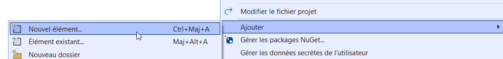

author: Jonathan Melly
summary: Refactoriser du code en classes statiques
id: preoo-03-static-classes
categories: csharp,dev
tags: ict
environments: Web
status: Published
feedback link: https://git.section-inf.ch/jmy/labs/issues
analytics account: UA-170792591-1

# Du Code aux Classes Statiques

## Vue d'ensemble
Duration: 0:03:00

Ce tutorial vous guide dans la transformation de code "en vrac" vers une architecture organisée avec des **classes statiques**. Vous apprendrez à créer des fichiers de classe et à refactoriser du code existant.

### Contexte

Vous avez développé une course d'escargots avec des fonctions préfixées (`Snail_Draw`, `Race_DrawTrack`, etc.). Ce code fonctionne, mais il est temps de le professionnaliser en utilisant des **classes statiques**.

### Objectifs

À travers ce tutorial, vous apprendrez à :
1. Identifier les groupes logiques de fonctions (préfixes)
2. Créer un fichier de classe
3. Transformer des fonctions préfixées en méthodes de classe statique
4. Organiser le code avec des namespaces
5. Utiliser `using` pour importer des namespaces

### Prérequis

- Avoir complété le tutorial "Coordonnées 2D - Le Jeu de l'Escargot"
- Connaître les bases des fonctions en C#

Positive
: Ce tutorial fait le pont entre le code procédural et la Programmation Orientée Objet. C'est une étape fondamentale !

Survey
: Comment organisez-vous votre code actuellement ?
<ul>
<li>Tout dans Program.cs</li>
<li>J'utilise des fonctions mais sans organisation particulière</li>
<li>J'utilise des préfixes pour regrouper mes fonctions</li>
<li>J'utilise déjà des classes</li>
</ul>

## Point de départ : le code actuel
Duration: 0:05:00

### Le code de la course d'escargots

Voici une version simplifiée de la course d'escargots avec des fonctions préfixées. Ce sera le point de départ.

Si un projet avec une course d'escargots fonctionnelle n'est pas disponible, créer un nouveau projet **Console App** nommé **SnailRaceRefactoring** et copier ce code dans `Program.cs` (ou adapter le code existant selon l'exemple) :

```csharp
// ========== DONNÉES GLOBALES ==========
int numberOfSnails = 3;
int screenWidth = 50;
int startX = 2;
int finishX = screenWidth - 3;

int[] snailX = new int[3];
int[] snailY = new int[3];
int[] snailEnergy = new int[3];
string[] snailNames = { "Turbo", "Speedy", "Flash" };
ConsoleColor[] snailColors = { ConsoleColor.Yellow, ConsoleColor.Cyan, ConsoleColor.Magenta };

Random random = new Random();

// ========== PROGRAMME PRINCIPAL ==========
Console.Clear();
Console.CursorVisible = false;

Race_Init();
Race_DrawTrack();
Race_DrawAllSnails();

Console.SetCursorPosition(0, 12);
Console.WriteLine("Appuyez sur ENTER pour lancer la course !");
Console.ReadLine();

// Boucle de course
bool raceFinished = false;
int winner = -1;

while (!raceFinished)
{
    for (int i = 0; i < numberOfSnails; i++)
    {
        if (random.Next(100) < snailEnergy[i])
        {
            Snail_Clear(snailX[i], snailY[i]);
            snailX[i]++;
            Snail_Draw(snailX[i], snailY[i], snailColors[i]);

            snailEnergy[i] -= random.Next(1, 4);
            if (snailEnergy[i] < 10) snailEnergy[i] = 10;
        }

        if (snailX[i] >= finishX)
        {
            winner = i;
            raceFinished = true;
            break;
        }
    }

    Race_ShowEnergy();
    Thread.Sleep(100);
}

Console.SetCursorPosition(0, 14);
Console.ForegroundColor = snailColors[winner];
Console.WriteLine($"{snailNames[winner]} a gagné la course !");
Console.ResetColor();
Console.ReadKey();

// ========== FONCTIONS RACE_ ==========

void Race_Init()
{
    for (int i = 0; i < numberOfSnails; i++)
    {
        snailX[i] = startX;
        snailY[i] = 2 + i * 2;
        snailEnergy[i] = 100;
    }
}

void Race_DrawTrack()
{
    for (int i = 0; i < numberOfSnails; i++)
    {
        int y = 2 + i * 2;

        Console.SetCursorPosition(startX - 1, y);
        Console.ForegroundColor = ConsoleColor.White;
        Console.Write("|");

        for (int x = startX; x < finishX; x++)
        {
            Console.SetCursorPosition(x, y);
            Console.ForegroundColor = ConsoleColor.DarkGray;
            Console.Write(".");
        }

        Console.SetCursorPosition(finishX, y);
        Console.ForegroundColor = ConsoleColor.Green;
        Console.Write("|");
    }
    Console.ResetColor();
}

void Race_DrawAllSnails()
{
    for (int i = 0; i < numberOfSnails; i++)
    {
        Snail_Draw(snailX[i], snailY[i], snailColors[i]);
    }
}

void Race_ShowEnergy()
{
    Console.SetCursorPosition(0, 10);
    for (int i = 0; i < numberOfSnails; i++)
    {
        Console.ForegroundColor = snailColors[i];
        string bar = new string('#', snailEnergy[i] / 10);
        string empty = new string('-', 10 - snailEnergy[i] / 10);
        Console.Write($"{snailNames[i],6}[{bar}{empty}] ");
    }
    Console.ResetColor();
}

// ========== FONCTIONS SNAIL_ ==========

void Snail_Draw(int x, int y, ConsoleColor color)
{
    Console.SetCursorPosition(x, y);
    Console.ForegroundColor = color;
    Console.Write("@");
    Console.ResetColor();
}

void Snail_Clear(int x, int y)
{
    Console.SetCursorPosition(x, y);
    Console.ForegroundColor = ConsoleColor.DarkGray;
    Console.Write(".");
    Console.ResetColor();
}
```

### Tester le code

Lancer l'application pour vérifier que tout fonctionne.

### Observation des préfixes

On remarque que les fonctions sont organisées avec des préfixes :

| Préfixe  | Fonctions                                                              | Rôle                    |
| :------- | :--------------------------------------------------------------------- | :---------------------- |
| `Race_`  | `Race_Init`, `Race_DrawTrack`, `Race_DrawAllSnails`, `Race_ShowEnergy` | Gestion de la course    |
| `Snail_` | `Snail_Draw`, `Snail_Clear`                                            | Affichage des escargots |

Positive
: Ces préfixes indiquent des **groupes logiques** de fonctions. Chaque préfixe deviendra une **classe** !

## Étape 1 : Créer la classe Snail
Duration: 0:10:00

### Objectif

Transformer les fonctions `Snail_*` en méthodes d'une classe statique `Snail`.

### Créer un nouveau fichier de classe

Dans l'IDE :

1. Clic droit sur le projet **SnailRaceRefactoring** dans l'Explorateur de solutions
2. Sélectionner **Ajouter** > **Classe...**
3. Nommer le fichier `Snail.cs`
4. Cliquer sur **Ajouter**



L'IDE crée un fichier avec ce contenu par défaut :

```csharp
namespace SnailRaceRefactoring
{
    internal class Snail
    {
    }
}
```

### Transformer en classe statique

Modifier le fichier `Snail.cs` comme suit :

```csharp
namespace SnailRaceRefactoring
{
    static class Snail
    {
        public static void Draw(int x, int y, ConsoleColor color)
        {
            Console.SetCursorPosition(x, y);
            Console.ForegroundColor = color;
            Console.Write("@");
            Console.ResetColor();
        }

        public static void Clear(int x, int y)
        {
            Console.SetCursorPosition(x, y);
            Console.ForegroundColor = ConsoleColor.DarkGray;
            Console.Write(".");
            Console.ResetColor();
        }
    }
}
```

### Analyse des changements

| Avant (fonction)                              | Après (méthode)                                    |
| :-------------------------------------------- | :------------------------------------------------- |
| `void Snail_Draw(...)`                        | `public static void Draw(...)`                     |
| Fonction "en vrac" dans Program.cs            | Méthode dans la classe `Snail`                     |
| Appel : `Snail_Draw(x, y, color)`             | Appel : `Snail.Draw(x, y, color)`                  |

### Les mots-clés importants

- **`static class`** : La classe ne peut pas être instanciée (pas de `new Snail()`)
- **`public`** : La méthode est accessible depuis l'extérieur de la classe
- **`static`** : La méthode appartient à la classe, pas à une instance

### Mettre à jour Program.cs

Dans `Program.cs`, remplacer les appels aux anciennes fonctions :

**Avant :**
```csharp
Snail_Draw(snailX[i], snailY[i], snailColors[i]);
Snail_Clear(snailX[i], snailY[i]);
```

**Après :**
```csharp
Snail.Draw(snailX[i], snailY[i], snailColors[i]);
Snail.Clear(snailX[i], snailY[i]);
```

### Supprimer les anciennes fonctions

Supprimer les fonctions `Snail_Draw` et `Snail_Clear` de `Program.cs` (elles sont maintenant dans `Snail.cs`).

### Tester

Compiler et exécuter. Le programme doit fonctionner exactement comme avant !

Positive
: Félicitations ! Vous avez créé votre première classe statique. Le préfixe `Snail_` est devenu le nom de la classe `Snail`, et les fonctions sont devenues des méthodes.

## Étape 2 : Créer la classe Race
Duration: 0:15:00

### Objectif

Transformer les fonctions `Race_*` en méthodes d'une classe statique `Race`.

### Le défi des données

Les fonctions `Race_*` utilisent des variables globales :
- `numberOfSnails`, `screenWidth`, `startX`, `finishX`
- `snailX[]`, `snailY[]`, `snailEnergy[]`, `snailNames[]`, `snailColors[]`

Ces variables doivent être déplacées dans la classe `Race`.

### Créer le fichier Race.cs

1. Clic droit sur le projet > **Ajouter** > **Classe...**
2. Nommer le fichier `Race.cs`
3. Cliquer sur **Ajouter**

### Contenu de Race.cs

```csharp
namespace SnailRaceRefactoring
{
    static class Race
    {
        // ========== DONNÉES DE LA COURSE ==========
        public static int NumberOfSnails = 3;
        public static int ScreenWidth = 50;
        public static int StartX = 2;
        public static int FinishX = ScreenWidth - 3;

        public static int[] SnailX = new int[3];
        public static int[] SnailY = new int[3];
        public static int[] SnailEnergy = new int[3];
        public static string[] SnailNames = { "Turbo", "Speedy", "Flash" };
        public static ConsoleColor[] SnailColors = {
            ConsoleColor.Yellow,
            ConsoleColor.Cyan,
            ConsoleColor.Magenta
        };

        // ========== MÉTHODES ==========

        public static void Init()
        {
            for (int i = 0; i < NumberOfSnails; i++)
            {
                SnailX[i] = StartX;
                SnailY[i] = 2 + i * 2;
                SnailEnergy[i] = 100;
            }
        }

        public static void DrawTrack()
        {
            for (int i = 0; i < NumberOfSnails; i++)
            {
                int y = 2 + i * 2;

                Console.SetCursorPosition(StartX - 1, y);
                Console.ForegroundColor = ConsoleColor.White;
                Console.Write("|");

                for (int x = StartX; x < FinishX; x++)
                {
                    Console.SetCursorPosition(x, y);
                    Console.ForegroundColor = ConsoleColor.DarkGray;
                    Console.Write(".");
                }

                Console.SetCursorPosition(FinishX, y);
                Console.ForegroundColor = ConsoleColor.Green;
                Console.Write("|");
            }
            Console.ResetColor();
        }

        public static void DrawAllSnails()
        {
            for (int i = 0; i < NumberOfSnails; i++)
            {
                Snail.Draw(SnailX[i], SnailY[i], SnailColors[i]);
            }
        }

        public static void ShowEnergy()
        {
            Console.SetCursorPosition(0, 10);
            for (int i = 0; i < NumberOfSnails; i++)
            {
                Console.ForegroundColor = SnailColors[i];
                string bar = new string('#', SnailEnergy[i] / 10);
                string empty = new string('-', 10 - SnailEnergy[i] / 10);
                Console.Write($"{SnailNames[i],6}[{bar}{empty}] ");
            }
            Console.ResetColor();
        }
    }
}
```

### Observations importantes

1. **Les données sont dans la classe** : Les tableaux et variables sont devenus des champs `public static`
2. **Accès aux données** : Les méthodes accèdent directement aux champs (ex: `SnailX[i]` au lieu de `snailX[i]`)
3. **Utilisation de Snail** : `DrawAllSnails()` appelle `Snail.Draw()` - les classes peuvent s'utiliser mutuellement !

### Conventions de nommage

| Type de membre        | Convention | Exemple                    |
| :-------------------- | :--------- | :------------------------- |
| Champ public statique | PascalCase | `SnailX`, `NumberOfSnails` |
| Méthode publique      | PascalCase | `DrawTrack()`, `Init()`    |
| Variable locale       | camelCase  | `int y = ...`              |

## Étape 3 : Nettoyer Program.cs
Duration: 0:10:00

### Objectif

Simplifier `Program.cs` en utilisant les nouvelles classes.

### Le nouveau Program.cs

Remplacer tout le contenu de `Program.cs` par :

```csharp
// Programme principal - Course d'escargots
Console.Clear();
Console.CursorVisible = false;

Race.Init();
Race.DrawTrack();
Race.DrawAllSnails();

Console.SetCursorPosition(0, 12);
Console.WriteLine("Appuyez sur ENTER pour lancer la course !");
Console.ReadLine();

// Boucle de course
Random random = new Random();
bool raceFinished = false;
int winner = -1;

while (!raceFinished)
{
    for (int i = 0; i < Race.NumberOfSnails; i++)
    {
        if (random.Next(100) < Race.SnailEnergy[i])
        {
            Snail.Clear(Race.SnailX[i], Race.SnailY[i]);
            Race.SnailX[i]++;
            Snail.Draw(Race.SnailX[i], Race.SnailY[i], Race.SnailColors[i]);

            Race.SnailEnergy[i] -= random.Next(1, 4);
            if (Race.SnailEnergy[i] < 10) Race.SnailEnergy[i] = 10;
        }

        if (Race.SnailX[i] >= Race.FinishX)
        {
            winner = i;
            raceFinished = true;
            break;
        }
    }

    Race.ShowEnergy();
    Thread.Sleep(100);
}

Console.SetCursorPosition(0, 14);
Console.ForegroundColor = Race.SnailColors[winner];
Console.WriteLine($"{Race.SnailNames[winner]} a gagné la course !");
Console.ResetColor();
Console.ReadKey();
```

### Comparaison avant/après

| Avant                              | Après                                |
| :--------------------------------- | :----------------------------------- |
| Variables globales dans Program.cs | Données dans `Race`                  |
| `Race_Init()`                      | `Race.Init()`                        |
| `Snail_Draw(...)`                  | `Snail.Draw(...)`                    |
| `snailX[i]`                        | `Race.SnailX[i]`                     |
| Fonctions en vrac                  | Méthodes organisées dans des classes |

### Structure du projet

Le projet devrait maintenant ressembler à ceci :

```
SnailRaceRefactoring/
├── Program.cs      // Programme principal (simplifié)
├── Race.cs         // Classe Race (données + logique de course)
└── Snail.cs        // Classe Snail (affichage escargot)
```

### Tester

Compiler et exécuter. Le programme doit fonctionner exactement comme avant !

Positive
: Le code est maintenant **organisé** en classes. Chaque classe a une responsabilité claire : `Snail` gère l'affichage des escargots, `Race` gère la course.

## Étape 4 : Introduction des namespaces
Duration: 0:10:00

### Pourquoi des namespaces ?

Imaginons un autre projet avec une classe `Race` pour des courses de voitures. Il y aurait un conflit de noms !

Les **namespaces** permettent d'organiser les classes et d'éviter ces conflits.

### Structure avec namespace

Actuellement, l'IDE a créé le namespace `SnailRaceRefactoring`. Organisons mieux avec un sous-namespace.

### Modifier Snail.cs

```csharp
namespace SnailRaceRefactoring.Game
{
    static class Snail
    {
        public static void Draw(int x, int y, ConsoleColor color)
        {
            Console.SetCursorPosition(x, y);
            Console.ForegroundColor = color;
            Console.Write("@");
            Console.ResetColor();
        }

        public static void Clear(int x, int y)
        {
            Console.SetCursorPosition(x, y);
            Console.ForegroundColor = ConsoleColor.DarkGray;
            Console.Write(".");
            Console.ResetColor();
        }
    }
}
```

### Modifier Race.cs

```csharp
namespace SnailRaceRefactoring.Game
{
    static class Race
    {
        // ... tout le contenu reste identique ...
    }
}
```

### Le problème : Program.cs ne compile plus !

Après ces modifications, `Program.cs` affiche des erreurs :

```
CS0103: The name 'Race' does not exist in the current context
CS0103: The name 'Snail' does not exist in the current context
```

### Solution : utiliser `using`

Ajouter cette ligne **au début** de `Program.cs` :

```csharp
using SnailRaceRefactoring.Game;

// Programme principal - Course d'escargots
Console.Clear();
Console.CursorVisible = false;

Race.Init();
// ... reste du code ...
```

### Alternative : nom complet

Sans `using`, il faudrait écrire le nom complet partout :

```csharp
// Sans using : nom complet obligatoire
SnailRaceRefactoring.Game.Race.Init();
SnailRaceRefactoring.Game.Snail.Draw(x, y, color);
```

C'est long et répétitif ! Le `using` permet d'utiliser les noms courts.

### Tester

Compiler et exécuter. Tout doit fonctionner !

Positive
: Le `using` importe un **namespace**, pas une classe. Ainsi `using SnailRaceRefactoring.Game;` permet d'accéder à toutes les classes de ce namespace.

## Étape 5 : Aligner dossiers et namespaces
Duration: 0:10:00

### Le problème

À la compilation, un **avertissement** (warning) peut apparaître :

```
IDE0130: Namespace "SnailRaceRefactoring.Game" does not match folder structure,
expected "SnailRaceRefactoring"
```

### La convention .NET

En .NET, il existe une convention importante :

> **Le namespace doit correspondre à l'arborescence des dossiers du projet.**

| Namespace                      | Chemin attendu du fichier |
| :----------------------------- | :------------------------ |
| `SnailRaceRefactoring`         | `/Snail.cs`               |
| `SnailRaceRefactoring.Game`    | `/Game/Snail.cs`          |
| `SnailRaceRefactoring.Game.AI` | `/Game/AI/Snail.cs`       |

### Créer le dossier Game

Pour respecter cette convention :

1. Clic droit sur le projet > **Ajouter** > **Nouveau dossier**
2. Nommer le dossier `Game`
3. **Glisser-déposer** les fichiers `Snail.cs` et `Race.cs` dans ce dossier


### Structure après réorganisation

```
SnailRaceRefactoring/
├── Program.cs                    // namespace: SnailRaceRefactoring (ou aucun)
└── Game/
    ├── Race.cs                   // namespace: SnailRaceRefactoring.Game
    └── Snail.cs                  // namespace: SnailRaceRefactoring.Game
```

### Pourquoi c'est important ?

| Avantage                    | Explication                                               |
| :-------------------------- | :-------------------------------------------------------- |
| **Navigation facile**       | Le dossier reflète l'organisation logique                 |
| **Pas d'avertissements**    | L'IDE ne se plaint plus                                   |
| **Standard de l'industrie** | Tous les développeurs .NET suivent cette convention       |
| **Refactoring automatique** | L'IDE peut renommer le namespace si on déplace un fichier |

### Astuce : création automatique

Lors de la création d'une classe dans un dossier, l'IDE propose automatiquement le bon namespace :

- Créer une classe dans `/Game/` → namespace `SnailRaceRefactoring.Game`
- Créer une classe dans `/Display/` → namespace `SnailRaceRefactoring.Display`

Negative
: Attention : déplacer un fichier ne change **pas** automatiquement son namespace ! Il faut le modifier manuellement (ou utiliser le refactoring de l'IDE).

### Vérification

Compiler le projet. Les avertissements IDE0130 devraient avoir disparu.

## Étape 6 : Créer une classe SuperConsole
Duration: 0:15:00

### Objectif

Créer une classe utilitaire pour simplifier l'affichage coloré dans la console.

### Observation du code répétitif

Dans notre code, nous avons souvent ce pattern :

```csharp
Console.ForegroundColor = ConsoleColor.Green;
Console.WriteLine("Texte vert");
Console.ResetColor();
```

Trois lignes pour afficher du texte coloré, c'est beaucoup !

### Créer le dossier Display et SuperConsole.cs

Comme pour `Game`, créons un dossier pour le namespace `Display` :

1. Clic droit sur le projet > **Ajouter** > **Nouveau dossier**
2. Nommer le dossier `Display`
3. Clic droit sur le dossier `Display` > **Ajouter** > **Classe...**
4. Nommer le fichier `SuperConsole.cs`

L'IDE propose automatiquement le namespace `SnailRaceRefactoring.Display`.

Modifier le contenu :

```csharp
namespace SnailRaceRefactoring.Display
{
    static class SuperConsole
    {
        /// <summary>
        /// Affiche du texte coloré avec retour à la ligne
        /// </summary>
        public static void WriteLineColor(string text, ConsoleColor color)
        {
            Console.ForegroundColor = color;
            Console.WriteLine(text);
            Console.ResetColor();
        }

        /// <summary>
        /// Affiche du texte coloré sans retour à la ligne
        /// </summary>
        public static void WriteColor(string text, ConsoleColor color)
        {
            Console.ForegroundColor = color;
            Console.Write(text);
            Console.ResetColor();
        }

        /// <summary>
        /// Affiche un message de succès (vert)
        /// </summary>
        public static void WriteSuccess(string text)
        {
            WriteLineColor(text, ConsoleColor.Green);
        }

        /// <summary>
        /// Affiche un message d'erreur (rouge)
        /// </summary>
        public static void WriteError(string text)
        {
            WriteLineColor(text, ConsoleColor.Red);
        }

        /// <summary>
        /// Affiche un message d'avertissement (jaune)
        /// </summary>
        public static void WriteWarning(string text)
        {
            WriteLineColor(text, ConsoleColor.Yellow);
        }

        /// <summary>
        /// Affiche du texte à une position précise
        /// </summary>
        public static void WriteAt(int x, int y, string text)
        {
            Console.SetCursorPosition(x, y);
            Console.Write(text);
        }

        /// <summary>
        /// Affiche du texte coloré à une position précise
        /// </summary>
        public static void WriteAtColor(int x, int y, string text, ConsoleColor color)
        {
            Console.SetCursorPosition(x, y);
            Console.ForegroundColor = color;
            Console.Write(text);
            Console.ResetColor();
        }
    }
}
```

### Observer le namespace différent

`SuperConsole` est dans `SnailRaceRefactoring.Display`, pas dans `SnailRaceRefactoring.Game`. C'est une classe d'affichage générique, pas spécifique au jeu.

### Utiliser SuperConsole

Modifier `Program.cs` pour utiliser la nouvelle classe :

```csharp
using SnailRaceRefactoring.Game;
using SnailRaceRefactoring.Display;

// Programme principal - Course d'escargots
Console.Clear();
Console.CursorVisible = false;

Race.Init();
Race.DrawTrack();
Race.DrawAllSnails();

SuperConsole.WriteAt(0, 12, "Appuyez sur ENTER pour lancer la course !");
Console.ReadLine();

// ... boucle de course ...

// À la fin, remplacer l'affichage du gagnant :
SuperConsole.WriteAt(0, 14, "");
SuperConsole.WriteLineColor($"{Race.SnailNames[winner]} a gagné la course !", Race.SnailColors[winner]);
Console.ReadKey();
```

### Structure finale du projet

```
SnailRaceRefactoring/
├── Program.cs           // Programme principal
├── Game/
│   ├── Race.cs          // namespace SnailRaceRefactoring.Game
│   └── Snail.cs         // namespace SnailRaceRefactoring.Game
└── Display/
    └── SuperConsole.cs  // namespace SnailRaceRefactoring.Display
```

Positive
: Les dossiers `Game/` et `Display/` correspondent aux namespaces. C'est la convention standard en .NET, comme expliqué à l'étape 5.

## Exercice : Refactoriser la classe Snail
Duration: 0:15:00

### Objectif

Améliorer la classe `Snail` en utilisant `SuperConsole`.

### Instructions

1. Dans `Snail.cs`, ajouter le `using` nécessaire
2. Remplacer le code d'affichage par des appels à `SuperConsole`

### Solution

```csharp
using SnailRaceRefactoring.Display;

namespace SnailRaceRefactoring.Game
{
    static class Snail
    {
        public static void Draw(int x, int y, ConsoleColor color)
        {
            SuperConsole.WriteAtColor(x, y, "@", color);
        }

        public static void Clear(int x, int y)
        {
            SuperConsole.WriteAtColor(x, y, ".", ConsoleColor.DarkGray);
        }
    }
}
```

### Analyse

| Avant                           | Après                                   |
| :------------------------------ | :-------------------------------------- |
| 4 lignes pour `Draw`            | 1 ligne avec `SuperConsole`             |
| Code dupliqué (couleur + reset) | Logique centralisée dans `SuperConsole` |

### Bonus : Refactoriser Race

Appliquer le même principe à la classe `Race` pour utiliser `SuperConsole` dans `DrawTrack()` et `ShowEnergy()`.

Positive
: Les classes peuvent s'utiliser mutuellement ! `Snail` utilise `SuperConsole`, `Race` utilise `Snail` et `SuperConsole`.

## Comprendre les erreurs courantes
Duration: 0:10:00

### Erreur 1 : Classe non trouvée

```
CS0103: The name 'SuperConsole' does not exist in the current context
```

**Cause** : Le `using` du namespace est manquant.

**Solution** : Ajouter `using SnailRaceRefactoring.Display;` en haut du fichier.

### Erreur 2 : Using sur une classe

```csharp
using SnailRaceRefactoring.Display.SuperConsole;  // ERREUR!
```

```
CS0138: A 'using' directive can only be applied to namespaces
```

**Cause** : `using` s'applique aux **namespaces**, pas aux classes.

**Solution** : Utiliser le namespace : `using SnailRaceRefactoring.Display;`

### Erreur 3 : Méthode non accessible

```
CS0122: 'Snail.Draw(...)' is inaccessible due to its protection level
```

**Cause** : La méthode n'est pas `public`.

**Solution** : Ajouter `public` devant la méthode : `public static void Draw(...)`

### Erreur 4 : Appel sans static

```csharp
Snail s = new Snail();  // ERREUR si Snail est static class
```

```
CS0712: Cannot create an instance of the static class 'Snail'
```

**Cause** : On ne peut pas instancier une classe statique.

**Solution** : Appeler directement sur la classe : `Snail.Draw(...)`

### Erreur 5 : Using du parent n'importe pas les enfants

```csharp
using SnailRaceRefactoring;  // N'importe PAS Game ni Display !

Race.Init();  // ERREUR: Race non trouvée
```

**Cause** : `using SnailRaceRefactoring` n'importe pas automatiquement les sous-namespaces.

**Solution** : Importer explicitement : `using SnailRaceRefactoring.Game;`

## Bonus : using static
Duration: 0:05:00

### Aller encore plus loin

C# permet d'importer les **membres statiques** d'une classe avec `using static` :

```csharp
using static System.Console;
using static SnailRaceRefactoring.Display.SuperConsole;

// Plus besoin de préfixe !
Clear();                              // au lieu de Console.Clear()
CursorVisible = false;                // au lieu de Console.CursorVisible
WriteSuccess("Partie terminée !");    // au lieu de SuperConsole.WriteSuccess()
```

### Comparaison

| Code               | Avec `using`                       | Avec `using static`   |
| :----------------- | :--------------------------------- | :-------------------- |
| Effacer l'écran    | `Console.Clear();`                 | `Clear();`            |
| Afficher un succès | `SuperConsole.WriteSuccess("OK");` | `WriteSuccess("OK");` |

### Avantages et inconvénients

| Avantages           | Inconvénients                          |
| :------------------ | :------------------------------------- |
| Code plus court     | Moins explicite (d'où vient `Clear` ?) |
| Moins de répétition | Risque de confusion entre méthodes     |

Negative
: Attention : `using static` s'applique à une **classe**, pas un namespace. `using static System;` est invalide !

## Synthèse
Duration: 0:03:00

### Ce que vous avez appris

| Concept               | Description                                                   |
| :-------------------- | :------------------------------------------------------------ |
| **Classe statique**   | Conteneur pour données et méthodes, sans instanciation        |
| **Méthode statique**  | Fonction qui appartient à la classe (pas à une instance)      |
| **public**            | Rend un membre accessible depuis l'extérieur                  |
| **namespace**         | Organise les classes et évite les conflits de noms            |
| **using**             | Importe un namespace pour utiliser les noms courts            |
| **Dossiers = NS**     | Les dossiers doivent refléter la structure des namespaces     |

### Progression réalisée

| Étape               | Organisation                            | Appel                      |
| :------------------ | :-------------------------------------- | :------------------------- |
| Fonctions préfixées | `void Snail_Draw(...)`                  | `Snail_Draw(x, y, c)`      |
| Classe statique     | `static class Snail`                    | `Snail.Draw(x, y, c)`      |
| Avec namespace      | `namespace Game { static class Snail }` | `Game.Snail.Draw(x, y, c)` |
| Avec using          | `using Game;`                           | `Snail.Draw(x, y, c)`      |

### Structure finale

```
SnailRaceRefactoring/
├── Program.cs                    // Point d'entrée
├── Game/
│   ├── Race.cs                   // Logique de course
│   └── Snail.cs                  // Affichage escargot
└── Display/
    └── SuperConsole.cs           // Utilitaires console
```

### Correspondance avec .NET

Vous utilisiez déjà des classes statiques sans le savoir :

| Votre code                               | .NET                  |
| :--------------------------------------- | :-------------------- |
| `SuperConsole.WriteSuccess()`            | `Console.WriteLine()` |
| `namespace SnailRaceRefactoring.Display` | `namespace System`    |
| `using SnailRaceRefactoring.Display;`    | `using System;`       |

Positive
: Félicitations ! Vous avez transformé du code procédural en code orienté objet avec des classes statiques. C'est la première étape vers la POO complète !

### Prochaine étape

Dans le prochain tutorial, vous découvrirez les classes **non statiques** qui permettent de créer des **instances** (objets) avec leurs propres données. Chaque escargot deviendra un objet `Snail` avec ses propres coordonnées et énergie !

Survey
: Quelle partie avez-vous trouvée la plus utile ?
<ul>
<li>Créer un fichier de classe</li>
<li>Transformer des fonctions en méthodes statiques</li>
<li>Comprendre les namespaces</li>
<li>Aligner les dossiers et les namespaces</li>
<li>Utiliser le mot-clé using</li>
<li>Créer une classe utilitaire (SuperConsole)</li>
</ul>
