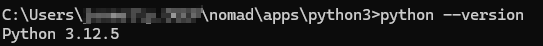

author: Jonathan Melly
summary: python tuto
id: python-01
categories: python,dev
tags: ict
environments: Web
status: Published
feedback link: https://git.section-inf.ch/jmy/labs/issues
analytics account: UA-170792591-1

# Découvrir Python par la pratique

## Vue d’ensemble
Duration: 0:01:00


Survey
: Y’a-t-il des serpents en Suisse ?
<ul>
<li>Quoi des serpents !!!!</li>
<li>Ils sont morts avec les dinosaures</li>
<li>Vipères, orvais et autres asticots vivent encore dans notre pays...</li>
</ul>

## Mise en place de l’environnement
Duration: 0:05:00

Pour faciliter l’utilisation de Python sur n’importe quel système, un outil tiers (nomad) non invasif sera utilisé.

### Nomad

#### Enplacement
Créer ou choisir un dossier dans lequel sera installé les applications nomades, par exemple

```shell
%userprofile%\nomad
```

ou

```shell
c:\nomad
```

#### Installation

Lancer un shell à l’endroit du répertoire choisi/créé ci-dessus et éxécuter la commande suivante:

```shell
powershell -Command Invoke-WebRequest -Uri https://github.com/jonathanMelly/nomad/raw/main/install.bat -OutFile %TEMP%\downloaded.bat && %TEMP%\downloaded.bat
```

### Python

Depuis la fenêtre de commande lancée après l’installation de Nomad, éxécuter la commande suivante:

```shell
nomad install python3
```

Positive
: Valider avec "Enter" l’installation

#### Vérifier l’installation

Lancer l’éxécutable Python qui vient d’être installé avec l’argument *--version* :



### Isolation de python

Python supporte la notion *d’environnement virtuel* ce qui permet de compartimenter les modules python pour chaque projet ce qui est une **bonne pratique**.

Ce système va donc configuré afin d’avoir un environnement virtuel pour la suite du tutoriel.

#### Installer le plugin venv

#### Créer un venv

## Synthèse
Duration: 0:02:00

Bravo, il est temps de faire le point sur les éléments travaillés


