author: Jonathan Melly
summary: intro rclone
id: rclone-01
categories: dev
tags: msig
environments: Web
status: Published
feedback link: https://git.section-inf.ch/jmy/labs/issues
analytics account: UA-170792591-1

# Synchronisation avec Rclone

## Vue d’ensemble
Duration: 0:00:15


### Successeur de rsync
Rclone permet de synchroniser des sources et destinations de fichiers diverses. Par exemple, il permet de synchroniser 
un dossier local avec un stockage sur OneDrive.

Pour plus d’informations, voici l’adresse officielle: [https://rclone.org/](https://rclone.org/)

Positive
: Rclone est écrit en GO et est disponible pour tous les OS.

## Installation
Duration: 0:05:00

### Télécharger l’environnement

Le programme est disponible [en cliquant ici](https://rclone.org/downloads/)

Veuillez vous référer à votre système d’exploitation pour choisir la bonne version.

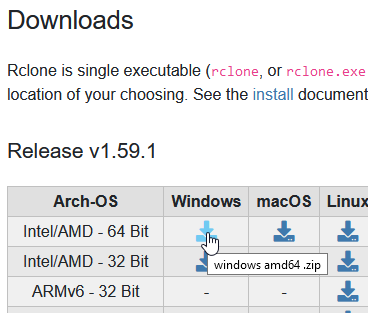


### Installation

Dézipper l’archive

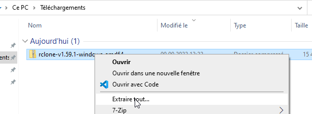

Créer un dossier nommé 'outils' dans votre profil et y glisser rclone.exe

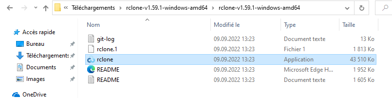
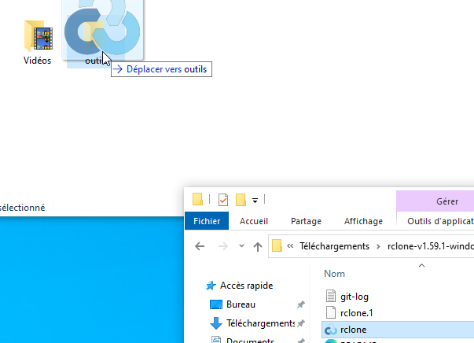

### Vérifier que tout fonctionne

Lancer un terminal
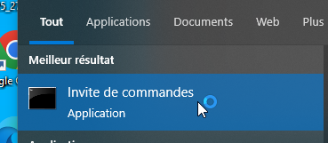

Se déplacer dans le répertoire 'outils'
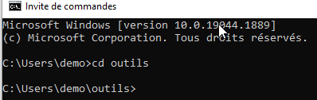

Lancer rclone pour voir sa version
```shell
	rclone --version
```
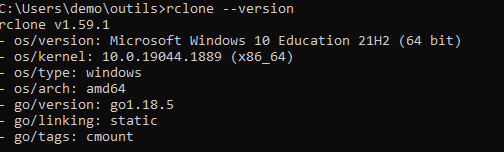

## Configuration avec OneDrive
Duration: 0:05:00

Lancer la configuration de rclone
```shell
	rclone config
```

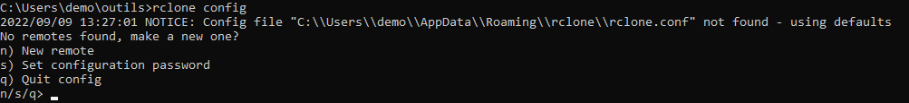

Créer un nouveau 'remote' et le nommer

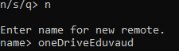

Trouver dans la liste le numéro correspondant à onedrive et le saisir dans l’invite

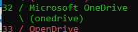

Laisser vide client_id et client_secret et choisir Microsoft Cloud Global

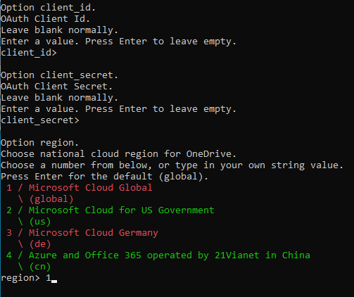

Ne pas éditer la configuration par défaut

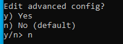

Utiliser la configuration automatique (**y** et non pas *yes* comme dans la capture)
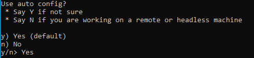

Remplir les champs dans la fenêtre de navigation ouverte

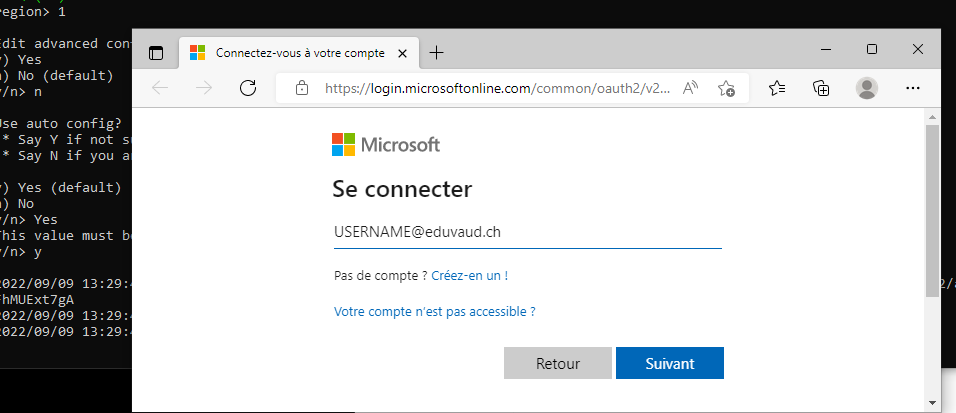

Attendre l’affichage de 'Success'
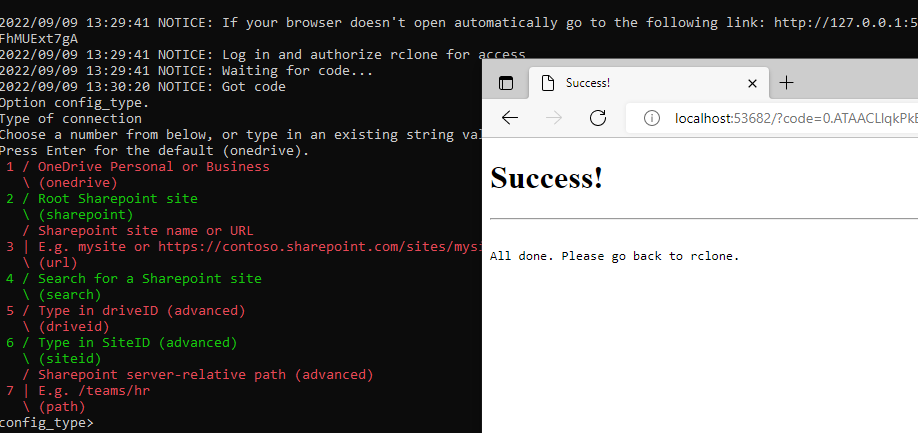

Choisir OneDrive personal
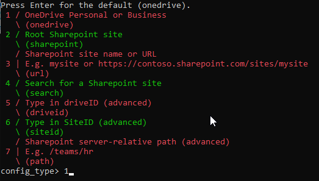

Sélectionner le drive avec l’id proposé (**1**)
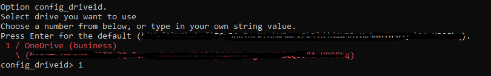

Valider
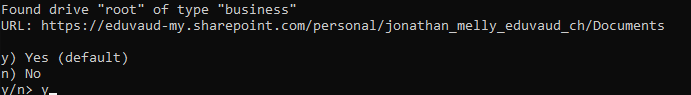

Revalider
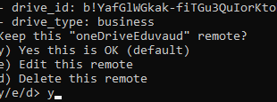

## Synchronisation
Duration: 0:03:00

### Créer un fichier dans un répertoire dans vos documents et le remplir avec du texte, exemple:

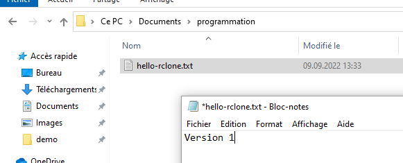

### Lancer la synchronisation en ligne de commande

```shell
	rclone sync ..\Documents\programmation oneDriveEduvaud:sauvegardes\programmation
```

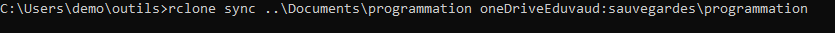

### Vérifier que le fichier a bien été uploadé avec son contenu
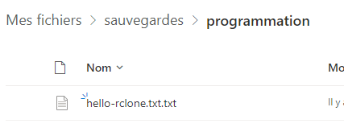
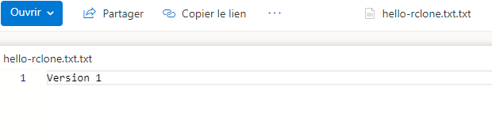

## Historique des versions
Duration: 0:03:00

### Modifier le fichier créé précédemment
Ajouter du contenu, par exemple 'Version 2' dans le fichier et le sauvegarder en local

### Relancer la synchronisation (cette fois en mode verbeux)
En mode verbeux, rsync donne des informations sur ce qu’il fait:

```shell
	rclone sync -v ..\Documents\programmation oneDriveEduvaud:sauvegardes\programmation
```
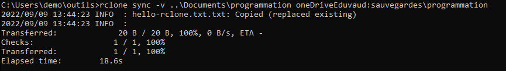

### Vérifier l’historique
Sur l’interface WEB, afficher l’historique
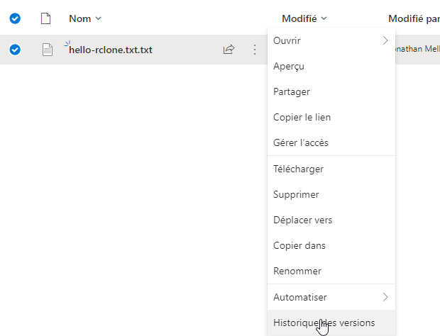

Et vérifier le contenu de la V2
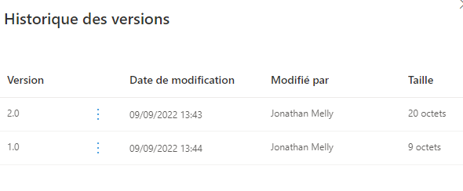

## Synchronisation inverse / bidirectionnelle
Duration: 0:02:00

Actuellement, seules les modifications de la source sont répliquées.

Negative
: Pire que ça, si on modifie quelque chose sur la destination, cela écrasera la source /!\\.

### Option 1: bisync

Afin d’activer le mode bidirectionnel qui synchronise source et destination avec les éléments les plus récents.
Attention toutefois, car l’automatisation de la synchronisation bidirectionnelle n’est pas toujours possible... Rclone
offre plusieurs options, mais voici le scénario optimiste :


#### Lancer la 1ʳᵉ synchro
```shell
	rclone bisync -v --resync ..\Documents\programmation oneDriveEduvaud:sauvegardes\programmation
```

#### Lancer les synchronisations subséquentes
```shell
	rclone bisync -v ..\Documents\programmation oneDriveEduvaud:sauvegardes\programmation
```

### Vérification
#### Modifier le fichier sur l’interface WEB
Afin de vérifier que la modification en ligne soit répercutée ensuite, faire une modification
en ligne (ajouter un dossier ou modifier un fichier...)

#### Lancer rclone
```shell
	rclone bisync -v ..\Documents\programmation oneDriveEduvaud:sauvegardes\programmation
```

#### Vérifier que le fichier local correspond à la dernière version
Si tout va bien, la modification faite précédemment en ligne devrait être répercutée en local

### Option 2 : Intervertir la source et la destination
Une autre manière d’avoir une synchro inverse et d’intervertir la source et la destination.
Cela demande de bien savoir où on en est avec la version la plus à jour...

Même si l’option *bisync* est encore expérimentale, avec l’historique de version sur o365 et quelques options 
supplémentaires (voir ci-après), on a probablement une meilleure solution.

### Option 3 : Bisync avec protection
L’option *backup-dir* permet d’indiquer un répertoire où stocker les fichiers supprimés ou modifiés.
Puisque sur oneDrive, il y a l’historique, il suffit de stocker les opérations destructrices
en local pour, si nécessaire les retrouver...

```shell
	rclone bisync -v --backup-dir="old-%date%-%time:~,5%" ..\Documents\programmation oneDriveEduvaud:sauvegardes\programmation
```

Negative
: Attention, le nom du dossier de backup est précis à la minute... il n’y aura donc qu’une sauvegarde maximum
par minute avec cette syntaxe...


## Automatisation
Duration: 0:03:00

Plutôt que de faire cela à la main, il est possible de scripter la sauvegarde:

### Créer un script
Par exemple un .bat (ou .ps1 pour powershell)
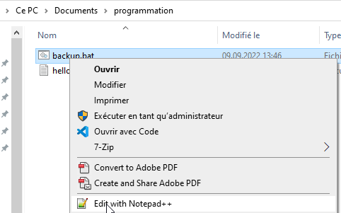

Adapter la commande pour qu’elle puisse s’éxécuter depuis n’importe où

```shell
	%USERPROFILE%\outils\rclone bisync -v C:\Users\demo\Documents\programmation oneDriveEduvaud:sauvegardes\programmation
```

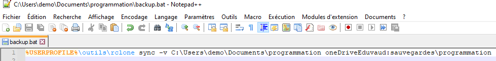

### Lancer le script
Double-cliquer sur le fichier .bat et vérifier qu’il fonctionne (éventuellement ajouter 'pause' à la fin du fichier)

### Ajouter une tâche planifiée
Lancer le planificateur de tâche

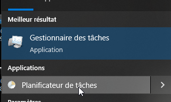

Ajouter une tâche en pointant vers le fichier .bat et en choisissant les options de lancement
(toutes les 15 minutes, avant extinction, ...)
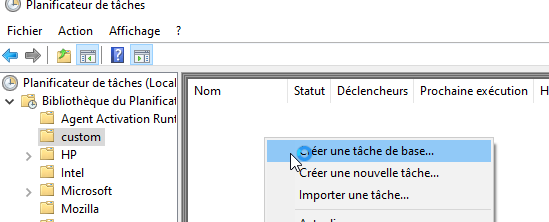

## Pimpages
Duration: 0:05:00


Maintenant que la version de base fonctionne, on peut encore améliorer certains aspects comme

### Logs
Modifier le script pour qu’il génère un log d’éxecution et le *rcloner* pour qu’il soit sauvegardé aussi 
L’option 

```shell
	--log-file=backup.log
```

permet d’enregistrer les détails d’exécution sur un fichier...

### Sécurité
Pour l’instant, la clé de connexion à OneDrive est stockée en claire dans le fichier de configuration.
Ce fichier est stocké dans le profil et si le disque est chiffré il n’y a pas trop de risque. Néanmoins, 
*rclone* peut aussi chiffrer lui-même la configuration :

[Chiffrer la configuration de rclone](https://rclone.org/docs/#configuration-encryption)

