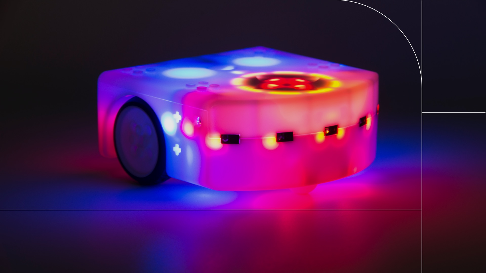
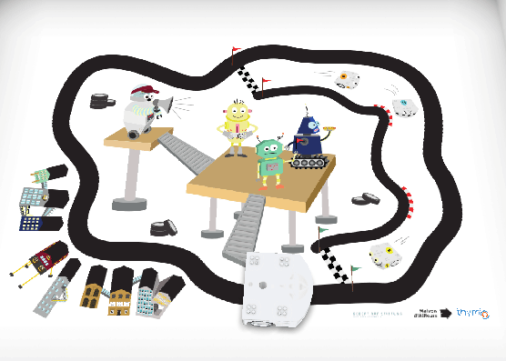
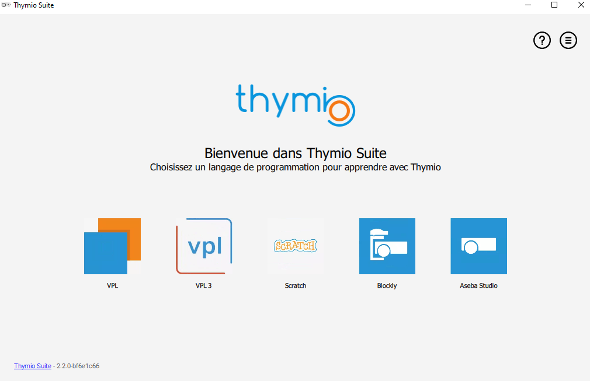
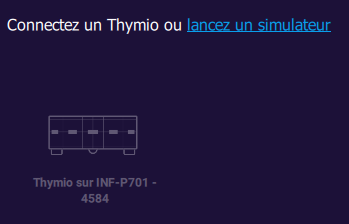
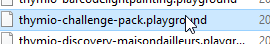
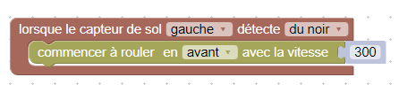
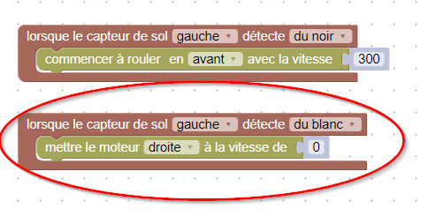
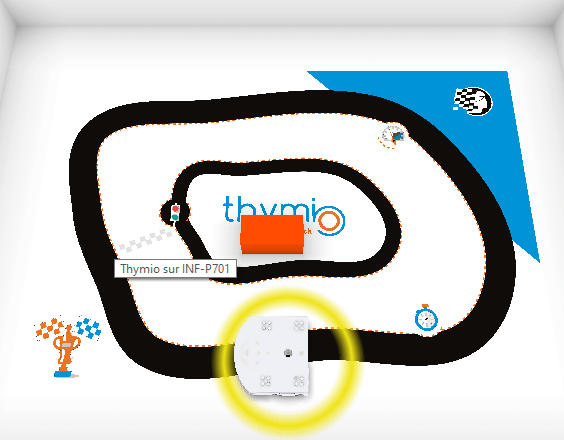
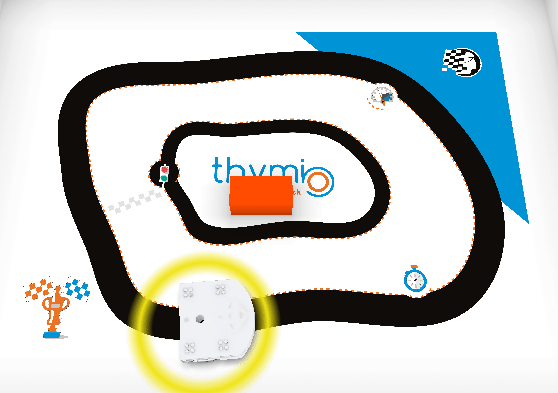

author: Jonathan Melly
summary: intro robot
id: robot-01
categories: robot
tags: robot,msig
environments: Web
status: Published
feedback link: https://git.section-inf.ch/jmy/labs/issues
analytics account: UA-170792591-1

# Programmation de robot

## Vue d’ensemble
Duration: 0:00:20

### Swiss Made
Thymio est un robot réalisé à l’EPFL et entretenu à l’ETML. Il est à la fois simple et complexe dans le sens où il a des capteurs assez précis pour réaliser des tâches comme la cartographie de température d’une pièce...

Positive
: Pour pouvoir débuter avec ce robot sans devoir l’acheter, un simulateur est disponible.

## Installation
Duration: 0:05:00

### Télécharger l’environnement

Le programme est disponible [en cliquant ici](https://dev.mobsya.org/form-4/)

### Installation

Suivez l’assistant en sélectionnant les options par défaut

## Premier programme
Duration: 0:15:0

### Lancez l’environnement Thymio Suite

La fenêtre devrait ressembler à ceci:

### Langages

Il existe plusieurs manières d’écrire un programme pour Thymio. La plus avancée étant Aseba Studio.

Avant d’utiliser cette version avancée, une programmation visuelle sera utilisée.

### Blockly pour débuter

À moins que vous ne soyez habitué à utiliser scratch, blockly est un modèle relativement confortable qui a l’avantage de présenter le code équivalent dans AsebaStudio...

Après avoir cliqué sur Blockly, il faut créer un simulateur et le sélectionner:

### Playground du simulateur

Sélectionnez la carte challenge-pack

### Suivre la ligne noire

Le robot possède des capteurs de lumière avec lesquels on peut détecter la couleur au sol avec une certaine précision. Il y a un capteur à droite et un capteur à gauche.

On peut donc commencer par faire un programme basique qui fera avancer le robot tant qu’un de ses capteurs voit du noir:

*Information: le contrôle des moteurs est dans la rubrique 'actuateur'*

### Virage à gauche

Le robot suit la ligne noire et fonce ensuite dans le mur. Il faudrait pour ça que si le capteur ne détecte plus du noir, alors on coupe le moteur gauche le temps qu’il retrouve ses marques:

### Virage à droite

En s’inspirant de l’amélioration précédente, faire en sorte que le robot se remette sur la ligne lorsqu’il dépasse de l’autre côté aussi:

Positive
: Pour déplacer le robot dans le simulateur, maintenir le clic gauche et déplacer la souris...

Negative
: Pour tourner le robot, maintenir le clic droit et déplacer la souris..

### Réutiliser le code dans AsebaStudio
Une fois le programme terminé, le code dans la fenêtre droite peut-être copié/collé dans un éditeur AsebaStudio...
