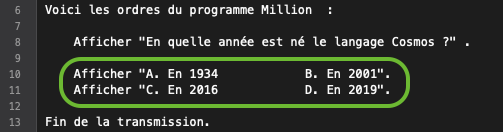
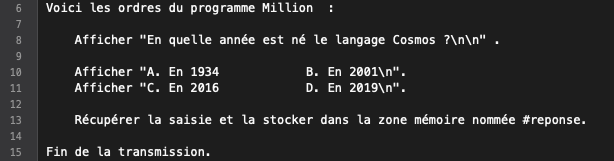
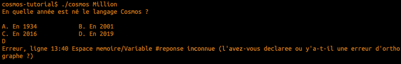
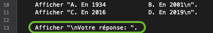
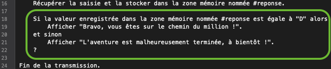
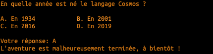
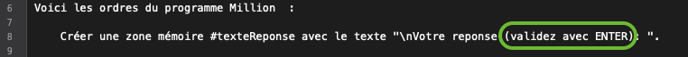

author: Jonathan Melly
summary: Qui veut gagner des millions
id: cosmos-base-01-million
categories: dev
tags: msig
environments: Web
status: Published
feedback link: https://git.section-inf.ch/jmy/labs/issues
analytics account: UA-170792591-1

# Qui veut gagner les millions ?

## Bienvenue
Duration: 0:01:00


Suite au [précédent épisode](https://labs.section-inf.ch/codelabs/cosmos-base-00-hello/index.html), il est temps d'en découvrir un peu plus sur la programmation en reprenant un jeu de questions / réponses à l'image de *Qui veut gagner des millions*.

### Objectifs

- Interagir avec l'utilisateur
- S'adapter au comportement de l'utilisateur


Survey
: Si tu gagnais un million, que ferais-tu ?
<ul>
  <li>Je les verserai intégralement à Greenpeace</li>
  <li>Je les flamberai en achats divers</li>
  <li>Ça demanderait réflexion...</li>
  <li>Autre</li>
</ul>

## Poser une question
Duration: 0:15:00

Pour commencer, on va poser une question au joueur.

### Créer un nouveau programme

Pour rappel, on créée un nouveau programme avec la commande suivante:


Positive
: Une alternative plus concise est 
**cosmos -n Million**

### Afficher la question

Pour afficher une question, il suffit d'éditer le fichier *Million.cosmos* et d'y ajouter:


Pour vérifier si cela fonctionne, on peut lancer le programme:


### Ajouter les propositions

Dans le jeu original, on propose plusieurs possibilités et on pourrait s'inspirer de la question pour ajouter le code suivant:



En testant le programme, on s'aperçoit que le résultat n'est pas satisfaisant:


#### Retour de chariot

En fait, on doit indiquer à l'ordinateur si on veut des retours à la ligne ou pas.
En l'occurrence, on en veut plusieurs !
Pour indiquer un retour à la ligne, on utilise la notation **\n**, ce qui dans notre exemple donnerait:


Negative
: Sur Windows, le caractère de fin de ligne est plutôt **\r\n** mais le seul inconvénient à utiliser **\n** partout est qu'il faut utiliser un éditeur plus évolué que *notepad.exe*, comme par exemple *notepad++* ou *visulstudio code*...

## Récupérer la réponse de l'utilisateur
Duration: 0:15:00

Maintenant que la question est posée, l'utilisateur va appuyer sur le clavier et on va devoir réagir.
S'il répond juste, on affiche la question suivante et sinon on lui dit au revoir.

### Lecture du clavier
Avec le verbe *Afficher* on envoie une information à l'utilisateur (OUTPUT). 
Pour le clavier, c'est l'inverse, on reçoit une information de la part de l'utilisateur (INPUT). Dans ce cas, les mots à utiliser sont:

```cosmos
	Récupérer la saisie et la stocker dans la zone mémoire nommée <#zoneMemoire>.
```

Ajoutons donc ceci au programme:



Et en testant, on remarque que le programme se met en pause. En fait, il attend une saisie du clavier.
Il faut donc entrer un caractère et valider avec la touche *ENTER*, ce qui donne:



On a 2 problèmes à résoudre:

1. Il faudrait indiquer à l'utilisateur qu'on attend sa réponse
2. Le message d'erreur indique que l'espace mémoire n'existe pas => on doit le créer

#### Aide à l'utilisateur
En réutilisant ce qu'on connaît déjà, on va juste afficher du texte pour que l'utilisateur comprenne ce qu'il doit faire:



#### Gestion de la mémoire


Un ordinateur est un peu comme un bureau avec des tiroirs, ça veut dire qu'on peut y ranger des informations et les retrouver, du moment qu'on se rappelle dans quel tiroir on l'a mis (bien sûr, on pourrait essayer chaque tiroir mais imaginez-vous une commode avec plus de 4 milliards de tiroirs ;-)).

Bref, pour *créer un tiroir* et lui donner une *étiquette* pour le retrouver, on écrit:


#### Test
Le programme devrait maintenant fonctionner:


Negative
: Si le programme ne fonctionne pas, peut-être que le fichier source n'a pas été sauvegardé...

## Réagir à la réponse
Duration: 0:10:00


Maintenant que l'utilisateur a donné sa réponse, on va lui dire s'il peut continuer ou s'il doit déjà s'arrêter.
Pour cela, on va utiliser la syntaxe d'une **condition** :



Avec comme résultat pour une mauvaise réponse :



Et pour une bonne réponse:


## Deuxième question
Duration: 0:05:00

Maintenant que la recette est connue pour une question, il suffit de répéter pour les suivantes.
Voici donc un extrait pour une deuxième question à partir duquel s'inspirer pour préparer 10 questions:


Negative
: Il n'est pas nécessaire de recréer l'espace mémoire **#reponse**, il existe pour toute la durée du programme...

## Commentaires
Duration: 0:02:00

Dans certains extraits de code source, il y avait des lignes précédées par les caractères **//**.
Ceci indique à l'ordinateur d'ignorer cette ligne et est utilisé pour aider la personne qui programme à se retrouver dans le code.

L'invitation est donc d'en ajouter pour faciliter la lecture ou expliquer un élément particulier:


## Évolution
Duration: 0:02:00

Certains éléments se répètent plusieurs fois et au cas où on voudrait les changer plus tard, il est utile de les regrouper :


Ainsi, on va utiliser la mémoire pour stocker des éléments réutilisables :


Comme ça, si on voulait modifier ce message qui se répète partout, il suffit de le faire à un seul endroit:



## Questions suivantes
Duration: 0:15:00


En partant de la solution actuelle, il est temps d'ajouter encore 8 questions pour arriver au million.
Bon courage ;-)

## Synthèse
Duration: 0:03:00

Cet atelier était riche en découvertes, surtout quand on débute en programmation.
Voici donc un quizz récapitulatif:

