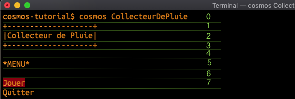
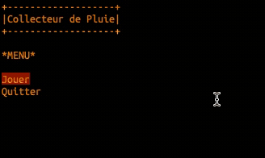

author: Jonathan Melly
summary: Collecteur de pluie
id: cosmos-base-03-raincollector
categories: dev
tags: msig
environments: Web
status: Published
feedback link: https://git.section-inf.ch/jmy/labs/issues
analytics account: UA-170792591-1

# Collecteur de pluie

## Introduction
Duration: 0:01:00


Prêt(e) à chanter sous la pluie ?

Pour faire suite au précédent épisode (animation et réaction au clavier), cet atelier propose de créer un premier jeu interactif qui a pour but de collectionner les gouttes de pluie...

### Objectifs

- Mettre en commun les compétences acquises pour créer un jeu interactif

Survey
: Quelle est la meilleure utilité à récolter l'eau de pluie ?
<ul>
  <li>Réduire la densité hygromètrique de l'atmosphère</li>
  <li>Agrémenter des cocktails d'eau déminéralisée</li>
  <li>Utiliser l'acidité de cette eau pour dissoudre la rouille sur un métal</li>
  <li>Arroser le jardin et ainsi économiser l'eau potable</li>
</ul>

## Menu
Duration: 0:10:00

Le but est d'avoir un menu au lancement du jeu qui permette de joueur ou quitter.

### Version statique
Commençons donc par afficher un menu avec 2 entrées :


Réalisé par le code ci-dessous:


*Cette version est purement visuelle et l'utilisateur ne peut pas encore interagir. Toutefois c'est déjà une bonne base qui présente une idée du résultat.*

### Version réactive

On va maintenant adapter la version statique pour que l'appui des flèches sur le clavier permette de choisir l'option.

#### Sélection
Pour réagir aux flèches du clavier, on commence par se souvenir que la console est un système de coordonnées à 2 dimensions et donc que le texte "Jouer" arrive à la ligne numéro 7:



Ceci est utile parce que si l'utilisateur appuie sur la flèche en bas, on devra réécrire le texte "Jouer" sans le fond rouge. Et par contre, on devra réécrire le texte "Quitter" avec le fond rouge :


#### Un peu de cosmétique
Pour s'approprier intégralement la console, la commande suivante insérée au tout début du programme améliore le rendu:

``` cosmos
Effacer l'écran.
```

Negative
: Attention, cela enlève la ligne de lancement du programme et donc peut décaler les numéros de ligne précédemment établis.
Cela veut dire que la ligne de la première option n'est plus 7 mais 6...

Pour résumer, on peut démarrer tout programme de jeu avec les commandes suivantes:

``` cosmos
Effacer l'écran.
Masquer le curseur.
```

#### Validation
Pour l'instant le programme quitte si on appuie sur *Enter*. On va donc réagir à cela on regardant quelle était la dernière option choisie:


## Jeu
Duration: 0:01:00



On va maintenant se concentrer sur le jeu qui habituellement est une répétition d'opérations:

1. Afficher les éléments graphiques
2. Déplacer les éléments graphiques automatisés
3. Déplacer les éléments graphiques selon les entrées utilisateur (le clavier)
4. Mettre à jour les compteurs (score, vie, ...)
5. Recommencer

Cela veut dire que le code du jeu sera à l'intérieur d'une répétition avec comme condition d'arrêt la fatigue de l'utilisateur qui voudra arrêter.

## Jeu - Quitter
Duration: 0:05:00

Pour faire simple, l'appui sur la touche *Escape (Échap)* quittera donc le jeu et dans ce cas on affiche aussi le message d'au revoir :


## Jeu - Pluie
Duration: 0:10:00

On va maintenant faire tomber une goutte de pluie:


Pour réaliser cette animation, on reprend les élément vus jusque là, soit:

1. Afficher un caractère
2. Attendre quelques millisecondes
3. Effacer le caractère
4. Afficher le caractère sur une position légèrement décalée
5. Et on recommence...

Ce qui donne:


Positive
: Un nouvel élément est présenté ici c'est la génération d'un nombre aléatoire. Ceci permet de faire varier la position horizontale de chaque nouvelle goutte.

## Jeu - Collecteur
Duration: 0:25:00

Il faut maintenant ajouter le collecteur. Ce dernier ressemble beaucoup à ce qui a été fait précédemment en faisant bouger un caractère avec les touches fléchées:


Avec un code ressemblant à ceci:


## Jeu - Score
Duration: 0:15:00

L'intérêt du jeu encore relatif jusqu'à présent va augmenter en comptabilisant et affichant les scores:


correspondant aux modifications suivantes:


## Bilan
Duration: 0:05:00

Il est temps de faire le point sur les compétences acquises:


