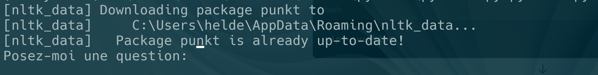

author: Helder Costa
summary: ia tuto
id: ia-01
categories: ia,python,dev
tags: ict
environments: Web
status: Published
feedback link: https://git.section-inf.ch/jmy/labs/issues
analytics account: UA-170792591-1

# Introduction aux Principes de l’IA

## Vue d’ensemble
Duration: 0:01:00


Survey
: Quelle est votre première réaction en entendant parler d'intelligence artificielle (IA) ?
<ul>
   <li><strong>C'est fascinant, mais un peu effrayant.</strong> - Intérêt mêlé d'appréhension face aux possibilités et aux implications de l'IA.</li>   
   <li><strong>Ça va changer le monde !</strong> - Enthousiasme pour l'impact potentiel de l'IA sur différents aspects de la vie.</li>
   <li><strong>On est encore loin des robots intelligents...</strong> - Scepticisme quant au niveau actuel de développement et aux attentes souvent exagérées.</li>
</ul>

## Bonjour jeune nageur !
Duration: 0:05:00

Bienvenue dans cette aventure passionnante où tu vas créer ta première IA ! L’objectif n’est pas de rivaliser avec ChatGPT ou Elon Musk, mais de découvrir le monde fascinant de l’intelligence artificielle.

Nous aurons deux projets distincts. Nous commencerons par créer un système de chat, puis nous créerons un système d’analyse d’image capable de prédire l’objet principal de l’image.

### Crée ton propre PyChat

Il s'agit d'un petit programme qui vous demande de lui poser une question. Ensuite, il va chercher dans sa base de données selon un système moyennement complexe qui découpe la phrase en mots clés. En utilisant ces mots clés, il tente de trouver la réponse la plus pertinente possible.

**Comment fonctionne la prédiction dans PyChat ?**

1. **Analyse de la question** : Lorsque vous posez une question, le programme commence par analyser la phrase. Il identifie les mots clés importants en supprimant les mots courants comme "le", "la", "et", etc.

2. **Recherche dans la base de données** : Une fois les mots clés identifiés, le programme les utilise pour rechercher des réponses potentielles dans sa base de données. Il compare les mots clés de la question avec ceux des réponses stockées.

3. **Utilisation des statistiques** : Le programme utilise des modèles statistiques pour prédire les mots qui suivent les mots clés identifiés. Par exemple, si la question contient le mot "météo", le programme sait que des mots comme "aujourd'hui", "demain", "prévisions" sont statistiquement susceptibles de suivre. C'est un peu comme lorsque nous utilisons le dictionnaire de nos smartphones pour écrire un message ; le programme suggère les mots suivants en fonction de ce que nous avons déjà écrit.

4. **Sélection de la réponse** : En combinant les mots clés et les prédictions statistiques, le programme évalue les réponses possibles. Il sélectionne la réponse qui correspond le mieux aux mots clés et aux prédictions.

5. **Affichage de la réponse** : Enfin, le programme affiche la réponse qu'il a jugée la plus pertinente.

Negative
: Avertissement : Il s’agit d’une simplification du système. 
Les véritables systèmes de chat basés sur l’intelligence artificielle utilisent des algorithmes beaucoup plus complexes et sophistiqués pour comprendre et répondre aux questions.

### Mise en place d'un protocole de test

Pour comprendre le fonctionnement du chat, tu trouveras plus loin dans ce tutoriel un scénario dont le but est de poser des questions et de nous faire un retour sur des réflexions telles que : la réponse est-elle pertinente ? Le système apprend-il ? Enfin, comment le système pourrait-il s'améliorer ?

N'oublie pas que l'idéal est que tu te forges ta propre vision et compréhension.

Prêt à commencer ? Allons-y ! 💪


## Prérequis 🛠️
Duration: 0:02:00

Idéalement les [tutoriels python](https://labs.section-inf.ch/?cat=python) ont été réalisés.

De plus, la programmation étant un long voyage, semblable à l'apprentissage d'une langue 🌍, il faut d'abord maîtriser les bases, comme les mots, la grammaire, et les différents sons 🗣️. 
Avec le temps, nous formerons des phrases, et avec encore plus de pratique, nous comprendrons leur sens 🧠. 
Puis, en saisissant les nuances 🧐, nous pourrons apprécier les blagues culturelles 🎭.

> Un jour, un homme africain part à la chasse. Après une longue journée dans la savane, il rentre à la maison les mains vides. Sa femme lui demande :  
> « Chéri, où est le gibier ? »  
> L'homme répond : « Aujourd'hui j'ai attrapé quelque chose de plus précieux qu'un simple animal... j'ai attrapé de l'expérience ! »

- **Humour culturel** : Cette blague montre comment l'humour peut varier selon les contextes culturels.
- **Leçons de vie** : Les expériences peuvent être aussi précieuses que les biens matériels. Même sans gibier, l'homme a acquis une leçon importante.
- **Contextualisation** : Dans l'apprentissage, il est crucial de reconnaître la valeur des expériences, même si les résultats ne sont pas immédiatement visibles.

Ici, nous sommes au début, donc pas le temps de tout faire nous-mêmes. Je te propose donc une petite exploration des bibliothèques que nous utiliserons dans ce tutoriel pour comprendre les composants essentiels de notre système 🧩.

## Explication des Bibliothèques (voir code ci après)
Duration: 0:01:00

1. **`import nltk`** : Pour le traitement du langage naturel, notamment le tokenizer `punkt` pour diviser le texte en mots et phrases.
2. **`from sklearn.feature_extraction.text import CountVectorizer`** : Convertit le texte en une matrice de comptage des mots pour l'entraînement des modèles.
3. **`from sklearn.naive_bayes import MultinomialNB`** : Algorithme de classification basé sur le théorème de Bayes, adapté aux données textuelles.
4. **`import json`** : Manipule les fichiers JSON pour charger et sauvegarder les données d'entraînement.
5. **`import joblib`** : Sérialise les objets Python pour sauvegarder et charger les modèles d'apprentissage automatique.
6. **`import string`** : Fournit des outils pour manipuler les chaînes de caractères, comme supprimer la ponctuation.

## Installation des dépendances 🛠️
Duration: 0:03:00

0. Copie-colle le contenu suivant dans un fichier nommé *requirements.txt*
```text
certifi==2024.7.4
charset-normalizer==3.3.2
click==8.1.7
colorama==0.4.6
filelock==3.15.4
fsspec==2024.6.1
huggingface-hub==0.24.5
idna==3.7
Jinja2==3.1.4
joblib==1.4.2
MarkupSafe==2.1.5
mpmath==1.3.0
networkx==3.3
nltk==3.8.2
numpy==2.0.1
packaging==24.1
PyYAML==6.0.2
regex==2024.7.24
requests==2.32.3
safetensors==0.4.4
scikit-learn==1.5.1
scipy==1.14.0
setuptools==72.2.0
sympy==1.13.2
threadpoolctl==3.5.0
tokenizers==0.19.1
torch==2.4.0
tqdm==4.66.5
transformers==4.44.0
typing_extensions==4.12.2
urllib3==2.2.2
wheel==0.44.0
```

1. **Ouvre ton terminal**.

2. **Installe les bibliothèques nécessaires** :
   Tu devras avoir un fichier nommé `requirements.txt` contenant toutes les dépendances nécessaires pour ton projet. Pour installer ces dépendances, exécute la commande suivante :

   ```shell
   python -m pip install -r requirements.txt
   ```

## Instructions de code 📝
Duration: 0:05:00

Ensuite, copie-colle le code suivant dans un fichier Python :

```python
import nltk
from sklearn.feature_extraction.text import CountVectorizer
from sklearn.naive_bayes import MultinomialNB
import json
import joblib
import string
import sys
import io

# Assurer que la sortie standard utilise l'encodage UTF-8
sys.stdout = io.TextIOWrapper(sys.stdout.buffer, encoding='utf-8')

# Télécharger les ressources nécessaires de NLTK
nltk.download('punkt')

# Fonction de prétraitement du texte
def preprocess_text(text):
    text = text.lower()  # Conversion en minuscules
    text = text.translate(str.maketrans('', '', string.punctuation))  # Suppression de la ponctuation
    return text

# Charger les données d'apprentissage depuis un fichier
def load_data(file_path):
    with open(file_path, 'r', encoding='utf-8') as file:
        data = json.load(file)
    return data["questions"], data["responses"]

# Sauvegarder les données d'apprentissage dans un fichier
def save_data(file_path, questions, responses):
    data = {"questions": questions, "responses": responses}
    with open(file_path, 'w', encoding='utf-8') as file:
        json.dump(data, file, ensure_ascii=False, indent=4)

def save_model(file_path, model, vectorizer):
    joblib.dump((model, vectorizer), file_path)

def load_model(file_path):
    return joblib.load(file_path)

# Fonction pour entraîner le modèle de réponse
def train_response_model(questions, responses):
    vectorizer = CountVectorizer()
    X = vectorizer.fit_transform([preprocess_text(question) for question in questions])
    model = MultinomialNB()
    model.fit(X, responses)
    return model, vectorizer

# Initialisation
data_file_path = "data.json"
model_path = "response_model.pkl"

# Charger les données
questions, responses = load_data(data_file_path)

# Entraîner ou charger le modèle
try:
    model, vectorizer = load_model(model_path)
except FileNotFoundError:
    model, vectorizer = train_response_model(questions, responses)
    save_model(model_path, model, vectorizer)

def predict_response(question):
    question = preprocess_text(question)
    X = vectorizer.transform([question])
    prediction = model.predict(X)[0]
    return prediction

def main():
    while True:
        try:
            question = input("Posez-moi une question: ")
            
            # Trouver la réponse correspondant à la question
            response = predict_response(question)
            print(f"Réponse: {response}")
            
            feedback = input("Est-ce que la réponse est correcte? (oui/non) ").strip().lower()
            if feedback == "non":
                correct_response = input("Quelle devrait être la bonne réponse? ").strip()
                questions.append(question)
                responses.append(correct_response)
                # Réentraîner le modèle avec les nouvelles données
                global model, vectorizer
                model, vectorizer = train_response_model(questions, responses)
                save_data(data_file_path, questions, responses)
                save_model(model_path, model, vectorizer)
                print("Merci pour le retour, j'ai appris quelque chose de nouveau!")
            elif feedback == "oui":
                print("Merci pour votre confirmation!")
            else:
                print("Réponse non reconnue. Veuillez répondre par 'oui' ou 'non'.")
        except KeyboardInterrupt:
            print("\nProgramme terminé.")
            break
        except Exception as e:
            print(f"Une erreur est survenue: {e}")

if __name__ == "__main__":
    main()
```

## Télécharger les fichiers ressources
Duration: 0:02:00

Complète le projet en ajoutant les fichiers manquant présents dans [l’archive suivante](https://eduvaud.sharepoint.com/:u:/s/msteams_d0db31/EW8v5Lrtm89DnMLaEqhbbioB5iKOS1AknUA4xSNVIFp-tA?e=jIHL4Z)

## 🎬 Lancer le programme
Duration: 0:02:00

Exécute la commande suivante :  
```bash
python pysChat.py
```
Suis les instructions à l'écran pour interagir avec le système de chat. 



## Activité 🛠️
Duration: 0:15:00

Super, nous avons terminé le programme ! 🎉 Il est maintenant temps de le tester et d'en tirer des conclusions. 🧩

Pour cela, comme indiqué plus haut, nous allons mettre en place un scénario de test. Comme cela peut être nouveau pour vous, je vais vous guider tout au long du processus. 👨‍🏫

Le protocole consiste simplement à poser des questions au programme et à indiquer si les réponses sont pertinentes ou non. 🤔✅❌

### Scénario de test

Ci-dessous se trouve une série de questions simples, sans lien entre elles. votre tâche est de déterminer si chaque réponse proposée est correcte ou non.

- **Question :** "Quelle est la capitale de la France ?"  
   **Réponse attendue :** "Paris"

- **Question :** "Quel est le résultat de 2 + 2 ?"  
   **Réponse attendue :** "4"

- **Question :** "Comment s'appelle le président des États-Unis en 2024 ?"  
   **Réponse attendue :** "Joe Biden" (si applicable)

**À votre avis, pourquoi cette réponse pourrait-elle être incorrecte ?**

---

### Histoire à raconter

- **Question :** Connais-tu Sarah ?  
   **Réponse :** La réponse est probablement incorrecte. Dites que c'est une collègue.

- **Question :** Sais-tu qui est notre chef de projet ?  
   **Réponse :** La réponse est insatisfaisante. Dites que c'est Sarah.

- **Question :** As-tu déjà travaillé avec Sarah sur un projet spécifique ?  
   **Réponse :** La réponse est vague. Dites que vous avez collaboré avec elle sur le projet de refonte du site web de l'entreprise, où elle a joué un rôle clé dans la coordination des équipes.

- **Question :** Es-tu au courant de la date de la prochaine réunion d'équipe ?  
   **Réponse :** La réponse manque de précision. Dites que Sarah a mentionné que la réunion est prévue pour mardi prochain à 10 heures, dans la salle de conférence principale.

- **Question :** Connais-tu les objectifs fixés par Sarah pour ce trimestre ?  
   **Réponse :** La réponse est incomplète. Dites que Sarah a fixé des objectifs précis, notamment l'amélioration de la collaboration entre les départements et l'augmentation de l'efficacité des processus internes.

- **Question :** Qui a récemment pris la responsabilité de superviser les nouvelles embauches dans l'équipe ?  
   **Réponse attendue :** Sarah, étant donné son rôle de chef de projet et son implication dans les processus internes.

- **Question :** Sais-tu qui a proposé l'idée de lancer une enquête de satisfaction des employés ce trimestre ?  
   **Réponse attendue :** Sarah, en raison de son initiative et de son souci d'améliorer les processus internes.

---

### Test logique

- **Question :** "Si un avion vole à 800 km/h pendant 2 heures, quelle distance parcourt-il ?"  
   **Réponse attendue :** "1600 km"  
   **Vérification :** Est-ce que la réponse est correcte ?  
   **Objectif :** Tester la capacité du modèle à comprendre et traiter des questions nécessitant une logique de base.

- **Question :** "Si je te dis que 2 + 2 = 5, que dis-tu ?"  
   **Réponse attendue :** "C'est incorrect."  
   **Vérification :** Est-ce que la réponse est correcte ?  
   **Objectif :** Tester la capacité du modèle à détecter des erreurs logiques.

- **Question :** "Peux-tu me raconter une blague ?"  
   **Réponse attendue :** Une blague ou une indication que le modèle ne peut pas répondre à cette question.  
   **Vérification :** Est-ce que la réponse est correcte ?  
   **Objectif :** Tester la flexibilité du modèle pour des questions ouvertes.

---

### Analyse des réponses et réajustement

après avoir exécuté ces scénarios de test, vous devez :

1. **analyser les réponses :** vérifiez si les réponses sont correctes par rapport aux attentes.
2. **fournir du feedback :** si une réponse est incorrecte, fournissez la bonne réponse et voyez si le modèle s'améliore après réentraînement.
3. **répéter le processus :** continuez à poser des questions jusqu'à ce que le modèle soit suffisamment robuste pour répondre à la plupart des questions de manière satisfaisante.

**l'objectif est d'observer l'amélioration progressive du système, qui ne fonctionne pas parfaitement au départ.**

## Explication du Code par Blocs
Duration: 0:05:00

### 1. Importations et Configuration

```python
import nltk
from sklearn.feature_extraction.text import CountVectorizer
from sklearn.naive_bayes import MultinomialNB
import json
import joblib
import string
import sys
import io

# Assurer que la sortie standard utilise l'encodage UTF-8
sys.stdout = io.TextIOWrapper(sys.stdout.buffer, encoding='utf-8')
```

- **`import nltk`** : Charge la bibliothèque Natural Language Toolkit pour le traitement du langage naturel.
- **`from sklearn.feature_extraction.text import CountVectorizer`** : Importation de `CountVectorizer` pour convertir les textes en matrices de fréquence de mots.
- **`from sklearn.naive_bayes import MultinomialNB`** : Importation de l'algorithme de classification Naïve Bayes pour l'apprentissage automatique.
- **`import json`** : Permet la manipulation des fichiers JSON pour charger et sauvegarder les données.
- **`import joblib`** : Utilisé pour la sérialisation des objets Python, comme les modèles d'apprentissage automatique.
- **`import string`** : Fournit des outils pour la manipulation de chaînes de caractères, comme la suppression de la ponctuation.
- **`import sys`** et **`import io`** : Pour configurer l'encodage UTF-8 de la sortie standard.

### 2. Prétraitement du Texte

```python
# Télécharger les ressources nécessaires de NLTK
nltk.download('punkt')

# Fonction de prétraitement du texte
def preprocess_text(text):
    text = text.lower()  # Conversion en minuscules
    text = text.translate(str.maketrans('', '', string.punctuation))  # Suppression de la ponctuation
    return text
```

- **`nltk.download('punkt')`** : Télécharge le tokenizer `punkt` de NLTK pour diviser le texte en mots et phrases.
- **`preprocess_text`** : Fonction pour normaliser le texte en le convertissant en minuscules et en supprimant la ponctuation.

### 3. Gestion des Données

```python
# Charger les données d'apprentissage depuis un fichier
def load_data(file_path):
    with open(file_path, 'r', encoding='utf-8') as file:
        data = json.load(file)
    return data["questions"], data["responses"]

# Sauvegarder les données d'apprentissage dans un fichier
def save_data(file_path, questions, responses):
    data = {"questions": questions, "responses": responses}
    with open(file_path, 'w', encoding='utf-8') as file:
        json.dump(data, file, ensure_ascii=False, indent=4)
```

- **`load_data`** : Charge les questions et réponses depuis un fichier JSON.
- **`save_data`** : Sauvegarde les questions et réponses dans un fichier JSON.

### 4. Gestion du Modèle

```python
def save_model(file_path, model, vectorizer):
    joblib.dump((model, vectorizer), file_path)

def load_model(file_path):
    return joblib.load(file_path)
```

- **`save_model`** : Sauvegarde le modèle et le vecteur de caractéristiques dans un fichier avec `joblib`.
- **`load_model`** : Charge le modèle et le vecteur de caractéristiques depuis un fichier.

### 5. Entraînement du Modèle

```python
# Fonction pour entraîner le modèle de réponse
def train_response_model(questions, responses):
    vectorizer = CountVectorizer()
    X = vectorizer.fit_transform([preprocess_text(question) for question in questions])
    model = MultinomialNB()
    model.fit(X, responses)
    return model, vectorizer
```

- **`train_response_model`** : Entraîne un modèle de classification Naïve Bayes pour prédire les réponses basées sur les questions. Utilise `CountVectorizer` pour transformer le texte en une matrice de fréquences de mots, puis entraîne le modèle avec ces données.

### 6. Initialisation et Exécution Principale

```python
# Initialisation
data_file_path = "data.json"
model_path = "response_model.pkl"

# Charger les données
questions, responses = load_data(data_file_path)

# Entraîner ou charger le modèle
try:
    model, vectorizer = load_model(model_path)
except FileNotFoundError:
    model, vectorizer = train_response_model(questions, responses)
    save_model(model_path, model, vectorizer)
```

- **Initialisation** : Définit les chemins pour les fichiers de données et le modèle.
- **Chargement des données** : Charge les questions et réponses depuis le fichier JSON.
- **Entraînement ou chargement du modèle** : Essaie de charger le modèle préexistant, ou l'entraîne si le fichier du modèle n'existe pas.

### 7. Prédiction et Interaction

```python
def predict_response(question):
    question = preprocess_text(question)
    X = vectorizer.transform([question])
    prediction = model.predict(X)[0]
    return prediction

def main():
    while True:
        try:
            question = input("Posez-moi une question: ")
            
            # Trouver la réponse correspondant à la question
            response = predict_response(question)
            print(f"Réponse: {response}")
            
            feedback = input("Est-ce que la réponse est correcte? (oui/non) ").strip().lower()
            if feedback == "non":
                correct_response = input("Quelle devrait être la bonne réponse? ").strip()
                questions.append(question)
                responses.append(correct_response)
                # Réentraîner le modèle avec les nouvelles données
                global model, vectorizer
                model, vectorizer = train_response_model(questions, responses)
                save_data(data_file_path, questions, responses)
                save_model(model_path, model, vectorizer)
                print("Merci pour le retour, j'ai appris quelque chose de nouveau!")
            elif feedback == "oui":
                print("Merci pour votre confirmation!")
            else:
                print("Réponse non reconnue. Veuillez répondre par 'oui' ou 'non'.")
        except KeyboardInterrupt:
            print("\nProgramme terminé.")
            break
        except Exception as e:
            print(f"Une erreur est survenue: {e}")

if __name__ == "__main__":
    main()
```

- **`predict_response`** : Prépare la question, transforme le texte en une matrice de caractéristiques, et prédit la réponse en utilisant le modèle.
- **`main`** : Fonction principale qui boucle pour prendre des questions de l'utilisateur, fournir des réponses, et gérer les retours de feedback pour améliorer le modèle.


## Synthèse

