author: Jonathan Melly
summary: mobile app sensors
id: mobile-07-sensor
categories: android,dev
tags: ict
environments: Web
status: Published
feedback link: https://git.section-inf.ch/jmy/labs/issues
analytics account: UA-170792591-1

# Capteurs

## Introduction
Duration: 0:0:30

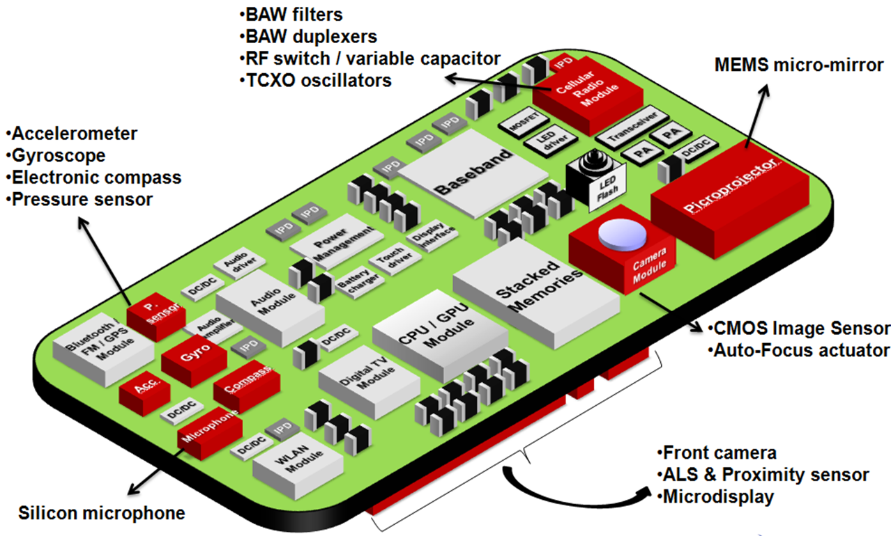

Comme nos 5 sens, les capteurs de téléphones peuvent donner des informations bien utiles pour certaines applications...

## Accéléromètre
Duration: 0:15:00

Pour utiliser l’accéléromètre, il faut l’activer et assigner une fonction qui sera appelée en cas de changement des données du capteur (la fréquence d’actualisation est adaptable...)

### Aperçu
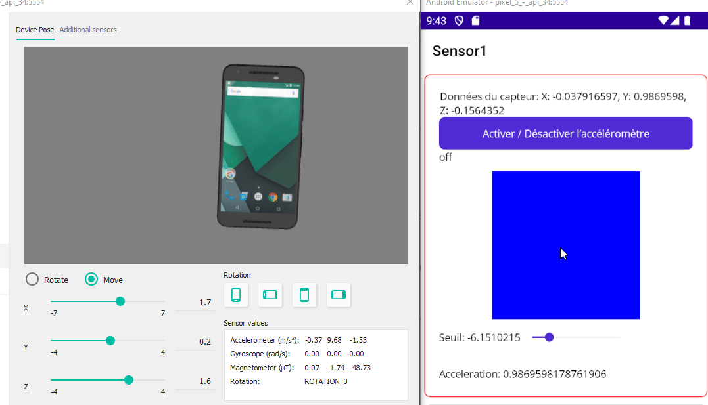

### XAML
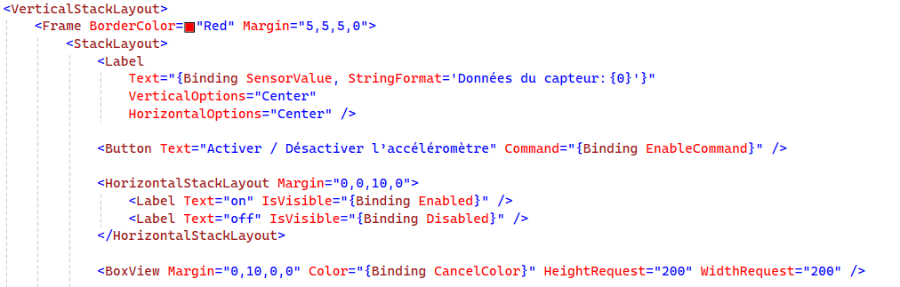

Positive
: Le seuil et l’accélération présents dans l’aperçu ne sont pas traités ici...

### ViewModel
Créer le ViewModel et le compléter selon les éléments ci-dessous.

#### Propriétés
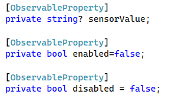

#### Activation du capteur
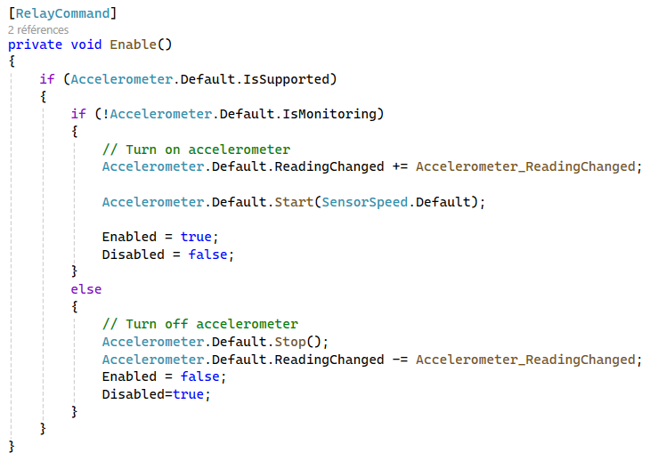

#### Fonction observateur
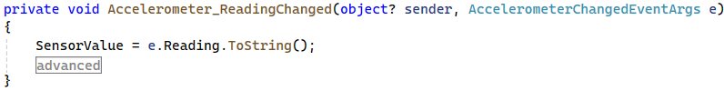

### Simulateur
On peut stimuler l’accéléromètre en utilisant les outils avancés du simulateur:

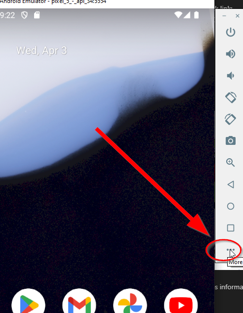

#### Virtual sensors
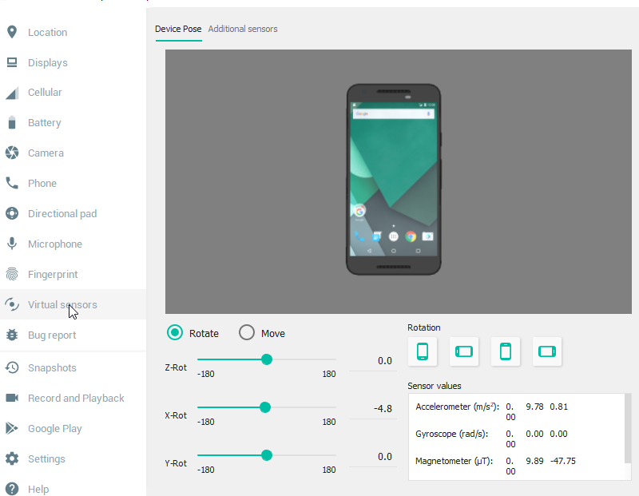

## Gestion des secousses
Duration: 0:15:00

Pour réagir à des secousses, il est nécessaire de faire un peu de calcul et définir un seuil de tolérance...
Tout cela est possible, néanmoins, MAUI intègre cela nativement et on peut donc réutiliser ce qui a déjà été implémenté...

### XAML
On va profiter de ce scénario pour introduire la gestion d’un élément de type *toggle* avec MVVM.

Il est donc correct que le code suivant ne contienne pas de binding vers une méthode.

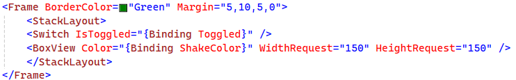

### ViewModel
Voici l’astuce pour lier le *toggle* avec une méthode :

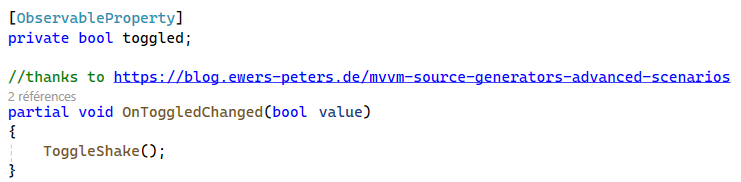

Positive
: On utilise le mot clé *partial* afin de définir une partie du code généré par le MVVM toolkit et on peut donc se "hooker" sur l’évènement déclenché au changement de la valeur de la propriété...

#### Méthode d’activation
Et voici la méthode sans annotation *RelayCommand* puisque cela passe par un autre flux...

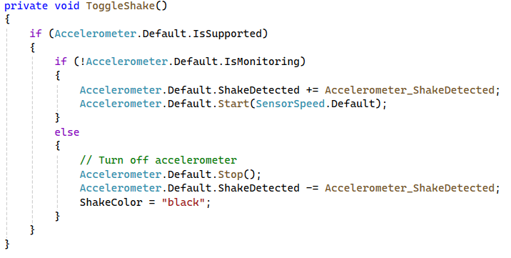


#### Méthode observateur
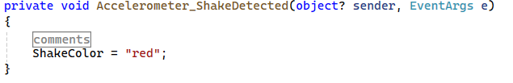


Le carré va donc changer de couleur lorsqu’une secousse est détectée.

### Simulateur
Pour simuler une secousse avec l’émulateur, le plus simple est d’envoyer une commande:
```shell
adb emu sensor set acceleration 100:100:100 && timeout 1 > NUL && adb emu sensor set acceleration 0:0:0
```

Negative
: Avec l’émulateur maison, ADB.EXE est dans le dossier sdk\\platform-tools...

## Synthèse
Duration: 0:1:00

Suite à cet exercice, les compétences suivantes ont été travaillées:

- Activation d’un capteur
- Définition d’une méthode de traitement des données transmises par le capteur
- Utilisation d’un composant *toggle* en respectant MVVM
- Détection des secousses d’un téléphone