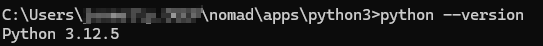
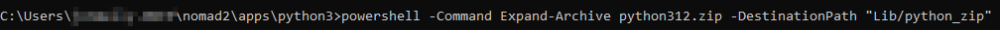
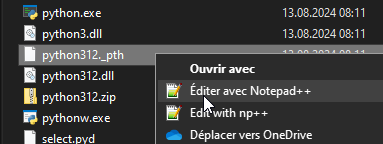
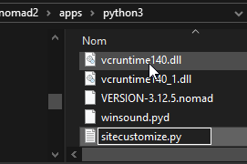
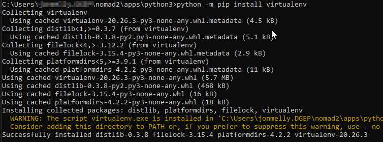
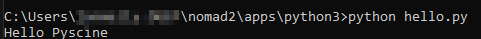

author: Jonathan Melly
summary: python tuto
id: python-01
categories: python,dev
tags: ict
environments: Web
status: Published
feedback link: https://git.section-inf.ch/jmy/labs/issues
analytics account: UA-170792591-1

# Découvrir Python par la pratique

## Vue d’ensemble
Duration: 0:01:00


Survey
: Y’a-t-il des serpents en Suisse ?
<ul>
<li>Quoi des serpents !!!!</li>
<li>Ils sont morts avec les dinosaures</li>
<li>Vipères, orvais et autres asticots vivent encore dans notre pays...</li>
</ul>

## Mise en place de l’environnement
Duration: 0:15:00

Pour faciliter l’utilisation de Python sur n’importe quel système, un outil tiers (nomad) non invasif sera utilisé.

### Nomad

#### Emplacement
Créer ou choisir un dossier dans lequel seront installées les applications nomades, par exemple

```shell
%userprofile%\nomad
```

ou

```shell
c:\nomad
```

#### Installation

Lancer un shell à l’endroit du répertoire choisi/créé ci-dessus et éxécuter la commande suivante:

```shell
powershell -Command Invoke-WebRequest -Uri https://github.com/jonathanMelly/nomad/raw/main/install.bat -OutFile %TEMP%\downloaded.bat && %TEMP%\downloaded.bat
```

### Python

Depuis la fenêtre de commande lancée après l’installation de Nomad, éxécuter la commande suivante:

```shell
nomad install python3
```

Positive
: Valider avec "Enter" l’installation

#### Vérifier l’installation

Lancer l’éxécutable Python qui vient d’être installé avec l’argument *--version* :



### Compléter la version light

#### Compléter la version installée

La version installée est une version simplifiée qui n’inclut pas le gestionnaire de paquet "pip" et les étapes suivantes sont à suivre avec précision:


#### Dézipper les librairies standard

Depuis le répertoire final où python est installé:



```shell
powershell -Command Expand-Archive python312.zip -DestinationPath "Lib/python_zip"
```

#### Éditer les chemins de chargement de python



Remplacer le contenu par:

```text
.\Lib\python_zip
.\DLLs
.\Lib
.\Scripts
.
.\Lib\site-packages
```

#### Ajouter un fichier sitecustomize.py



et y mettre le contenu suivant:
```python
import os
import site
import sys

# do not use user-wide site.USER_SITE path; it refers to a path location
# outside of this embed installation
site.ENABLE_USER_SITE = False

# remove site.USER_SITE and the realpath variation from sys.path
# XXX: somewhat time consuming to do on every startup but thorough
__sys_path_index_del = list()
#index to delete from sys.path
__user_site_resolve = os.path.realpath(site.USER_SITE)
for __i, __path in enumerate(sys.path):
    __path_resolve = os.path.realpath(__path)
    if site.USER_SITE in (__path, __path_resolve):
        __sys_path_index_del.append(__i)
        continue
    if __user_site_resolve in (__path, __path_resolve):
        __sys_path_index_del.append(__i)
for __index_del in reversed(__sys_path_index_del):
    sys.path.pop(__index_del)
del __sys_path_index_del
del __user_site_resolve
```

#### Désactiver les futurs warnings sur le path


```shell
echo [install] > pip.ini & echo no-warn-script-location = true >> pip.ini
```

#### Ajouter un dossier standard DLLs
```shell
mkdir DLLs
```

#### Vérification

Éxécuter la commande suivante (toujours depuis le répertoire où python est installé) pour vérifier les chemins configurés préalablement:

```shell
python.exe -c "import sys; print(sys.path)"
```

### PIP

À présent, on devrait pouvoir installer l’outil PIP

#### Télécharger le script

```shell
powershell -Command Invoke-WebRequest -OutFile get-pip.py "https://bootstrap.pypa.io/get-pip.py"
```

#### Lancer le script

```shell
python get-pip.py
```

### VirtualEnv
Pour ségmenter l’utilisation de python (de ses librairies surtout) par projet, le module virtualenv est utile et il permet de valider l’installation de pip par la même occasion:

```shell
python -m pip install virtualenv
```



## Hello python

Maintenant que l’environnement fonctionne, on peut faire un helloWorl.

### Créer un fichier de script
Créer le fichier *hello.py* et y ajouter le code suivant (ou toute autre variation selon l’émotion du moment):

```python
print("Hello Pyscine")
```

### Éxécuter le script
```shell
python hello.py
```




## Synthèse
Duration: 0:01:00

Il existe plusieurs manières d’utiliser Python et celle présentée a le mérite de simplement ajouter des fichiers dans un dossier, ce qui permet de facilement transporter ou jeter son contenu tout en compliquant par contre d’autres étapes comme l’installation de paquets supplémentaires ou l’utilisation d’environnement virtuels...

Désormais l’environnement python est prêt pour des programmes plus complexes...