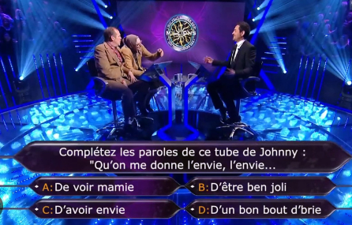
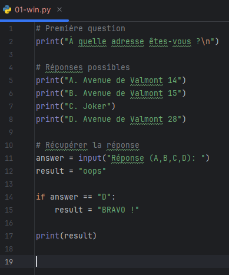
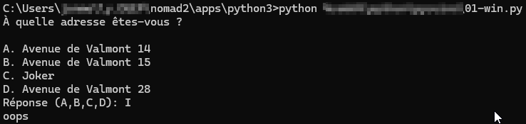

author: Jonathan Melly
summary: python tuto
id: python-02
categories: python,dev
tags: ict
environments: Web
status: Published
feedback link: https://git.section-inf.ch/jmy/labs/issues
analytics account: UA-170792591-1

# Qui veut gagner des maillots

## Contexte
Duration: 0:1:00

Le premier programme consistera à un simili de "qui veut gagner des millions" afin de se familiariser avec la syntaxe Python

## Point de départ
Duration: 0:1:00

Créer un nouveau script Python et lui ajouter le contenu suivant:

### Test
Lancer le script et vérifier qu’il fonctionne avec les limitations qu’il a:

## Théorie
Duration: 0:1:00

À partir de ce petit exemple, les éléments suivants peuvent être déduits:

1. Au lieu des accolades, Python utilise l’indentation
2. Les variables sont dynamiques

## Premières améliorations
Duration: 0:20:00

En utilisant tous les moyens nécessaires sauf l’IA, il est temps de rendre le jeu un peu plus interactif, il faut donc désormais:

0. Choisir un thème ludique pour les questions
1. Gérer les problèmes d’entrées (caractère invalides)
2. Prendre en compte la réponse comme majuscule ou minuscule
3. Si la question est bien répondue, on en pose une deuxième

## Jeu complet
Duration: 0:05:00
Une fois la partie précédente terminée, il s’agit d’avoir au moins 10 questions pour un jeu complet.

### Vérification
Faites jouer une personne tierce à votre jeu pour le valider ou pour détecter (et donc corriger) les erreurs restantes éventuelles.

## Synthèse
Duration: 0:01:00

Normalement écrire un programme en Python est relativement confortable quand on a l’habitude du C# et cette entrée en matière permet de se familiariser avec cette syntaxe.