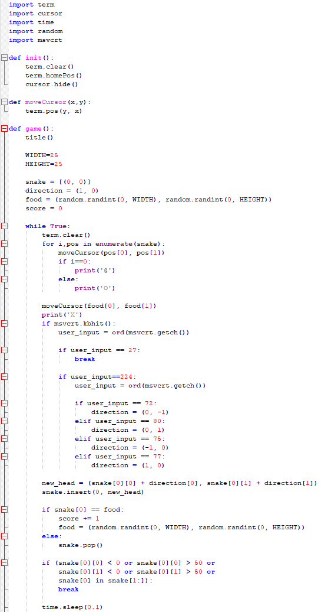

author: Jonathan Melly
summary: python tuto
id: python-03
categories: python,dev
tags: ict
environments: Web
status: Published
feedback link: https://git.section-inf.ch/jmy/labs/issues
analytics account: UA-170792591-1

# Snake

## Contexte
Duration: 0:1:00

Le second programme consistera à une version simplifiée du célèbre jeu "snake"


## Point de départ
Duration: 0:10:00

Créer un nouveau script Python et lui ajouter le contenu suivant:

```python
import term
import cursor
import time


def init():
    # Initialise le terminal en 0,0
    term.clear()
    term.homePos()
    cursor.hide()   


def game():
    title()


def title():
    # Faire clignoter le titre
    for i in range(10):
        term.write('Snake'.center(40, ' '))
        time.sleep(0.4)
        term.clearLine()
        time.sleep(0.3)
        term.pos(0, 0)


try:
    init()
    game()

finally:
    # Remettre le curseur
    cursor.show()

```

### Installation des dépendances
Il faut ajouter les paquets suivants:
```python
python -m pip install py-term cursor
```

### Tester
Vérifier que le programme affiche bien un titre qui clignote.

### Théorie
On peut déduire de ce code que

1. Les fonctions sont déclarées avec le mot clé **def**, suivi d’un nom puis de parenthèses et enfin deux points
2. Les fonctions doivent être déclarées avant d’être utilisées
3. On peut protéger du code avec *try:* et *finally:* pour, en cas d’erreur, éxécuter du code particulier (nettoyage, reset...)

## Éléments du jeu (serpent, ...)
Duration: 0:10:00

Pour modéliser un serpent, rien de tel qu’une liste de coordonnées X et Y... En python, on peut faire un *tableau de tuple* de manière relativement simple:

```python
snake = [(0, 0)]
```

Il faut ensuite lui ajouter une information de direction courante, là aussi une information X et Y suffisent:

```python
direction = (1, 0)
```

### Explications

- (1,0)  => X est positif (va à droite)
- (-1,0) => X est négatif (va à gauche)
- (0,1)  => Y est positif (va en bas)
- (0,-1) => Y est négatif (va en haut)

### Score et nourriture
La nourriture est positionnée aléatoirement sur une coordonnée X et Y et le score est initialisé à zéro:

```python
WIDTH=25
HEIGHT=25
food = (random.randint(0, WIDTH), random.randint(0, HEIGHT))
score = 0
```

### Code actuel
Le code devrait désormais ressembler à cela:
```python
import term
import cursor
import time
import random
import msvcrt


def init():
    # Initialise le terminal en 0,0
    term.clear()
    term.homePos()
    cursor.hide()       

def game():
    title()
    
    WIDTH=25
    HEIGHT=25
    
    snake = [(0, 0)]
    direction = (1, 0)
    food = (random.randint(0, WIDTH), random.randint(0, HEIGHT))
    score = 0

def title():
    # Faire clignoter le titre
    for i in range(10):
        term.write('Snake'.center(40, ' '))
        time.sleep(0.4)
        term.clearLine()
        time.sleep(0.3)
        term.pos(0, 0)

try:
    init()
    game()

finally:
    # Remettre le curseur
    cursor.show()
```

## Boucle de jeu
Duration: 0:15:00

On peut maintenant faire *vivre* le jeu.

### Gadget
Pour se faciliter la vie avec la librairie *term*, on va redéfinir une fonction pour bouger le curseur pour garder une logique X suivi de Y:

```python
def moveCursor(x,y):
    term.pos(y, x)
```

### Affichage du serpent

Il suffit d’afficher tous ses couples de coordonnées en différenciant la tête:

```python
while True:
    # Version "agressive" pour nettoyer l’écran avec un effet de bord
    # de clignotement...
    term.clear()

    # Afficher le serpent complet
    for i,pos in enumerate(snake):
        moveCursor(pos[0], pos[1])
        if i==0:
            print('@')
        else:
            print('O')  

```

### Affichage de la nourriture
Il faut aussi faire apparaître la nourriture:

```python
# Affichage de la nourriture
moveCursor(food[0], food[1])
print('X')
```


### Gestion du clavier
Pour faire changer le serpent de direction, on a besoin du clavier en mode (non bloquant), pour  cela et sur Windows, on utilise la librairie **msvcrt**:

```python
# Get user input
if msvcrt.kbhit():
    user_input = ord(msvcrt.getch())
    
    if user_input == 27: #ESC
        #Quitter
        break
    
    if user_input==224:
        user_input = ord(msvcrt.getch())
        
        if user_input == 72: # HAUT
            direction = (0, -1)
        elif user_input == 80: # BAS
            direction = (0, 1)
        elif user_input == 75: # GAUCHE
            direction = (-1, 0)
        elif user_input == 77: # DROIT
            direction = (1, 0)
```

Negative
: En cas d’erreur, ajouter *import msvcrt* en haut du programme

### Déplacer le serpent

Ensuite on doit calculer la prochaine position de la tête du serpent:

```python
new_head = (snake[0][0] + direction[0], snake[0][1] + direction[1])
snake.insert(0, new_head)
```

Positive
: Pour l’instant le serpent grandit toujours mais on va régler cela avec la gestion de la nourriture juste après

### Nourriture
Si la tête du serpent est sur la même coordonnée qu’une nourriture, on augmente le score et on regénère une nourriture.

Dans le cas contraire, il faut *réduire* la taille du serpent car on a déjà ajouté la tête à la nouvelle coordonnée...

```python
if snake[0] == food:
    score += 1
    food = (random.randint(0, WIDTH), random.randint(0, HEIGHT))
else:
    snake.pop() # pas de nourriture, le serpent ne doit pas grandir (tête déjà ajoutée)
```

### Mort
Il reste à gérer la mort du serpent en vérifiant s’il est en dehors de la zone de jeu OU qu’il se *mort la queue* :

```python
if (snake[0][0] < 0 or snake[0][0] > WIDTH or
    snake[0][1] < 0 or snake[0][1] > HEIGHT or
    snake[0] in snake[1:]):
        break
```

### FPS
Pour ralentir un peu le jeu, on ajoute un délai :

```python
time.sleep(0.1)
```

## Fin de jeu
Duration: 0:10:00

Il reste encore à gérer la fin du jeu.

### État actuel
Si tout va bien, le code condensé devrait ressembler à cela:



### Gestion de la fin de la partie
On va ajouter une méthode *gameOver* qui va afficher le score une fois sorti de la boucle de jeu:

```python
    #while True...
    #...
        time.sleep(0.1)
    # Fin de la boucle de jeu    
    gameOver(score)
        
def gameOver(score):
    # Game over
    term.clear()
    term.homePos()
    print(f'Game Over! Your score is {str(score)}'.center(40,' '))
    input("Press Enter to quit...".center(40,' '))
```

#### Théorie
On peut mélanger des variables et du texte en ajoutant *f* devant une chaîne de caractère (un peu comme le $ de C#)...

## Améliorations
Duration: 0:45:00

À partir de là, c’est à vous d’améliorer le jeu:

- Ajouter une bordure tout autour du jeu
- Remplacer le *term.clear()* par une gestion intelligente avec moveCursor et print(' ') pour effacer les éléments à effacer sans faire scintiller tout l’écran
- Vérifier que la nourriture n’arrive pas sur le serpent
- Augmenter la vitesse au fur et à mesure que le score augmente
- ...

## Synthèse
Duration: 0:01:00

Ce tutorial était un aperçu rapide des fondamentaux de Python sans ajouter la complexité liée à une interface utilisateur plus complexe que la console.

Pour en savoir plus sur python, se rendre par exemple sur https://www.learnpython.org/