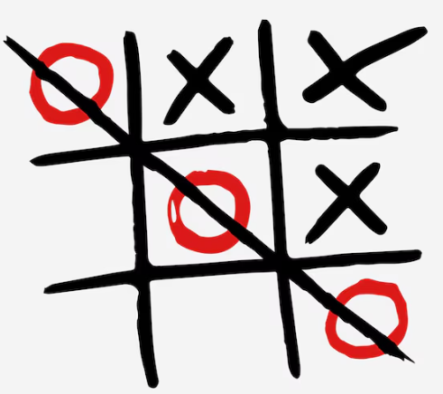
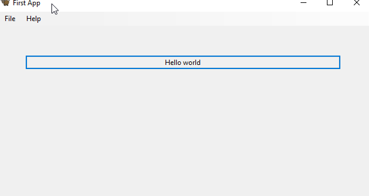

author: Jonathan Melly
summary: python tuto
id: python-04
categories: python,dev
tags: ict
environments: Web
status: Published
feedback link: https://git.section-inf.ch/jmy/labs/issues
analytics account: UA-170792591-1

# TicTacToe




## Contexte
Duration: 0:1:00

À toi de jouer maintenant en te lançant dans un TicTacToe !

## Point de départ
Duration: 0:15:00

Commence par vérifier ta connaissance des règles du jeu puis gribouille un pseudo-code sur papier.

Ensuite à toi de choisir si tu veux rester dans la console ou profiter de découvrir une manière de faire de l’UI, par exemple en partant du code suivant.

## Toga
Duration: 0:10:00

Toga permet de faire de l’UI cross-platform...

### Librairie

```shell
python -m pip install toga
```

### HelloWorld
```python
import toga


def button_handler(widget):
    print("hello")


def build(app):
    box = toga.Box()

    button = toga.Button("Hello world", on_press=button_handler)
    button.style.padding = 50
    button.style.flex = 1
    box.add(button)

    return box


def main():
    return toga.App("First App", "org.beeware.toga.tutorial", startup=build)


if __name__ == "__main__":
    main().main_loop()

```



### Référence

[Voici la référence pour Toga](https://toga.readthedocs.io/en/stable/tutorial/tutorial-0.html)


## Demo
Duration: 0:01:00

Une fois le programme terminé, ne manque pas de faire une démo à la personne qui encadre....